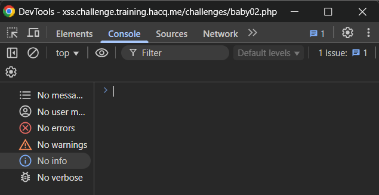
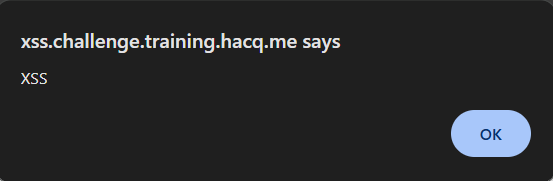
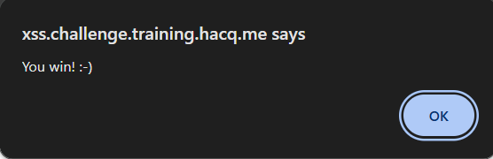

# Baby XSS 02

> A DOM-based XSS (DbXSS) Challenge

For this question, we are given the source code as below:

## ***src***

```php
<script src="hook.js"></script>
<script>
    window.addEventListener("load", function() {
        var q = location.hash.substring(1);
        window.query.innerHTML = q == '' ? `Hello!` : (`Hello, ${decodeURI(q)}`);
    });
</script>

<p id="query"></p>

<h1>inject</h1>
<p>Inspect the source code carefully and find where to inject :-)</p>

<h1>src</h1>
<?php highlight_string(file_get_contents(basename(__FILE__))); ?>
```
## Solution

For this time we are not given the input box as in the previous question to inject the payload but, we are given hint:

> Inspect the source code carefully and find where to inject :-)

From the given hint, I suspect to inject the payload using the console in the DevTools:



To solve this question, we can use the payload:
```javascript
window.alert('XSS');
```

## Output

**XSS injection output**



**Final output**

