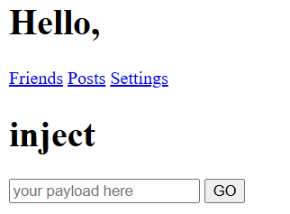
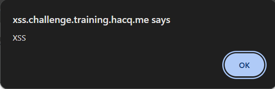
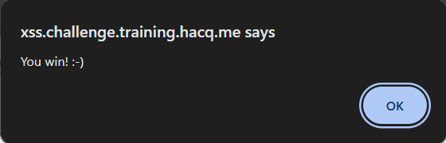

# Baby XSS 03

For this question, we are given the source code as below:

## ***src***

```php
<script src="hook.js"></script>
<?php
$escaped = htmlspecialchars($_GET['payload']);
?>

<h1>Hello, <?= $escaped ?></h1>
<a href="<?= $escaped ?>/friends">Friends</a>
<a href="<?= $escaped ?>/post">Posts</a>
<a href="<?= $escaped ?>/settings">Settings</a>

<h1>inject</h1>
<form>
    <input type="text" name="payload" placeholder="your payload here">
    <input type="submit" value="GO">
</form>

<h1>src</h1>
<?php highlight_string(file_get_contents(basename(__FILE__))); ?>
```
## Solution

For this time we are given the input box to inject the payload but, we are also given the link to go to 'Friends', 'Posts' and 'Settings' page:



We are also given hint:

> (NOTE: I believe this needs user interaction.)

From the given hint, I suspect that we need to inject the payload with the interaction of the link.

To solve this question, we can use the payload:
```javascript
javascript:alert('XSS')
```
After injecting the payload, click any of the link (Friends/Posts/Settings) to see the output.

## Output

**XSS injection output**



**Final output**

