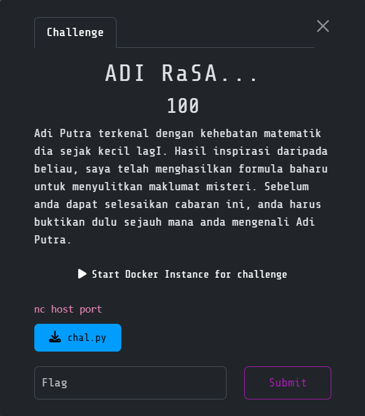

# ADI RaSA

> Category: Cryptography🔑



## 🔍 Overview

We are given three RSA parameters:

- N (the modulus)

- e (the public exponent, 65537)

- c (the ciphertext)

Unlike standard RSA which uses two primes, this instance of **RSA uses three prime factors** for the modulus. Our goal is to recover the plaintext flag.


## ✨ Solution

**Step 1: Factorization of N**

The modulus was:
```
N = 293492960412007278668808616766320338991219616990905534338059009987
```

Using <code>sympy.factorint</code>, we obtain:
```
p = 5430897953231074212767
q = 6535332035423657364551
r = 8269102763695880823611
```

Verification:
p * q * r == N ✅

**Step 2: Compute λ(N)**

For multi-prime RSA, the private key is computed using **Carmichael’s totient** function:
```
λ(N) = lcm(p−1,q−1,r−1)
```

We then compute the modular inverse of **e modulo λ(N**):
```
d = pow(e, -1, λ(N))
```

This gives us the private exponent **d**.

**Step 3: Decryption**

With the private key d, the plaintext integer is recovered as:
```
m = c^d (modN)
```

Finally, we convert **m** into bytes:
```
m = 42454387885183227758761122397918534987770964838843287355272148046
plaintext bytes = b'<DECRYPTED-FLAG>'
```

**Step 4: Recover the Flag**

Decoding the bytes yields:
<details><summary><b>🏳️ Flag:</b></summary><b>3108{g3n1uS_m4th3MAT1K_D1lUp4k4N}</b></details>


## 💡 Takeaways

- The challenge demonstrates multi-prime RSA, a variant where N is factored into 3 (or more) primes instead of 2.

- The main difference lies in computing λ(N) with the least common multiple of (pi - 1) for all primes.

- Once factored, the decryption flow is exactly the same as regular RSA.