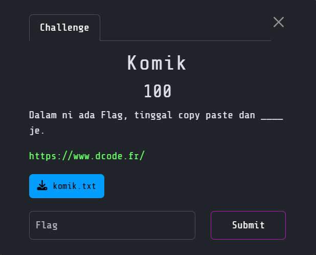
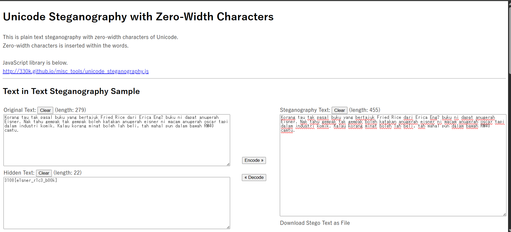

# Komik

> Category: Miscellaneous🧩



## 🔍 Overview

The <code>komik.txt</code> contents:
```
Korang‌‌‌‌‌‌ tau tak ‌‌‌‌‌‌‍pasal ‌‌‌‌‌‌‌buku yang‌‌‌‌‌‬‌ bertajuk Fried‌‌‌‌‍‬ ‌‌‌‌‍‬‍‍Rice ‌‌‌‌‌‌‍‌‌‌‌‍‌dari Erica Eng? ‌‌‌‌‍‬‬‌‌‌‌‍‬‍‍buku ni‌‌‌‌‍‌‬ dapat anugerah Eisner‌‌‌‌‍‍. Nak tahu gempak tak gempak‌‌‌‌‍‌‬ ‌‌‌‌‌‌‍boleh katakan ‌‌‌‌‍‬‌anugerah ‌‌‌‌‌‌eisner ni‌‌‌‌‍‍ macam‌‌‌‌‍‬‌‬ anugerah oscar‌‌‌‌‌‌‌ tapi‌‌‌‌‌‌‌‌‌‌‌‍‬‬ dalam industri komik‌‌‌‌‍‍. Kalau korang minat boleh lah beli, tah mahal pun dalam bawah RM40 camtu.
```

Actually in this text contains the zero-width characters.

## ✨ Solution

Go to [this page](https://330k.github.io/misc_tools/unicode_steganography.html) to reveal the hidden flag:



<details><summary><b>🏳️ Flag:</b></summary><b>3108{e1sner_r1c3_b00k}</b></details>