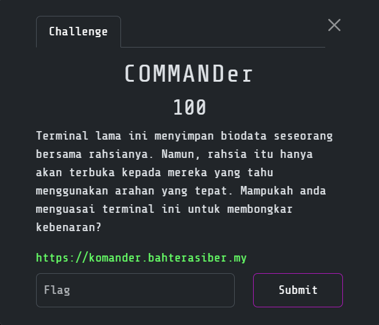
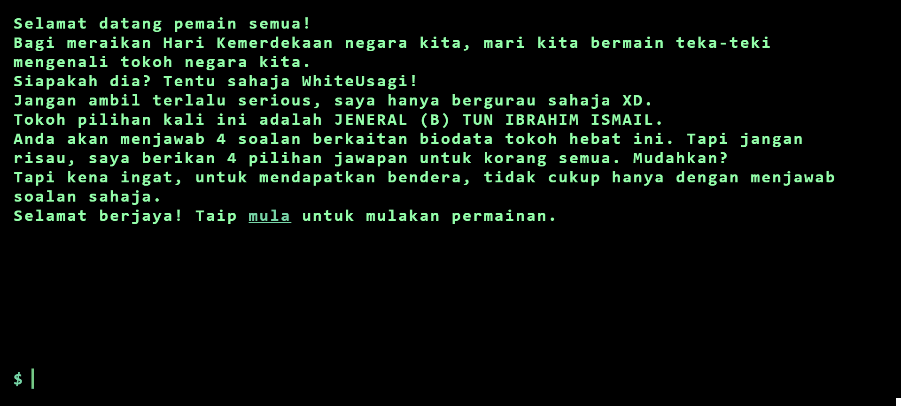
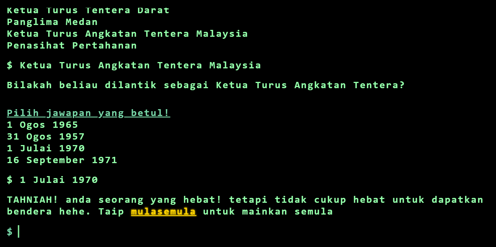
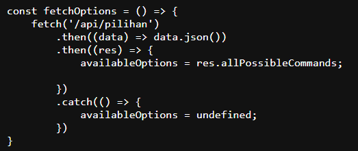
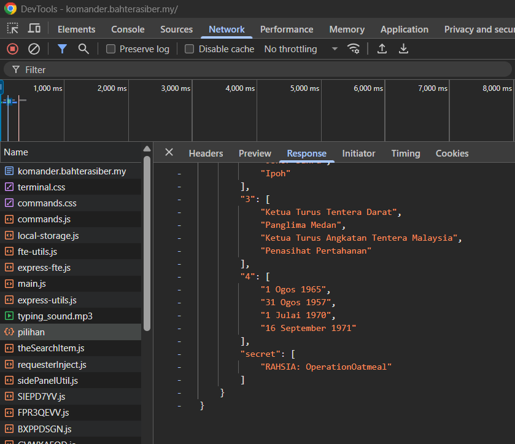
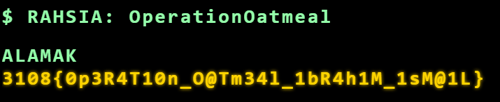

# COMMANDer

> Category: Web Exploitation🕸️




## 🔍 Overview

Visiting the page shows us the challenge to answer about Jeneral (B) Tun Ibrahim Ismail.




## ✨ Solution

After successfully answered the questions, it still not show us the flag:



Viewing the script, reveals us the <code>/api/pilihan</code> which will reveal all the possible command:



Try to view the response in the **Network** tab:



Look interesting here. Try to send the request as below:
```
curl -s https://komander.bahterasiber.my/api/check -H "Content-Type: application/json" -d '{"command":"RAHSIA: OperationOatmeal","step":1}'
```

Or you also can just type after **"mula"**:
```
RAHSIA: OperationOatmeal
```



<details><summary><b>🏳️ Flag:</b></summary><b>3108{0p3R4T10n_O@Tm34l_1bR4h1M_1sM@1L}</b></details>