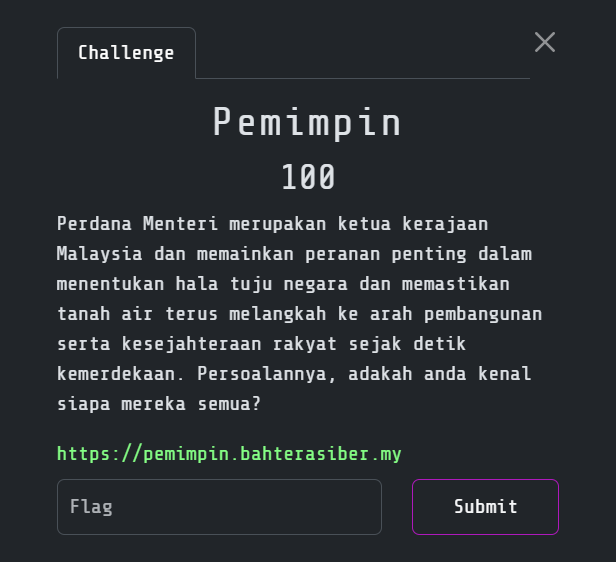
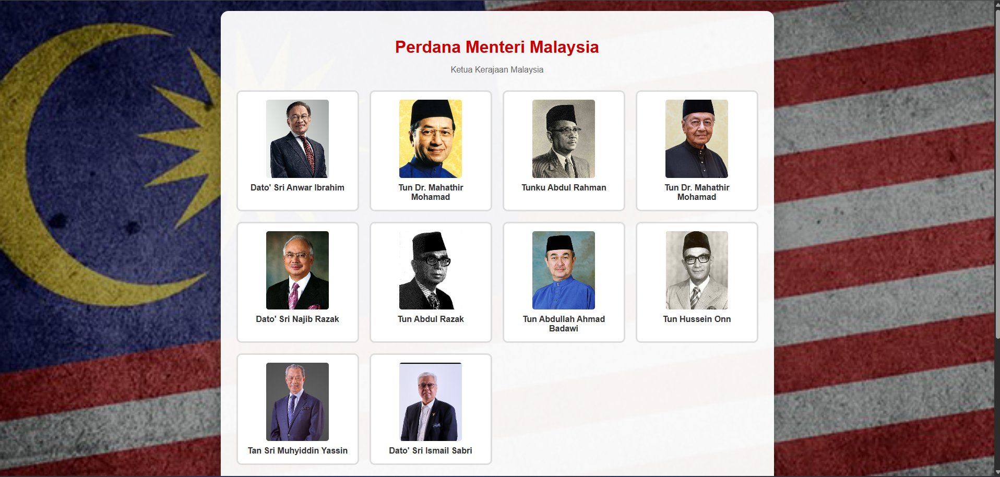
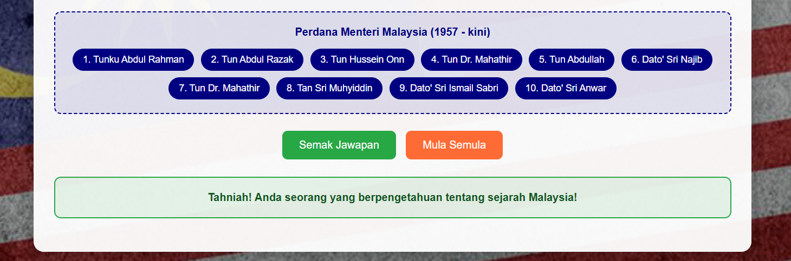
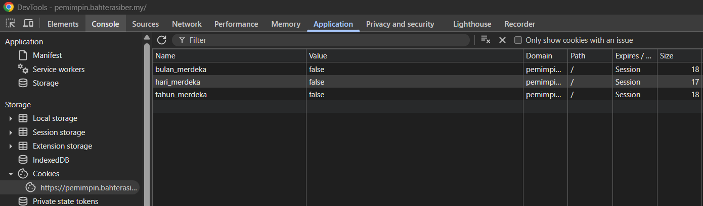
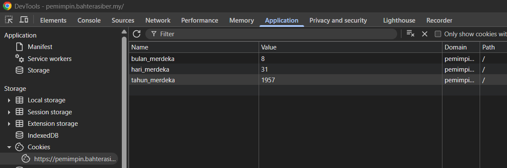
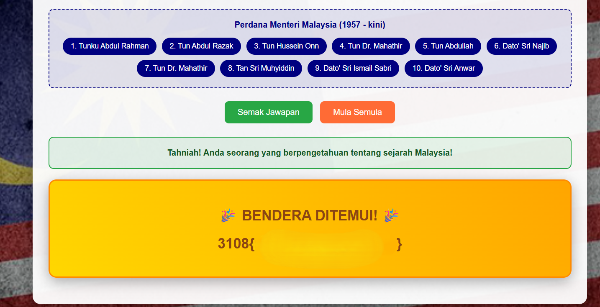

# Pemimpin

> Category: Web Exploitation🕸️

## 🔍 Overview

Visiting the page shows us the Prime Minister of Malaysia that we need to sort them out based on their order.

## ✨ Solution

So, we just need to sort them out based on their order:

However, the flag doesn't show up. Try to view the cookies:

We need to change the value of the cookies based on their name:

Then, just view the page to get the flag:

<b>🏳️ Flag:</b>
<b>3108{p3m1mp1n_m4l4y5I4}</b>
