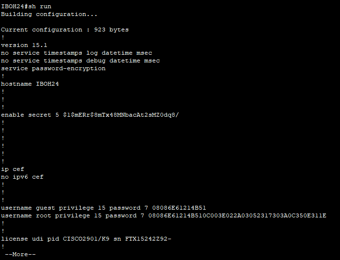

# Welcome Back to 

> Category: Miscellaneous


## Walkthrough

In the challenge description, we are given the SSH credentials for us to log in to the router
inside the Packet Tracer file that is also given.

>**SSH Credentials:**
>
>**IP Address**: 192.168.69.1
>
>**Username**: guest
>
>**Password**: IBOH24


Go to the **PC0** and at the **Desktop Tab**, click the **Telnet/SSH Client**. Login using the credentials given.

Try to check the router configuration using the command:

```bash
IBOH24# sh run
```

Usually, all the running configurations including the password will be printed out using the command
above.

We need to get the root password from the router, click enter until you find the root
password.



The password seems to be encrypted, open the web browser and find **Cisco Password 7 decrypt.**

I used this website to decrypt the password:
https://www.ifm.net.nz/cookbooks/passwordcracker.html

Just copy and paste the root password and you will get the flag.

## 🏳️Flag:

>IBOH24{rUnNINg_coNFiG}
