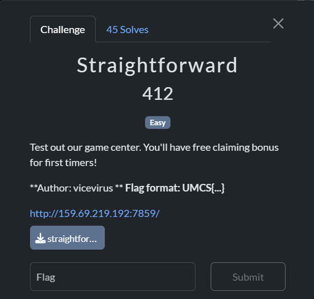
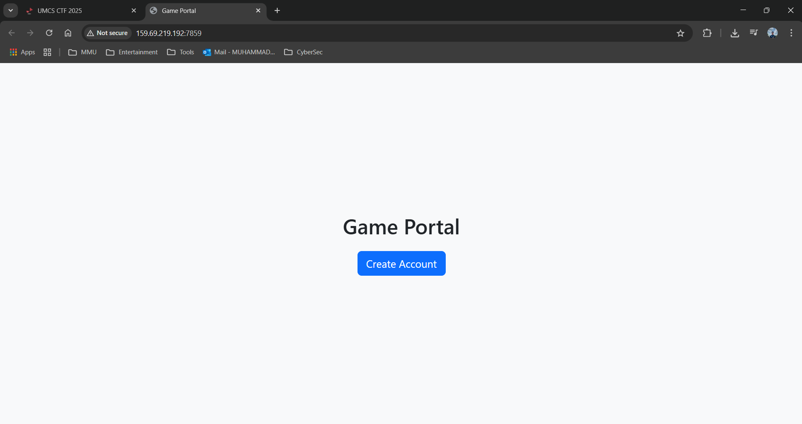
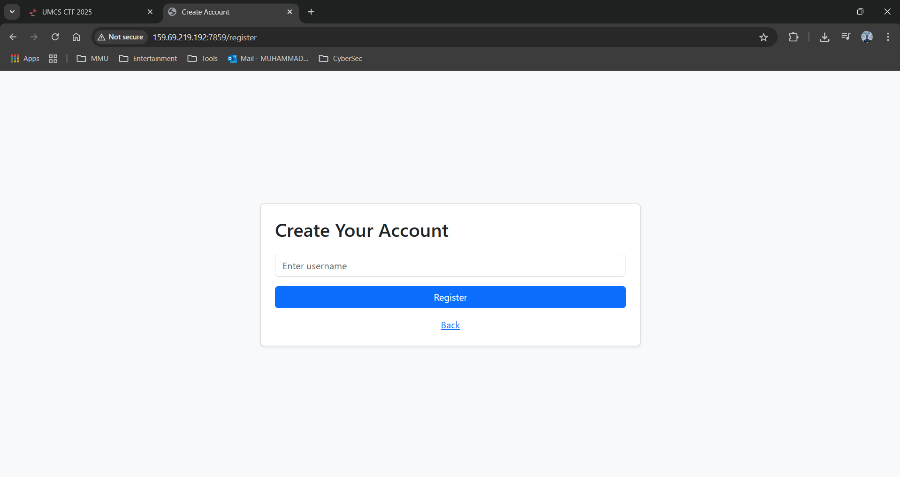
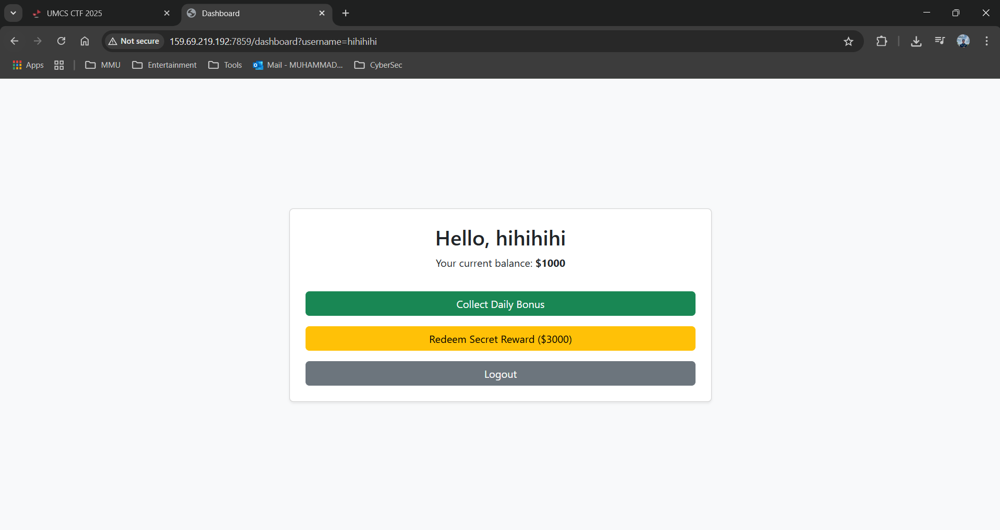
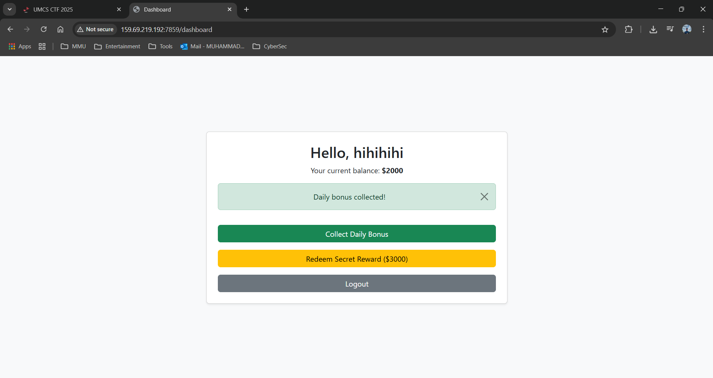
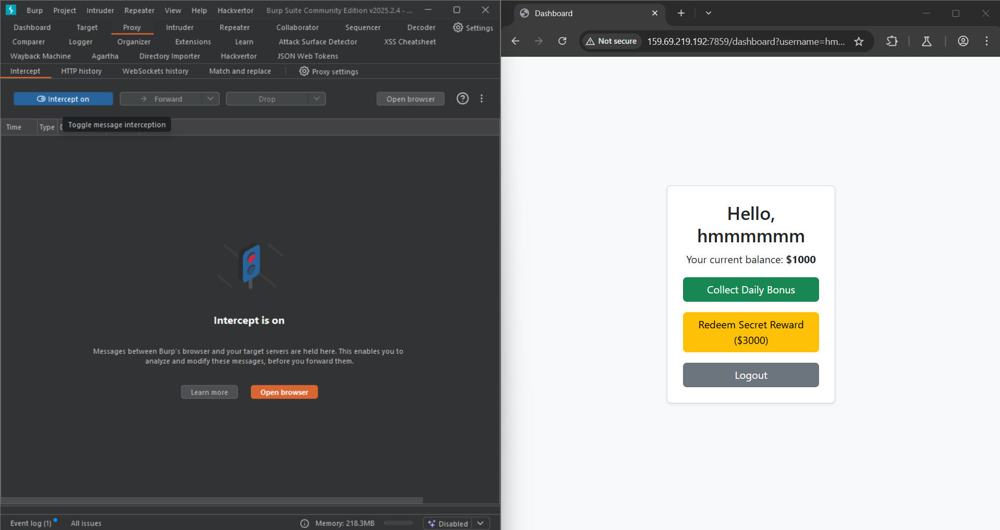
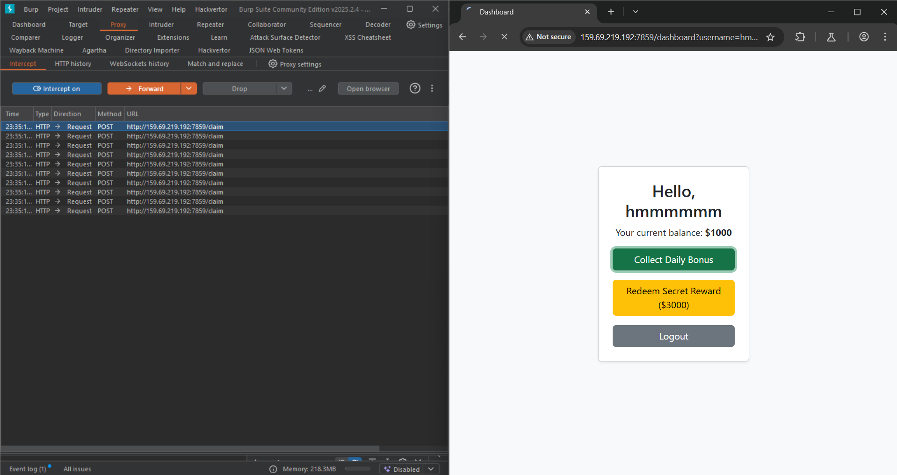
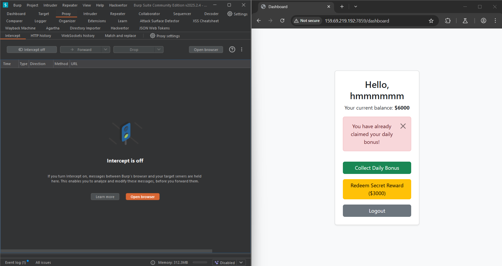
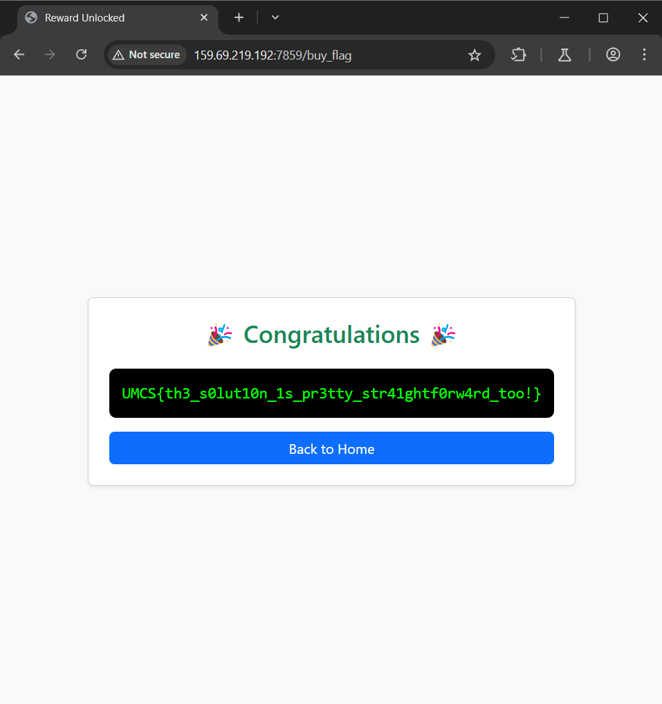

# straightforward
>Category: Web Exploitation 🕸️

## Description:
>_Test out our game center. You'll have free claiming bonus for first timers!_
>
>_**Author: vicevirus **_ **_Flag format: UMCS{...}_**







When opening the webpage, we came up with a Create Account function. So, let’s create an account first.



I’ve noticed that if we registered an account that is already a registered account, the page will be redirected to the /register page. Meaning, we need to create a different new account.

After creating a new account, each **new account will receive $1000.**

Each account can claim a bonus **only once** for an **additional $1000.**



## Walkthrough

During analysis of the code, we found out that the **/claim** function performs a **non-atomic
check and update** operations which can **lead to race conditions**.

Due to the conditions **“check_same_thread=False”** are set, multiple threads/processes are allowed to access and manipulate the shared data concurrently. 

```python
def get_db():
    if 'db' not in g:
        g.db = sqlite3.connect(DATABASE, check_same_thread=False)
        g.db.row_factory = sqlite3.Row
    return g.db
```

Basically, sending **multiple requests** to the server **in a short time** can lead to **improper checking and updating** of the operations.

```python
@app.route('/claim', methods=['POST'])
def claim():
    if 'username' not in session:
        return redirect(url_for('register'))
    username = session['username']
    db = get_db()
    cur = db.execute('SELECT claimed FROM redemptions WHERE username=?', (username,))
    row = cur.fetchone()
    if row and row['claimed']:
        flash("You have already claimed your daily bonus!", "danger")
        return redirect(url_for('dashboard'))
    db.execute('INSERT OR REPLACE INTO redemptions (username, claimed) VALUES (?, 1)', (username,))
    db.execute('UPDATE users SET balance = balance + 1000 WHERE username=?', (username,))
    db.commit()
    flash("Daily bonus collected!", "success")
    return redirect(url_for('dashboard'))
```

So, how can we exploit this?

## Solution

First, we will use **Burp Suite Intercept** function to intercept all the traffic before sending it to the server. Open Burp Suite and make sure to set the proxy to **send all the traffic to Burp Suite**. Then just as we did before, create a new account. Before claiming the bonus, make sure to **turn on the Intercept** function before creating **multiple /claim requests**.



After creating multiple **/claim** requests, **turn off the Intercept** function.



There we go, now we have enough balance to redeem the flag.





## 🏳️Flag:
>UMCS{th3_s0lut10n_1s_pr3tty_str41ghtf0rw4rd_too!}