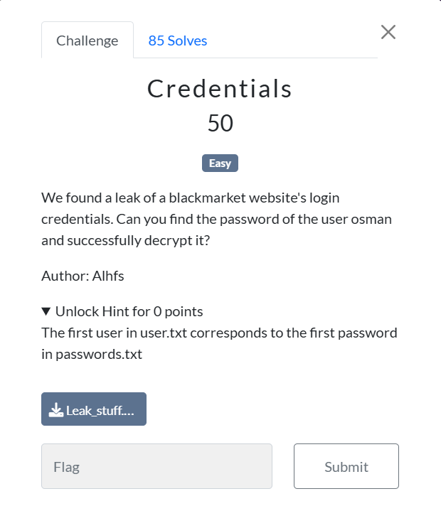
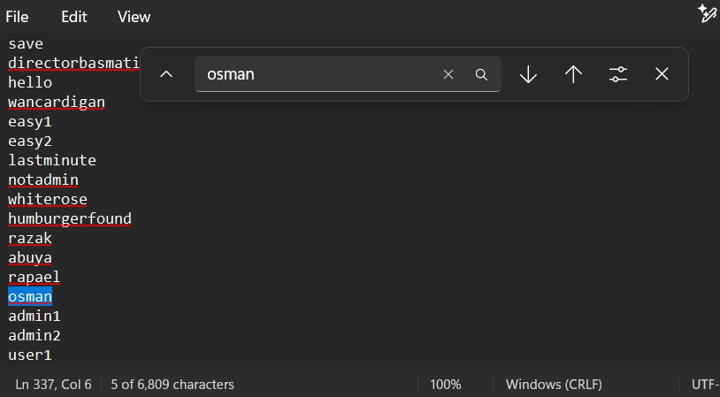
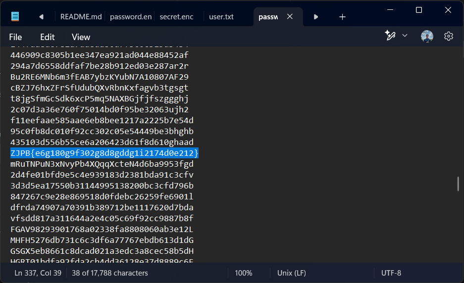
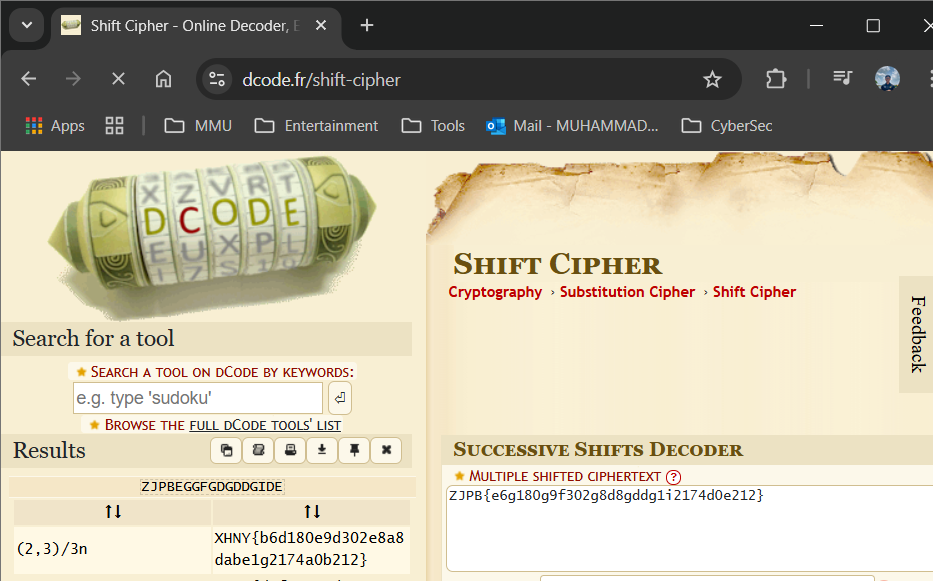
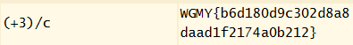

# Credentials🔑

> Category: Cryptography🔑

Based on the challenge, we are given a file containing the user.txt and passwd.txt file.

This challenge asks us to retrieve the password for the user osman.

## Solution

From the given user.txt file, search for user named as osman and see the position of the user in the txt file.

**user.txt**

We found out that osman credentials is in **line 337**, so usually osman’s password will be the same line as his username.

**passwd.txt**

Then, copy the password of osman and just go to any online cipher decryptor. I personally use dcode.fr

Based on the ciphertext, I assume it to adopt the shift cipher algorithm.

Next, just search the identical format as wgmy{flag_here}.

## 🏳️Flag:

>WGMY{b6d180d9c302d8a8daad1f2174a0b212}