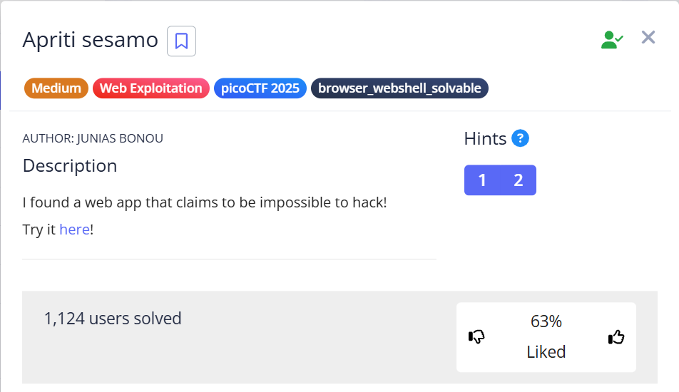
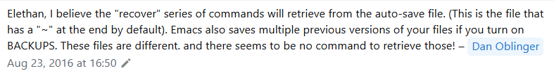

# Apriti sesamo 🕸️

> Category: Web Exploitation 🕸️




>Hints:
>1. Backup files
>2. Rumor has it, the lead developer is a militant emacs user

Based on the given hints, try to find how to view backup file in emacs.

Source: https://stackoverflow.com/questions/39091433/viewing-reloading-emacs-backup-files



Found out that, when adding **"~"** in the url after the **.php**, we can view the **backup file** of the page generated in emacs.

>http://chall-url:port/impossibleLogin.php~

Then, try to view the Page Source:


```html
<!--?php
 if(isset($_POST[base64_decode("\144\130\x4e\154\x63\155\x35\x68\142\127\125\x3d")])&& isset($_POST[base64_decode("\143\x48\x64\x6b")])){$yuf85e0677=$_POST[base64_decode("\144\x58\x4e\154\x63\x6d\65\150\x62\127\x55\75")];$rs35c246d5=$_POST[base64_decode("\143\x48\144\153")];if($yuf85e0677==$rs35c246d5){echo base64_decode("\x50\x47\112\x79\x4c\172\x35\x47\x59\127\154\163\132\127\x51\x68\111\x45\x35\166\x49\x47\132\163\131\127\x63\x67\x5a\155\71\171\111\x48\x6c\166\x64\x51\x3d\x3d");}else{if(sha1($yuf85e0677)===sha1($rs35c246d5)){echo file_get_contents(base64_decode("\x4c\151\64\166\x5a\x6d\x78\x68\x5a\x79\65\60\145\110\x51\75"));}else{echo base64_decode("\x50\107\112\171\x4c\x7a\65\107\x59\x57\154\x73\x5a\127\x51\x68\x49\105\x35\x76\111\x47\132\x73\131\127\x63\x67\x5a\155\71\x79\x49\110\154\x76\x64\x51\x3d\75");}}}?-->
```

There is an obfuscated php code appended to the html code.

After deobfuscated the php code using this tool, https://github.com/simon816/PHPDeobfuscator :

```php
if (isset($_POST["username"]) && isset($_POST["pwd"])) {

    /* $yuf85e0677 = $_POST[base64_decode("dXNlcm5hbWU=")]; */
    $yuf85e0677 = $_POST["username"];

    /* $rs35c246d5 = $_POST[base64_decode("cHdk")]; */
    $rs35c246d5 = $_POST["pwd"];

    if ($yuf85e0677 == $rs35c246d5) {
        echo "<br/>Failed! No flag for you";
    } 
    else {
        if (sha1($yuf85e0677) === sha1($rs35c246d5)) {
            echo file_get_contents("../flag.txt");
        } 
        else {
            echo "<br/>Failed! No flag for you";
        }
    }
}
```

## Solution

We need to bypass the login algorithm which will:
1. Check if username **is equal to** pwd, then it will print **Failed! No flag for you**.
2. If the first condition does not met, it will check second condition, if the **sha1** of both username and pwd is the same (=== :Strict Equality), then it will **retrieve the /flag.txt**.

So, try to find how to bypass the login algorithm related to sha1.

source: https://medium.com/@Asm0d3us/part-1-php-tricks-in-web-ctf-challenges-e1981475b3e4

Found out that, we can bypass the sha1 check condition by changing the login request using **Burp Suite** into:

```
username[]=x&pwd[]=y
```

## 🏳️Flag:
> picoCTF{w3Ll_d3sErV3d_Ch4mp_76d46a4d}