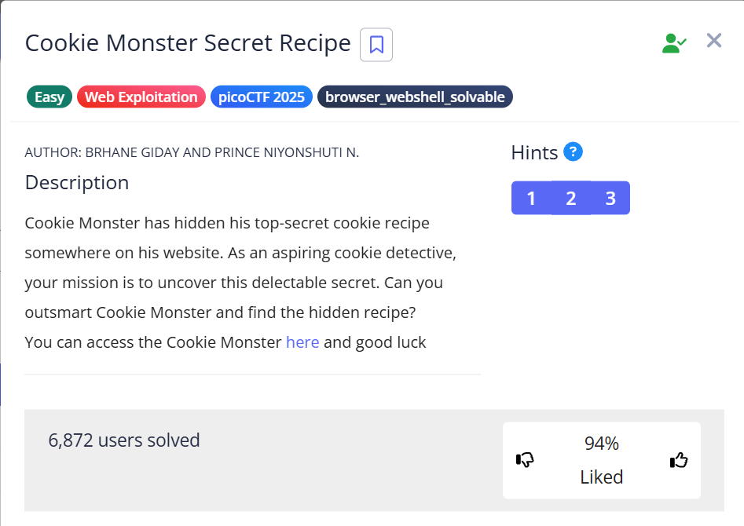
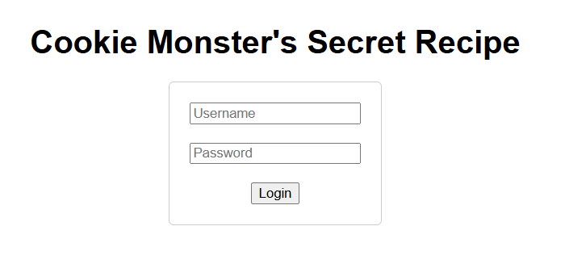
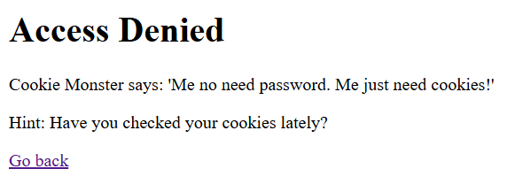
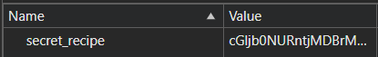
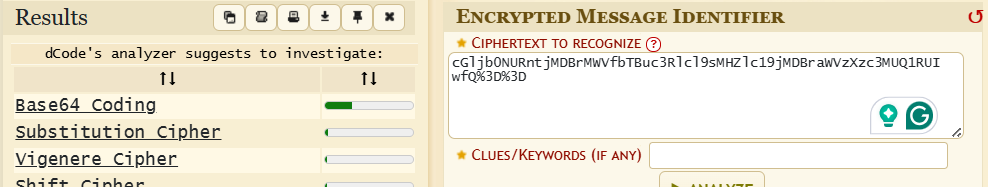

# Cookie Monster Secret Recipe 🕸️

> Category: Web Exploitation 🕸️

>Hints:
>1. Sometimes, the most important information is hidden in plain sight. Have you checked all parts of the webpage?
>2. Cookies aren't just for eating - they're also used in web technologies!
>3. Web browsers often have tools that can help you inspect various aspects of a webpage, including things you can't see directly.

We are greeted with login page, try to login using any login credential.

>Username: test
>
>Password: test

Try to check for the cookies, Inspect > Application > Cookies > site url

From the Value given, try to check using [dcode.fr/cipher-identifier](https://www.dcode.fr/cipher-identifier) tools

secret_recipe: cGljb0NURntjMDBrMWVfbTBuc3Rlcl9sMHZlc19jMDBraWVzXzc3MUQ1RUIwfQ%3D%3D

We found out that the secret_recipe is in **base64** encoding.

Decode it using base64.

## 🏳️Flag:
>picoCTF{c00k1e_m0nster_l0ves_c00kies_AC8FCD75}