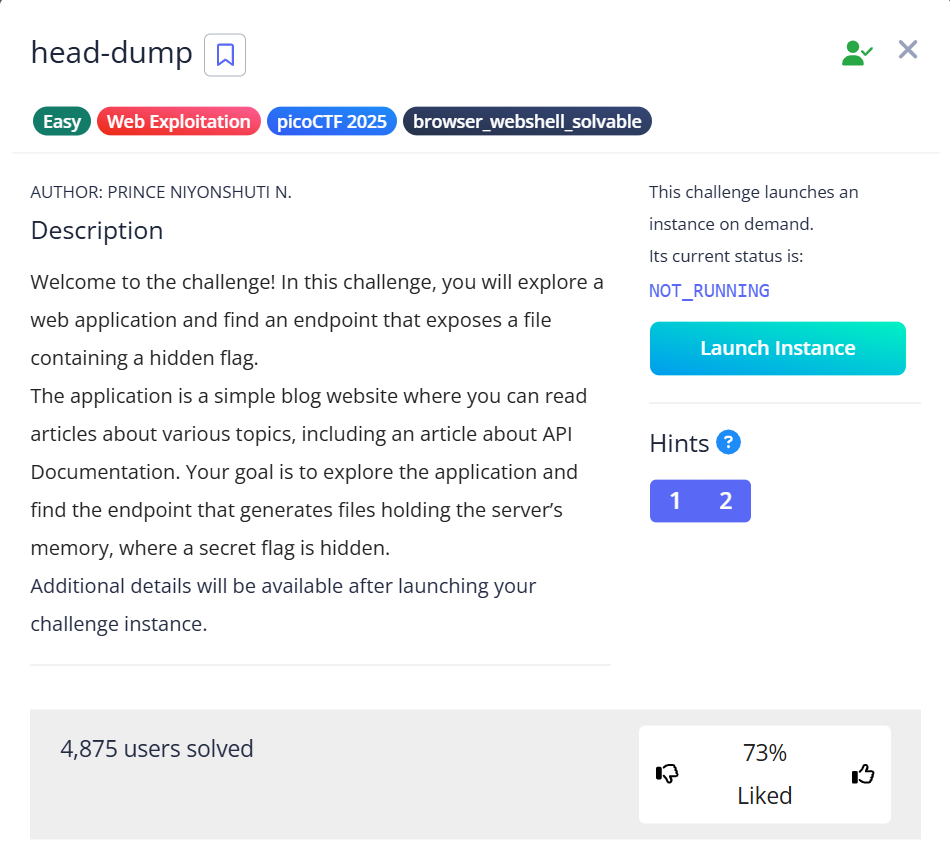

# head-dump 🕸️

> Category: Web Exploitation 🕸️



>Hints:
>1. Explore backend development with us
>2. The head was dumped.


Based on the given hints, we need to try to **View Page Source**.

```html
<!-- Message -->
<div class="mb-4">
    <p class="text-gray-800">Explore backend development with us <a href="" class="text-blue-600">#nodejs</a> ,
            <a href="" class="text-blue-600">#swagger UI</a> , <a href="/api-docs" class="text-blue-600 hover:underline">#API Documentation</a> 
    </p>
</div>
```

We found a reference to go to **/api-docs**

After some reading, we found that there is **/heapdump GET request** which seems the **title of the challenge** had given some hints.

Try to send request to **/heapdump** using **GET request** in Burp Suite.

Open the file and find for picoCTF

## 🏳️Flag:
> picoCTF{Pat!3nt_15_Th3_K3y_13d135dd}