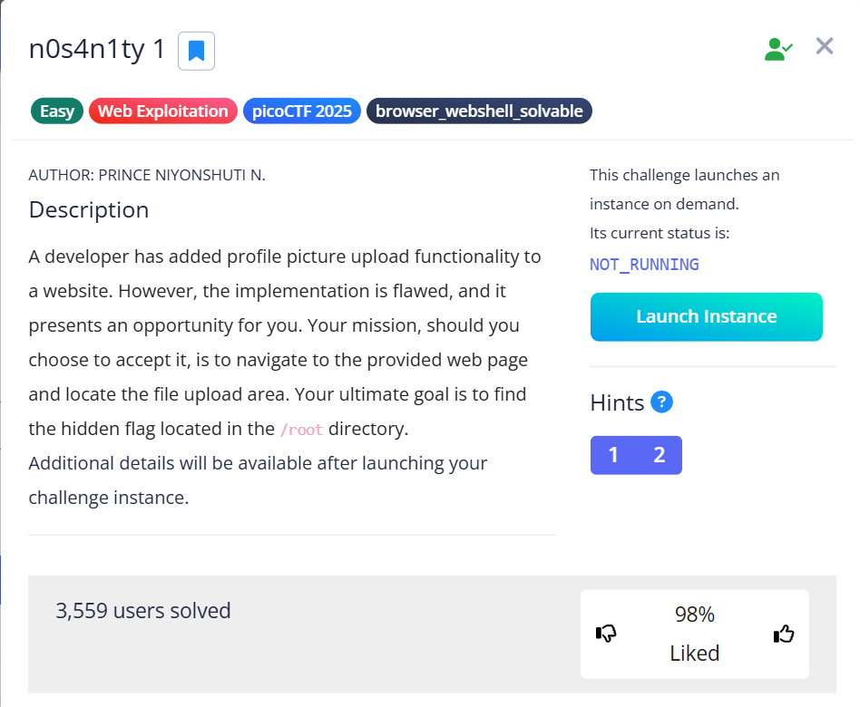

# n0s4n1ty 1 🕸️

> Category: Web Exploitation 🕸️



>Hints:
>1. File upload was not sanitized
>2. Whenever you get a shell on a remote machine, check sudo -l


After some searching, I found a payload from
https://medium.com/@niceselol/picoctf-2024-trickster-af90f7476e18

Copy, Paste and Save the payload as **filename.png.php**

After successfully upload the file, we can go to **uploads/filename.png.php**

Then, try to **inject** our command.

```bash
sudo -l
sudo ls -l /root
sudo cat /root/flag.txt
```

## 🏳️Flag:
> picoCTF{wh47_c4n_u_d0_wPHP_712a9451}